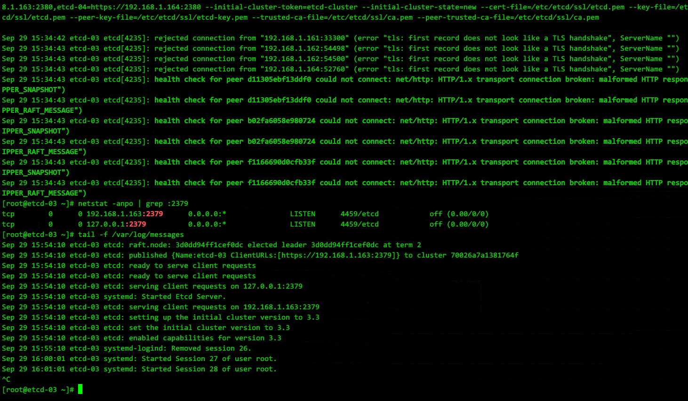

* [目录](#0)
  * [K8S external etcd](#1)
  * [早期文档](#99)

<h3 id="1">K8S external etcd</h3>

即 etcd 独立于 K8S 集群之外, 不在 K8S 集群内部

#### 看 endpoint status

格式

```shell
export ETCDCTL_API=3;  # 指定API版本
/usr/local/bin/etcdctl \ # etcdctl 所在位置
--endpoints=https://10.100.0.201:2379,https://10.100.0.202:2379,https://10.100.0.203:2379 \  # 集群所有的节点的信息
--cacert=/etc/kubernetes/pki/etcd/ca.crt \  # CA证书位置
--cert=/etc/kubernetes/pki/etcd/server.crt \ # server公钥位置
--key=/etc/kubernetes/pki/etcd/server.key \  # server私钥位置
endpoint status --write-out=table   # 显示 endpoint 状态, 并以表格形式输出
```

```shell
[root@docker-node4 ~]# ansible dc-1-kube-master-01 -m shell -a 'export ETCDCTL_API=3; \
> /usr/local/bin/etcdctl --endpoints=https://10.100.0.201:2379,https://10.100.0.202:2379,https://10.100.0.203:2379 \
> --cacert=/etc/kubernetes/pki/etcd/ca.crt --cert=/etc/kubernetes/pki/etcd/server.crt --key=/etc/kubernetes/pki/etcd/server.key \
> endpoint status --write-out=table'
dc-1-kube-master-01 | CHANGED | rc=0 >>
+---------------------------+------------------+---------+---------+-----------+------------+-----------+------------+--------------------+--------+
|         ENDPOINT          |        ID        | VERSION | DB SIZE | IS LEADER | IS LEARNER | RAFT TERM | RAFT INDEX | RAFT APPLIED INDEX | ERRORS |
+---------------------------+------------------+---------+---------+-----------+------------+-----------+------------+--------------------+--------+
| https://10.100.0.201:2379 | 9a8c2903ac5cc983 |  3.5.27 |   20 kB |     false |      false |         2 |          8 |                  8 |        |
| https://10.100.0.202:2379 | 9f95291795863ef7 |  3.5.27 |   20 kB |      true |      false |         2 |          8 |                  8 |        |
| https://10.100.0.203:2379 | cfac6b1599e45a38 |  3.5.27 |   20 kB |     false |      false |         2 |          8 |                  8 |        |
+---------------------------+------------------+---------+---------+-----------+------------+-----------+------------+--------------------+--------+
[root@docker-node4 ~]# 

[root@docker-node4 ~]# ansible dc-2-kube-master-01 -m shell -a 'export ETCDCTL_API=3; \
> /usr/local/bin/etcdctl --endpoints=https://10.200.0.201:2379,https://10.200.0.202:2379,https://10.200.0.203:2379 \
> --cacert=/etc/kubernetes/pki/etcd/ca.crt --cert=/etc/kubernetes/pki/etcd/server.crt --key=/etc/kubernetes/pki/etcd/server.key \
> endpoint status --write-out=table'
dc-2-kube-master-01 | CHANGED | rc=0 >>
+---------------------------+------------------+---------+---------+-----------+------------+-----------+------------+--------------------+--------+
|         ENDPOINT          |        ID        | VERSION | DB SIZE | IS LEADER | IS LEARNER | RAFT TERM | RAFT INDEX | RAFT APPLIED INDEX | ERRORS |
+---------------------------+------------------+---------+---------+-----------+------------+-----------+------------+--------------------+--------+
| https://10.200.0.201:2379 | 7e254504d1812858 |  3.5.27 |   20 kB |      true |      false |         2 |          8 |                  8 |        |
| https://10.200.0.202:2379 | f1adbd3faed715f4 |  3.5.27 |   20 kB |     false |      false |         2 |          8 |                  8 |        |
| https://10.200.0.203:2379 | e001a6118958ccab |  3.5.27 |   20 kB |     false |      false |         2 |          8 |                  8 |        |
+---------------------------+------------------+---------+---------+-----------+------------+-----------+------------+--------------------+--------+
```

#### 看 member list

格式

```shell
export ETCDCTL_API=3; \ # 指定API版本
/usr/local/bin/etcdctl \ # etcdctl 所在位置
--endpoints=https://10.100.0.201:2379,https://10.100.0.202:2379,https://10.100.0.203:2379 \ # 集群所有的节点的信息
--cacert=/etc/kubernetes/pki/etcd/ca.crt \ # CA证书位置
--cert=/etc/kubernetes/pki/etcd/server.crt \ # server公钥位置
--key=/etc/kubernetes/pki/etcd/server.key \  # server私钥位置
member list -w table    # 显示成员列表, 并以表格形式输出
```


```shell
[root@docker-node4 ~]# ansible dc-1-kube-master-01 -m shell -a 'export ETCDCTL_API=3; \
> /usr/local/bin/etcdctl --endpoints=https://10.100.0.201:2379,https://10.100.0.202:2379,https://10.100.0.203:2379 \
> --cacert=/etc/kubernetes/pki/etcd/ca.crt --cert=/etc/kubernetes/pki/etcd/server.crt --key=/etc/kubernetes/pki/etcd/server.key \
> member list -w table'
dc-1-kube-master-01 | CHANGED | rc=0 >>
+------------------+---------+---------------------+---------------------------+---------------------------+------------+
|        ID        | STATUS  |        NAME         |        PEER ADDRS         |       CLIENT ADDRS        | IS LEARNER |
+------------------+---------+---------------------+---------------------------+---------------------------+------------+
| 9a8c2903ac5cc983 | started | dc-1-kube-master-01 | https://10.100.0.201:2380 | https://10.100.0.201:2379 |      false |
| 9f95291795863ef7 | started | dc-1-kube-master-02 | https://10.100.0.202:2380 | https://10.100.0.202:2379 |      false |
| cfac6b1599e45a38 | started | dc-1-kube-master-03 | https://10.100.0.203:2380 | https://10.100.0.203:2379 |      false |
+------------------+---------+---------------------+---------------------------+---------------------------+------------+

[root@docker-node4 ~]# ansible dc-2-kube-master-01 -m shell -a 'export ETCDCTL_API=3; \
> /usr/local/bin/etcdctl --endpoints=https://10.200.0.201:2379,https://10.200.0.202:2379,https://10.200.0.203:2379 \
> --cacert=/etc/kubernetes/pki/etcd/ca.crt --cert=/etc/kubernetes/pki/etcd/server.crt --key=/etc/kubernetes/pki/etcd/server.key \
> member list -w table'
dc-2-kube-master-01 | CHANGED | rc=0 >>
+------------------+---------+---------------------+---------------------------+---------------------------+------------+
|        ID        | STATUS  |        NAME         |        PEER ADDRS         |       CLIENT ADDRS        | IS LEARNER |
+------------------+---------+---------------------+---------------------------+---------------------------+------------+
| 7e254504d1812858 | started | dc-2-kube-master-01 | https://10.200.0.201:2380 | https://10.200.0.201:2379 |      false |
| e001a6118958ccab | started | dc-2-kube-master-03 | https://10.200.0.203:2380 | https://10.200.0.203:2379 |      false |
| f1adbd3faed715f4 | started | dc-2-kube-master-02 | https://10.200.0.202:2380 | https://10.200.0.202:2379 |      false |
+------------------+---------+---------------------+---------------------------+---------------------------+------------+
```

<h3 id="99">早期文档</h3>

#### etcd集群初始化出现cluster ID mismatch的情况


初始化的情况  
https://www.cnops.xyz/archives/1658  
https://www.cnblogs.com/dukuan/p/8671345.html  
删除etcd数据文件, 在配置文件/etc/etcd/etcd.conf 的 [Member] 段的 ETCD_DATA_DIR 定义的位置,默认值 /var/lib/etcd/default.etcd  
所有节点都删除一遍  

#### etcd 集群新增节点  
https://www.centos.bz/2018/04/etcd%E9%9B%86%E7%BE%A4%E5%A2%9E%E5%8A%A0%E8%8A%82%E7%82%B9/  
先在集群已有节点上add 新节点,再在新节点上操作  

在集群已有节点上add 新节点,无论是否为Leader节点皆可  
示例:  
```
etcdctl member add etcd-node3 http://192.168.10.152:2380
```  
etcd-node3 为 etcd-name  
http://192.168.10.152:2380 为 ETCD_LISTEN_PEER_URLS  
  
&nbsp;

然后在新节点上修改etcd.conf&nbsp;  
唯一不同的是 ETCD_INITIAL_CLUSTER_STATE="existing"  
有些文档说的exist, 应是版本迭代关键字已失效.  
&nbsp;

同样的,遇到cluster ID mismatch , 删除新增节点上的/var/lib/etcd/default.etcd 重启服务尝试  


#### etcd 删除节点  
https://github.com/k8sp/sextant/issues/333  
```
etcdctl cluster-health  # 查看各节点健康状态
etcdctl member remove 66b087520c48d825 # 从cluster中删除有问题节点
```

清空问题节点的etcd数据目录, 再添加回有问题节点, 操作步骤与新增节点相同.


#### etcd 集群整体的灾难恢复  
https://github.com/etcd-io/etcd/blob/master/Documentation/v2/admin_guide.md#disaster-recovery  

#### etcd 配置TLS认证  
又一巨坑--配置https认证后出现的, 服务虽然启动,但是systemctl是activting状态,并且有大量报错  
```
error "tls: first record does not look like a TLS handshake
```

https://blog.crazytaxii.com/posts/trap_in_etcds_https_deploying/  
解决办法同样是删除etcd的数据 /var/lib/etcd/default.etcd 重启服务尝试  


&nbsp;

启用TLS认证, etcd的service文件参数需要修改

```
ExecStart=/bin/bash -c "GOMAXPROCS=$(nproc) /usr/bin/etcd --name=\"${ETCD_NAME}\" --data-dir=\"${ETCD_DATA_DIR}\"  --listen-peer-urls=\"${ETCD_LISTEN_PEER_URLS}\" --listen-client-urls=\"${ETCD_LISTEN_CLIENT_URLS}\" --advertise-client-urls=\"${ETCD_ADVERTISE_CLIENT_URLS}\" --initial-advertise-peer-urls=\"${ETCD_INITIAL_ADVERTISE_PEER_URLS}\" --initial-cluster=\"${ETCD_INITIAL_CLUSTER}\" --initial-cluster-token=\"${ETCD_INITIAL_CLUSTER_TOKEN}\" --initial-cluster-state=\"${ETCD_INITIAL_CLUSTER_STATEN}\" --cert-file=\"${ETCD_CERT_FILE}\" --key-file=\"${ETCD_KEY_FILE}\" --peer-cert-file=\"${ETCD_PEER_CERT_FILE}\" --peer-key-file=\"${ETCD_PEER_KEY_FILE}\" --trusted-ca-file=\"${ETCD_TRUSTED_CA_FILE}\" --peer-trusted-ca-file=\"${ETCD_PEER_TRUSTED_CA_FILE}\""
```

参数值应从配置文件中读取, 而不是直接赋值.

另外注意命令中的双引号需要转义 \"

启用后, 检查集群健康状况的命令也发生变化, 需要设置环境变量指明版本是v3, 同时提供pem证书位置
```
export ETCDCTL_API=3
etcdctl --cacert=/etc/etcd/ssl/ca.pem --cert=/etc/etcd/ssl/etcd.pem --key=/etc/etcd/ssl/etcd-key.pem --endpoints=https://192.168.1.161:2379,https://192.168.1.162:2379,https://192.168.1.163:2379,https://192.168.1.164:2379 endpoint health
```

#### 关于CA自签名认证
https://github.com/Donyintao/Kubernetes-install/blob/master/%E5%88%9B%E5%BB%BATLS%E8%AF%81%E4%B9%A6%E5%92%8C%E7%A7%98%E9%92%A5.md  
https://www.cnblogs.com/wjoyxt/p/9946680.html  
https://blog.51cto.com/phospherus/2445742  
https://blog.csdn.net/weixin_42350212/article/details/84930255  

- 第一步, CA自签名中心初始化, 签发自身的证书
- 第二步, 创建证书, 证书分3种类型:  
    client certificate： 用于服务端认证客户端,例如etcdctl、etcd proxy、fleetctl、docker客户端  
    server certificate:  服务端使用，客户端以此验证服务端身份,例如docker服务端、kube-apiserver  
    peer   certificate:  双向证书，用于etcd集群成员间通信  
    这里证书的创建需要用到CA的证书, 以及profile, 因此在csr文件可以自定义一个适合的profile方便引用  
- etcd会用到的是为etcd生成的xxx.pem, xxx-key.pem, 以及CA自己的pem

