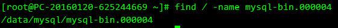
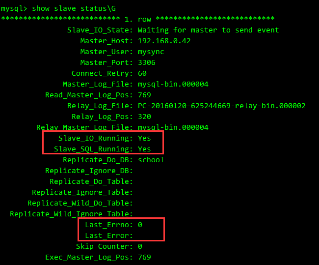

### MySQL主从、主主结构的配置 

#### 配置
http://www.cnblogs.com/zhoujie/p/mysql1.html  
http://blog.csdn.net/mycwq/article/details/17136001  
http://blog.csdn.net/testcs_dn/article/details/51423861  

注意MySQL 5.7是start 或 stop slave，而不是slave start 或 stop.  
要使主库的Position列的值不发生改变，将主库进入只读模式.  

MySQL 5.7需要在MySQL中执行命令
```
mysql>CHANGE MASTER TO MASTER_HOST='192.168.0.30',  
MASTER_PORT=3306,  
MASTER_USER='rep1',  
MASTER_PASSWORD='123456',  
MASTER_LOG_FILE='mysql-bin.000009', 
MASTER_LOG_POS=154;

master_host=主服务器IP
master_user=在主服务器上创建的备份用户名
master_password=备份用户密码
master_log_file=查询master(主服务器)的状态得到的File列的值
master_log_pos=Position列的值

start slave：启动从服务器复制功能
```

示例：
```
change master to master_host='120.136.129.89',master_user='root',master_password='xinhong',master_log_file='mysql-bin.000001',master_log_pos=33578;  
```

其中MASTER_LOG_FILE和MASTER_LOG_POS是在主MySQL中执行  
```
show master status;
```  
查看


查看server-id
```
show variables like 'server_id';
```

#### 删除主从信息
查看同步状态
```
show slave status \G; 
```
进入mysql
```
mysql>stop slave;
mysql>reset slave;
mysql>change master to master_user='', master_host=' ', master_password='';
```
结果报错如下：  
```ERROR 1210 (HY000): Incorrect arguments to MASTER_HOST```

解决办法如下：
```
mysql>change master to master_host=' ';
```
即可成功删除同步用户信息。  
注意：上面的命令报错的原因，为master_host=' ' 里面必须有内容，即使为空，也应该用空格代替，而不能什么都不写。


#### 主从排错一则

http://storysky.blog.51cto.com/628458/259280   
*<font color="#00dd00">/path/to/</font>*
mysql-error.log至关重要，需要查看

我所遇到的问题是配置文件里有server-id=2，但启动服务后仍为1，导致查看show slave status \G有报错：
```
Last_IO_Error: Fatal error: The slave I/O thread stops because master and slave have equal MySQL server ids; these ids must be different for replication to work (or the --replicate-same-server-id option must be used on slave but this does not always make sense; please check the manual before using it).
```
也是通过
```
mysql> SET GLOBAL server_id=2;
```
即可正常
但重启是不保存的，重启以后继续出现问题，发现问题所在：


真正的问题所在找到排除以后，再重启从MySQL所在服务器，slave进程也会跟随启动。

#### 主主结构
原有的文档链接已GG

概念差别不太大，只是由主服务器通告二进制文件给从服务器改成相互通告。配置my.cnf参数有区别。  
增加的内容： 
```
log-bin           = mysql-bin
expire-logs-days  = 100 
replicate-do-db   = school
binlog-ignore-db  = mysql
binlog-ignore-db  = information_schema
auto-increment-increment = 2 
auto-increment-offset = 1
```
需说明的：  
log-bin参数只给出了文件名格式，并未指定位置，实际在mysqld启动参数中指定的--datadir=/data/mysql 下



原作者的备注：  
二者都只有server-id不同和 auto-increment-offset不同  
auto-increment-offset是用来设定数据库中自动增长的起点的，回为这两台服务器都设定了一次自动增长值2，所以它们的起点必须得不同，这样才能避免两台服务器数据同步时出现主键冲突  
replicate-do-db 指定同步的数据库，我们只在两台服务器间同步test数据库  
另：auto-increment-increment的值应设为整个结构中服务器的总数，本案例用到两台服务器，所以值设为2  


相互通告：  
使用对端的show slave status\G看到file和position信息来进行通告  
```
mysql> change master to master_host='192.168.0.42',master_user='mysync',master_password='mysync',master_log_file='mysql-bin.000004',master_log_pos=769;
```
<br>
<br>
整个思路与主从结构大同小异，不过使用中遇到以下现象。  
最初作为两台独立的服务器进行配置时， file和position信息完全一样，进行通告，并start slave;后报错：


<br>
<br>
以为通告反了用户名，各种排错，并无效果。  
期间，Position发生了变化，可能由stop slave之后引起的。


<br>
<br>
此时，两台服务器之间的Position不再相同，重新通告，成功。



数据库测试，两台数据库各插入一条数据，相互同步无误。
