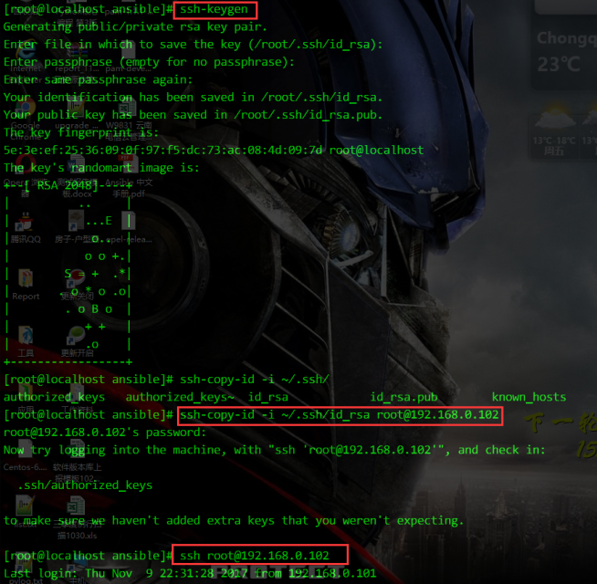
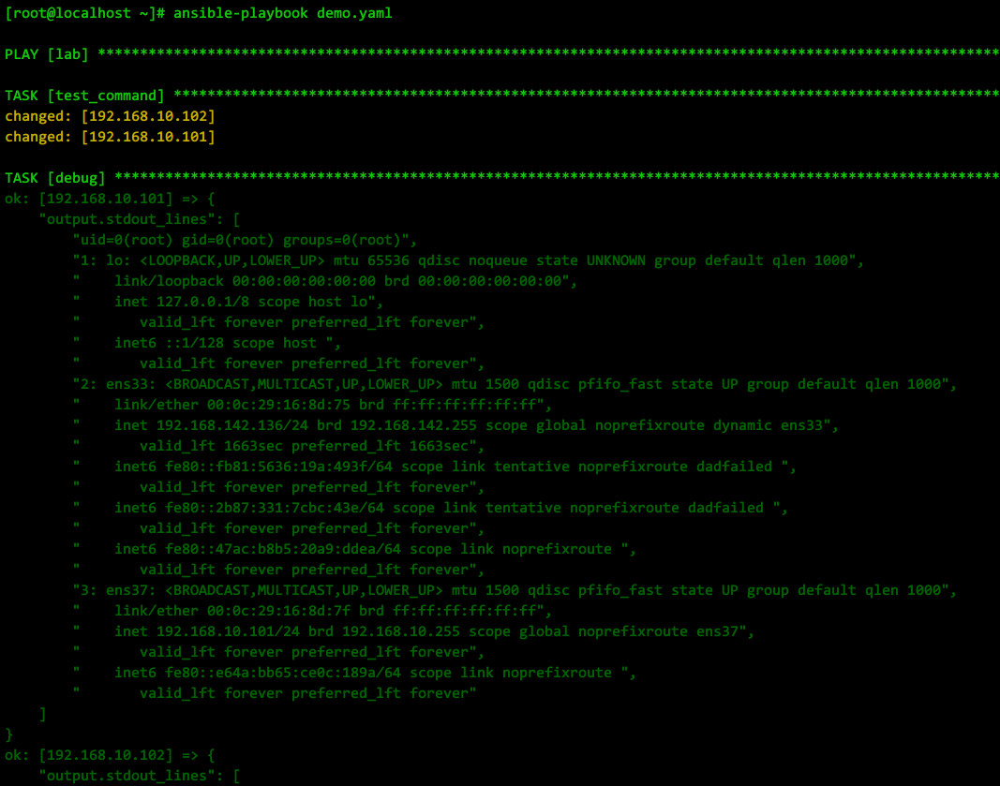
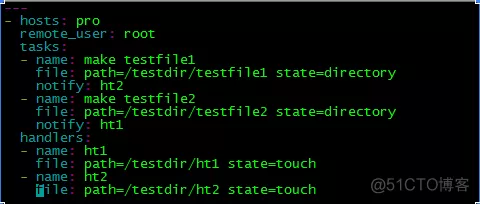
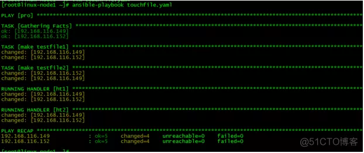
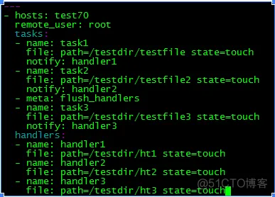

#### 手册资料
Ansible中文权威指南  
http://ansible-tran.readthedocs.io/en/latest/index.html

介绍了ansible配置中的各参数含义  
https://micorochio.github.io/2017/05/31/ansible-learning-01/

* [目录](#0)
  * [免密连接受控端](#1)
  * [有密码连接受控端](#2)
  * [首次连接免去回答是否添加key到konwn_hosts](#3)
  * [playbook的一个简单示例](#4)
  * [playbook将执行回显显示出来](#5)
  * [playbook 加速执行的几个技巧](#6)
  * [为playbook 增加一个显示执行时间的插件](#7)
  * [ansible配置文件ansible.cfg参数含义](#8)
  * [有关 playbook 里的 handler](#9)
  * [异步任务](#10)
  * [playbook的复用](#11)
  * [等待事件](#12)
  * [特殊字符的转义](#13)


<h3 id="1">免密连接受控端</h3>

实际上就是配置ssh免密码的操作  
1) ansible控制端ssh-keygen生成密钥对---密钥打开口令为空(没有特殊要求的情况下)    
2) ansible控制端ssh-copy-id把自己的公钥上传到受控客户端 或 复制pub公钥里的文本内容到 /${HOME}/.ssh/authorized_keys    
3) 此时ansible控制端sshh登录受控客户端已不需要验证口令.再配置ansible上的hosts项,在条目中指明ansible控制端生成的私钥位置    

至此,ansible免密操作受控客户端完成  




<h3 id="2">有密码连接受控端</h3>

实际的生产环境中, 极大概率是普通用户连接, 需要切换为root提权的情况

以下是使用ansible的su方式, 成为root身份的配置方式之一, 写入inventory清单里的内容

```
[lab]
192.168.10.101 ansible_ssh_user="user" ansible_ssh_port=22 ansible_ssh_pass=user用户的密码 ansible_become=true ansible_become_method=su ansible_become_user=root ansible_become_pass=root用户的密码
192.168.10.102 ansible_ssh_user="user" ansible_ssh_port=22 ansible_ssh_pass=user用户的密码 ansible_become=true ansible_become_method=su ansible_become_user=root ansible_become_pass=root用户的密码
```

在命令行下执行su的操作方式

https://lvii.github.io/system/2020-02-26-ansible-run-command-with-su-root/

```
ansible -i /etc/ansible/lab lab -m shell -a 'id' --become --become-user=root --become-method=su --ask-become-pass
```

--ask-become-pass 是交互方式输入

<h3 id="3">首次连接免去回答是否添加key到konwn_hosts</h3>

在ansible的默认配置文件/etc/ansible/ansible.cfg中  
方法一:  
取消ssh_args 的注释,并且添加 StrictHostKeyChecking＝no  
ssh_args = -o ControlMaster=auto -o ControlPersist=60s -o StrictHostKeyChecking＝no  

方法二:  
取消注释  
host_key_checking = False  


<h3 id="4">playbook的一个简单示例</h3>

一个简单的yaml文件的内容  
```
- hosts: lab
  gather_facts: no
  tasks:
      - name: "test_command"
        shell: id; ip a
```
hosts: lab  是执行的对象, lab是预先在inventory定义的分组

gather_facts: no  不执行ansible的fact信息收集, fact信息收集的耗时可达10几秒乃至更高. 有关fact的内容单独列出

tasks 下的name  任务名称, 用于后续了解进度时的显示  
tasks 下的shell  执行的模块名称, 这里选择的是ansible的shell模块


<h3 id="5">playbook将执行回显显示出来</h3>

https://www.codenong.com/20563639/

```
- hosts: lab
  gather_facts: no
  tasks:
      - name: "test_command"
        shell: id; ip a
        register: output
      - debug: var=output.stdout_lines

```
在目标任务增加一项  
register: output  register是使用变量来存放输出, output是自定义的变量名称

&nbsp;
接下另起一行, 精简内容就不用起任务名  
debug: var=output.stdout_lines  
debug 是模块名称, 将output的stdout_lines赋给var, 而这个过程就能触发debug打印其内容.

显示的内容样式如下:  




<h3 id="6">playbook 加速执行的几个技巧</h3>

http://github.com/jlafon/ansible-profile

***关闭 gathering facts***  

yaml执行对象下添加

```
gather_facts: no
```

***启用SSH PIPElinING***  

SSH PIPElinING 是一个加速 Ansible 执行速度的简单方法  
它ansible.cfg里的注释如下:  

```
Enabling pipelining reduces the number of SSH operations required to
execute a module on the remote server. This can result in a significant
performance improvement when enabled, however when using "sudo:" you must
first disable 'requiretty' in /etc/sudoers

By default, this option is disabled to preserve compatibility with
sudoers configurations that have requiretty (the default on many distros).
```

***启用ControlPersist***  

ControlPersist 即持久化 socket，一次验证，多次通信

注意是ssh客户端, 也就是ansible的server所在机器上的ssh_config

```
cat ~/.ssh/config
 Host *
  Compression yes
  ServerAliveInterval 60
  ServerAliveCountMax 5
  ControlMaster auto
  ControlPath ~/.ssh/sockets/%r@%h-%p
  ControlPersist 4h
```

新增的是 ```ControlPersist 4h```


<h3 id="7">为playbook 增加一个显示执行时间的插件</h3>

https://github.com/jlafon/ansible-profile

ansible 2.0 已内置, 只需要在ansible.cfg 中启用

```
callback_whitelist = profile_tasks
```

ansible 1.x 里的用法是, 下载这个python脚本, 在你的playbook所在的目录下, 新建一个callback_plugins 目录, 并放入这个python脚本

```
mkdir callback_plugins
cd callback_plugins
wget https://raw.githubusercontent.com/jlafon/ansible-profile/master/callback_plugins/profile_tasks.py
```

<h3 id="8">ansible配置文件ansible.cfg参数含义</h3>

```
# (扩展插件存放目录)
action_plugins = /usr/share/ansible_plugins/action_plugins

# (插入Ansible模板的字符串)
ansible_managed = Ansible managed: {file} modified on %Y-%m-%d %H:%M:%S by {uid} on {host}

# （PlayBook是否需要提供密码，默认为No）
# ask_pass=True

# （PlayBook是否需要提供sudo 密码）
# ask_sudo_pass=True

# （回调函数插件存放路径）
action_plugins = /usr/share/ansible_plugins/action_plugins

# （连接插件存放路径）
action_plugins = /usr/share/ansible_plugins/action_plugins

# （是否展示警告信息）
deprecation_warnings = True

# （是否展示跳过的主机的信息）
# display_skipped_hosts=True

# （执行错误时候赋予的变量）
# error_on_undefined_vars=True

# （默认的Shell）
# executable = /bin/bash

# （拦截器插件）
action_plugins = /usr/share/ansible_plugins/action_plugins

# （最大进程数）
forks=5

# （哈希特性，没事不用去动它）
# hash_behavior=replace

# （资产文件存放位置）
hostfile = /etc/ansible/hosts

# （是否检查SSH key）
host_key_checking=True

# （JinJa扩展）
jinja2_extensions = jinja2.ext.do,jinja2.ext.i18n

# （PlayBook变量）
legacy_playbook_variables = no

# （Ansible默认库）
library = /usr/share/ansible

# （日志路径）
log_path=/var/log/ansible.log

# （插件路径）
action_plugins = /usr/share/ansible_plugins/action_plugins

# （默认模块名称）
module_name = command

# (输出样式)
nocolor=0

# (是否使用cowsay打印)
nocows=0

# （主机）
hosts=*

# （pool间隔）
poll_interval=15

# （私钥的存放路径）
private_key_file=/path/to/file.pem

# （远程连接端口号）
remote_port = 22

# (远程目录临时文件夹)
remote_temp = $HOME/.ansible/tmp

# （远程用户）
remote_user = root

# （角色路径）
roles_path = /opt/mysite/roles

# （SUDO执行）
sudo_exe=sudo

# （SUDO标记）
sudo_flags=-H

# （sudo用户）
sudo_user=root

# （重连次数）
timeout = 10

# （传输模式） 默认用的smart
transport

# （变量插件存放路径）
action_plugins = /usr/share/ansible_plugins/action_plugins

# SSH变量

# (SSH连接参数)
ssh_args = -o ControlMaster=auto -o ControlPersist=60s

# （采用SCP还是SFTP进行文件传输）
scp_if_ssh=False
```

<h3 id="9">有关 playbook 里的 handler</h3>

https://blog.csdn.net/qq_25599925/article/details/122170883

在以上这一示例中, 有大量的```task``` 调用了同一个```hanlder```  
自然而然会联想到一个问题: 类似于文本处理--对配置文件进行某些修改, 修改之后要重启某个服务的需求.  
但 ansible playbook 的特性决定了, 每一个```task``` 只是完成了一个特定的修改操作, 而所有的操作每执行一次就调用一次重启服务, 则显得非常的不合理.  

在以下这篇文档中, 回答了这一问题

https://blog.51cto.com/u_11726212/2378616

解释了:
1) ansible 的 handler 在默认状态下的调用时机是在所有的 task 完成以后  
2) handler 的调用顺序是取决于在 playbook 中被定义的先后顺序, 而并非在 task 中被调用的先后顺序  
3) 当需要在某个 task 执行就立即调用 handlers 的情形, 方法是使用 meta

原作者原文:
> 如上所说，handlers是另一种任务列表，可以理解handlers和tasks是’平级关系‘，所以他们的缩进相同，上面的handlers中只有一个任务，任务的名称为restart nginx，这个名词被tasks中的modify the configuration这个任务调用了，notify字段就是调用handlers任务，当modify the configuration这个任务执行之后并发生了改变，就会去执行handlers中的相应的任务。

> handlers是另一种任务列表，所以handlers中可以有多个任务，被tasks中不同的任务notify，如下：



> 如上所示，tasks和handlers都是任务列表，只是handlers中的人物被tasks中的任务notify罢了，那么我们来执行一下上述playbook，如下图所以：



> 从上图看出，handlers执行的顺序与handlers在playbook中定义的顺序是相同的，与handlers被notify的顺序无关，默认情况下，所有的task执行完毕后，才会执行各个handles，并不是执行完某个task后，立即执行相应的handler，如果想要在执行完某些task以后立即执行对应的handlre，那么需要使用meta模块。




<h3 id="10">异步任务</h3>

https://docs.ansible.com/ansible/latest/playbook_guide/playbooks_async.html

以下原文确认两点:
- async 就是超时时长
- poll 就是探测间隔

> Playbooks also support asynchronous mode and polling, with a simplified syntax. You can use asynchronous mode in 
> playbooks to avoid connection timeouts or to avoid blocking subsequent tasks. The behavior of asynchronous mode in a playbook depends on the value of poll.

> Avoid connection timeouts: poll > 0
> If you want to set a longer timeout limit for a certain task in your playbook, use async with poll set to a 
> positive value. Ansible will still block the next task in your playbook, waiting until the async task either completes, fails or times out. However, the task will only time out if it exceeds the timeout limit you set with the async parameter.

> To avoid timeouts on a task, specify its maximum runtime and how frequently you would like to poll for status:

ansible 的 AD-HOC 模式

> You can execute long-running operations in the background with ad hoc tasks. For example, to execute 
> long_running_operation asynchronously in the background, with a timeout (-B) of 3600 seconds, and without polling (-P):

```
$ ansible all -B 3600 -P 0 -a "/usr/bin/long_running_operation --do-stuff"
```

> To check on the job status later, use the async_status module, passing it the job ID that was returned when you ran 
> the original job in the background:

```
$ ansible web1.example.com -m async_status -a "jid=488359678239.2844"
```

> Ansible can also check on the status of your long-running job automatically with polling. In most cases, Ansible 
> will keep the connection to your remote node open between polls. To run for 30 minutes and poll for status every 60 seconds:

```
$ ansible all -B 1800 -P 60 -a "/usr/bin/long_running_operation --do-stuff"
```

> Poll mode is smart so all jobs will be started before polling begins on any machine. Be sure to use a high enough 
> --forks value if you want to get all of your jobs started very quickly. After the time limit (in seconds) runs out (-B), the process on the remote nodes will be terminated.

> Asynchronous mode is best suited to long-running shell commands or software upgrades. Running the copy module 
> asynchronously, for example, does not do a background file transfer.


playbook 的写法示例

```
---

- hosts: all
  remote_user: root

  tasks:
  - name: Simulate long running op (15 sec), wait for up to 45 sec, poll every 5 sec
    ansible.builtin.command: /bin/sleep 15
    async: 45
    poll: 5
```

<h3 id="11">playbook的复用</h3>

关于复用, 这个文档有质量不错的介绍

https://getansible.com/advance/playbook/includeyu_ju

对使用场景还不了解的, 可以看

https://developer.aliyun.com/article/661091

原本是打算按照 ansible 的规则来复用 ansible-playbook  
模块化拆解, 然后流程组装上不同的组合以满足不同的场景  
但上述文档看了下来, 遵守它规则的代价以及其他一些限制, 使我放弃了这个想法  
正如同我不会按照 ansible 的 role 模式去写的理由一样--不与 ansible 深度绑定, shell 脚本可以精细打磨, 但可以做到广泛适配的
可被调用  
ansible 之于我的核心功能, 依然是批量指令, 变量传递, 流程调度  
所以原本多个playbook想整合到一个总的playbook中来进行总调度, 但最后还是用的一个 shell 脚本分别执行这多个 playbook.  
原意是最外层的调度, 可以灵活的修改这些 playbook 的变量值.  
目前这个模式也并不算完美, 待更新.

<h3 id="12">等待事件</h3>

https://docs.ansible.com/ansible/latest/collections/ansible/builtin/wait_for_module.html

等待目标机上的一个事件

最终的 playbook

```
---
- name: 等待目标机器重启完成
  hosts: "{{ target }}"
  gather_facts: false
  tasks:
  - name: wait for port 22 close
    ansible.builtin.wait_for:
      port: 22
      host: "{{ ansible_ssh_host | default(inventory_hostname) }}"
      state: stopped
      # 20分钟关不下来就该人工介入了
      timeout: 1200
#    等待端口关闭, 反而不应该使用 connection: local
    connection: local
    ignore_errors: true


  - name: wait for port 22 open
    ansible.builtin.wait_for:
      port: 22
      host: "{{ ansible_ssh_host | default(inventory_hostname) }}"
      state: started
      # 20分钟还没启动起来就该人工介入了
      timeout: 1200
    connection: local
```

当然也包括了一些摸索得出的规律

```connection: local``` 是探测指令是由 ansible 主机本地发出, 如果不加这个参数, 默认是ansible主机会ssh登陆到对端
再执行相关指令, 显然在 reboot 这种场景下就不适合.

另外一个非常重要的, 在 ```task``` 里的 ```ansible.builtin.wait_for``` 里的 ```host```  
最初我用的 &#123;&#123; target &#125;&#125;  

即我 playbook 顶部定义的```hosts```, 但实测死活有些问题  
最后抱着试一试的心态, 尝试了文档里示例给的  "&#123;&#123; ansible_ssh_host | default(inventory_hostname) &#125;&#125;" 果然结果如同预期.
虽然文档里也有提到这么一句  

> Do not assume the inventory_hostname is resolvable and delay 10 seconds at start

但着实看得还是有些云里雾里.

<h3 id="13">特殊字符的转义</h3>

ansible-playbook 里的转义, 其实也就是```yaml```的转义的语法解析, 也有它的坑处
看了好些文章, 从官方手册到各路讨论

https://cn-ansibledoc.readthedocs.io/zh-cn/latest/reference_appendices/YAMLSyntax.html

https://serverfault.com/questions/1074361/ansible-2-9-21-unwanted-escape-char-is-added-in-shell-command

https://medium.com/@_muhammadardhi/escaping-all-special-characters-using-ansible-shell-ed10007f2517

示例性的需求如下:

为了修改 ulimit 的限制值, 现在打算操作 /etc/security/limits.conf 文件  
如果它不存在一条```*               -	nproc           65536```的语句,则为其添加  
如果存在则不满足该值就修改.

难就难在它包含特殊字符```*```  
上述文章虽然没有找到直接答案, 但最终琢磨出的结果如下

```
  # 设置 ulimit 的两个配置
  - name: config ulimit value
    lineinfile:
      path: /etc/security/limits.conf
      regexp: "^'*'.*nproc.*"
      line: "*\t\t-\tnproc\t\t65536"
```

也即不是用 ```\*``` 来实现转义, 而是 ```'*'```  
而在 ```line:``` 行, 是写入文本的内容, ```*``` 号并没有用到转义

以上是第一版, 在上述基础上, 与chatgpt调试出第二版

```
---
- name: test
  hosts: rhel-7-9
  tasks:
    - name: ulimit 配置过通配用户nproc的情形
      lineinfile:
        path: /etc/security/limits.conf
        regexp: ".*nproc.*"
        line: "*\t\t-\tnproc\t\t65536"
        state: present
      when: "'nproc' in lookup('file', '/etc/security/limits.conf')"
    
    - name: ulimit 未配置过通配用户nproc的情形
      lineinfile:
        path: /etc/security/limits.conf
        line: "*\t\t-\tnproc\t\t65536"
        state: present
      when: "'nproc' not in lookup('file', '/etc/security/limits.conf')"
```

目的是要实现 "如果存在一条匹配的记录的行, 则进行修改; 如果不存在, 则新增"  
这一版也很难称之为完美, 因为就这一案例而言, nproc 原本可能有值, 而配置值的形式可能是千奇百怪, 可能不是 制表符```\t```而是其他,
又涉及正则表达式要精调了.

第三版  
其实chatgpt机器人也在误导, ```when``` 语句 ```not in``` 这一段根本是冗余的

```
  # 设置 ulimit 的两个配置
  - name: ulimit 配置过nproc的情形
    lineinfile:
      path: /etc/security/limits.conf
      regexp: "^\\*.*nproc.*"
      line: "*\t\t-\tnproc\t\t65536"
      state: present
    when: "'nproc' in lookup('file', '/etc/security/limits.conf')"

  - name: ulimit 配置过nofile的情形
    lineinfile:
      path: /etc/security/limits.conf
      regexp: "^\\*.*nofile.*"
      line: "*\t\t-\tnofile\t\t65536"
      state: present
    when: "'nofile' in lookup('file', '/etc/security/limits.conf')"
```

实测了以下三种情形:  
- 文件中不存在带 ```nproc``` 的行, playbook做到了新增
- 文件中存在 ```*   -   nproc   <数值>``` 这样的行, playbook做到了把值替换成指定的
- 文件中不存在 ```*   -   nproc   <数值>``` 这样的行, 但存在 ```oracle   -   nproc   <数值>```, playbook 做到了不覆盖该行, 另新增了行

行为符合预期
