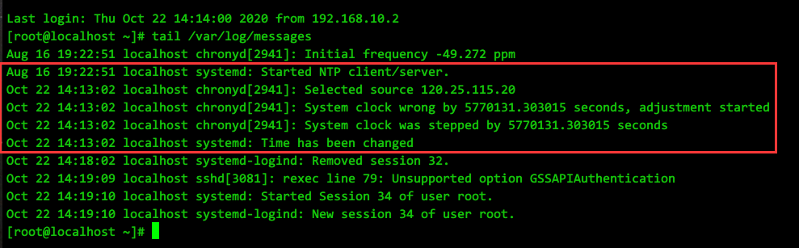
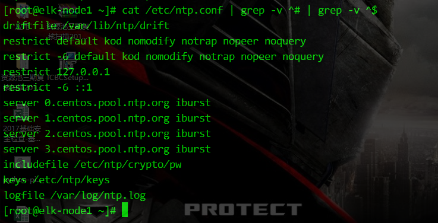
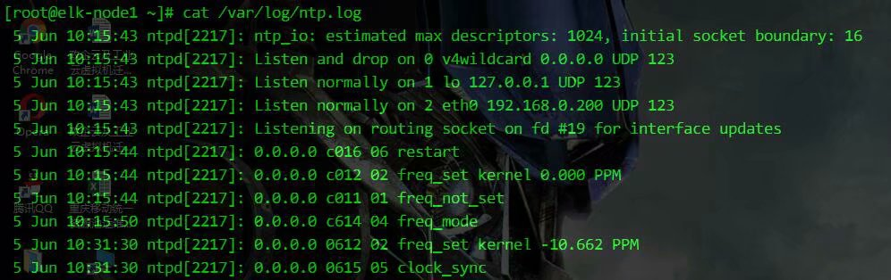
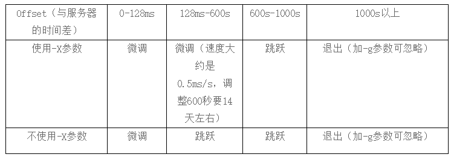
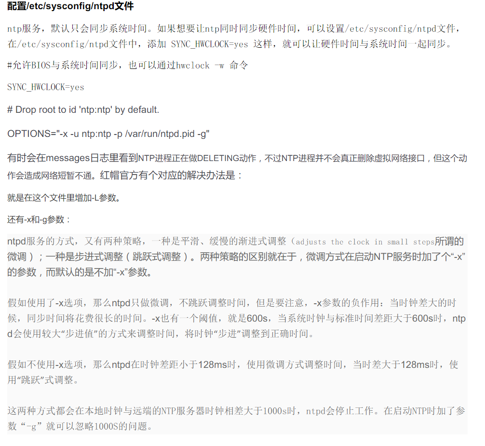

### 导航--点击跳转
[Chrony 部分](#Chrony部分)  
[ntpd 部分](#ntpd部分)  

&nbsp;

### Chrony部分
Fedora官方guide  
https://docs.fedoraproject.org/en-US/Fedora/18/html/System_Administrators_Guide/sect-Understanding_the_chrony_configuration_commands.html

比较好的文章  
https://cloud.tencent.com/developer/article/1546322

man手册  
https://chrony.tuxfamily.org/doc/3.4/chrony.conf.html

其他参考  
https://tswblog.com/article/linux/chrony/

&nbsp;

早期的RHEL 7.x 系列, 以及由此升级而来的最新的几个7.x版本, 可能不会包含chrony的软件包, yum自行安装即可.

&nbsp;

#### 配置文件与参数

chrony的默认配置文件  
/etc/chrony.conf  
内容如下:  
```
[root@localhost ~]# cat /etc/chrony.conf 
# Use public servers from the pool.ntp.org project.
# Please consider joining the pool (http://www.pool.ntp.org/join.html).
server 0.centos.pool.ntp.org iburst
server 1.centos.pool.ntp.org iburst
server 2.centos.pool.ntp.org iburst
server 3.centos.pool.ntp.org iburst

# Record the rate at which the system clock gains/losses time.
driftfile /var/lib/chrony/drift

# Allow the system clock to be stepped in the first three updates
# if its offset is larger than 1 second.
makestep 1.0 3

# Enable kernel synchronization of the real-time clock (RTC).
rtcsync

# Enable hardware timestamping on all interfaces that support it.
#hwtimestamp *

# Increase the minimum number of selectable sources required to adjust
# the system clock.
#minsources 2

# Allow NTP client access from local network.
#allow 192.168.0.0/16

# Serve time even if not synchronized to a time source.
#local stratum 10

# Specify file containing keys for NTP authentication.
#keyfile /etc/chrony.keys

# Specify directory for log files.
logdir /var/log/chrony

# Select which information is logged.
#log measurements statistics tracking
```

与 ntpd.conf 的内容相似度极高

#### 参数含义解释:

- server hostname [option]  

server 指令用于指定要同步的 NTP 服务器。  

server 0.centos.pool.ntp.org iburst  
其中的 0.centos.pool.ntp.org 是 NTP 服务器的地址，默认有四组官方的 NTP 服务器。你也可以修改为自定义的时间服务器，例如：ntp1.aliyun.com。

iburst 是参数, 一般用此参数即可。该参数的含义是在头四次 NTP 请求以 2s 或者更短的间隔，而不是以 minpoll x 指定的最小间隔，这样的设置可以让 chronyd 启动时快速进行一次同步。

其他的参数有 minpoll x 默认值是 6，代表 64s。maxpoll x 默认值是 9，代表 512s。

这里的x是2的幂次.

根据man手册里的解释:  
minpoll 默认值是6 , 即64秒.  
maxpoll 默认值是10, 即1024秒.  
这两者的最小值可到 -6, 即1/64秒. 最大值是24, 即6个月.

示例:
```
server ntp1.aliyun.com iburst minpoll 4 maxpoll 9
```

&nbsp;

- driftfile file  

Chrony 会根据实际时间计算修正值，并将补偿参数记录在该指令指定的文件里，默认为 driftfile /var/lib/chrony/drift。

与 ntpd 或者 ntpdate 最大的区别就是，Chrony 的修正是连续的，通过减慢时钟或者加快时钟的方式连续的修正。而 ntpd 或者 ntpdate 搭配 Crontab 的校时工具是直接调整时间，会出现间断，并且相同时间可能会出现两次。因此，请放弃使用 ntpd、ntpdate 来校时。

&nbsp;

- makestep threshold limit

此指令使 Chrony 根据需要通过加速或减慢时钟来逐渐校正任何时间偏移。例如：makestep 1.0 3，就表示当头三次校时，如果时间相差 1.0s, 则跳跃式校时。

&nbsp;

- rtcsync

启用内核时间与 RTC 时间同步 (自动写回硬件)。

&nbsp;

- logdir

该参数用于指定 Chrony 日志文件的路径。

&nbsp;

- stratumweight

该参数用于设置当 chronyd 从可用源中选择同步源时，每个层应该添加多少距离到同步距离。默认情况下设置为 0，让 chronyd 在选择源时忽略源的层级。

可以参考 ntpd.conf 里的stratum的概念

以上是作为客户端的常用参数

&nbsp;

#### 用作server端

至少应包含的是 allow, 以允许来自指定客户端的连接--特定的主机 / 网段 / IPv6地址形式.  
Optionally specify a host, subnet, or network from which to allow NTP connections to a machine acting as NTP server. The default is not to allow connections.  
Examples:    
Use this form to specify a particular host, by its host name, to be allowed access.
```
allow server1.example.com
```

&nbsp;

Use this form to specify a particular network to be allowed access.
```
allow 192.0.2.0/24
```

&nbsp;

Use this form to specify an IPv6 address to be allowed access.

```
allow 2001:db8::/32
```

&nbsp;

#### 检查客户端的同步状况
- chronyc tracking
  
显示时钟的详细信息
```
[root@localhost ~]# chronyc tracking
Reference ID    : C1B66F0E (ntp5.flashdance.cx)
Stratum         : 3
Ref time (UTC)  : Mon Dec 28 08:36:52 2020
System time     : 0.000000059 seconds slow of NTP time
Last offset     : -0.017252956 seconds
RMS offset      : 0.017252956 seconds
Frequency       : 138.891 ppm slow
Residual freq   : +1868.784 ppm
Skew            : 1000000.000 ppm
Root delay      : 0.312753052 seconds
Root dispersion : 2.573378563 seconds
Update interval : 0.0 seconds
Leap status     : Normal
```
Update interval这个参数, 说明最后两次更新的时间间隔是64.1s

&nbsp;

- chronyc sources -v

显示被chronyd加载的所有NTP源的信息
```
[root@localhost ~]# chronyc sources -v
210 Number of sources = 4

  .-- Source mode  '^' = server, '=' = peer, '#' = local clock.
 / .- Source state '*' = current synced, '+' = combined , '-' = not combined,
| /   '?' = unreachable, 'x' = time may be in error, '~' = time too variable.
||                                                 .- xxxx [ yyyy ] +/- zzzz
||      Reachability register (octal) -.           |  xxxx = adjusted offset,
||      Log2(Polling interval) --.      |          |  yyyy = measured offset,
||                                \     |          |  zzzz = estimated error.
||                                 |    |           \
MS Name/IP address         Stratum Poll Reach LastRx Last sample               
===============================================================================
^* 202.118.1.130                 1   6   125    45  -4266us[-7802us] +/-   43ms
^- undefined.hostname.local>     2   6    17    48  -2582us[-6056us] +/-  129ms
^- ntp5.flashdance.cx            2   6   377    47    -17ms[  -20ms] +/-  176ms
^+ tock.ntp.infomaniak.ch        1   6   377    47  +5493us[+2002us] +/-  104ms
```

&nbsp;

#### 其他chrony相关命令
```
查看 NTP 服务器的在线和离线状态
$ chronyc activity

查看 Chrony 服务的日志
$ journalctl -u chronyd

检查 NTP 访问是否对特定主机可用
$ chronyc accheck

该命令会显示有多少 NTP 源在线/离线
$ chronyc activity

手动添加一台新的 NTP 服务器
$ chronyc add server

在客户端报告已访问到服务器
$ chronyc clients

手动移除 NTP 服务器或对等服务器
$ chronyc delete

手动设置守护进程时间
$ chronyc settime

校准时间服务器，显示系统时间信息
$ chronyc tracking

检查 NTP 访问是否对特定主机可用
$ chronyc accheck

查看时间同步源
$ chronyc sources -v

查看时间同步源状态
$ chronyc sourcestats -v
```


&nbsp;

#### chrony在超大时间偏差下停止工作的问题
https://serverfault.com/questions/819467/chrony-time-synchronization-on-huge-time-diff

#### chrony一次性修正时间的日志记录


#### ntpd部分

使用ntpdate命令同步,存在的问题是如果时间偏差过大,一次性修正过猛,会对应用产生不可接受的影响  
关于此问题更详细的描述  
http://www.cnblogs.com/liuyou/archive/2012/07/29/2614330.html  

#### 对NTP服务端的配置  
https://my.oschina.net/myaniu/blog/182959  
http://blog.163.com/little_yang@126/blog/static/2317559620091019104019991/  

对配置的解析也比较详细  
http://blog.csdn.net/wzyzzu/article/details/46515129  

配置样例  



#### 指定日志位置
用
```
logfile /path/to/xxx.log
```  
进行定义, 日志内容如下  


#### 层的概念
这些问题主要涉及到NTP的层（stratum）的概念，顶层是1，值为0时表示层数不明，层的值是累加的，比如NTP授时方向是A-〉B-〉C，假设A的stratum值是3，那么B从A获取到时间，B的stratum置为4，C从B获取到时间，C的值被置为5。一般只有整个NTP系统最顶层的服务器stratum才设为1。  
NTP同步的方向是从stratum值较小的节点向较大的节点传播，如果某个NTP客户端接收到stratum比自己还要大，那么NTP客户端认为自己的时间比接受到的时间更为精确，不会进行时间的更新。  
对于大部分NTP软件系统来说，服务启动后，stratum值初始是0，一旦NTP服务获取到了时间，NTP层次就设置为上级服务器stratum+1。对于具备卫星时钟、原子钟的专业NTP设备，一般stratum值初始是1。  

#### NTPD的运行过程
NTPD启动后，stratum值初始是0，此时NTPD接收到NTP请求，回复stratum字段为0的NTP包，客户端接收后，发现stratum字段无效，拒绝更新时间，造成时间更新失败。  
几分钟后，NTPD从上级服务器获取到了更新，设置了正确的stratum，回复stratum字段为n+1的NTP包，客户端接收后，确认stratum有效，成功进行时间更新。  
在NTPD上级服务器不可用的情况下，NTPD将本机时钟服务模拟为一个上级NTP服务器，地址使用环回127.127.1.0，服务启动几分钟后，NTPD从127.127.1.0更新了时钟，设置了有效的stratum，客户端接收后，成功进行时间更新。  

#### 关于排错
http://www.tuicool.com/articles/Iv2QNf  
在使用 ntpq -p 查询的过程中，出现如下的 error log:  
```
# ntpq -p 
localhost: timed out, nothing received 
***Request timed out 
```
原因很简单，ntpd 需要有 loopback 的参与，而默认是拒绝所有，将 loopback 放行就好了: 
```
restrict 127.0.0.1
```
补充:  
同样的,ipv6的环回地址同样可能需要添加进配置文件,否则在启用了ipv6的机器上也可能ntpq -p看不到上级服务器的信息,在suse上就是如此
```
restrict -6 ::1
```

#### NTP版本升级
编译安装, 下载地址  
http://www.ntp.org/downloads.html
ntp的软件包编译安装本身不涉及太多判断要处理, 只是编译参数的选择, 以及原有配置文件的备份工作可能需要涉及

我自己所使用的编译参数
```
./configure \
--prefix=/usr/local/ntp \
--bindir=/usr/sbin \
--sysconfdir=/etc \
--enable-linuxcaps \
--with-lineeditlibs=readline \
--docdir=/usr/share/doc/${ntp_version} \
--with-openssl-incdir=/usr/local/openssl/include \
--enable-all-clocks \
--enable-parse-clocks \
--disable-ipv6 \
--without-ntpsnmpd \
--enable-clockctl

make -j 4 && make install -j 4
```

#### NTP服务的解析得较深入的文章
http://www.happyworld.net.cn/post/6.html  
以下摘抄文中部分内容,原文后面还有几种时间偏差范围的对比测试  

ntpdate就是执行该命令的时候就将客户端的时钟与服务器端的时钟做下同步，不管差异多大，都是一次调整到位。  
而ntpd服务的方式，又有两种策略，一种是平滑、缓慢的渐进式调整（adjusts the clock in small steps所谓的微调）；一种是步进式调整（跳跃式调整）。两种策略的区别就在于，微调方式在启动NTP服务时加了个“-X”的参数，而默认的是不加“-X”参数。  
假如使用了-x选项，那么ntpd只做微调，不跳跃调整时间，但是要注意，-x参数的负作用：当时钟差大的时候，同步时间将花费很长的时间。-x也有一个阈值，就是600s，当系统时钟与标准时间差距大于600s时，ntpd会使用较大“步进值”的方式来调整时间，将时钟“步进”调整到正确时间。  
假如不使用-x选项，那么ntpd在时钟差距小于128ms时，使用微调方式调整时间，当时差大于128ms时，使用“跳跃”式调整。  
这两种方式都会在本地时钟与远端的NTP服务器时钟相差大于1000s时，ntpd会停止工作。在启动NTP时加了参数“-g”就可以忽略1000S的问题。  
 
以下是man ntpd里关于加参数“-X”的描述：  
-X  
Normally, the time is slewed if the offset is less than the step threshold, which is 128 ms by default, and stepped if above the  threshold.  This option  sets the threshold to 600 s, which is well within the accuracy window to set the clock manually. Note: Since the slew rate of typical Unix kernels is limited to 0.5 ms/s, each second of adjustment requires an amortization interval of  2000 s. Thus, an adjustment as much as 600 s  will take  almost  14  days to complete. This option can be used with the -g and -q options. See the tinker command for other options. Note: The kernel time discipline is disabled with this option.



<font color=red>只有对于跳跃式的校正时间，系统日志才会记录。</font>  


#### 同步系统时间同时同步硬件时钟
https://blog.51cto.com/xjsunjie/1895760
  
在/etc/sysconfig/ntpd文件中，添加  
```
SYNC_HWCLOCK=yes  
OPTIONS="-x -u ntp:ntp -p /var/run/ntpd.pid -g"
```

