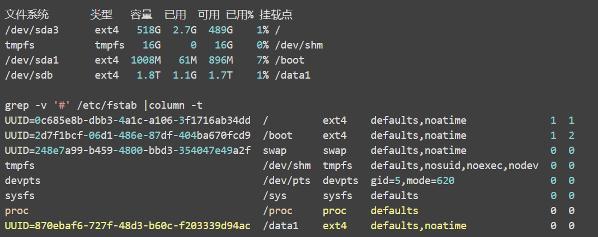
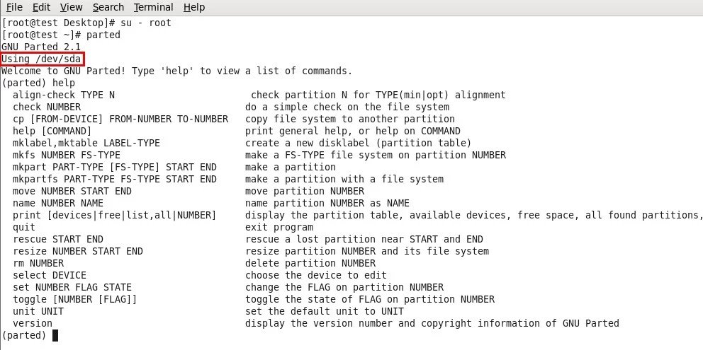
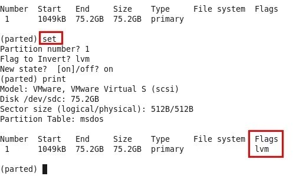

#### 导航
* 目录
    * [文件系统层次结构标准](#文件系统层次结构标准)
    * [通过UUID挂载分区](#通过UUID挂载分区)
    * [LVM逻辑磁盘卷管理](#LVM逻辑磁盘卷管理)
    * [parted命令](#parted命令)
    * [fdisk命令](#fdisk的详解)

#### 文件系统层次结构标准
http://zh.wikipedia.org/wiki/%E6%96%87%E4%BB%B6%E7%B3%BB%E7%BB%9F%E5%B1%82%E6%AC%A1%E7%BB%93%E6%9E%84%E6%A0%87%E5%87%86


| 目录 | 描述 |  
| ---- | ---- |
| / | 第一层次结构 的根、 整个文件系统层次结构的根目录。 |  
| /bin/ | 需要在单用户模式可用的必要命令（可执行文件）；面向所有用户，例如： cat、 ls、 cp。 |  
| /boot/ | 引导程序文件，例如： kernel、initrd；时常是一个单独的分区 |  
| /dev/ | 必要设备, 例如：/dev/null. |  
| /etc/ | 特定主机，系统范围内的配置文件。关于这个名称目前有争议。在贝尔实验室关于UNIX实现文档的早期版本中，/etc 被称为etcetera，  这是由于过去此目录中存放所有不属于别处的所有东西（然而，FHS限制/etc只能存放静态配置文件，不能包含二进制文件）。  自从早期文档出版以来，目录名称已被以各种方式重新称呼。最近的解释包括反向缩略语如："可编辑的文本配置"（英文 "Editable Text Configuration"）或"扩展工具箱"（英文 "Extended Tool Chest"）。  |
| &ensp;&ensp;/etc/opt/ | /opt/的配置文件 |  
| &ensp;&ensp;/etc/X11/ | X窗口系统(版本11)的配置文件 |  
| &ensp;&ensp;/etc/sgml/ | SGML的配置文件 |  
| &ensp;&ensp;/etc/xml/ | XML的配置文件 |  
| /home/ | 用户的家目录，包含保存的文件、个人设置等，一般为单独的分区。 |  
| /lib/ | /bin/ 和 /sbin/中二进制文件必要的库文件。 |  
| /media/ | 可移除媒体(如CD-ROM)的挂载点 (在FHS-2.3中出现)。 |  
| /mnt/ | 临时挂载的文件系统。 |  
| /opt/ | 可选应用软件 包。 |  
| /proc/ | 虚拟文件系统，将内核与进程状态归档为文本文件。例如：uptime、 network。在Linux中，对应Procfs格式挂载。 |  
| /root/ | 超级用户的家目录 |  
| /sbin/ | 必要的系统二进制文件，例如： init、 ip、 mount。 |  
| /srv/ | 站点的具体数据，由系统提供。 |  
| /tmp/ | 临时文件(参见 /var/tmp)，在系统重启时目录中文件不会被保留。 |  
| /usr/ | 用于存储只读用户数据的第二层次； 包含绝大多数的(多)用户工具和应用程序，注意不是user的缩写，而是"Unix Software Resource"的缩写。 |  
| &ensp;&ensp;/usr/bin/ | 非必要可执行文件 (在单用户模式中不需要)；面向所有用户。 |  
| &ensp;&ensp;/usr/include/ | 标准包含文件。 |  
| &ensp;&ensp;/usr/lib/ | /usr/bin/和/usr/sbin/中二进制文件的库。 |  
| &ensp;&ensp;/usr/sbin/ | 非必要的系统二进制文件，例如：大量网络服务的守护进程。 |  
| &ensp;&ensp;/usr/share/ | 体系结构无关（共享）数据。 |  
| &ensp;&ensp;/usr/src/ | 源代码,例如:内核源代码及其头文件。 |  
| &ensp;&ensp;/usr/X11R6/ | X窗口系统 版本 11, Release 6. |  
| &ensp;&ensp;/usr/local/ | 本地数据的第三层次， 具体到本台主机。通常而言有进一步的子目录， 例如：bin/、lib/、share/. |
| /var/ | 变量文件——在正常运行的系统中其内容不断变化的文件，如日志，脱机文件和临时电子邮件文件。有时是一个单独的分区。 |  
| &ensp;&ensp;/var/cache/ | 应用程序缓存数据。这些数据是在本地生成的一个耗时的I/O或计算结果。应用程序必须能够再生或恢复数据。缓存的文件可以被删除而不导致数据丢失。 |  
| &ensp;&ensp;/var/lib/ | 状态信息。 由程序在运行时维护的持久性数据。 例如：数据库、包装的系统元数据等。 |  
| &ensp;&ensp;/var/lock/ | 锁文件，一类跟踪当前使用中资源的文件。 |  
| &ensp;&ensp;/var/log/ | 日志文件，包含大量日志文件，为了防止日志占满根分区，生产环境中一般是单独分区。 |  
| &ensp;&ensp;/var/mail/ | 用户的电子邮箱。 |  
| &ensp;&ensp;/var/run/ | 自最后一次启动以来运行中的系统的信息，例如：当前登录的用户和运行中的守护进程、一些守护进程的pid文件、socket文件。现已经被/run代替。 |  
| &ensp;&ensp;/var/spool/ | 等待处理的任务的脱机文件，例如：打印队列和未读的邮件。 |  
| &ensp;&ensp;/var/spool/mail/ | 用户的邮箱(不鼓励的存储位置) |  
| &ensp;&ensp;/var/tmp/ | 在系统重启过程中可以保留的临时文件。 |  
| /run/ | 代替/var/run目录。 |  


#### partprobe 不重启的情况重读分区
https://www.bookstack.cn/read/linux-command-1.6.0/command-partprobe.md

```
[root@localhost ~]# partprobe
```


#### 通过UUID挂载分区
https://my.oschina.net/leejun2005/blog/290073  
UUID 全称是 Universally Unique Identifier，也就是说，每个分区有一个唯一的 UUID 值，这样就不会发生分区识别混乱的问题了。  
在 fstab 中用 UUID 挂载分区，看起来向这样：  
UUID=1234-5678 /mnt/usb vfat utf8,umask=0 0 0  
在 UUID= 后面填入分区相应的 UUID 值，就可以正确挂载分区了。  
那么，我们如何知道一个分区的 UUID 呢？  
有 3 种方法：  
1 通过浏览 /dev/disk/by-uuid/ 下的设备文件信息
```
# ls -l /dev/disk/by-uuid/
------
lrwxrwxrwx 1 root root 10 10-13 09:14 0909-090B -> ../../sdb5
lrwxrwxrwx 1 root root 10 10-13 09:13 7c627a81-7a6b-4806-987b-b5a8a0a93645 -> ../../sda4
..... 
```
 
2 通过 vol_id 命令
```
# vol_id /dev/sdb5
ID_FS_USAGE=filesystem
ID_FS_TYPE=vfat
ID_FS_VERSION=FAT32
ID_FS_UUID=0909-090B
ID_FS_UUID_ENC=0909-090B
ID_FS_LABEL=SWAP
ID_FS_LABEL_ENC=SWAP
ID_FS_LABEL_SAFE=SWAP
```

3 通过 blkid 命令
```
# blkid /dev/sdb5
/dev/sdb5: LABEL="SWAP" UUID="0909-090B" TYPE="vfat"
通过这三种方法都可以获得分区的 UUID，UUID 依据分区不同，长度和格式都不相同。
比如我最后把 /dev/sdb 挂载在了 /data1 目录下（不放心的话重启或者生成文件测试下，看挂载分区的空间被占用没）：
```


#### LVM逻辑磁盘卷管理
关于LVM的概念：  
http://molinux.blog.51cto.com/2536040/518441  
http://wqmsl.blog.51cto.com/847418/471784   
3层结构——物理卷（pv），卷组（vg），逻辑卷（lv）

操作  
http://hi.baidu.com/voostar/item/6aaeca5b779a1b948c12edf2  
操作流程：  
1. 建立LVM类型的分区(如果是裸盘直接创建PV则没有此步)  
2. 建立LVM物理卷PV  
3. 建立LVM卷组VG  
4. 建立LVM逻辑卷LV  
5. 建立文件系统  
6. 挂载文件系统  

fdisk -l  查看已被系统识别的磁盘
fdisk对磁盘进行划分，使用fdisk命令的 t 选项将物理磁盘卷ID修改8e（LVM的物理卷）

pv，vg，lv分别对应物理卷，卷组，逻辑卷  
前三者加上create，extend，remove，display关键字分别对应创建，拓展，移除，查看。  
pvcreate将该磁盘或分区创建成pv  裸磁盘也可以直接创建,如 pvcreate /dev/sdb  
vgextend加入已存在的卷组vg中，新增则是vgcreate 卷组名

lvextend有了空闲空间的卷组则可以扩容  
lvcreate -L 10G -n 卷名 卷组名  
关于大小写的L , -L指定size ,小写 l 指定的是PE数  
使用剩余的全部空间的形式为 -l +100%FREE  
从卷组的剩余空间为某个LV扩容,不需要给出卷组名,命令格式如  
lvcreate -L 10G -n 卷名  
在-L 后面给的size,带+号为在原基础上增加多少,不带+号为总大小为多少  
<font color=red>带-r参数为在调整大小之后执行resize , 可省去后续的resize2fs那一步</font>  

lvdisplay查看完整的卷路径  
resize2fs最后重新生成大小----设备完整路径,如 /dev/mapper/rootvg

解释得更为详细  
http://h2olyu.blog.51cto.com/1490267/1181547  

<font color=red>LVM的缩减</font>  
标准步骤  
1.umount filesystem  
2.e2fsck filesystem  
3.resize2fs filesystem  
4.lvredure  
http://blog.itpub.net/32980/viewspace-1123851/  
http://bbs.chinaunix.net/thread-1925323-1-1.html  

#### parted命令
http://www.cnblogs.com/zhangpengme/archive/2011/12/29/2305963.html   
执行parted进入parted的交互环境，不同的是help打在前面（如help mkpart），获取帮助；  
与fdisk相同的是，同样应当跟设备文件名，如不加，将会自动寻找首个磁盘设备；  



另外，parted里的分区是即时执行，而fdisk是被缓存  
parted对磁盘置标志位，使用set  



parted 非交互模式  
https://blog.51cto.com/qq862228267/2046392  
parted 使用-s参数, 即script, 可以非交互模式下完成操作

parted 对齐问题  
遇到提示:  
```Warning: The resulting partition is not properly aligned for best performance.```  
https://blog.hqcodeshop.fi/archives/273-GNU-Parted-Solving-the-dreaded-The-resulting-partition-is-not-properly-aligned-for-best-performance.html
也就是该磁盘第一个分区, 起始点设为0%


#### fdisk的详解
http://linux008.blog.51cto.com/2837805/548711  
在fdisk里的操作，在没有使用wq保存更改操作以前，不会生效，但相应的操作指令会被缓存。