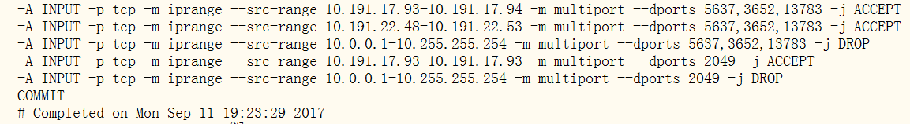

### 导航--点击跳转
[firewalld 部分](#firewalld部分)

[iptables 部分](#firewalld部分)

#### firewalld部分


#### iptables部分
1) Linux操作系统中永久性生效，重启后不会复原  
开启： chkconfig iptables on  
关闭： chkconfig iptables off  

2) 即时生效，重启后复原  
开启： service iptables start  
关闭： service iptables stop  

比较详细的说明  
http://www.vpser.net/security/linux-iptables.html   
http://www.lampbo.org/linux-xuexi/linux-advance/iptables-options.html  
http://blog.51yip.com/linux/1404.html  

-A 参数默认是添加到INPUT方向的规则链尾部，默认的配置文件通常最后一条是拒绝所有请求，因此，添加在其后的规则实际上无法起作用。使用-I 参数插入规则链顶部。

最简单的开放端口示例  
iptables -I INPUT -p tcp --dport 22 -j ACCEPT

保存规则  
service iptables save

<font color=red>添加ip段范围的用法以及直接写入 /etc/sysconfig/iptables 文件中的示例</font>
```
# Generated by iptables-save v1.4.7 on Wed Oct 26 09:29:01 2016
*filter
:INPUT ACCEPT [18:1824]
:FORWARD ACCEPT [0:0]
:OUTPUT ACCEPT [159:58904]
-A INPUT -s 127.0.0.1/32 -j ACCEPT
-A INPUT -s 10.191.20.137/32 -j ACCEPT
-A INPUT -s 10.191.20.138/32 -j ACCEPT
-A INPUT -p tcp -m iprange --src-range 10.191.16.84-10.191.16.91 -m tcp --dport 10073 -j ACCEPT
-A INPUT -p tcp -m iprange --src-range 10.191.28.130-10.191.28.146 -m tcp --dport 10073 -j ACCEPT
-A INPUT -p tcp -m iprange --src-range 10.191.19.1-10.191.19.3 -m tcp --dport 10073 -j ACCEPT
-A INPUT -p tcp -m iprange --src-range 10.191.28.130-10.191.28.132 -m tcp --dport 10073 -j ACCEPT
-A INPUT -p tcp -m iprange --src-range 10.191.28.141-10.191.28.142 -m tcp --dport 10073 -j ACCEPT
-A INPUT -s 10.191.19.2/32 -p tcp -m tcp --dport 10073 -j ACCEPT
-A INPUT -p tcp -m tcp --dport 10073 -j DROP
COMMIT
# Completed on Wed Oct 26 09:29:01 2016
```

<font color=red>端口范围的另一种写法</font>  
红帽iptables文件 /etc/sysconfig/iptables
```
-A RH-Firewall-1-INPUT -m state --state NEW -m tcp -p tcp --dport 700:800 -j ACCEPT
```
- ```700:800```  表示700到800之间的所有端口  
- ```:800```   表示800及以下所有端口  
- ```700:```   表示700以及以上所有端口  

多地址多端口的写法


```
-A INPUT -p tcp -m iprange --src-range 192.3.208.119-192.3.208.119 -m multiport --dports 22,1000,6000,7000,9527,10001,10002,20023,20024,20025 -j ACCEPT
-A INPUT -p tcp -m iprange --src-range 42.88.165.64-42.88.165.64 -m multiport --dports 22,1000,6000,7000,9527,10001,10002,20023,20024,20025 -j ACCEPT
-A INPUT -p tcp -m iprange --src-range 192.168.2.1-192.168.2.254 -m multiport --dports 22,1000,6000,7000,9527,10001,10002,20023,20024,20025 -j ACCEPT
-A INPUT -p tcp -m multiport --dports 22,1000,6000,7000,9527,10001,10002,20023,20024,20025 -j DROP
```

##### iptables 的保存    
- RHEL / CentOS  
使用service iptables save即可  
- SuSE 11  
只有iptables-save将输出重定向到文件, iptables-restore 文件名 命令进行恢复


SuSE上配置iptables
按其官方的配置方式,配置文件：/etc/sysconfig/SuSEfirewall2
可填写23:65535形式,冒号为连续端口号
