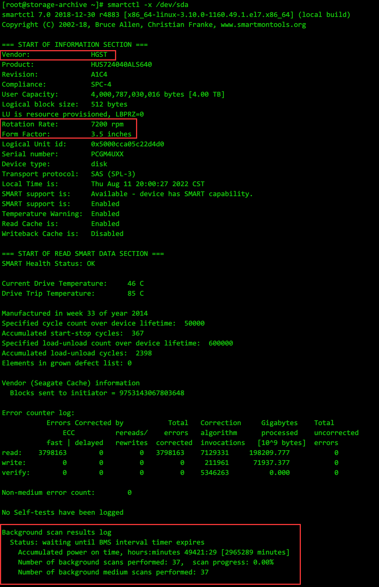

* [目录](#0)
  * [查看磁盘归属哪张板卡](#1)
  * [查看磁盘信息的方式](#1)
  * [smartctl 里的 Background scan](#3)
  * [by-id 查找与盘符的对应关系](#4)
  * [查看 PCI-E 设备工作的版本与通道数](#5)
  * [盘符上限问题](#6)
  * [移动设备挂载与Winodws分区表错误修复](#7)
  * [固化网卡命名](#8)


<h3 id="1">查看磁盘归属哪张板卡</h3>  

http://bean-li.github.io/proc-scsi-scsi-to-dev-sdX/  
https://blog.csdn.net/yiyeguzhou100/article/details/100715930  


如图所示  

```
cat /proc/scsi/scsi
```

是为列出所有scsi设备的通道编号, 依次为:  
host -> channel -> id -> lun

而通过

```
ls -ld /sys/block/*/device
```

则可以查看每个盘符对应的通道编号, 两者对应上, 则可获知需要的信息  
但如果是虚拟化平台直通后的, 又会无法确定在宿主机上的对应关系, 因为通道号不同

<h3 id="2">查看磁盘信息的方式</h3> 

当磁盘处于重负载下, 使用 ```parted -l``` 命令可能会挂起一直得不到响应.  
目前尚未确认属于特定条件的个案还是普遍.  

与此同时的 ```smartctl``` ```lsblk``` 则不会有此现象

查看磁盘扇区大小的方式  

https://zdyxry.github.io/2019/06/05/%E6%9F%A5%E7%9C%8B%E7%A3%81%E7%9B%98%E6%89%87%E5%8C%BA%E5%A4%A7%E5%B0%8F/

除了 ```parted -l``` 有所显示以外, ```lsblk``` 同样也可以完成此任务

```
lsblk -d -o NAME,PHY-SEC,LOG-SEC <设备名>
```

其中  
-d 不显示 slave 节点, 也就是此磁盘之上的分区信息不显示出来  
-o 指定显示哪些列的信息, 其中 PHY-SEC,LOG-SEC 分别代表物理扇区, 逻辑扇区, -h 帮助信息有详细说明


<h3 id="3">smartctl 里的 Background scan</h3>

有关此话题的讨论  
https://www.reddit.com/r/DataHoarder/comments/e677p1/psa_if_you_have_sas_drives_check_the_background/

有关 ```Background scan```  
题主以为是希捷独有技术, 因为他没接触过其他品牌, 所以他也不能确定.  
实际上应该是企业级的机械盘, 各个厂家都有--准确的说是SAS盘, SAS盘通常都是面向企业级客户.

在我的这个例子里, 大概也是企业盘里最拉垮的一类了, 7200转的SAS, 启用了 ```Background scan``` 



凑巧的是帖子讨论的不少人都是ZFS 文件系统的用户, 对 ```Background scan``` 也是在 ZFS 使用场景下进行的讨论.

>As long as you’re doing regular scrubs on your pools, arguably you don’t need it with ZFS. However, counterpoint is that a scrub only reads allocated blocks, so a potential weak spot might not be discovered until you write to it and then have issues later reading it. Also, I can confirm that the BMS does not only reallocate sectors, it will first try a rewrite-in-place which will usually succeed - basically, if the scan decides a sector needed a little too much ECC, even if it read successfully, it will rewrite it to “refresh” it on the physical medium. The drive SHOULD be doing this in normal operation as well, but I can’t 100% confirm that.
>
>If a drive runs out of spare sectors it should be discarded regardless of interface and type. The secondary point of the BMS is to detect this scenario sooner.
>
>The core point is to do regular read tests to ensure all data remains readable and to catch otherwise silent errors. As long as you’re doing that regularly in some fashion it should be OK.

他的核心观点是, ```Background scan``` 在工作时对IO性能的影响有限,   
而 ```zfs scurb``` 功能只检查有数据的位置, 而没数据的位置由于 ```zfs``` 不做检查, 因此 ```Background scan``` 是个弥补.  
技术上来说两者功能并不重叠, 并且由于负面影响, 应该处于开启状态.


<h3 id="4">by-id 查找与盘符的对应关系</h3> 

在 ```zfs``` 的命令 ```zpool status``` 中, 展现的不是盘符, 而是id, 如下所示

```
NAME                                          STATE     READ WRITE CKSUM
SAS-4T-group01                                DEGRADED     0     0     0
  raidz3-0                                    DEGRADED     0     0     0
    scsi-35000cca05c22d4d0                    ONLINE       0     0     0
    scsi-35000cca05c2302a4                    ONLINE       0     0     0
    scsi-35000cca05c218680                    ONLINE       0     0     0
    scsi-35000cca03b49d970                    ONLINE       0     0     0
    scsi-35000cca05c203418                    ONLINE       0     0     0
    scsi-35000cca03b8c2c20                    ONLINE       0     0     0
    scsi-35000cca03b8e60b4                    FAULTED      2     0     0  too many errors
    scsi-35000cca05c2302a8                    ONLINE       0     0     0
    ata-ST4000DM004-2CV104_ZFN0238P           ONLINE       0     0     0
    ata-WDC_WD40EZRZ-00GXCB0_WD-WCC7K0CEHPR8  DEGRADED     0     0   108  too many errors
    scsi-35000cca05c1e5180                    ONLINE       0     0     0
    scsi-35000cca05c0f6d24                    ONLINE       0     0     0
    scsi-35000cca05c1e5200                    ONLINE       0     0     0
    ata-WDC_WD40EZRZ-00GXCB0_WD-WCC7K5EAD4EK  ONLINE       0     0     0
    ata-WDC_WD40EZRZ-00GXCB0_WD-WCC7K2DN7X0E  ONLINE       0     0     0
```

当需要知晓某块盘 对应系统上哪个盘符, 以便于后续查询其他信息时, 就需要解决这个对应关系转换的问题

https://www.diytechguru.com/2020/11/27/identify-zfs-disks-using-disk-by-id/

命令也很简单

```
ls -l /dev/disk/by-id/ 
```

多加个 ```grep``` 也就有想要的答案了

```
[root@storage-archive ~]# ls -l /dev/disk/by-id/ | grep scsi-35000cca03b8e60b4
lrwxrwxrwx 1 root root  9 Aug 13 23:13 scsi-35000cca03b8e60b4 -> ../../sdg
lrwxrwxrwx 1 root root 10 Aug 13 23:13 scsi-35000cca03b8e60b4-part1 -> ../../sdg1
lrwxrwxrwx 1 root root 10 Aug 13 23:13 scsi-35000cca03b8e60b4-part9 -> ../../sdg9
[root@storage-archive ~]# ls -l /dev/disk/by-id/ | grep ata-WDC_WD40EZRZ-00GXCB0_WD-WCC7K0CEHPR8
lrwxrwxrwx 1 root root  9 Aug 13 23:13 ata-WDC_WD40EZRZ-00GXCB0_WD-WCC7K0CEHPR8 -> ../../sdm
lrwxrwxrwx 1 root root 10 Aug 13 23:13 ata-WDC_WD40EZRZ-00GXCB0_WD-WCC7K0CEHPR8-part1 -> ../../sdm1
lrwxrwxrwx 1 root root 10 Aug 13 23:13 ata-WDC_WD40EZRZ-00GXCB0_WD-WCC7K0CEHPR8-part9 -> ../../sdm9
```

<h3 id="5">查看 PCI-E 设备工作的版本与通道数</h3>

https://www.cnblogs.com/lsgxeva/p/9542975.html

流程共3个步骤

1) lspci 不加参数, 先确认要查找设备的bus号, slot号, function号  
2) lspci -n 按bus号, slot号, function号 进行过滤, 得到 ```Vendor ID + Device ID``` 的组合  
3) lspci -n -d 按 ```Vendor ID + Device ID``` 过滤,得到PCI-E通道的版本和通道数的信息  

示例一

```
[root@5950X-node1 ~]# lspci | grep -i samsung
01:00.0 Non-Volatile memory controller: Samsung Electronics Co Ltd NVMe SSD Controller SM981/PM981/PM983
04:00.0 Non-Volatile memory controller: Samsung Electronics Co Ltd NVMe SSD Controller SM981/PM981/PM983
[root@5950X-node1 ~]# lspci -n | grep 01:00.0
01:00.0 0108: 144d:a808
[root@5950X-node1 ~]# lspci -n -d 144d:a808 -vvv | grep --color  Width
		LnkCap:	Port #0, Speed 8GT/s, Width x4, ASPM L1, Exit Latency L1 <64us
		LnkSta:	Speed 8GT/s (ok), Width x4 (ok)
		LnkCap:	Port #0, Speed 8GT/s, Width x4, ASPM not supported
		LnkSta:	Speed 8GT/s (ok), Width x4 (ok)
```

示例二

```
[root@storage-archive ~]# lspci -n -d 15b3:1003 -vvv | grep --color  Width
		LnkCap:	Port #8, Speed 8GT/s, Width x8, ASPM L0s, Exit Latency L0s unlimited, L1 unlimited
		LnkSta:	Speed 5GT/s, Width x2, TrErr- Train- SlotClk+ DLActive- BWMgmt- ABWMgmt-
	
[root@storage-archive ~]# lspci -n -d 1000:0087 -vvv | grep --color  Width
pcilib: sysfs_read_vpd: read failed: Input/output error
		LnkCap:	Port #0, Speed 8GT/s, Width x8, ASPM L0s, Exit Latency L0s <64ns, L1 <1us
		LnkSta:	Speed 5GT/s, Width x8, TrErr- Train- SlotClk+ DLActive- BWMgmt- ABWMgmt-

[root@storage-archive ~]# lspci -n -d 1000:0086 -vvv | grep --color  Width
pcilib: sysfs_read_vpd: read failed: Input/output error
		LnkCap:	Port #0, Speed 8GT/s, Width x8, ASPM L0s, Exit Latency L0s <64ns, L1 <1us
		LnkSta:	Speed 5GT/s, Width x2, TrErr- Train- SlotClk+ DLActive- BWMgmt- ABWMgmt-
```

#### 在 vmware ESXi 上查看的方法

从 ESXi 5.x 上开始, vmware 移除了 ```lspci -vvv``` 的大部分信息, 不再能显示 PCI-E 通道及版本

能用的命令是 ```esxcli hardware pci list```

https://communities.vmware.com/t5/ESXi-Discussions/What-is-the-ESXi-command-to-obtain-PCI-information-like-DevSta/td-p/947254

它的示例如下:

```
0000:02:00.1
   Address: 0000:02:00.1
   Segment: 0x0000
   Bus: 0x02
   Slot: 0x00
   Function: 0x1
   VMkernel Name: vmnic5
   Vendor Name: Intel Corporation
   Device Name: Ethernet Controller 10 Gigabit X540-AT2
   Configured Owner: Unknown
   Current Owner: VMkernel
   Vendor ID: 0x8086
   Device ID: 0x1528
   SubVendor ID: 0x103c
   SubDevice ID: 0x192d
   Device Class: 0x0200
   Device Class Name: Ethernet controller
   Programming Interface: 0x00
   Revision ID: 0x01
   Interrupt Line: 0x0a
   IRQ: 10
   Interrupt Vector: 0x32
   PCI Pin: 0x01
   Spawned Bus: 0x00
   Flags: 0x3201
   Module ID: 4133
   Module Name: ixgbe
   Chassis: 0
   Physical Slot: 2
   Slot Description: CPU1 SLOT2 PCI-E 3.0 X4 (IN X8 SLOT)
   Passthru Capable: true
   Parent Device: PCI 0:0:1:1
   Dependent Device: PCI 0:2:0:1
   Reset Method: Function reset
   FPT Sharable: true

0000:04:00.0
   Address: 0000:04:00.0
   Segment: 0x0000
   Bus: 0x04
   Slot: 0x00
   Function: 0x0
   VMkernel Name: vmhba2
   Vendor Name: LSI Logic / Symbios Logic
   Device Name: LSI2308_2
   Configured Owner: VM Passthru
   Current Owner: VM Passthru
   Vendor ID: 0x1000
   Device ID: 0x0087
   SubVendor ID: 0x1000
   SubDevice ID: 0x3020
   Device Class: 0x0107
   Device Class Name: Serial Attached SCSI controller
   Programming Interface: 0x00
   Revision ID: 0x05
   Interrupt Line: 0x0b
   IRQ: 255
   Interrupt Vector: 0x00
   PCI Pin: 0x00
   Spawned Bus: 0x00
   Flags: 0x3401
   Module ID: 21
   Module Name: pciPassthru
   Chassis: 0
   Physical Slot: 3
   Slot Description: CPU1 SLOT3 PCI-E 3.0 X16
   Passthru Capable: true
   Parent Device: PCI 0:0:2:0
   Dependent Device: PCI 0:4:0:0
   Reset Method: Function reset
   FPT Sharable: true
```

其中 ```Slot Description``` 是可以帮助确认的描述信息, 它读取了主板(motherboard)上的标识信息


<h3 id="6">盘符上限问题</h3>  

有关盘符上限问题  

https://access.redhat.com/solutions/70913

阅读全文需要红帽订阅权限的帐号

离线版本

<a href="files/What is the theoretical maximum number.pdf" target="_blank">附件</a>


简而言之就是

> 盘符总共可用3位字母  
1） sda ~ sdz : 26  
2） sdaa ~ sdzz : 26x26=676  
3） sdaaa ~ sdzzz: 26x26x26=17576  
4） total=26+26x26+26x26x26=18278

> 来自 SCSI 的"本地盘"  
> 
> RHEL6: default limit is 511  
RHEL7: default limit is 16,383  
查看当前限制: cat /sys/module/scsi_mod/parameters/max_report_luns


> 来自存储划分的 "LUN"  
> 
> Emulex controllers support a maximum of 65,535 LUNs. The default is set to 255.  
> 查看当前限制: cat /sys/module/lpfc/parameters/lpfc_max_luns
> 
> QLogic controllers support a maximum of 65,535 LUNs. The default is set to 65,535  
> see current limit: cat /sys/module/qla2xxx/parameters/ql2xmaxlun


<h3 id="7">移动设备挂载与Winodws分区表错误修复</h3>  

在Linux上挂载 NTFS格式的移动硬盘, 即使是GPT格式的分区表, 使用的软件包是 ```ntfs-3g``` 这个是正确无误的

可能会遇到的错误情况, parted命令提示如下:

```
Error: The primary GPT table is corrupt, but the backup appears OK, so that will
be used.
OK/Cancel?                                                                
OK/Cancel? ok                                                             
Model: External USB 3.0 (scsi)
Disk /dev/sdb: 4001GB
Sector size (logical/physical): 512B/4096B
Partition Table: gpt
Disk Flags: 

Number  Start   End     Size    File system  Name                  Flags
 1      1049kB  4001GB  4001GB  ntfs         Basic data partition  msftdata
```

挂载出现:

```
[root@5950X-node1 ~]# mount /dev/sdb /mnt/usb-disk -t ntfs-3g
NTFS signature is missing.
Failed to mount '/dev/sdb': Invalid argument
The device '/dev/sdb' doesn't seem to have a valid NTFS.
Maybe the wrong device is used? Or the whole disk instead of a
partition (e.g. /dev/sda, not /dev/sda1)? Or the other way around?
```

不过既然 ```parted``` 命令有提示 GPT 主分区表损坏, 备份分区表可用, 那么大概率可以修复

修复过程:

https://blog.csdn.net/isinstance/article/details/78966829

```
gdisk <设备, 如: /dev/sdb>
```

完整过程:

```
[root@5950X-node1 ~]# gdisk /dev/sdb
GPT fdisk (gdisk) version 1.0.3

Caution! After loading partitions, the CRC doesn't check out!
Warning! Main partition table CRC mismatch! Loaded backup partition table
instead of main partition table!

Warning! One or more CRCs don't match. You should repair the disk!

Partition table scan:
  MBR: protective
  BSD: not present
  APM: not present
  GPT: damaged

****************************************************************************
Caution: Found protective or hybrid MBR and corrupt GPT. Using GPT, but disk
verification and recovery are STRONGLY recommended.
****************************************************************************

Command (? for help): r

Recovery/transformation command (? for help): ?
b	use backup GPT header (rebuilding main)
c	load backup partition table from disk (rebuilding main)
d	use main GPT header (rebuilding backup)
e	load main partition table from disk (rebuilding backup)
f	load MBR and build fresh GPT from it
g	convert GPT into MBR and exit
h	make hybrid MBR
i	show detailed information on a partition
l	load partition data from a backup file
m	return to main menu
o	print protective MBR data
p	print the partition table
q	quit without saving changes
t	transform BSD disklabel partition
v	verify disk
w	write table to disk and exit
x	extra functionality (experts only)
?	print this menu

Recovery/transformation command (? for help): b

Recovery/transformation command (? for help): w

Final checks complete. About to write GPT data. THIS WILL OVERWRITE EXISTING
PARTITIONS!!

Do you want to proceed? (Y/N): y
OK; writing new GUID partition table (GPT) to /dev/sdb.
The operation has completed successfully.
```

第一个交互问题, 按 r 即 recovery, 修复  
第二个交互问题, 按 ? 显示帮助菜单  
在本例中, 选择 b 使用备份分区表头, 重建主分区表  
执行后无输出  
第四个交互问题, 按 w 将操作写入磁盘并退出

此时, parted 命令不再有错误提示, 挂载亦恢复正常.


<h3 id="8">固化网卡命名</h3>  

对红帽7以后的 udev 命名规则的解读  
https://www.aikaiyuan.com/12535.html

验证可行的操作步骤  
https://tinychen.com/20201024-centos8-modify-eth-name/

与早年间Oracle场景下的配置人员偏好于指定成想指定的网络接口命名略有区别.  
对于系统管理员来说, ifname 如果经常变化非常头疼, 因为在 nmcli 里是要指定 ifname 的.  
ifname 一旦变化, 就导致原本的IP配置失效, 网络不通.  

固化的原则也不同于早年Oracle基于其他设备编号, 我在这里使用网卡MAC地址作为锚定条件, 因为MAC地址写在网卡固件里, 不容易变化.  
即可达到我希望 ifname 不要因为主板上的PCIE通道号等可能变化的情况下也跟随变化.  

示例也很简单:

```
# 修改下面的这个配置文件，如果没有就新建一个，然后写入对应的mac地址和网卡名字，最后重启机器即可
[root@tiny-dpvs ~]# cat /etc/udev/rules.d/70-persistent-net.rules
SUBSYSTEM=="net", ACTION=="add", DRIVERS=="?*", ATTR{address}=="11:22:33:44:55:66", NAME="eth0"
SUBSYSTEM=="net", ACTION=="add", DRIVERS=="?*", ATTR{address}=="11:22:33:44:55:77", NAME="eth1"
SUBSYSTEM=="net", ACTION=="add", DRIVERS=="?*", ATTR{address}=="11:22:33:44:55:88", NAME="eth2"
```
