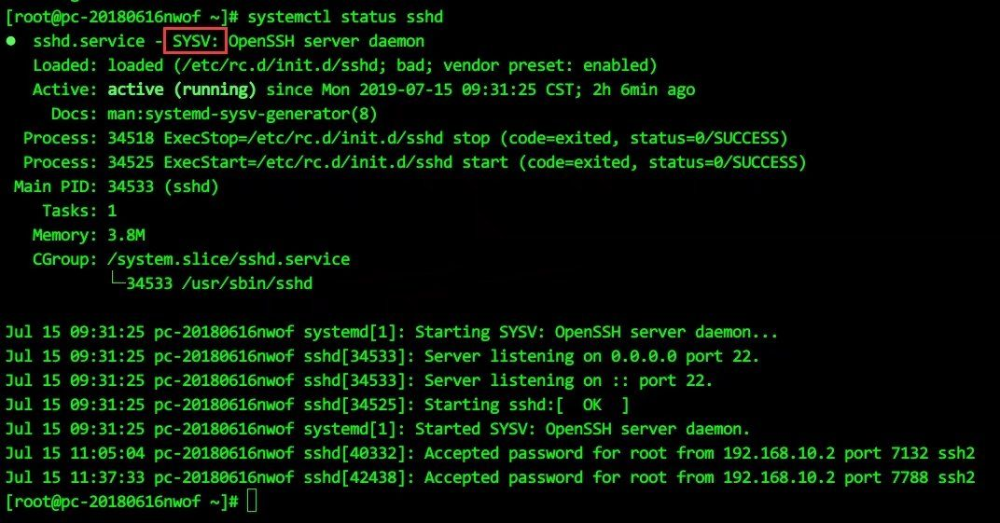

有两篇可以参考：
升级照此操作  
http://blog.csdn.net/celeste7777/article/details/51670824  
涉及到后续应用的一些问题  
http://blog.csdn.net/levy_cui/article/details/53100315 

实测需要替换原本的sshd启动脚本/etc/init.d/sshd  
从源码包里contrib/redhat/sshd.init拷贝替换

### openssh 8.8 弃用RSA-1  2021-11-13更新
https://dev.to/cloudx/why-openssh-8-8-cannot-find-a-host-key-type-if-ssh-rsa-is-provided-49i  
https://www.cnblogs.com/jiayouba/p/15430389.html  
openssh 8.8 开始,正式不支持RSA-1生成的证书  
因此, 解决途径2个  
要么让客户端有开关参数, 可以继续支持  
要么替换证书, 使用可被openssh 8.8支持的证书规格  
这里使用的, 可被支持的算法为ed25519  
```
ssh-keygen -t ed25519
```

### BUG / 未知问题
源码编译安装的openssh在RHEL 7的systemctl上工作不正常的情况  
https://bbs.csdn.net/topics/392512080  
带来了2个问题:
1) systemctl 不能正确监测到sshd的状态,当它汇报sshd失败时,实际可能是正常
2) 由于上述原因,systemctl 不停在"重启进程--检测sshd进程是否存活失败--重启进程"

解决办法:  
删除 /usr/lib/systemd/system/sshd.service  
源码编译安装时,已生成sysv的脚本,在删除systemctl的服务后,systemctl会去调用sysv脚本来检测状态和服务的启停




配置SSH互信实现免密码登录,在确认authorized_keys以及sshd_config配置文件里的项无误后,依然无法实现免密码登录的情况  
在重置该用户的password后解决, 推测是这一用户的密码有效期到期,导致用户处于锁定状态之类的原因造成免密码登录失败.


### 关于涉及到其他应用的问题  
CentOS 7.x由于openssh版本新了，其他应用连接会没有匹配的加密算法的错误提示，需加入/etc/ssh/sshd_config以下内容：
```
Ciphers aes128-cbc,aes192-cbc,aes256-cbc,aes128-ctr,aes192-ctr,aes256-ctr,3des-cbc,arcfour128,arcfour256,arcfour,blowfish-cbc,cast128-cbc  
 
KexAlgorithms diffie-hellman-group1-sha1,curve25519-sha256@libssh.org,ecdh-sha2-nistp256,ecdh-sha2-nistp384,ecdh-sha2-nistp521,diffie-hellman-group-exchange-sha256,diffie-hellman-group14-sha1  
```
关于xshell连接问题
提示 “找不到匹配的host key” 的问题
需要检查/etc/ssh/ 目录下的文件属性，新版的openssh只认可600的权限，组用户和其他即使可读也会导致异常

如果是root用户和口令认证的方式连接，需确认配置文件/etc/ssh/sshd_config中，以下两项存在
```
PasswordAuthentication yes
PermitRootLogin yes
```

### 常见编译安装异常处理
http://leung4080.github.io/linux/2013/08/07/OpenSSL-OpenSSH-%E5%8D%87%E7%BA%A7%E9%85%8D%E7%BD%AE/  
查看系统ssl、ssh当前版本
```
[root@csqtest soft]# ssh -V
OpenSSH_4.3p2, OpenSSL 0.9.8e-fips-rhel5 01 Jul 2008
```
OpenSSL安装过程  
获取OpenSSL源码包并上传到服务器 解压后，查看INSTALL文件（安装说明文件）
```
[root@csqtest soft]# tar -zxvf openssl-1.0.0.tar.gz 
[root@csqtest soft]# cd openssl-1.0.0
[root@csqtest openssl-1.0.0]# more INSTALL
```
配置、编译并安装
默认安装到/usr/local/ssl目录下。
```
[root@csqtest openssl-1.0.0]# ./config threads zlib shared
[root@csqtest openssl-1.0.0]# make 
[root@csqtest openssl-1.0.0]# make test
[root@csqtest openssl-1.0.0]# make install
```
查看编译出来的openssl的库文件与原来的openssl的差异。 可以看到libssl.so和libcrypto.so两个库文件的指向地址不同。

新版本：
```
[root@csqtest openssl-1.0.0]# ldd /usr/local/ssl/bin/openssl 
    libssl.so.1.0.0 => /usr/local/ssl/lib64/libssl.so.1.0.0 (0x00002aadd2a09000)
    libcrypto.so.1.0.0 => /usr/local/ssl/lib64/libcrypto.so.1.0.0 (0x00002aadd2c60000)
    libdl.so.2 => /lib64/libdl.so.2 (0x000000337a800000)
    libz.so.1 => /usr/lib64/libz.so.1 (0x000000337b400000)
    libc.so.6 => /lib64/libc.so.6 (0x000000337a400000)
    /lib64/ld-linux-x86-64.so.2 (0x0000003379400000)
[root@csqtest openssl-1.0.0]# /usr/local/ssl/bin/openssl version
OpenSSL 1.0.0 29 Mar 2010
```
旧版本：
```
[root@csqtest openssl-1.0.0]# ldd /usr/bin/openssl
    libssl.so.6 => /lib64/libssl.so.6 (0x0000003385a00000)
    libgssapi_krb5.so.2 => /usr/lib64/libgssapi_krb5.so.2 (0x0000003384e00000)
    libkrb5.so.3 => /usr/lib64/libkrb5.so.3 (0x0000003384a00000)
    libcom_err.so.2 => /lib64/libcom_err.so.2 (0x0000003384200000)
    libk5crypto.so.3 => /usr/lib64/libk5crypto.so.3 (0x0000003385600000)
    libcrypto.so.6 => /lib64/libcrypto.so.6 (0x0000003383600000)
    libdl.so.2 => /lib64/libdl.so.2 (0x000000337a800000)
    libz.so.1 => /usr/lib64/libz.so.1 (0x000000337b400000)
    libc.so.6 => /lib64/libc.so.6 (0x000000337a400000)
    libkrb5support.so.0 => /usr/lib64/libkrb5support.so.0 (0x0000003384600000)
    libkeyutils.so.1 => /lib64/libkeyutils.so.1 (0x0000003385200000)
    libresolv.so.2 => /lib64/libresolv.so.2 (0x0000003383e00000)
    /lib64/ld-linux-x86-64.so.2 (0x0000003379400000)
    libselinux.so.1 => /lib64/libselinux.so.1 (0x0000003380800000)
    libsepol.so.1 => /lib64/libsepol.so.1 (0x0000003380400000)
[root@csqtest openssl-1.0.0]# /usr/bin/openssl version
OpenSSL 0.9.8e-fips-rhel5 01 Jul 2008
```
查看升级后的openssl版本
```
[root@csqtest openssl-1.0.0]# /usr/local/ssl/bin/openssl version
OpenSSL 1.0.0 29 Mar 2010
```
现在有两个版本的openssl并存。 由于旧版本的openssl被很多系统组件所依赖，不对其做任何修改。

查看系统默认的openssl：
```
[root@csqtest openssl-1.0.0]# openssl version
OpenSSL 0.9.8e-fips-rhel5 01 Jul 2008
```
还是原来的版本。

OpenSSH升级过程
###获取OpenSSH源码包并上传到服务器
```
[root@csqtest soft]# tar -zxvf openssh-5.5p1.tar.gz 
[root@csqtest soft]# cd openssh-5.5p1
```
配置，编译并安装

由于openssh配置时会使用旧版本的openssl库文件，需要先配置以下三个变量，让其指向新版本的opnessl库文件：
```
[root@csqtest openssh-5.5p1]# DEFAULT_LIBPATH=/usr/local/ssl/include/openssl:/usr/local/ssl/lib64/
[root@csqtest openssh-5.5p1]# LIBPATH=${LIBPATH:=$DEFAULT_LIBPATH} 
[root@csqtest openssh-5.5p1]# LD_LIBRARY_PATH=${LD_LIBRARY_PATH:=$DEFAULT_LIBPATH}
[root@csqtest openssh-5.5p1]# LIBRARY_PATH=${LIBRARY_PATH:=$DEFAULT_LIBPATH}
[root@csqtest openssh-5.5p1]# export LIBPATH LD_LIBRARY_PATH LIBRARY_PATH
```
还需要更新一下locate库。
```
[root@csqtest openssh-5.5p1]# /usr/bin/updatedb
```
更新系统库文件
```
[root@csqtest openssh-5.5p1]# echo " /usr/local/ssl/lib64/" >> /etc/ld.so.conf.d/openssh.1.0.0.conf
[root@csqtest openssh-5.5p1]# ldconfig –v
```
ps:如果是32位的系统可能位置有所不同:/usr/local/ssl/lib/

配置时需要注意-with-ssl-dir需要使用当前SSL的安装路径/usr/local/ssl
```
[root@csqtest openssh-5.5p1]# ./configure -prefix=/usr -sysconfdir=/etc/ssh -with-ssl-dir=/usr/local/ssl -with-zlib -with-pam -with-md5-passwords -with-kerberos5 --without-zlib-version-check
```
如果没有指定上面三个环境变量会有以下提示： 
```
checking OpenSSL header version… 1000000f (OpenSSL 1.0.0 29 Mar 2010) checking OpenSSL library version… 90802f (OpenSSL 0.9.8e-fips-rhel5 01 Jul 2008) checking whether OpenSSL’s headers match the library… no configure: error: Your OpenSSL headers do not match your library. Check config.log for details.
```
```
[root@csqtest openssh-5.5p1]# make
[root@csqtest openssh-5.5p1]# make install
```
查看并修改配置文件。
```
[root@csqtest openssh-5.5p1]# more /etc/ssh/sshd_config
Port 22
Protocol 2
Banner none
X11Forwarding no
PermitEmptyPasswords no
ServerKeyBits 1024
LoginGraceTime 600
StrictModes yes
PermitRootLogin no
```
重启sshd服务
```
[root@csqtest openssh-5.5p1]# ps -ef|grep sshd
root      9861     1  0 00:06 ?        00:00:00 /usr/sbin/sshd
root      9925  4977  0 00:28 pts/2    00:00:00 grep sshd
[root@csqtest openssh-5.5p1]# /sbin/service sshd restart
```
查看当前SSL、SSH版本
```
[root@csqtest openssh-5.5p1]# ssh -V
OpenSSH_5.5p1, OpenSSL 1.0.0 29 Mar 2010
```
