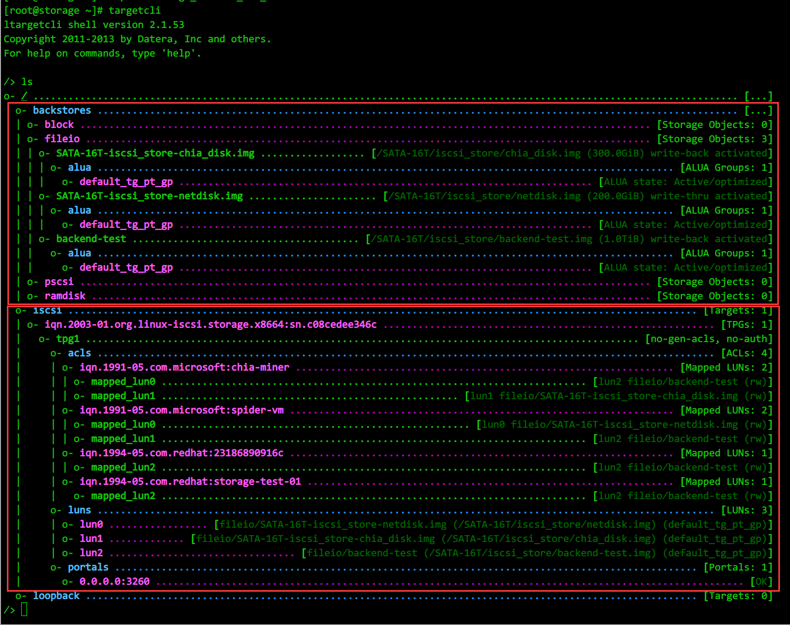

* [目录](#0)
  * [iscsi 服务端](#1)
  * [iscsi 客户端](#2)
  * [bcache 的使用](#3)


<h3 id="1">iscsi 服务端</h3>

中文手册  
https://access.redhat.com/documentation/zh-cn/red_hat_enterprise_linux/8/html/managing_storage_devices/configuring-an-iscsi-target_managing-storage-devices

英文手册  
https://access.redhat.com/documentation/en-us/red_hat_enterprise_linux/8/html/managing_storage_devices/configuring-an-iscsi-target_managing-storage-devices

#### targetcli 命令

在 targetcli 中分为2个部分  
一个是"后端存储"(backstore) , 类型有  
- block(直接使用块存储存放数据)  
- fileio(使用文件存放数据)  
- pscsi(直接使用SCSI盘存放数据)  
- ramdisk(使用内存作块存储设备存放数据)  

一个是"iscsi", 是对外提供服务的部分. 其中包括ACL规则等





使用示例  
http://linux.51yip.com/search/targetcli

<h3 id="2">iscsi 客户端</h3>

https://developer.aliyun.com/article/47365

红帽系上的软件包名称: ```iscsi-initiator-utils```

通过 yum 安装可能会附带的安装 ```iscsi-initiator-utils-devel```  

initiator名称用来唯一标识一个iSCSI Initiator端。保存此名称的配置文件为 ```/etc/iscsi/initiatorname.iscsi```


```
# vi /etc/iscsi/initiatorname.iscsi
InitiatorName=iqn.2000-01.com.synology:themain-3rd.ittest
```

**有关 iSCSI qualified name 命名规范**

https://docs.vmware.com/en/VMware-vSphere/7.0/com.vmware.vsphere.storage.doc/GUID-686D92B6-A2B2-4944-8718-F1B74F6A2C53.html

> iSCSI Qualified Name Format
> The iSCSI Qualified Name (IQN) format takes the form iqn.yyyy-mm.naming-authority:unique name, where:
>
> yyyy-mm is the year and month when the naming authority was established.
> 
> naming-authority is the reverse syntax of the Internet domain name of the naming authority. For example, the iscsi.
> 
> vmware.com naming authority can have the iSCSI qualified name form of iqn.1998-01.com.vmware.iscsi. The name 
> indicates that the vmware.com domain name was registered in January of 1998, and iscsi is a subdomain, maintained 
> by vmware.com.
> 
> unique name is any name you want to use, for example, the name of your host. The naming authority must make sure 
> that any names assigned following the colon are unique, such as:  
iqn.1998-01.com.vmware.iscsi:name1   
iqn.1998-01.com.vmware.iscsi:name2  
iqn.1998-01.com.vmware.iscsi:name999  

https://blog.csdn.net/Mickeywaugh/article/details/119103075

> 一、可以包含的字符  
> 最长223个字符，不能使用大写字母，可以使用的字符是：字母（a～z）、数字（0～9）、点（.）、冒号（:）和连字符（-）
> 
> 二、遵循以下两种编码方式
> 1．iqn(iSCSI qualified name)：  
类型  
日期（拥有组织名的日期）  
组织名  
组织内部唯一的标志符  
实例：iqn.2001-04.com.h3c:storage.tape1.sys1.xyz
> 
> 2．eui（Extended Unique Identifier，主要用于FC设备接入iSCSI网络）  
类型  
EUI-64 标识符（如果是FC设备，那么就是FC的WWN）  
实例：eui.02004567A425678D

CHAP认证 -- 可选项

```
vi /etc/iscsi/iscsid.conf
# To enable CHAP authentication set node.session.auth.authmethod
node.session.auth.authmethod = CHAP        去掉注释
# To set a CHAP username and password for initiator
node.session.auth.username = ittest              修改为网管提供的认证username/password
node.session.auth.password = Storageittest
```

发现服务端

```
iscsiadm -m discovery -t sendtargets -p 172.29.88.62
iscsiadm -m discovery -t sendtargets -p 172.29.88.62:3260
```

登录

```
iscsiadm -m node -T iqn.2000-01.com.synology:themain-3rd.ittest -p 172.29.88.62 --login
```

-T后面跟target名称，--login等同于-l，

登录目标节点成功后，即建立了initiator与target之间的会话（session），同时target提供的存储设备也挂载到主机中，在/dev目录下生成一个新的设备文件类似于sdb、sdc等。使用iscsiadm -m session -P 3（与service iscsi status相同）来查看连接会话信息。

如果出现某些错误, 希望清理 initiator 的缓存信息, 可以删除以下目录

```
/var/lib/iscsi/nodes/<server端名称的目录>
```


<h3 id="3">bcache 的使用</h3>

#### 基本操作

常用命令  
https://cloud.tencent.com/developer/article/1987561

```
# 创建后端(backend)磁盘, 创建后的设备通常如: /dev/bcache0
make-bcache -B <设备,如:/dev/sdc>


# 创建缓存(cache)磁盘
make-bcache -C <设备,如:/dev/sdc>


# 将前后端的关联关系建立,字符串是cset.uuid
echo "d0079bae-b749-468b-ad0c-6fedbbc742f4" >/sys/block/bcache0/bcache/attach 


# 查看设备的bcache信息
bcache-super-show <bcache格式化过的设备,如:/dev/sdc>


# 一条命令的创建方法
make-bcache -B <设备,如:/dev/sdc> -C <设备,如:/dev/sdc>


# 如果原本该磁盘上有文件系统信息, 则需要 wipefs 来擦除
wipefs -a <设备,如:/dev/sdc>


# 如果原本该磁盘上有bcache信息, 则会有提示, 带参数可以直接擦除
make-bcache -B <设备,如:/dev/sdc> -C <设备,如:/dev/sdc> --wipe-bcache


# 脱离缓存状态, bcache会将脏数据落到后端盘再脱离关联关系,字符串是cset.uuid
echo "d0079bae-b749-468b-ad0c-6fedbbc742f4" >/sys/block/bcache0/bcache/detach

# 注销缓存盘, 即该盘不再是bcache格式化过的磁盘,字符串是cset.uuid
echo 1>/sys/fs/bcache/d0079bae-b749-468b-ad0c-6fedbbc742f4/unregister

# 停用bcache后端磁盘
umount 卸载文件系统
echo 1>/sys/block/bcache0/bcache/stop
操作完成后，通过lsblk命令查看结果, 此时，设备下并无bcache磁盘，即表示bcache后端磁盘已经停用。 
```

#### bcache 的 cache 盘可以服务于多个 backend 后端磁盘, 但不能多个 cache 盘服务于同一个backend 后端磁盘 

https://unix.stackexchange.com/questions/152408/using-multiple-ssds-as-cache-devices-with-bcache

由以上帖子讨论内容得出.  
虽然其中有人提到开发者文档提到, 在未来的版本中, 会有多个cache可以以镜像mirror的形式组合以提升容错率, 但实际情况是 bcache
已多年未更新过代码

