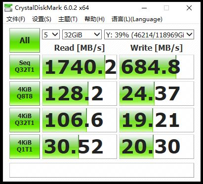

* [目录](#0)
  * [iscsi 服务端](#1)
  * [iscsi 客户端](#2)
  * [bcache 的使用](#3)
  * [mdadm 的使用](#4)
  * [有关存储性能问题的测试结论](#5)


<h3 id="1">iscsi 服务端</h3>


中文手册  
https://access.redhat.com/documentation/zh-cn/red_hat_enterprise_linux/8/html/managing_storage_devices/configuring-an-iscsi-target_managing-storage-devices

英文手册  
https://access.redhat.com/documentation/en-us/red_hat_enterprise_linux/8/html/managing_storage_devices/configuring-an-iscsi-target_managing-storage-devices

#### targetcli 命令

在 targetcli 中分为2个部分  
一个是"后端存储"(backstore) , 类型有  
- block(直接使用块存储存放数据)  
- fileio(使用文件存放数据)  
- pscsi(直接使用SCSI盘存放数据)  
- ramdisk(使用内存作块存储设备存放数据)  

一个是"iscsi", 是对外提供服务的部分. 其中包括ACL规则等


使用示例  
http://linux.51yip.com/search/targetcli  
https://knowledgebase.45drives.com/kb/kb450410-adding-new-luns-to-iscsi-configuration/

只不过关于 targetcli 的文章虽多, 但也是新手教程级别为主, 当用户需要独立控制某些环节的问题就没有交代清楚.

**创建 backstore 磁盘**

backstore 里的四种类型

- block：block类型存储对象适用于本地块设备和逻辑设备, 需要 ```dev=```
- fileio：fileio类型存储对象适用于存储在本地磁盘上的常规文件
- pscsi：pscsi类型存储对象适用于直接通过SCSI命令访问的资源, 需要 ```dev=```
- ramdisk：ramdisk类型存储对象适用于临时缓存设备，支持多session

红帽关于 pscsi 的提示  
https://access.redhat.com/documentation/zh-cn/red_hat_enterprise_linux/9/html/managing_storage_devices/creating-a-pscsi-storage-object_configuring-an-iscsi-target

以最常用的 ```fileio```为例, 创建的命令格式

```
/backstore/fileio create <在targetcli里的名称> <文件系统上的实际存放位置> <大小, 例如多少G>
```

**在已有ACL主机对象的情况下, 添加映射的LUN**

此场景适用于一个需要授权的客户端主机, 已经存在于 targetcli 内, 只不过现在缺少特定的 LUN 的授权, 需要添加特定的 LUN.

例如下图


```
/iscsi/<server 端的 WWN>/tpg1/acls/<客户端的 WWN> create tpg_lun_or_backstore=<数字> mapped_lun=<数字>
```

其中  
tpg_lun_or_backstore 是server端, 位于 ```/iscsi/<server 端的 WWN>/tpg1/luns```
mapped_lun 是客户端ACL 下的 映射LUN 的编号


**取消默认的,新增LUN后, 会自动添加到各个主机的ACL去的行为**

通过```man targetcli```可以发现, 这一行为是被 ```auto_add_mapped_luns``` 参数所定义,但具体操作也没说清楚.

https://access.redhat.com/documentation/en-us/red_hat_enterprise_linux/7/html/storage_administration_guide/online-storage-management

红帽该文档有指出步骤:

在 targetcli 内执行 ```set global auto_add_mapped_luns=false```

```
/> set global auto_add_mapped_luns=false
Parameter auto_add_mapped_luns is now 'false'.
/> exit
Global pref auto_save_on_exit=true
Last 10 configs saved in /etc/target/backup/.
Configuration saved to /etc/target/saveconfig.json
```

<h3 id="2">iscsi 客户端</h3>

https://developer.aliyun.com/article/47365

红帽系上的软件包名称: ```iscsi-initiator-utils```

通过 yum 安装可能会附带的安装 ```iscsi-initiator-utils-devel```  

initiator名称用来唯一标识一个iSCSI Initiator端。保存此名称的配置文件为 ```/etc/iscsi/initiatorname.iscsi```


```
# vi /etc/iscsi/initiatorname.iscsi
InitiatorName=iqn.2000-01.com.synology:themain-3rd.ittest
```

**有关 iSCSI qualified name 命名规范**

https://docs.vmware.com/en/VMware-vSphere/7.0/com.vmware.vsphere.storage.doc/GUID-686D92B6-A2B2-4944-8718-F1B74F6A2C53.html

> iSCSI Qualified Name Format
> The iSCSI Qualified Name (IQN) format takes the form iqn.yyyy-mm.naming-authority:unique name, where:
>
> yyyy-mm is the year and month when the naming authority was established.
> 
> naming-authority is the reverse syntax of the Internet domain name of the naming authority. For example, the iscsi.
> 
> vmware.com naming authority can have the iSCSI qualified name form of iqn.1998-01.com.vmware.iscsi. The name 
> indicates that the vmware.com domain name was registered in January of 1998, and iscsi is a subdomain, maintained 
> by vmware.com.
> 
> unique name is any name you want to use, for example, the name of your host. The naming authority must make sure 
> that any names assigned following the colon are unique, such as:  
iqn.1998-01.com.vmware.iscsi:name1   
iqn.1998-01.com.vmware.iscsi:name2  
iqn.1998-01.com.vmware.iscsi:name999  

https://blog.csdn.net/Mickeywaugh/article/details/119103075

> 一、可以包含的字符  
> 最长223个字符，不能使用大写字母，可以使用的字符是：字母（a～z）、数字（0～9）、点（.）、冒号（:）和连字符（-）
> 
> 二、遵循以下两种编码方式
> 1．iqn(iSCSI qualified name)：  
类型  
日期（拥有组织名的日期）  
组织名  
组织内部唯一的标志符  
实例：iqn.2001-04.com.h3c:storage.tape1.sys1.xyz
> 
> 2．eui（Extended Unique Identifier，主要用于FC设备接入iSCSI网络）  
类型  
EUI-64 标识符（如果是FC设备，那么就是FC的WWN）  
实例：eui.02004567A425678D

CHAP认证 -- 可选项

```
vi /etc/iscsi/iscsid.conf
# To enable CHAP authentication set node.session.auth.authmethod
node.session.auth.authmethod = CHAP        去掉注释
# To set a CHAP username and password for initiator
node.session.auth.username = ittest              修改为网管提供的认证username/password
node.session.auth.password = Storageittest
```

发现服务端

```
iscsiadm -m discovery -t sendtargets -p 172.29.88.62
iscsiadm -m discovery -t sendtargets -p 172.29.88.62:3260
```

登录

```
iscsiadm -m node -T iqn.2000-01.com.synology:themain-3rd.ittest -p 172.29.88.62 --login
```

其他

https://blog.csdn.net/qq_41586875/article/details/123090983

```
# 查看默认是否自动登录
grep startup /var/lib/iscsi/nodes/<server端的IQN>/<server端的IP+端口等>/default

# 重新扫描会话
iscsiadm -m node -R

# 查看注册的卷
cat /proc/scsi/scsi 

# 查看session
iscsiadm -m node
```

-T后面跟target名称，--login等同于-l，

登录目标节点成功后，即建立了initiator与target之间的会话（session），同时target提供的存储设备也挂载到主机中，在/dev目录下生成一个新的设备文件类似于sdb、sdc等。使用iscsiadm -m session -P 3（与service iscsi status相同）来查看连接会话信息。

如果出现某些错误, 希望清理 initiator 的缓存信息, 可以删除以下目录

```
/var/lib/iscsi/nodes/<server端名称的目录>
```

同样的, 如果不再需要该磁盘, 且该 iscsi server端的信息也无需保留, 也可以通过删除整个目录达成该目的.


<h3 id="3">bcache 的使用</h3>

#### 个人环境

编译Linux内核时, 选择的 bcache 以模块形式存在  
我个人的加载 bcache 模块的统一方式

```
[root@X9DRi-LN4F ~]# cat /etc/sysconfig/modules/bcache.modules
/usr/sbin/modprobe bcache

[root@X9DRi-LN4F ~]# chmod u+x /etc/sysconfig/modules/bcache.modules
```

#### 基本操作

常用命令  
https://cloud.tencent.com/developer/article/1987561

```
# 创建后端(backend)磁盘, 创建后的设备通常如: /dev/bcache0
make-bcache -B <设备,如:/dev/sdc>


# 创建缓存(cache)磁盘
make-bcache -C <设备,如:/dev/sdc>


# 将前后端的关联关系建立,字符串是cset.uuid
# 注意是把 cache 设备的 cset.uuid 加入到 attach
# 如果不确定 cset.uuid 的值, 用下方的 bcache-super-show 命令查看
echo "d0079bae-b749-468b-ad0c-6fedbbc742f4" >/sys/block/bcache0/bcache/attach 


# 查看设备的bcache信息
bcache-super-show <bcache格式化过的设备,如:/dev/sdc>


# 一条命令的创建方法
make-bcache -B <后端设备,如:/dev/sdc> -C <缓存设备,如:/dev/sdc>


# 如果原本该磁盘上有文件系统信息, 则需要 wipefs 来擦除
wipefs -a <设备,如:/dev/sdc>


# 如果原本该磁盘上有bcache信息, 则会有提示, 带参数可以直接擦除
make-bcache -B <设备,如:/dev/sdc> -C <设备,如:/dev/sdc> --wipe-bcache


# 脱离缓存状态, bcache会将脏数据落到后端盘再脱离关联关系,字符串是cset.uuid
echo "d0079bae-b749-468b-ad0c-6fedbbc742f4" >/sys/block/bcache0/bcache/detach

# 注销缓存盘, 即该盘不再是bcache格式化过的磁盘,字符串是cset.uuid
echo 1>/sys/fs/bcache/d0079bae-b749-468b-ad0c-6fedbbc742f4/unregister

# 停用bcache后端磁盘
umount 卸载文件系统
echo 1>/sys/block/bcache0/bcache/stop
操作完成后，通过lsblk命令查看结果, 此时，设备下并无bcache磁盘，即表示bcache后端磁盘已经停用。 
```

#### 新创建的 bcache 盘, 确认它的盘符

```
# 新创建的 bcache 盘, 确认它的盘符

[root@X9DRi-LN4F ~]# make-bcache -B /dev/sdk -C /dev/sdc
UUID:			b344551c-5162-4543-9f25-f98d336751cc
Set UUID:		5e636d9d-3a77-4ca0-840d-46fb3c92b8ce
version:		0
nbuckets:		763108
block_size:		1
bucket_size:		1024
nr_in_set:		1
nr_this_dev:		0
first_bucket:		1
UUID:			a0eae3cd-428b-4088-bd86-b952f5017aba
Set UUID:		5e636d9d-3a77-4ca0-840d-46fb3c92b8ce
version:		1
block_size:		1
data_offset:		16
```

创建之后有 "UUID", 注意不是"Set UUID", 而且是第2个"UUID", 即"first_bucket"下一行的"UUID"

由此UUID查找 

```
[root@X9DRi-LN4F ~]# ll /dev/bcache/by-uuid/
total 0
lrwxrwxrwx 1 root root 13 May 30 22:06 a0eae3cd-428b-4088-bd86-b952f5017aba -> ../../bcache0
```

可知指向的是 /dev/bcache0

#### 一个 bcache 设备, 如何确定它的构成成员盘

方式一

```lsblk``` 命令, 树形结构可以看出构成关系

方式二

相关信息, 其实都在 ```/sys/block/bcache<数字>/bcache/``` 下

这个 bcache 设备的后端磁盘的名称: ```/sys/block/bcache<数字>/bcache/backing_dev_name```  
这个 bcache 设备的后端磁盘的uuid: ```/sys/block/bcache<数字>/bcache/backing_dev_uuid```  
这个 bcache 设备的cache盘: &ensp;&ensp;&ensp;&ensp;&ensp;&ensp; ```/sys/block/bcache<数字>/bcache/cache``` 这是一个软链接

进而倒推这个 bcache 盘的 cache 设备是哪个 block 设备

```/sys/block/bcache<数字>/bcache/cache``` 指向的 /sys/fs/bcache/  
而路径中最后一级的字符串就正是 cache 设备的 cset.uuid  
再由 /sys/fs/bcache/<cset.uuid> 目录下的  
```bdev<数字>``` 指向它的后端设备  
```cache<数字>``` 指向它的 cache 设备的真实 block 设备对象

#### 关于在卸载 bcache 组合时常见的 Device or resource busy

```
[root@X9DRi-LN4F ~]# wipefs -a /dev/sdd
wipefs: error: /dev/sdd: probing initialization failed: Device or resource busy
[root@X9DRi-LN4F ~]# umount /dev/sdd
umount: /dev/sdd: not mounted.
```

https://unix.stackexchange.com/questions/115764/how-do-i-remove-the-cache-device-from-bcache

关于这一问题, 多数情况下都是源于 ```/sys/block/bcache<N>``` 再次出现导致的  
在保证文件系统已先行卸载的基础上, 再次执行

```
echo 1>/sys/block/bcache<N>/bcache/stop
```

再通过 ```lsblk``` 确认该 bcache 盘符没有再次出现.

#### 如果开机没有自动出现 bcache 后端磁盘设备

https://forums.gentoo.org/viewtopic-t-1068280-start-0.html

```
echo <后端磁盘/块设备的路径, 如/dev/sda, /dev/md125> > /sys/fs/bcache/register
```

补充:  
一个比较吊诡的现象--创建了bcache的设备, 在一次非人为重启后(并没有生成kdump文件), bcache设备对象未能自动创建, 且
```dmesg``` 和 ```/var/log/messages``` 均有错误.

```
[root@X9DRi-LN4F ~]# dmesg -T | grep bcache
[Fri Sep 29 15:08:32 2023] bcache: bch_journal_replay() journal replay done, 2256 keys in 259 entries, seq 21539124
[Fri Sep 29 15:08:32 2023] bcache: register_cache() registered cache device md125
[Fri Sep 29 15:19:28 2023] bcache: register_bcache() error : Not a bcache superblock (bad offset)
[Fri Sep 29 15:22:39 2023] bcache: register_bcache() error : device already registered
[Fri Sep 29 15:23:32 2023] bcache: register_bcache() error : failed to open device
[Fri Sep 29 15:35:10 2023] bcache: register_bcache() error : failed to open device

[root@X9DRi-LN4F ~]# grep bcache /var/log/messages
Sep 27 00:19:56 X9DRi-LN4F kernel: i2c_i801 spl(O) acpi_ipmi intel_uncore pcspkr mei ipmi_si ioatdma lpc_ich i2c_smbus grace ipmi_devintf bcache ipmi_msghandler sunrpc xfs libcrc32c raid1 mgag200 drm_kms_helper sd_mod t10_pi crc64_rocksoft crc64 syscopyarea sg sysfillrect sysimgblt fb_sys_fops drm_shmem_helper drm ahci libahci libata igb mpt3sas crc32c_intel dca raid_class i2c_algo_bit scsi_transport_sas wmi dm_mirror dm_region_hash dm_log dm_mod fuse
Sep 29 14:52:57 X9DRi-LN4F kernel: bcache: bch_journal_replay() journal replay done, 2256 keys in 258 entries, seq 21539123
Sep 29 14:52:57 X9DRi-LN4F kernel: bcache: register_cache() registered cache device md125
Sep 29 15:03:45 X9DRi-LN4F kernel: bcache: register_bcache() error : device already registered
Sep 29 15:03:45 X9DRi-LN4F systemd-udevd[16185]: Process 'bcache-register /dev/md125' failed with exit code 1.
Sep 29 15:08:32 X9DRi-LN4F kernel: bcache: bch_journal_replay() journal replay done, 2256 keys in 259 entries, seq 21539124
Sep 29 15:08:32 X9DRi-LN4F kernel: bcache: register_cache() registered cache device md125
Sep 29 15:19:29 X9DRi-LN4F kernel: bcache: register_bcache() error : Not a bcache superblock (bad offset)
Sep 29 15:22:39 X9DRi-LN4F kernel: bcache: register_bcache() error : device already registered
Sep 29 15:22:39 X9DRi-LN4F systemd-udevd[10213]: Process 'bcache-register /dev/md125' failed with exit code 1.
Sep 29 15:23:32 X9DRi-LN4F kernel: bcache: register_bcache() error : failed to open device
Sep 29 15:35:10 X9DRi-LN4F kernel: bcache: register_bcache() error : failed to open device
Sep 29 15:37:14 X9DRi-LN4F kernel: bcache: register_bcache() error : failed to open device
```

而此时, 若按照前面手动注册的方式, 无法成功

```
[root@X9DRi-LN4F ~]# echo b030d322-4426-4c12-925a-15aa2165047f > /sys/fs/bcache/register
-bash: echo: write error: Invalid argument

[root@X9DRi-LN4F ~]# echo /dev/sda > /sys/fs/bcache/register
-bash: echo: write error: Invalid argument

# md125 是 cache 设备, 丢失的是后端设备 bdev
[root@X9DRi-LN4F ~]# echo 1 > /sys/block/md125/bcache/stop
-bash: /sys/block/md125/bcache/stop: Permission denied
```

然而, 正解却是意想不到的--使用 register_quiet 却成功解决了问题  
文章都依然还是这篇  
https://forums.gentoo.org/viewtopic-t-1068280-start-0.html

```
echo /dev/sdh > /sys/fs/bcache/register_quiet
```

#### 如果开机没有自动出现 bcache 后端磁盘设备---情况2, cache 设备的损坏

通过 ```dmesg -T | grep bcache``` 发现

```
[Sun Dec 24 21:05:59 2023] bcache: bch_cache_set_error() error on 76997545-a5b1-4ce5-a62a-a0a81d029d0d: bad btree header at bucket 4803467, block 0, 0 keys, disabling caching
[Sun Dec 24 21:05:59 2023] bcache: register_cache() error md125: failed to run cache set
[Sun Dec 24 21:05:59 2023] bcache: register_bcache() error : failed to register device
[Sun Dec 24 21:05:59 2023] bcache: cache_set_free() Cache set 76997545-a5b1-4ce5-a62a-a0a81d029d0d unregistered
[Sun Dec 24 21:06:00 2023] bcache: bch_cache_set_error() error on 76997545-a5b1-4ce5-a62a-a0a81d029d0d: bad btree header at bucket 4803467, block 0, 0 keys, disabling caching
[Sun Dec 24 21:06:00 2023] bcache: register_cache() error md125: failed to run cache set
[Sun Dec 24 21:06:00 2023] bcache: register_bcache() error : failed to register device
[Sun Dec 24 21:06:00 2023] bcache: cache_set_free() Cache set 76997545-a5b1-4ce5-a62a-a0a81d029d0d unregistered
[Sun Dec 24 21:10:34 2023] bcache: register_bdev() registered backing device sdf
[Sun Dec 24 21:10:34 2023] bcache: register_bdev() registered backing device sdg
[Sun Dec 24 21:10:34 2023] bcache: register_bdev() registered backing device sdh
[Sun Dec 24 21:10:34 2023] bcache: register_bdev() registered backing device sdj
[Sun Dec 24 21:10:34 2023] bcache: register_bdev() registered backing device sdk
```

这才是无论如何都再也注册不出 ```/dev/bcache*``` 设备的原因  
因为只是 cache 设备, 且 bdev 的状态也是 clean, 那就比较简单  
bdev 全部执行 detach, 然后重建 cache 设备即可

```
lsblk | grep -E "^sd" | grep 3.7T | awk '{print $1}' | while read -r line
do
    bcache-super-show /dev/$line > /dev/null
    if [ $? -eq 0 ];then
        echo 1 > /sys/block/$line/bcache/detach
    fi
done


[root@X9DRi-LN4F ~]# make-bcache -C /dev/md/s3610-group-01 
Already a bcache device on /dev/md/s3610-group-01, overwrite with --wipe-bcache
[root@X9DRi-LN4F ~]# make-bcache -C /dev/md/s3610-group-01 --wipe-bcache
Device /dev/md/s3610-group-01 already has a non-bcache superblock, remove it using wipefs and wipefs -a
[root@X9DRi-LN4F ~]# wipefs -a /dev/md/s3610-group-01
/dev/md/s3610-group-01: 16 bytes were erased at offset 0x00001018 (bcache): c6 85 73 f6 4e 1a 45 ca 82 65 f5 7f 48 ba 6d 81
[root@X9DRi-LN4F ~]# make-bcache -C /dev/md/s3610-group-01
UUID:			d98dc9f2-4b01-4c88-b397-bbcd1e310e8c
Set UUID:		7141ec82-0b56-41b7-b840-b81dee1b37c6
version:		0
nbuckets:		6103748
block_size:		1
bucket_size:		1024
nr_in_set:		1
nr_this_dev:		0
first_bucket:		1
[root@X9DRi-LN4F ~]# bcache-super-show /dev/md/s3610-group-01
sb.magic		ok
sb.first_sector		8 [match]
sb.csum			B2DD47AF6D291B33 [match]
sb.version		3 [cache device]

dev.label		(empty)
dev.uuid		d98dc9f2-4b01-4c88-b397-bbcd1e310e8c
dev.sectors_per_block	1
dev.sectors_per_bucket	1024
dev.cache.first_sector	1024
dev.cache.cache_sectors	6250236928
dev.cache.total_sectors	6250237952
dev.cache.ordered	yes
dev.cache.discard	no
dev.cache.pos		0
dev.cache.replacement	0 [lru]

cset.uuid		7141ec82-0b56-41b7-b840-b81dee1b37c6
[root@X9DRi-LN4F ~]# lsblk | grep -E "^sd" | grep 3.7T | awk '{print $1}' | while read -r line
> do
>     bcache-super-show /dev/$line > /dev/null
>     if [ $? -eq 0 ];then
>         echo 7141ec82-0b56-41b7-b840-b81dee1b37c6 > /sys/block/$line/bcache/attach
>     fi
> done
[root@X9DRi-LN4F ~]# 
[root@X9DRi-LN4F ~]# lsblk
NAME                MAJ:MIN RM   SIZE RO TYPE  MOUNTPOINT
sda                   8:0    0 745.2G  0 disk  
└─md125               9:125  0   2.9T  0 raid0 
  ├─bcache0         252:0    0   3.7T  0 disk  
  ├─bcache1         252:128  0   3.7T  0 disk  
  ├─bcache2         252:256  0   3.7T  0 disk  
  ├─bcache3         252:384  0   3.7T  0 disk  
  └─bcache4         252:512  0   3.7T  0 disk  
sdb                   8:16   0 894.3G  0 disk  
├─sdb1                8:17   0 894.3G  0 part  
└─sdb9                8:25   0     8M  0 part  
sdc                   8:32   0 745.2G  0 disk  
├─sdc1                8:33   0 745.2G  0 part  
└─sdc9                8:41   0     8M  0 part  
sdd                   8:48   0 745.2G  0 disk  
└─md125               9:125  0   2.9T  0 raid0 
  ├─bcache0         252:0    0   3.7T  0 disk  
  ├─bcache1         252:128  0   3.7T  0 disk  
  ├─bcache2         252:256  0   3.7T  0 disk  
  ├─bcache3         252:384  0   3.7T  0 disk  
  └─bcache4         252:512  0   3.7T  0 disk  
sde                   8:64   0 745.2G  0 disk  
└─md125               9:125  0   2.9T  0 raid0 
  ├─bcache0         252:0    0   3.7T  0 disk  
  ├─bcache1         252:128  0   3.7T  0 disk  
  ├─bcache2         252:256  0   3.7T  0 disk  
  ├─bcache3         252:384  0   3.7T  0 disk  
  └─bcache4         252:512  0   3.7T  0 disk  
sdf                   8:80   0   3.7T  0 disk  
└─bcache0           252:0    0   3.7T  0 disk  
sdg                   8:96   0   3.7T  0 disk  
└─bcache1           252:128  0   3.7T  0 disk  
sdh                   8:112  0   3.7T  0 disk  
└─bcache2           252:256  0   3.7T  0 disk  
sdi                   8:128  0 745.2G  0 disk  
└─md125               9:125  0   2.9T  0 raid0 
  ├─bcache0         252:0    0   3.7T  0 disk  
  ├─bcache1         252:128  0   3.7T  0 disk  
  ├─bcache2         252:256  0   3.7T  0 disk  
  ├─bcache3         252:384  0   3.7T  0 disk  
  └─bcache4         252:512  0   3.7T  0 disk  
sdj                   8:144  0   3.7T  0 disk  
└─bcache3           252:384  0   3.7T  0 disk  
sdk                   8:160  0   3.7T  0 disk  
└─bcache4           252:512  0   3.7T  0 disk  
sdl                   8:176  0 223.6G  0 disk  
└─md126               9:126  0 212.4G  0 raid1 
  ├─md126p1         259:0    0     1G  0 md    /boot
  └─md126p2         259:1    0 211.4G  0 md    
    └─rootvg-lvroot 253:0    0 211.4G  0 lvm   /
sdm                   8:192  0 223.6G  0 disk  
└─md126               9:126  0 212.4G  0 raid1 
  ├─md126p1         259:0    0     1G  0 md    /boot
  └─md126p2         259:1    0 211.4G  0 md    
    └─rootvg-lvroot 253:0    0 211.4G  0 lvm   /
[root@X9DRi-LN4F ~]# zpool import
   pool: SAS-4T-group01
     id: 14559265339149382620
  state: ONLINE
status: One or more devices were being resilvered.
 action: The pool can be imported using its name or numeric identifier.
 config:

	SAS-4T-group01  ONLINE
	  raidz1-0      ONLINE
	    bcache0     ONLINE
	    bcache1     ONLINE
	    bcache3     ONLINE
	    bcache2     ONLINE
	    bcache4     ONLINE
	cache
	  sdc
	  sdb
[root@X9DRi-LN4F ~]# reboot

```

#### 如果开机没有自动出现 bcache 后端磁盘设备---情况3, cache 设备未注册

用 ```bcache-super-show``` 检查各个后端磁盘, 一切正常, 看不出任何端倪.  
包括 cache 设备也是如此  
结果最后通过观察 lsblk 发现, cache设备没有注册成功  

```
# 再次确认 bcache 设备数量, 会有前端 cache 设备未注册, 导致的后端 bcache 设备注册不上的情况
counter=$(find /dev/ -type b -name "bcache*" | wc -l)
if [ "$counter" -lt 11 ];then
    echo "bcache 后端盘数目不对, 可能是前端 cache 盘未注册成功, 自动注册cache 盘"
    echo "/dev/md/s3710-group-01" > /sys/fs/bcache/register
    echo "/dev/md/s3710-group-02" > /sys/fs/bcache/register
fi
```

暂时也没想到什么更巧妙的判断方法, 先简单粗暴的解决吧

#### bcache 的 cache 盘可以服务于多个 backend 后端磁盘, 但不能多个 cache 盘服务于同一个backend 后端磁盘 

https://unix.stackexchange.com/questions/152408/using-multiple-ssds-as-cache-devices-with-bcache

由以上帖子讨论内容得出.  
虽然其中有人提到开发者文档提到, 在未来的版本中, 会有多个cache可以以镜像mirror的形式组合以提升容错率, 但实际情况是 bcache
已多年未更新过代码

有关于此问题, 我个人的理解是, bcache 这一特性是由内核代码这一级别的限制决定.  
多个缓存设备共同缓存同一个后端设备, 则存在每一个IO请求的负载究竟应由哪块缓存设备来承担, 这会带来选择困难, 或者说每次都由代码来根据负载来调节分配的代价过大.

#### 多层嵌套的 bcache

基于前一节, bcache 不能多个cahce盘服务于一个 backend 的问题.  
经过我自身的实测验证:

- 如果直接把 bcache 设备对象当作后端磁盘使用, 创建新的 bcache对象, bcache并不报错, 新的 bcache对象会出现, 但检查会发现状态是非正常的, 不能正常使用.
- 同样是嵌套, 但通过mdadm 介入, 来实现"欺骗"系统的目的. 具体操作为: 第一层 bcache 设备正常创建, 创建出来的第一层 bcache 设备使用mdadm 创建成一个只有一个成员设备的 raid 0/ raid 
  1 设备, 此时的mdadm 创建出来的块设备对象, 就可以用于 bcache 再次作为后端盘, 创建出第二层 bcache设备. 这样的两层 bcache 设备就具备了为两层 cache 模式作不同选择的条件. 并且经实测验证,
  IO基准测试下的使用表现是正常的. 但SSD的加速效果与预期有较大出入 

读写分离式的 bcache, 经过实测验证了可行性, 但预期收益没达到预期效果, 有待后续跟进.


<h3 id="4">mdadm 的使用</h3>

优势就是软件阵列, 不依赖特定的硬件类型, 灵活性自由度高  
选择 raid 0 和 raid 1 也基本不受CPU性能影响阵列性能和增加CPU负担.  

https://zhuanlan.zhihu.com/p/63990027

原文

>创建 RAID 阵列：mdadm --create /dev/md/test --homehost=any --metadata=1.0 --level=1 --raid-devices=2 /dev/sda1 /dev/sdb1  
组合（并启动）RAID 阵列：mdadm --assemble /dev/md/test /dev/sda1 /dev/sdb1  
停止 RAID 阵列：mdadm --stop /dev/md/test  
删除 RAID 阵列：mdadm --zero-superblock /dev/sda1 /dev/sdb1  
检查所有已组合的 RAID 阵列的状态：cat /proc/mdstat

实际上已有部分不合时宜的地方, 比如 
- Rocky 8.7上, mdadm 的metadata 的版本已经是1.2, 所以手动指定1.0反而是多余的.  
- --homehost=any 取决于应用场景, 如果是希望该磁盘更换了主机反而是不希望mdadm自动去组装, 则不应添加该参数

```
创建 RAID 阵列
mdadm --create /dev/md/<用户定义名称> --level=<阵列级别> \
--raid-devices=<成员设备数量> /dev/<成员设备> /dev/<成员设备>

/dev/md/<用户定义名称> 用户定义的名称是一个友好命名, 它其实指向 /dev/md<数字>

探测有哪些mdadm组成的软阵列
mdadm -D -s
```


<h3 id="5">有关存储性能问题的测试结论</h3>

**2024-03-07**

于1月份期间重新配置了ZFS环境, 11块机械盘不变, 但每个机械盘前端都前置了一组SSD盘作为缓存写的盘.  
使用 ```bcache``` 内核模块实现这一配置  
共8个Intel S3710-400G的盘, 分为两组, 各自4块通过 ```mdadm``` 构建成一组 ```raid 0``` 的盘组  
一个盘组负责5块盘, 一个盘组负责6块盘  
```bcache``` 作了一些参数配置, 使其看起来尽可能接近我所希望的"仅缓存写操作"的目的, 因为"缓存读操作"由另外的SSD固态盘承担.

做了一些测试, 在不特别声明的情况下, 以下背景条件是固定不变的:
- 网络通信都是40G光口网卡与交换机40G口子, iperf3 测速能跑到 30Gbps 没问题
- Server端是 E5-2667 v2 双路, 超微 X9DR3-F

测试客户端 5950x, 通过 NFS 协议共享测得数据如下

```
 ------------------------------------------------------------------------------------------------------------ 
|     测试文件大小    |       500G      |     持续时间     |                     600 秒                      |
 ------------------------------------------------------------------------------------------------------------ 
|  测试项目  | 块大小 | 队列深度 线程数 |       带宽       |                     IO 延迟                     |
 ------------------------------------------------------------------------------------------------------------ 
|  顺序读    |  1M    |      Q32 T1     |   3701   MiB/s   |   平均值: 0.00    毫秒 标准方差: 0.00    毫秒   |
|  顺序写    |  1M    |      Q32 T1     |   84.4   MiB/s   |   平均值: 0.00    毫秒 标准方差: 0.00    毫秒   |
|  随机读    |  4K    |      Q8  T8     |   194    MiB/s   |   平均值: 1.29    毫秒 标准方差: 1.44    毫秒   |
|  随机写    |  4K    |      Q8  T8     |   1846   KiB/s   |   平均值: 0.00    毫秒 标准方差: 0.00    毫秒   |
|  随机读    |  4K    |      Q32 T1     |   193    MiB/s   |   平均值: 0.65    毫秒 标准方差: 0.30    毫秒   |
|  随机写    |  4K    |      Q32 T1     |   1729   KiB/s   |   平均值: 0.00    毫秒 标准方差: 0.00    毫秒   |
|  随机读    |  4K    |      Q1  T1     |   45.9   MiB/s   |   平均值: 0.08    毫秒 标准方差: 0.03    毫秒   |
|  随机写    |  4K    |      Q1  T1     |   357    KiB/s   |   平均值: 0.00    毫秒 标准方差: 0.00    毫秒   |
|  混合读写  |  8K    |      Q8  T8     |   5901   KiB/s   |   平均值: 53.40   毫秒 标准方差: 117.11  毫秒   |
|  混合读写  |  16K   |      Q8  T8     |   9.90   MiB/s   |   平均值: 62.05   毫秒 标准方差: 131.44  毫秒   |
|  混合读写  |  64K   |      Q8  T8     |   29.2   MiB/s   |   平均值: 84.27   毫秒 标准方差: 143.46  毫秒   |
|  混合读写  |  128K  |      Q8  T8     |   54.7   MiB/s   |   平均值: 89.67   毫秒 标准方差: 143.47  毫秒   |
 ------------------------------------------------------------------------------------------------------------ 
```

测试客户端 5950x, 通过 iscsi 协议共享测得数据如下

```
 ------------------------------------------------------------------------------------------------------------ 
|     测试文件大小    |       500G      |     持续时间     |                     600 秒                      |
 ------------------------------------------------------------------------------------------------------------ 
|  测试项目  | 块大小 | 队列深度 线程数 |       带宽       |                     IO 延迟                     |
 ------------------------------------------------------------------------------------------------------------ 
|  顺序读    |  1M    |      Q32 T1     |   24.0   GiB/s   |   平均值: 1.30    毫秒 标准方差: 0.13    毫秒   |
|  顺序写    |  1M    |      Q32 T1     |   104    MiB/s   |   平均值: 0.00    毫秒 标准方差: 0.00    毫秒   |
|  随机读    |  4K    |      Q8  T8     |   10.2   MiB/s   |   平均值: 0.00    毫秒 标准方差: 0.00    毫秒   |
|  随机写    |  4K    |      Q8  T8     |   3978   KiB/s   |   平均值: 64.33   毫秒 标准方差: 505.88  毫秒   |
|  随机读    |  4K    |      Q32 T1     |   9518   KiB/s   |   平均值: 0.00    毫秒 标准方差: 0.00    毫秒   |
|  随机写    |  4K    |      Q32 T1     |   1702   KiB/s   |   平均值: 75.20   毫秒 标准方差: 604.51  毫秒   |
|  随机读    |  4K    |      Q1  T1     |   1015   KiB/s   |   平均值: 3.94    毫秒 标准方差: 40.23   毫秒   |
|  随机写    |  4K    |      Q1  T1     |   1875   KiB/s   |   平均值: 2.13    毫秒 标准方差: 31.63   毫秒   |
|  混合读写  |  8K    |      Q8  T8     |   2726   KiB/s   |   平均值: 175.83  毫秒 标准方差: 333.39  毫秒   |
|  混合读写  |  16K   |      Q8  T8     |   10.8   MiB/s   |   平均值: 83.16   毫秒 标准方差: 189.48  毫秒   |
|  混合读写  |  64K   |      Q8  T8     |   73.8   MiB/s   |   平均值: 64.68   毫秒 标准方差: 258.90  毫秒   |
|  混合读写  |  128K  |      Q8  T8     |   144    MiB/s   |   平均值: 66.30   毫秒 标准方差: 444.67  毫秒   |
 ------------------------------------------------------------------------------------------------------------ 
```

测试客户端 5950x, 通过 samba 协议共享测得数据如下

```
 ------------------------------------------------------------------------------------------------------------ 
|     测试文件大小    |       500G      |     持续时间     |                     600 秒                      |
 ------------------------------------------------------------------------------------------------------------ 
|  测试项目  | 块大小 | 队列深度 线程数 |       带宽       |                     IO 延迟                     |
 ------------------------------------------------------------------------------------------------------------ 
|  顺序读    |  1M    |      Q32 T1     |   883    MiB/s   |   平均值: 36.22   毫秒 标准方差: 60.87   毫秒   |
|  顺序写    |  1M    |      Q32 T1     |   176    MiB/s   |   平均值: 0.00    毫秒 标准方差: 0.00    毫秒   |
|  随机读    |  4K    |      Q8  T8     |   5881   KiB/s   |   平均值: 43.52   毫秒 标准方差: 84.67   毫秒   |
|  随机写    |  4K    |      Q8  T8     |   6240   KiB/s   |   平均值: 41.02   毫秒 标准方差: 116.90  毫秒   |
|  随机读    |  4K    |      Q32 T1     |   6686   KiB/s   |   平均值: 19.14   毫秒 标准方差: 49.90   毫秒   |
|  随机写    |  4K    |      Q32 T1     |   6998   KiB/s   |   平均值: 18.29   毫秒 标准方差: 34.28   毫秒   |
|  随机读    |  4K    |      Q1  T1     |   7840   KiB/s   |   平均值: 0.51    毫秒 标准方差: 6.09    毫秒   |
|  随机写    |  4K    |      Q1  T1     |   6357   KiB/s   |   平均值: 0.63    毫秒 标准方差: 8.31    毫秒   |
|  混合读写  |  8K    |      Q8  T8     |   11.0   MiB/s   |   平均值: 36.50   毫秒 标准方差: 86.30   毫秒   |
|  混合读写  |  16K   |      Q8  T8     |   28.3   MiB/s   |   平均值: 32.18   毫秒 标准方差: 71.59   毫秒   |
|  混合读写  |  64K   |      Q8  T8     |   121    MiB/s   |   平均值: 30.39   毫秒 标准方差: 39.50   毫秒   |
|  混合读写  |  128K  |      Q8  T8     |   256    MiB/s   |   平均值: 30.27   毫秒 标准方差: 12.18   毫秒   |
 ------------------------------------------------------------------------------------------------------------ 
```

测试客户端 运行在5950x上的Windows虚拟机, 通过 samba 协议共享测得数据如下




**2023-08-27**

我个人的存储, 11块 西数的 SATA-16T, 型号 ```WDC  WUH721816ALE6L4```, 使用 ZFS 组建的 ```raid-z3```

如下:

```
[root@X9DR3-F ~]# zpool status
  pool: SATA-16T
 state: ONLINE
  scan: resilvered 5.48M in 00:00:01 with 0 errors on Mon Aug 21 23:05:34 2023
config:

	NAME                        STATE     READ WRITE CKSUM
	SATA-16T                    ONLINE       0     0     0
	  raidz3-0                  ONLINE       0     0     0
	    wwn-0x5000cca2ecc29ef7  ONLINE       0     0     0
	    wwn-0x5000cca2cdcb04da  ONLINE       0     0     0
	    wwn-0x5000cca2e3c40838  ONLINE       0     0     0
	    wwn-0x5000cca295f815dc  ONLINE       0     0     0
	    wwn-0x5000cca295f725b8  ONLINE       0     0     0
	    wwn-0x5000cca2b7ccb7fc  ONLINE       0     0     0
	    wwn-0x5000cca295f6ad26  ONLINE       0     0     0
	    wwn-0x5000cca2a1f6f505  ONLINE       0     0     0
	    wwn-0x5000cca2a1f75777  ONLINE       0     0     0
	    wwn-0x5000cca2a1f54fa0  ONLINE       0     0     0
	    wwn-0x5000cca295e57e92  ONLINE       0     0     0

errors: No known data errors
```

事情的起因是发现 ```rsync```拷贝时的速度上不去,100多MB/S 到 300多MB/S不等  
对于这个问题也十分的困惑, 也由此产生了一些猜测:  
1) HBA卡受限于PCI-E带宽(后证实排除)  
2) ZFS 本身的性能, 因为ZFS所在的硬件平台的CPU单核能力不够?  
3) 受限于我先前的网络拓扑, 因为最早的网络是依靠双口网卡串联, 是Linux包转发效率, 或网卡性能瓶颈  
4) rsync 使用 openssl 加密, 所以性能开销跟不上

最开始的网络拓扑


但随着 4口40G+48口10G 光纤交换机的上线, 上述拓扑也不复存在, 然而再复测速度, 依然没有丝毫变化.  
因此第3点也被排除

直至近日, 通过连续大量的测试, 最终得出的结论:  
1) 单个文件的复制/传输速度与CPU单核性能正相关, 毋庸置疑. 其上限与CPU单线程IO能力有对应  
2) ZFS, 乃至我所选择的 raid-z3 并不是造成 100-300MB/S 这一结果的责任所在, CPU单核能力更强, 固然能让它输出更高速率, 
但 100-300 这个区间并非它的责任所在  
3) 通过同时多个rsync复制的任务, 一是证明其上限远不止于此, 二是找出了我这套硬件平台上的甜点并发数.


测试背景介绍:

- 绝大部分都使用的 NFS 作server端
- 在条件具备的主机上, 使用Linux的内存盘(tmpfs)作为源端存储体, 即使不具备的情况, 也保证源端的存储体自身的输出能力不是瓶颈
- ```rsync```使用 ```rsync -avP```的参数组合, nc server端使用```nc -l <端口> < <文件>```, 客户端使用```nc <IP地址> <端口> > <文件>``` 的命令形式
- 网络接口均为40G网口, 且```iperf3``` 测速在 ```30Gbps```水平


由以上数据, 可以看出:
- AMD Ryzen 5950x 和 AMD Ryzen 3700x 之间单个文件复制速度最快
- 最糟糕的出现在两台 Intel Xeon E5-2667 v2 的两台物理机之间

上图主要想证明的是, CPU 单核能力与单文件的复制传输速度的关系.  
因为在单个文件的复制传输过程中, 你可以通过 ```ps``` ```top```等方式确定, 只有单个CPU逻辑核心会满载

基于以上, 又进而做第2组验证:  
既然单个rsync进程速度上不去, 是否 ZFS 的盘组性能还有更高上限, 使用多个 rsync 进程就可以达到?

以下截图, 来自多个窗口同时进行的 ```rsync``` 的复制操作


<br>


通过以上可以确定:
- 单个```rsync``` 的复制操作的速率非常依赖于源端和目标端两端各自的单核心能力, 任何一端过于弱, 则服从木桶效应
- ZFS 不该为单个 rsync 复制速度低背锅, 则 raid-z3 最初看重的就是它的最高级别数据保护能力, 虽然我个人上到实体设备的时间
也还不算长, 但从```数据安全```和```性能```两个纬度, 就目前已有的经验来看, 是值得信任, 而无需去首先质疑的.
- 老旧平台, 受限于CPU单核能力, 无论使用哪种后端方式, 只要单核能力决定单个传输进程/线程速度的规律存在(缺少更多硬件平台来验证), 
就只剩多线程/进程IO来提升其吞吐能力.
- 并发IO的传输工具, 现有可供选择的 ```parsyncfp``` ```fpsync```等
