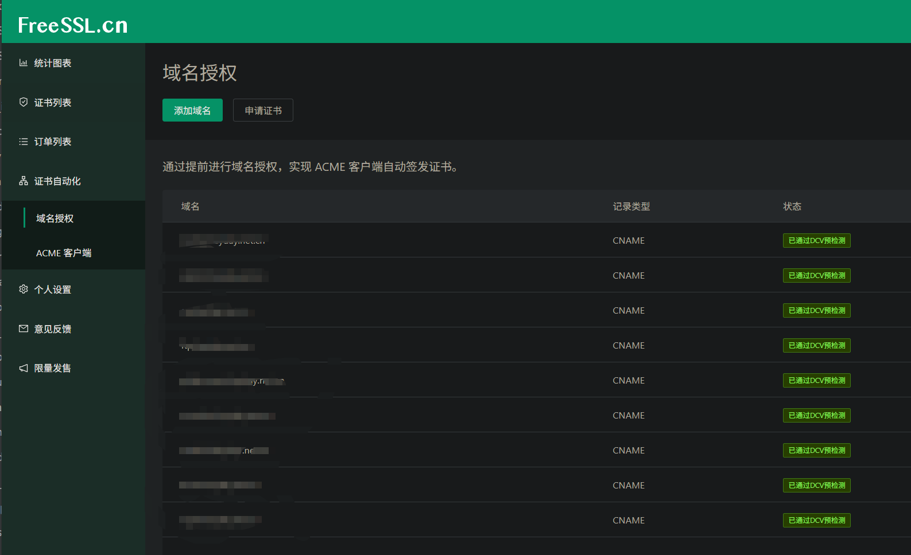
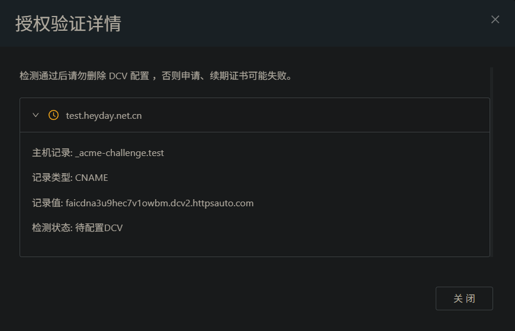
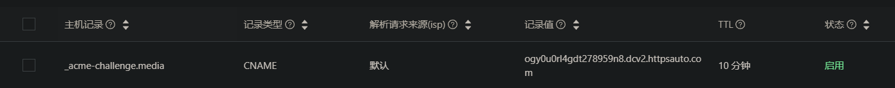
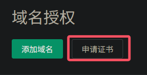
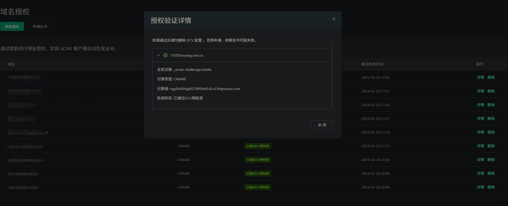

* [目录](#0)
  * [acme 自动化管理 Web 站点证书](#1)


<h3 id="1">acme 自动化管理 Web 站点证书</h3>

Google对HTTPS的推动是一个长期过程：
- **2014年**：启动大规模推广，将HTTPS作为安全基础。
- **2017年**：HTTPS普及率显著提升，成为行业标准。
- **2021年**：Chrome默认启用HTTPS，强化用户安全体验。
- **2023年**：自动升级HTTP到HTTPS，进一步淘汰不安全协议。

对于个人或无相关预算的组织, ACME 无疑是自动化管理 SSL 证书的最佳选择

**ACME**（Automatic Certificate Management Environment）是一个自动化管理SSL/TLS证书的协议，主要作用是让网站轻松实现HTTPS加密，保障数据安全。它的核心功能包括：

1. **自动申请证书**：  
   帮助服务器自动生成证书请求，并与证书颁发机构（CA）交互，无需手动操作。

2. **验证域名所有权**：  
   通过HTTP、DNS或TLS等方式，自动证明你拥有目标域名的控制权（例如自动添加验证文件或DNS记录）。

3. **自动颁发和续期**：  
   验证通过后，证书会自动颁发并安装到服务器；在证书过期前（如Let's Encrypt的90天有效期），自动续期，避免服务中断。

4. **简化管理**：  
   支持批量管理多个域名证书，减少人工干预，降低错误风险，尤其适合大规模网站或云服务。

**举例**：像Let's Encrypt这样的免费CA，配合工具（如Certbot、acme.sh），通过ACME协议，几分钟内就能为你的网站自动部署HTTPS证书，全程无需手动操作。


#### ACME的脚本获取  
https://github.com/acmesh-official/acme.sh

#### FreeSSL.cn 与之搭配的证书申请站点
https://freessl.cn/automation/auth

#### 新手入门
https://blog.freessl.cn/acme-quick-start/

#### 概述性的总结ACME自动管理Web站点SSL证书的流程

1) 在你的域名服务商那里创建该域名的解析记录(A记录或CNAME记录)  
2) 在 FreeSSL.cn 添加对应的证书申请(需要向FreeSSL.cn证明你对该域名的所有权)  
3) 在你的域名服务商, 根据 FreeSSL.cn 给出的内容, 添加对应的记录, 以证明你对该域名的所有权  
4) FreeSSL.cn 验证DCV通过, 提供ACME的证书申请命令给你  
5) 由你具体站点的运行方式(nginx/apache/容器内的web站点), 安装证书到正确的位置  
6) 验证结果


FreeSSL.cn 上申请的证书的示例  


FreeSSL.cn 上等待验证的示例  


阿里云上添加证明对域名所有权的记录  


需注意, 此时在阿里云(或其他DNS解析服务商)那里添加完后,此时  
FreeSSL.cn 上虽然还是"待验证"状态, 但无需干等, 而是手动点击"申请证书"  


该点击会自动触发DCV的再次验证, 如果DNS解析服务商那里的添加无误, 则自然会通过(受DNS更新记录的时间差影响)  
此时它自然会给出 acme.sh 的执行命令, 复制粘贴即可

```
[root@docker-node1 .acme.sh]# acme.sh --issue -d media.heyday.net.cn --dns dns_dp --server https://acme.freessl.cn/v2/DV90/directory/jz1mqkv891l2c9wai99i
[Sat May 24 12:35:33 CST 2025] Using CA: https://acme.freessl.cn/v2/DV90/directory/jz1mqkv891l2c9wai99i
[Sat May 24 12:35:33 CST 2025] Single domain='media.heyday.net.cn'
[Sat May 24 12:35:36 CST 2025] Getting webroot for domain='media.heyday.net.cn'
[Sat May 24 12:35:36 CST 2025] media.heyday.net.cn is already verified, skipping dns-01.
[Sat May 24 12:35:36 CST 2025] Verification finished, beginning signing.
[Sat May 24 12:35:36 CST 2025] Let's finalize the order.
[Sat May 24 12:35:36 CST 2025] Le_OrderFinalize='https://acme.freessl.cn/v2/DV90/finalize/jz1mqkv891l2c9wai99i/40642/748350'
[Sat May 24 12:35:37 CST 2025] Order status is 'processing', let's sleep and retry.
[Sat May 24 12:35:40 CST 2025] Polling order status: https://acme.freessl.cn/v2/DV90/order/jz1mqkv891l2c9wai99i/40642/748350
[Sat May 24 12:35:40 CST 2025] Order status is 'processing', let's sleep and retry.
[Sat May 24 12:35:40 CST 2025] Sleeping for 15 seconds then retrying
[Sat May 24 12:35:56 CST 2025] Polling order status: https://acme.freessl.cn/v2/DV90/order/jz1mqkv891l2c9wai99i/40642/748350
[Sat May 24 12:36:02 CST 2025] Order status is 'processing', let's sleep and retry.
[Sat May 24 12:36:02 CST 2025] Sleeping for 15 seconds then retrying
[Sat May 24 12:36:18 CST 2025] Polling order status: https://acme.freessl.cn/v2/DV90/order/jz1mqkv891l2c9wai99i/40642/748350
[Sat May 24 12:36:18 CST 2025] Downloading cert.
[Sat May 24 12:36:18 CST 2025] Le_LinkCert='https://acme.freessl.cn/v2/DV90/cert/jz1mqkv891l2c9wai99i/995938'
[Sat May 24 12:36:19 CST 2025] Cert success.
```

FreeSSL.cn 上验证通过后的示例  



以我的站点为例, 为```docker```内的```nginx```

```
-----END CERTIFICATE-----
[Sat May 24 12:36:19 CST 2025] Your cert is in: /root/.acme.sh/media.heyday.net.cn_ecc/media.heyday.net.cn.cer
[Sat May 24 12:36:19 CST 2025] Your cert key is in: /root/.acme.sh/media.heyday.net.cn_ecc/media.heyday.net.cn.key
[Sat May 24 12:36:19 CST 2025] The intermediate CA cert is in: /root/.acme.sh/media.heyday.net.cn_ecc/ca.cer
[Sat May 24 12:36:19 CST 2025] And the full-chain cert is in: /root/.acme.sh/media.heyday.net.cn_ecc/fullchain.cer
[root@docker-node1 .acme.sh]# cp /root/.acme.sh/media.heyday.net.cn_ecc/media.heyday.net.cn.cer /docker/service_gateway/conf/cert/
[root@docker-node1 .acme.sh]# cp /root/.acme.sh/media.heyday.net.cn_ecc/media.heyday.net.cn.key /docker/service_gateway/conf/cert/
```

acme在运行主机上的用户家目录下会创建 ```.acme.sh``` 的隐藏目录,  
并且每个域名会创建一个子目录   
证书会放置在此位置  
```full-chain``` 是包含了全部信息的内容, 如果你在后期有所缺失, 只要有它存在,  
你都可以通过 openssl 的工具链重新创建出来


部分命令示例

```
# 检查服务器证书
openssl x509 -in /root/.acme.sh/media.heyday.net.cn_ecc/media.heyday.net.cn.cer -text -noout

# 检查中间证书, 确认域名、有效期、颁发者等信息是否正确 
openssl x509 -in /root/.acme.sh/media.heyday.net.cn_ecc/ca.cer -text -noout

# 检查完整证书链, 确认完整证书链是否包含服务器证书和中间证书
openssl crl2pkcs7 -nocrl -certfile /root/.acme.sh/media.heyday.net.cn_ecc/fullchain.cer | openssl pkcs7 -print_certs -text -noout

# 生成 PEM 格式的完整证书链, 如果需要将服务器证书和中间证书合并为一个 PEM 文件（用于 Nginx/Apache 等服务），执行以下命令：
cat /root/.acme.sh/media.heyday.net.cn_ecc/media.heyday.net.cn.cer \
    /root/.acme.sh/media.heyday.net.cn_ecc/ca.cer > /path/to/fullchain.pem

# 如果需要将证书转换为 DER 格式（二进制格式），执行：
openssl x509 -outform der -in /root/.acme.sh/media.heyday.net.cn_ecc/media.heyday.net.cn.cer -out /path/to/cert.der

# 将 PEM 转换为 PKCS#12（PFX）
openssl pkcs12 -export \
    -in /root/.acme.sh/media.heyday.net.cn_ecc/media.heyday.net.cn.cer \
    -inkey /root/.acme.sh/media.heyday.net.cn_ecc/media.heyday.net.cn.key \
    -certfile /root/.acme.sh/media.heyday.net.cn_ecc/ca.cer \
    -out /path/to/cert.pfx
```


**常见问题排查**  
**错误 1：证书链不完整**  
- **现象**：浏览器提示证书链不完整。
- **解决**：确保 `fullchain.pem` 包含服务器证书和中间证书，顺序如下：
  ```bash
  [服务器证书]
  [中间证书]
  ```

**错误 2：私钥与证书不匹配**
- **现象**：服务启动时报错 `Private key does not match certificate`。
- **解决**：验证私钥和证书的指纹是否一致：
  ```bash
  # 查看证书指纹
  openssl x509 -noout -modulus -in /root/.acme.sh/media.heyday.net.cn_ecc/media.heyday.net.cn.cer | openssl md5

  # 查看私钥指纹
  openssl rsa -noout -modulus -in /root/.acme.sh/media.heyday.net.cn_ecc/media.heyday.net.cn.key | openssl md5
  ```
  - **确保两者输出一致**。

---

**总结**

| 操作 | 命令 |
|------|------|
| 合并完整证书链 | `cat cert.cer ca.cer > fullchain.pem` |
| 转换为 DER 格式 | `openssl x509 -outform der -in cert.cer -out cert.der` |
| 转换为 PKCS#12 | `openssl pkcs12 -export -in cert.cer -inkey key.key -certfile ca.cer -out cert.pfx` |
