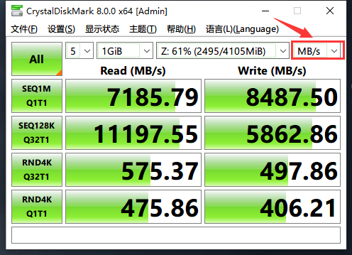
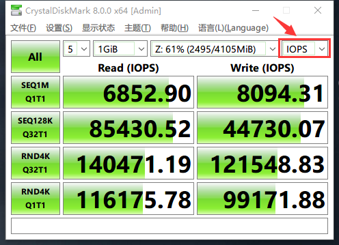
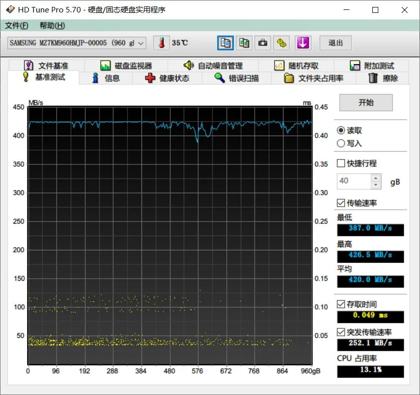
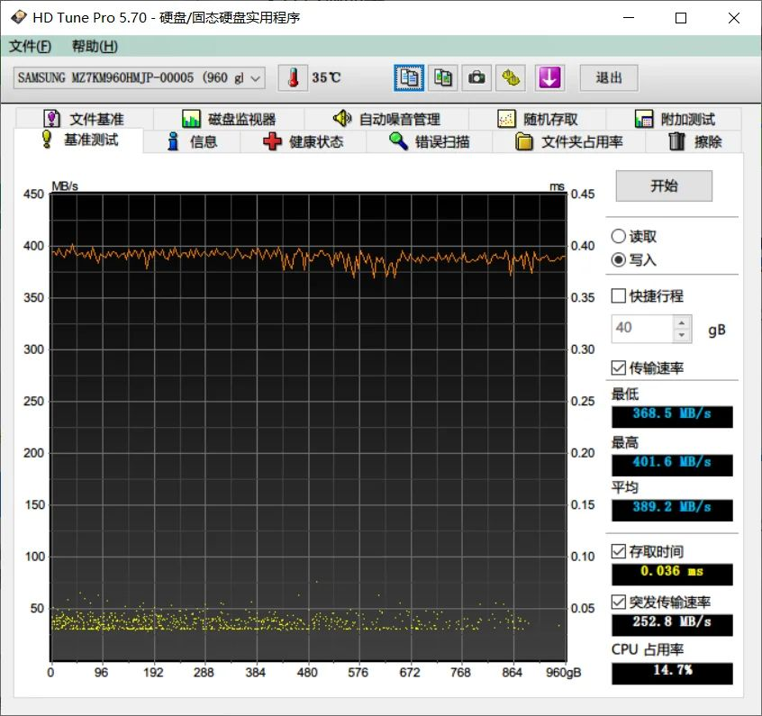
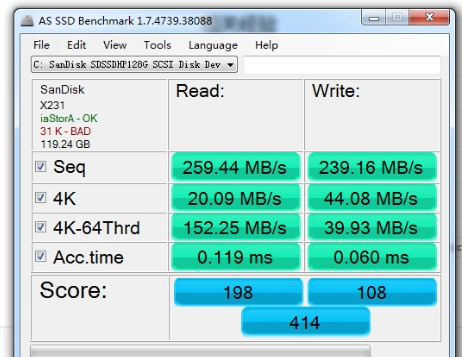
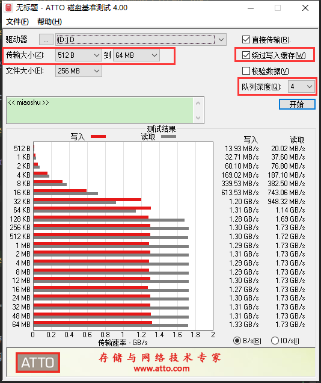

* [目录](#0)
  * [IO性能基准测试的意义](#1)
  * [开始基准测试前的基本概念与术语](#2)
  * [Windows平台上的测试工具](#3)
  * [Linux平台上的测试工具](#4)
  * [题外话](#5)


<h3 id="1">IO性能基准测试的意义</h3>

提供一个可供参考的标准.

基准测试可以是有文件系统, 也可以是没有文件系统的裸设备.

裸设备的基准测试, 通常反映的都是该本身的极限性能, 或者说无限接近于出厂性能/标称性能.

但大多数的实际情况都是在文件系统的基础之上进行使用的 (应用直接接管裸设备的情况除外)

而文件系统的存在, 就必然有文件系统自身的开销与损耗, 不同的文件系统, 性能表现的差异也可以很大.

扩展阅读--数据库方向的同学值得了解的文件系统性能对比  
https://www.cnblogs.com/tommyli/p/3201047.html  
该文章的中心思想: 没有单个文件系统类型是万能的, 也就是任何场景下都拥有最好的表现.

类似的, 对比xfs 和 ext4 文件系统在数据库应用上的性能
https://cloud.tencent.com/developer/article/1460643

<h3 id="2">开始基准测试前的基本概念与术语</h3>

- 现有的磁盘接口形式

| 接口制式  | 速度上限                                                    | 应用范围   |
|-------|---------------------------------------------------------|--------|
| SATA  | 600MB/S                                                 | 服务器,PC |
| SAS | 600MB/S                                                 | 服务器    |
| M.2 | PCI-E 3.0: 4000MB/S(通常是PCI-E x4)<br>PCI-E 4.0: 8000MB/S(通常是PCI-E x4) | 服务器,PC |
| U.2 | 同上                                                      | 服务器 |
| PCI-E | 同上                                                      | 服务器,PC |

受限于南桥芯片(PCH)与CPU之间的链路带宽(DMI), 由PCH扩展出来的,非CPU直连的各种接口形式的插槽, 要与其他设备争抢带宽.
  
- 什么是所谓的"黑片" "白片" "原厂"

引用: https://zhuanlan.zhihu.com/p/54722345  

原厂: 拥有颗粒生产能力的
> 完美无缺的，可以达到质检要求的颗粒，就会拿出来进行更严格的测试，更严格测试也通过的，这部分芯片就叫原片，也就是说，原片就是必须要达到原厂规定要求合格才能出厂的颗粒，像三星和Intel等厂商的市售固态硬盘都基本是原片颗粒，这些颗粒无论是速度还是寿命还是安全都是可以让我们放心的。

白片
> 但是还有一部分颗粒挑出来后，后续更加严格的测试没有通过，那么这部分颗粒达不到原厂的要求，但是达到了行业要求，也会被拿出来卖，这部分就是白片，也就是白片稍微差于原片，但是白片至少也是被检测过的，所以就数据安全和速度来说，和原厂拉不开多大差距，这些白片会被大量的二线固态厂商采购，白片虽然差，但是最起码还能用。

黑片
> 残次品就是我们说的黑片，他是在第一轮binning阶段就应该直接被淘汰的，照理来说，黑片最终都应该被销毁的，但是出于利益关系，厂家也是为了控制成本，这些黑片不加产品标识也没人知道是哪家的，所以也不会损坏自己原厂的口碑，于是通过特殊渠道流入了消费级市场，然后被不良厂商打包做成了固态硬盘

- 基准测试里的块大小,队列深度,线程, 随机读写, 顺序读写

#### 块大小

> 扇区是对硬盘而言，块是对文件系统而言
> 
> 物理层面: 硬盘的最小存储单位就是扇区
> 
> 逻辑层面: 文件系统不是一个扇区一个扇区的来读数据，是按块读取

示例:

```
[root@5950X-node1 ~]# parted -l /dev/sda
Model: ATA MK0800GCTZB (scsi)
Disk /dev/sda: 800GB
Sector size (logical/physical): 512B/512B
Partition Table: loop
```

其中的 ```Sector size (logical/physical): 512B/512B``` 就分别指明了逻辑扇区和物理扇区大小.

物理扇区 512B 大小是过去多年的唯一规格.  
物理扇区 4096B 大小( 4K扇区, 4K对齐 ) 是前些年逐渐开始普及.

#### 队列深度

>即可以在端口队列中等待服务的I/O请求数量。SAS和SATA可以分别处理254和32的队列深度。如果I/O请求的数量超过了最大队列深度，则该事务将在一段时间后无法重新尝试。当你认为具有高扇出比率的存储端口可以为多个主机提供服务时，可以快速达到SAS和SATA的队列深度数据。

扩展阅读--队列深度过浅有什么影响？  
https://blog.csdn.net/TV8MbnO2Y2RfU/article/details/78103730

#### 线程

多个发起 IO 请求的线程

#### 随机读写,顺序读写

> 连续读写，也可以叫做顺序读写，从字面意思可以理解为有序的读取和写入数据，它是进行大容量文件读写时所具备的性能，在读写的过程中会遵循先后顺序进行工作，数值越高它所代表读写性能就越强，速度单位是MB/s。

> 随机读写，从字面意思可以理解为不遵循文件的先后顺序进行数据的读取和写入，当固态硬盘在执行读写操作的时候，可任意跳到某个文件进行读写操作；它的主要作用是针对零碎文件（病毒扫描、启动程序等）任务，速度的单位是IOPS。它的特点是读写时间长、读写数据小且分散、充满随机性。

- IOPS与读写速率是可以互相换算的度量单位

```
带宽 = IOPS * 块大小
```

以 CrystalDiskMark 这个软件为例, 自它的 7 版本开始, 新增了一个选项, 用户可以自行选择以 MB/S 还是 IOPS 显示.





#### 文件系统的缓存

操作系统上的文件系统都会使用一定量的内存作为 buffer 区域

无论 windows 还是 linux 都有文件IO的 API, 提供给程序进行调用, 对是否使用 buffer 对写操作进行缓存的行为进行自主控制.

如果你无法确定你所使用的测试工具是否经过了文件系统 / 操作系统缓存, 那么测试结果反映的未必是设备的真实性能.

是否绕过文件缓存进行测试, 在支持该功能的工具上, 通常以可选参数的形式存在, 在后面介绍工具时介绍.

#### 反映设备性能优劣的两个维度

- 带宽(读写速度) / IOPS(每秒读写操作次数)
- 响应时间 / 延迟

由于带宽(读写速度) 和 IOPS(每秒读写操作次数) 之间是可以通过公式换算的概念, 所以属于同一维度.  
响应时间 (延迟) 反映的是设备在响应IO请求作出反应前所花费的时间, 也是体现设备繁忙程度的一个指标.  
在本文档内没有对 响应时间 (延迟) 做重点介绍, 会在介绍 Linux 上的 fio 命令时提及.

以SSD为例, 企业级产品与消费级产品最本质的几点区别  


<h3 id="3">Windows平台上的测试工具</h3>

- HD Tune ( 不作为首选推荐, 用来查看磁盘硬件信息好用, 但基准测试只能反映硬件层,裸设备,且是连续IO的数据 )
- AS SSD Benchmark ( 不作为首选推荐, 因为其结果数据有偏离 )
- CrystalDiskMark ( 我个人最主要使用的选择, 有一定的参数可调 )
- ATTO Disk Benchmark ( 以非常细分的块大小的跨越范围, 着重反映的是设备的随机性能 )

#### HD Tune

下载地址  
https://www.pc6.com/softview/SoftView_7967.html

HD Tune 作读取测试可以有文件系统, 写入测试必须未进行文件系统初始化的状态.

HD Tune 用作全盘读写的示例





#### AS SSD Benchmark

下载地址:  
https://soft.3dmgame.com/down/199669.html



#### CrystalDiskMark

文件系统下的测试

下载地址:  
https://crystalmark.info/en/


#### ATTO Disk Benchmark

文件系统下的测试

下载地址:  
https://www.atto.com/disk-benchmark/




<h3 id="4">Linux平台上的测试工具</h3>

- 简单,非严谨测试: dd
- 专业,可调参数丰富: fio

#### dd 命令

一个最基本的dd 命令示例

```
[root@5950X-node1 ~]# dd if=/dev/random of=/run/test bs=1M count=1024
1024+0 records in
1024+0 records out
1073741824 bytes (1.1 GB, 1.0 GiB) copied, 2.13412 s, 503 MB/s
```

更进一步的用法, oflag 指定参数以绕过文件系统缓存.

```
[root@5950X-node1 ~]# dd if=/dev/random of=/run/test bs=1M count=1024 oflag=sync
1024+0 records in
1024+0 records out
1073741824 bytes (1.1 GB, 1.0 GiB) copied, 2.09499 s, 513 MB/s
```

参数解释:

| 参数 | 含义 |  
| --- | --- |  
| if=/dev/random | 输入文件, 信息来源, 向输出对象输出什么内容 | 
| of=/run/test | 输出对象 |
| bs=1M | block size, 块大小是多大 |
| count=1024 | 块的数量, 多少个块 |
| oflag=sync | 输出对象的IO控制参数, sync表示同步写,在help里有可选参数列表及基本解释 |


<font color=red>个人观点:</font>

由于我实测得到的结果表明, dd命令即使在加上绕过文件系统缓存的参数的情况下, 依然有数据与设备真实性能不匹配的现象.  
所以我个人不会将 dd 得到的结果作为我唯一的判断依据.  
它更适合完成只需要一个基本的, 快速的参考, 而不需要更严谨, 更专业的结果.

#### fio 命令


<h3 id="5">题外话</h3>

想更多了解消费级产品

- B站up: "然后成为天下第一" 以 M.2 固态为主的SSD评测, 中肯客观, 指标专业度高
- 笔记本受限于 M.2 接口数量, SATA 接口的 SSD 可能是更多人为了扩展容量退而求其次的选择, 国产长江存储( 零售品牌: 致钛 )已在可靠性,性能指标,价格几个方面和三星, 铠侠(东芝)等一线大厂同台PK的实力
- 完全不看4K性能 和 唯4K论 是都不可取的两个极端, 抛开价格谈性能不可取, 量力而为.
- 温度表现的确也是一个需要考虑的指标, 特别是笔记本场景, 但矫枉又切忌过正. 
- 善用搜索, 不必迷信单一信息来源
