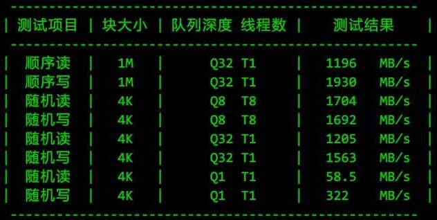

* [目录](#0)
  * [CPU 质数计算](#1)
  * [内存读写](#2)
  * [磁盘读写](#3)
  * [网络IO](#4)

#### 前言

- 在本文档内记录的安装, 均以麒麟内核版本号```4.19.90-24.4.v2101.ky10.aarch64``` 的发行版为基础, x86架构的操作系统有```epel```的yum源可供安装, 更为简单
- 本文档均假设进行基准测试的对象拥有互联网连接, 以下载需要的依赖库, 如实际不具备, 则需要用到 rpm包离线导入的方式, 具体操作步骤不在本文档内详述


<h3 id="1">CPU 质数计算</h3>

sysbench 用于CPU计算性能, 其原理是通过循环计算用户指定的数值上限内的素数, 以完成的轮数或素数最大值来比较CPU计算能力的差异.  
需注意: 考验的是CPU的<font color=red>整数运算</font>能力. 如业务场景是浮点数为主, 则结果并不适用

#### 安装

在ARM架构的OS上, 需要编译安装, 但以麒麟为例, 安装过程比较简单, 不存在技术障碍

相关步骤作者已给出  
https://github.com/akopytov/sysbench

```
yum -y install make automake libtool pkgconfig libaio-devel
# For MySQL support, replace with mysql-devel on RHEL/CentOS 5
yum -y install mariadb-devel openssl-devel
# For PostgreSQL support
yum -y install postgresql-devel
```

以上是编译安装所需的依赖, 在麒麟的源也能下载得到, 如果是离线环境, 提前下载并导入即可

编译步骤如下:

```
./autogen.sh
# Add --with-pgsql to build with PostgreSQL support
./configure
make -j
make install
```

合并以上两个步骤, 可使用以下附件一键安装

<a href="files/sysbench_compile_on_aarch64.sh" target="_blank">sysbench_compile_on_aarch64.sh</a>  
<a href="files/sysbench-1.0.20.tar.gz" target="_blank">sysbench-1.0.20.tar.gz</a>

#### 执行基准测试

执行基准测试, 可选参数有: 素数生成数量的上限, 线程数, 运行时长, event上限次数

详细了解可参考:  
https://zhuanlan.zhihu.com/p/56889337

提供自动化进行测试并进行结果汇报的shell脚本

<a href="files/sys_bench.sh" target="_blank">sys_bench.sh</a>

该脚本将根据机器的逻辑CPU数量, 自动选择 1 2 4 8 16...以此类推,直至半数和全部的逻辑CPU数作为sysbench的CPU测试部分的线程数进行测试.  
素数上限设定在2万, 也可按需修改  
运行时长设定在60秒, 也可按需修改  
汇报输出格式如下所示  


<h3 id="2">内存读写</h3>

内存读写的测试工具同样是 ```sysbench```, 因此安装过程略过

测试原理: 对内存发起不同块大小, 不同的操作类型(读,写), 不同的访问方式(顺序,随机)来测量它们的结果, 以比较内存性能

同样的, 自动化测试的shell脚本已在前文中提供, 汇报输出格式如下所示  


<h3 id="3">磁盘读写</h3>

详细了解可参见本站文档"IO性能的基准测试"

测试磁盘IO的性能基准, sysbench 同样也提供, 并且调用的也是 ```fio```  
不过这里我们直接使用```fio```工具本身.  
同样的, 麒麟的```yum源```也可以安装得到 ```fio``` 及其依赖

提供自动化的测试脚本与其配置文件

<a href="files/fio_auto_bench_and_report.sh" target="_blank">fio_auto_bench_and_report.sh</a>  
<a href="files/fio_auto_bench_and_report.ini" target="_blank">fio_auto_bench_and_report.ini</a>

其中, 配置文件 ```fio_auto_bench_and_report.ini``` 用于用户可以自定义测试项目与规格

- file_target 是文件测试对象, 是在文件系统之上的文件对象进行读写, shell 脚本会根据填写值进行自动创建.
特别需要申明的是: fio 可以对裸磁盘对象进行读写操作, <font color=red>但务必请确保该操作不会引发灾难性的后果</font>
- file_size 是被测试文件对象的大小, 即生成多大的文件
- runtime 是每个测试项目的运行时间长度限制, 它可以是被注释状态, 如果注释, 则指定的文件大小达成后, 单个测试项目才会结束, 单位为秒

以上3个参数, 包含了基本的必要信息, 如果没有自定义需求, 则脚本与配置文件放置在同一目录下就可以开始执行.

其他如 块IO大小, 线程数等则用于有其他明确修改需求的场景.

该shell脚本将自动汇报测试结果, 输出格式如下所示:



<h3 id="4">网络IO</h3>

网络IO, 测量物理网卡的吞吐能力, 例如:
- 在物理机上是否能达到标称的带宽速率?
- 在虚拟化平台上, 折损率在什么程度, 能有物理机的几成? 

使用到的工具为 ```iperf3```, 同样麒麟的```yum源```也已提供

```iperf3```的使用, 分为 server 端和 client 端两个角色

server 端通常使用命令 ```iperf3 -s``` 即可启动, 不指定端口的情况下, 默认端口为5201  

```
[root@localhost ~]# iperf3 -s
-----------------------------------------------------------
Server listening on 5201
```

此时 server端即就绪状态, 等待客户端连的连入

client 通常执行命令 ```iperf3 -c <server端IP地址>``` 之后测试将自动开始.

执行结果输出如下

```
[root@localhost ~]# iperf3 -c 192.168.1.221
Connecting to host 192.168.1.221, port 5201
[  5] local 192.168.1.221 port 52830 connected to 192.168.1.221 port 5201
[ ID] Interval           Transfer     Bitrate         Retr  Cwnd
[  5]   0.00-1.00   sec   270 MBytes  2.26 Gbits/sec   16   2.19 MBytes       
[  5]   1.00-2.00   sec   252 MBytes  2.12 Gbits/sec   48   2.00 MBytes       
[  5]   2.00-3.01   sec   262 MBytes  2.20 Gbits/sec    0   2.69 MBytes       
[  5]   3.01-4.00   sec   272 MBytes  2.29 Gbits/sec    3   3.00 MBytes       
[  5]   4.00-5.00   sec   260 MBytes  2.19 Gbits/sec    3   3.12 MBytes       
[  5]   5.00-6.00   sec   245 MBytes  2.05 Gbits/sec    0   3.12 MBytes       
[  5]   6.00-7.01   sec   254 MBytes  2.12 Gbits/sec   14   3.12 MBytes       
[  5]   7.01-8.01   sec   251 MBytes  2.11 Gbits/sec    1   3.12 MBytes       
[  5]   8.01-9.00   sec   260 MBytes  2.19 Gbits/sec    1   3.12 MBytes       
[  5]   9.00-10.00  sec   278 MBytes  2.33 Gbits/sec   24   3.12 MBytes       
- - - - - - - - - - - - - - - - - - - - - - - - -
[ ID] Interval           Transfer     Bitrate         Retr
[  5]   0.00-10.00  sec  2.54 GBytes  2.18 Gbits/sec  110             sender
[  5]   0.00-10.04  sec  2.54 GBytes  2.18 Gbits/sec                  receiver

iperf Done.
```

以上结果在 server 端和 client 端两端都会打印相同的内容.

从输出结果我们也可以读出的信息为:
- 共测试10次,每次1秒
- Transfer 为传输的字节数, MBytes, 兆字节, 即通常所说的大B
- Bitrate 为比特率/位速率, Gbits/sec, 位每秒, 即通常所说的小b
