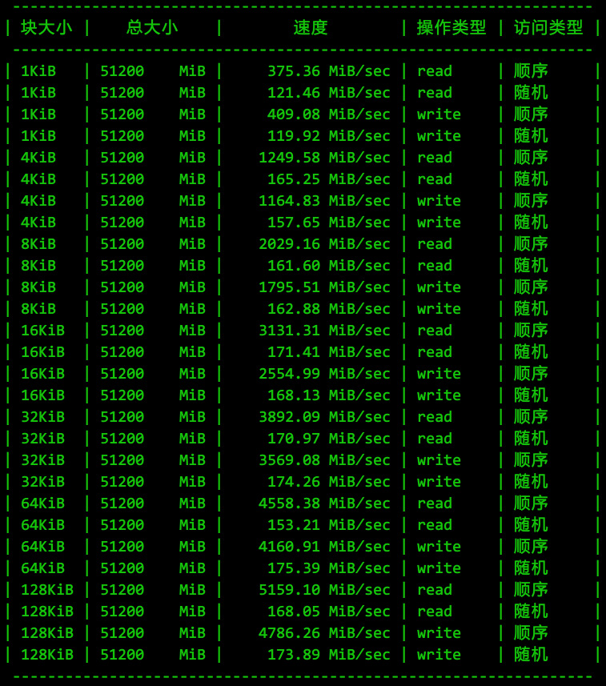

* [目录](#0)
  * [CPU 质数计算](#1)
  * [内存读写](#2)
  * [磁盘读写](#3)
  * [网络IO](#4)

#### 前言

- 在本文档内记录的安装, 均以麒麟内核版本号```4.19.90-24.4.v2101.ky10.aarch64``` 的发行版为基础, x86架构的操作系统有```epel```的yum源可供安装, 更为简单
- 本文档均假设进行基准测试的对象拥有互联网连接, 以下载需要的依赖库, 如实际不具备, 则需要用到 rpm包离线导入的方式, 具体操作步骤不在本文档内详述


<h3 id="1">CPU 质数计算</h3>

sysbench 用于CPU计算性能, 其原理是通过循环计算用户指定的数值上限内的素数, 以完成的轮数或素数最大值来比较CPU计算能力的差异.  
需注意: 考验的是CPU的<font color=red>整数运算</font>能力. 如业务场景是浮点数为主, 则结果并不适用

#### 安装

在ARM架构的OS上, 需要编译安装, 但以麒麟为例, 安装过程比较简单, 不存在技术障碍

相关步骤作者已给出  
https://github.com/akopytov/sysbench

```
yum -y install make automake libtool pkgconfig libaio-devel
# For MySQL support, replace with mysql-devel on RHEL/CentOS 5
yum -y install mariadb-devel openssl-devel
# For PostgreSQL support
yum -y install postgresql-devel
```

以上是编译安装所需的依赖, 在麒麟的源也能下载得到, 如果是离线环境, 提前下载并导入即可

编译步骤如下:

```
./autogen.sh
# Add --with-pgsql to build with PostgreSQL support
./configure
make -j
make install
```

合并以上两个步骤, 可使用以下附件一键安装

<a href="files/sysbench_compile_on_aarch64.sh" target="_blank">sysbench_compile_on_aarch64.sh</a>  
<a href="files/sysbench-1.0.20.tar.gz" target="_blank">sysbench-1.0.20.tar.gz</a>

#### 执行基准测试

执行基准测试, 可选参数有: 素数生成数量的上限, 线程数, 运行时长, event上限次数

详细了解可参考:  
https://zhuanlan.zhihu.com/p/56889337

提供自动化进行测试并进行结果汇报的shell脚本

<a href="files/sys_bench.sh" target="_blank">sys_bench.sh</a>

该脚本将根据机器的逻辑CPU数量, 自动选择 1 2 4 8 16...以此类推,直至半数和全部的逻辑CPU数作为sysbench的CPU测试部分的线程数进行测试.  
素数上限设定在2万, 也可按需修改  
运行时长设定在60秒, 也可按需修改  
汇报输出格式如下所示  


<h3 id="1">内存读写</h3>

内存读写的测试工具同样是 ```sysbench```, 因此安装过程略过

测试原理: 对内存发起不同块大小, 不同的操作类型(读,写), 不同的访问方式(顺序,随机)来测量它们的结果, 以比较内存性能

同样的, 自动化测试的shell脚本已在前文中提供, 汇报输出格式如下所示  


