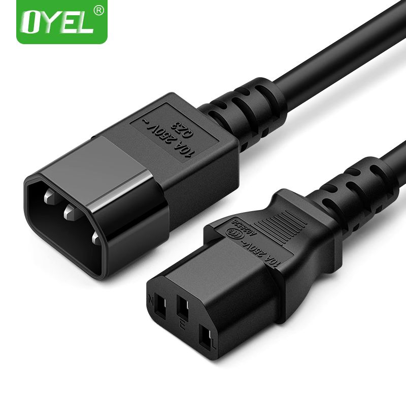

* [目录](#0)
  * [机房常见设备类型简介](#1)
  * [服务器品牌厂商logo简介](#2)
  * [网络设备品牌厂商logo简介](#3)
  * [计算机主要部件认识](#4)
  * [PCI-E插槽](#5)
  * [网络线缆类型](#6)

  

<h3 id="1">机房常见设备类型简介</h3>

数据中心典型样貌

- 术语: 动环

动力环境, 是一系列机房/数据中心功能模块的集合的统称.   
包括主要开关状态、空调、UPS等设备的工作状态、漏水检测装置、门禁系统工作状态、主机房的温湿度、消防系统工作状态及与安全监控等.

- 术语: “机架”、“服务器”、“机柜”、“U”

1、机架
机架：安装在标准机柜里面，是功能型服务器，故标准机柜也称“19英寸”机架。机架是更专业的学术名词，目前政策文件中提及的多为“机架”，并明确了单机架功率、平均上架率等指标。

2、机柜
机柜：用在网络布线间，楼层配线间，中心机房，数据机房，控制中心，监控室，监控中心等。规定的尺寸是服务器的宽（48.26cm=19英寸）与高（4.445cm的倍数）。由于宽为19英寸，所以有时也将满足这一规定的机柜称为“19英寸机架”。厚度以4.445cm为基本单位，1U就是4.445cm。

U是国际通用的机柜内设备安装所占高度的一个特殊计量单位，1U=44.45mm。U是指机柜的内部有效使用空间，使用机柜的标准设备的面板一般都是按n个U的规格制造。对于一些非标准设备，大多可以通过附加适配档板装入19寸机箱并固定。42U机柜是最常见的标准机柜，除42U标准机柜外，47U机柜、37U机柜、32U机柜、20U机柜、12U机柜、6U机柜也是较为常用的机柜。

3、1U、2U、4U服务器
在机架式服务器尺寸当中，常见的就是1U服务器、2U服务器、4U服务器，还有个别的是6U、10U设备等，这些服务器的尺寸是：1U=4.445厘米，2U=4.445*2=8.89厘米，4U=4.445*4=17.78厘米。在实际使用当中，1U或者2U服务器是最经常使用的。因为服务商是根据服务器占用空间来计算费用的，所以采用1U服务器是最节省空间的和价格最低的，但是1U服务器的扩展性不如2U服务器的好。1U的硬盘数最多可以插4个，2U可以插8个，另外PCI的插槽数目也不同，1U最多2个，2U的可以到6个。

- 术语: UPS

UPS（Uninterruptible Power Supply），即不间断电源，是将蓄电池（多为铅酸免维护蓄电池）与主机相连接，通过主机逆变器等模块电路将直流电转换成市电（交流电）的系统设备。UPS的三大基本功能：稳压、滤波、不间断。

技术规格按大的分类有"在线式"和"后备式", 其主要区别是当市电中断时, 切换到UPS供电状态所需的时长.  
后备式通常需要10ms(典型值)  
在线式通常需要0ms  
数据中心通常是在线式, 且还可能配备有柴油发电机与储油设施.  
后备式主要适用于家用及小型办公环境等要求不严苛的场景.

- 术语: 国标 / 欧标

这里只要针对主机电源连接线的规格.  

国标, 下图

欧标, 下图

- 术语: PDU

PDU（Power Distribution Unit，电源分配单元），也就是我们常说的机柜用电源分配插座，PDU是为机柜式安装的电气设备提供电力分配而设计的产品，拥有不同的功能、安装方式和不同插位组合的多种系列规格，能为不同的电源环境提供适合的机架式电源分配解决方案。PDU的应用，可使机柜中的电源分配更加整齐、可靠、安全、专业和美观，并使得机柜中电源的维护更加便利和可靠。

<h3 id="2">服务器品牌厂商logo简介</h3>

华为

浪潮

新华3, H3C

IBM, 存量多

惠普, 存量多

戴尔, 存量多

联想

联想服务器子类

中科曙光

中兴

超微

清华同方

<h3 id="3">网络设备品牌厂商logo简介</h3>

华为

新华3, H3C

深信服

思科

博通

<h3 id="4">计算机主要部件认识</h3>

PC机主要部件

显示卡

服务器主板, 双路CPU

未安装前的CPU

安装进CPU插座后的CPU

内存条

安装后的内存条与涂抹散热硅脂的CPU

安装散热器的双路主板

机械硬盘

网络接口卡

<h3 id="5">PCI-E插槽</h3>

Windows 上 PCI-E 控制器在设备管理器上的截图

Linux 上 PCI-E 地址编号

PCI-E 插槽在主板上的位置示意

PCI-E 插槽的作用:

PCI总线和设备树是X86硬件体系内很重要的组成部分，几乎所有的外围硬件都以这样或那样的形式连接到PCI设备树上。

自PC在1981年被IBM发明以来，主板上都有扩展槽用于扩充计算机功能。现在最常见的扩展槽是PCIe插槽，实际上在你看不见的计算机主板芯片内部，各种硬件控制模块大部分也是以PCIe设备的形式挂载到了一颗或者几颗PCI/PCIe设备树上。固件和操作系统正是通过枚举设备树们才能发现绝大多数即插即用（PNP）设备的。

PCI-E 速率一览表:

<h3 id="6">网络线缆类型</h3>

- 术语: "电口" 和 "光口"

电口: 使用RJ45接口, 俗称"水晶头"加上双绞线,俗称"网线", 作为传输媒介的通信方式  
光口: 使用光模块,加上光纤线缆作为传输媒介的通信方式

网线

光模块

光纤线

与之相对应的, 网络接口卡也分两类形式

电口卡

4口网卡

双口网卡

光口卡

