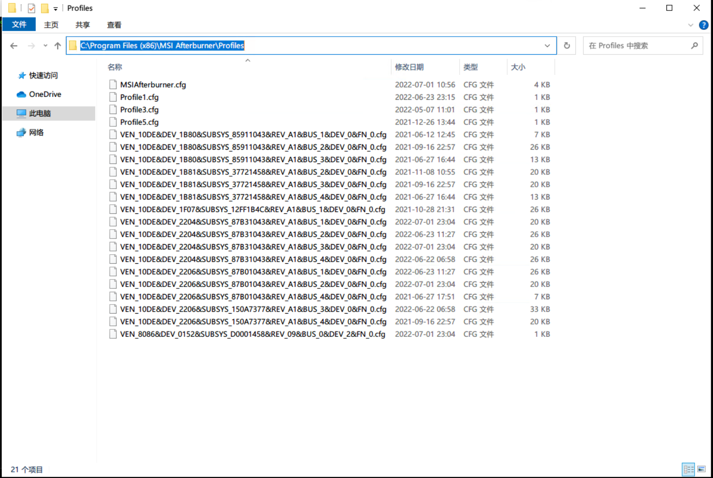

* [目录](#0)
  * [IPMI 命令列表](#1)
  * [PCI-E 版本与对应速率](#2)
  * [MSI Afterburner 命令行用法](#3)

<h3 id="1">IPMI 命令列表</h3>

引用自  
https://www.cnblogs.com/zhangxinglong/p/10529877.html


<table>
    <tr>
        <th>命令集</th><th>命令行格式</th><th>命令行说明</th>
    </tr>
    <tr>
        <td rowspan="8">User</td><td>ipmitool -H &#60;IP地址&#62; -I lanplus -U &#60;用户名&#62; -P &#60;密码&#62; user summary</td><td>查询用户概要信息</td>
    </tr>
    <tr>
        <td>ipmitool -H &#60;IP地址&#62; -I lanplus -U &#60;用户名&#62; -P &#60;密码&#62; user list</td><td>查询BMC上所有用户</td>
    </tr>
    <tr>
        <td>ipmitool -H &#60;IP地址&#62; -I lanplus -U &#60;用户名&#62; -P &#60;密码&#62; user set name &#60;用户ID&#62; &#60;用户名&#62;</td><td>设置用户名</td>
    </tr>
</table>


<h3 id="2">PCI-E 版本与对应速率</h3>

| PCI Express 版本 | 编码方案 | 传输速率 | x1 | x4 | x8 | x16 | 
| --- | --- |---------------|-----------------| --- | ---- | --- | 
| 1.0 | 8b/10b | 2.5GT/s       | 250MB/s         | 1GB/s | 5 GB/s | 4GB/s | 
| 2.0 | 8b/10b | 5GT/s         | 500MB/s         | 2GB/s | 4GB/s | 8GB/s | 
| 3.0 | 128b/130b | 8GT/s         | 984.6MB/s       | 3.938GB/s |7.877GB/s | 15.754GB/s | 
| 4.0 | 128b/130b | 16GT/s        | 1.969GB/s       | 7.877GB/s | 15.754GB/s | 31.508GB/s | 
| 5.0 | 128b/130b | 32 or 25 GT/s | 3.9 or 3.08GB/s | 15.8 or 12.3 GB/s	| 31.5 or 244.6GB/s	| 63.0 or 49.2GB/s | 


<h3 id="3">MSI Afterburner 命令行用法</h3>

#### MSI Afterburner 是什么

https://x1g.la/msi-afterburner.html  

> MSI Afterburner 虽然是微星出品的软件，但不限制任何电脑安装。同时也是目前硬件数码爱好者最爱用的硬件监控软件之一，主要功能支持显卡超频、硬件监控、三重超电压、定制化风扇设定、游戏中显示硬件实时信息。

https://bitcointalk.org/index.php?topic=2105295.0  
https://forums.guru3d.com/threads/afterburner-command-line-options-and-startup.322469/  

在使用熟练以后, 难免会有自动化操作的需求--无论是在不同场景下启用不同的方案, 还是在不同显卡应用不同的方案.

从以上链接的内容可以得知, 单GPU设备时, 命令调用不同方案, 只需要指定 profile 编号即可

```
# windows 平台示例
# <after burner位置> -<profile编号>
"C:\Program Files (x86)\MSI Afterburner\MSIAfterburner.exe" -Profile1
```

在不同场景下切换, 则可以通过windows 批处理 / Linux shell 进行调度

#### 多GPU应用不同方案

```
"C:\Program Files (x86)\MSI Afterburner\MSIAfterburner.exe" "-VEN_10DE\&DEV_1F07\&SUBSYS_12FF1B4C\&REV_A1\&BUS_4&DEV_0\&FN_0.cfg" -Profile1
```

多GPU的区别就在于, 软件用设备的唯一标识对应不同设备, 在windows上设备管理器应该能查看到该信息.

不过粗略寻找一遍, 我并未找出对应的信息.  
但可以取巧的实现同样的目的.  
在 MSI Afterburner 的软件安装目录保存有用户保存的配置 profile, 如果事先通过软件的图形界面进行了设置并保存方案, 则会有对应文件生成.  
文件名中就包含设备的唯一标识, 而你只需要在 cmd 命令行作为参数传入即可.


