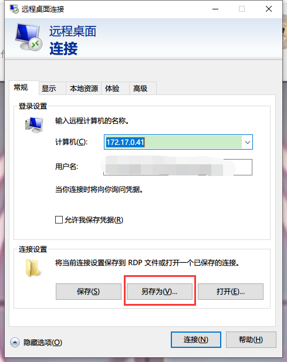
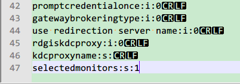

* [目录](#0)
  * [IPSec实现防火墙功能](#1)
  * [注册Windows服务项](#2)
  * [mstsc 指定显示器](#3)


<h3 id="1">IPSec实现防火墙功能</h3>

#### 图形化的操作  

https://blog.51cto.com/yttitan/1571117 

#### 命令行操作

```
rem 创建策略名称
netsh ipsec static add policy name="限制3389访问来源"

rem 创建动作名称,指定动作
netsh ipsec static add filteraction name="阻止" action=block
netsh ipsec static add filteraction name="允许" action=permit

rem 创建IP筛选列表
netsh ipsec static add filterlist name="所有IP"
netsh ipsec static add filterlist name="白名单IP"

rem 添加IP源地址,目的地址,目的端口,协议到IP筛选列表
netsh ipsec static add filter filterlist="所有IP" srcaddr=any dstaddr=me dstport=3389 description="所有IP的3389端口访问控制" protocol=TCP mirrored=yes
netsh ipsec static add filter filterlist="白名单IP" srcaddr=192.168.10.2 dstaddr=me dstport=3389 description="白名单IP允许3389端口访问" protocol=TCP mirrored=yes

rem 定义IP筛选列表与动作的对应关联
netsh ipsec static add rule name="所有IP的3389端口访问控制" policy="限制3389访问来源" filterlist="所有IP" filteraction="阻止"
netsh ipsec static add rule name="白名单IP允许3389端口访问" policy="限制3389访问来源" filterlist="白名单IP" filteraction="允许"

rem 激活该策略
netsh ipsec static set policy name="限制3389访问来源" assign=y

rem 确保IPSec服务是启动状态与开机自启动
sc start PolicyAgent
sc config PolicyAgent start= auto
```


<h3 id="2">注册Windows服务项</h3>

使用 nssm 程序辅助注册的方法  
https://blog.csdn.net/weixin_37348409/article/details/112304560  

其中程序下载地址  
http://www.nssm.cc/release/nssm-2.24.zip  
可能需要wget 之类的来辅助下载, 浏览器直接点击未必响应  

备用地址  
<a href="files/nssm-2.24.zip" target="_blank">nssm-2.24.zip</a>  


注册

```
:: 如果nssm的目录在path里就不用这句话了
cd /d "D:\Program Files\nssm-2.24\win64"
set serviceName=my_watchdog
:: python解释器目录
set pathonExe="D:\Program Files\Python310\python.exe"
:: 项目路径
set executePath="D:\Code\private\dev"
:: 脚本以及脚本的参数
set executeScript="my_watchdog_for_windows_pc.py"
:: 注册服务
nssm.exe install %serviceName% %pathonExe%  %executeScript%
nssm.exe set %serviceName% Application %pathonExe%
nssm.exe set %serviceName% AppDirectory %executePath%
nssm.exe set %serviceName% AppParameters %executeScript%
:: 启动服务
nssm.exe start %serviceName%
pause
```

卸载  

```
cd C:\Users\wang_\Downloads\nssm-2.24\win64
set serviceName=testService1
nssm.exe stop %serviceName%
nssm.exe remove %serviceName%
pause
```

<h3 id="3">mstsc 指定显示器</h3>

https://www.cnblogs.com/wuhailong/p/16420263.html

从 mstsc 编辑会话框上另存出一个会话来, ```.rdp``` 的文件



用文本编辑器编辑该rdp文件

增加一个语句行

```
# 表示第1,2个显示器
selectedmonitors:s:1,2

# 表示第1个显示器
selectedmonitors:s:1
```

以此类推


