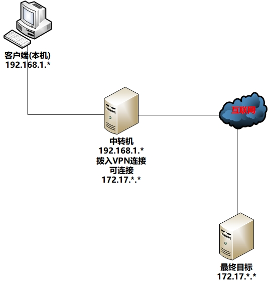
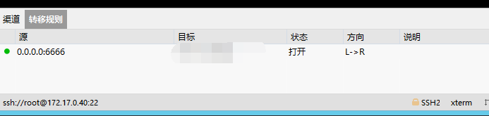

http://www.markjour.com/article/xshell-ssh-tunnel.html
https://www.cxyzjd.com/article/qq_42189368/107023408

拓扑示意图如下:

1) 中转机通过VPN连接到目标机,只是情景中的一种--也可能是双网卡等其他形式.大前提是中转机首先自己在网络链路上与目标机可达.  
2) 实现的工具 / 方法不止一种,这里描述的也只是其中的选择之一.

### 使用Windows作为中转机机器的情景

#### 中转机的配置

在中转机上首先要打开xshell连接到目标机

然后在保持该会话的情况下, 使用xshell的"隧道窗格", 建立隧道.

如果建立后,"状态"为"失败"而不是"打开", 则需要检查端口占用, 以及重建规则另起端口

#### 客户端的配置

此时, 在客户端上  
连接的对象是中转机的IP地址  
端口使用隧道监听的端口

其中本质就是ssh端口转发

不过xshell 还有代理选项, 代理类型也有多种.
