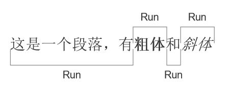

* [目录](#0)
  * [基本概念](#1)
  * [标题与正文字体字号](#2)
  * [表格](#3)


Pypi 上能找到的, 关于 word 操作的库主要有两个  
- docx
- python-docx

名字非常相近, 查阅文档时需要留意分辨, 避免库本身就不同而产生的误导

```docx``` 已多年没有更新  

本文均以 ```python-docx``` 作为对象进行描述

python-docx 的主页

https://python-docx.readthedocs.io/en/latest

<h3 id="1">基本概念</h3>

在 ```python-docx``` 中, word 文档的对象有几类

```docx.Document()``` 是实例化一个 word 对象, 是总体

标题是 ```heading```  
段落是 ```paragraph```  
```run``` 则是文本对象  
其中的 ```paragraph``` 和 ```run``` 又与"人"的思维习惯有所不同. 一个典型例子就是
当一段文字中需要切换不同的字体字号等场景, 则需要不同的```run```对象, 配置不同的属性来进行实现;
同样的, 在```python-docx```中的```paragraph```也并非仅限于我们, 尤其是中国人习惯上的"段落".  
概念性的介绍, 这篇文章已介绍得挺不错  
https://cloud.tencent.com/developer/article/1898865

引用它的一张图  



<h3 id="2">标题与正文字体字号</h3>

默认字体可以像这样设置

```
    doc = docx.Document()
    doc.styles['Normal'].font.name = u'仿宋'
    doc.styles['Normal']._element.rPr.rFonts.set(qn('w:eastAsia'), u'仿宋')
    doc.styles['Normal'].font.size = Pt(14)
    doc.styles['Normal'].font.color.rgb = RGBColor(0, 0, 0)
```

在 ```docx.Document()``` 实例化后, 对其属性进行设置.  
其中:  
2,3行的字体名称, 包括了一个东亚文字的属性设置, 是必要的, 具体原理在互联网上有文章介绍  
4,5行分别是字号与字体颜色  
其余更多属性, 有属性可另查文档

标题

```
    head = doc.add_heading('', level=1)
    run = head.add_run("一级标题")
    run.font.name = '仿宋'
    run.font.size = Pt(30)
    run._element.rPr.rFonts.set(qn('w:eastAsia'), '仿宋')
    run.font.color.rgb = RGBColor(0, 0, 0)
```

标题不同于正文, 默认字体的设置的作用于仅限于正文, 当需要对标题进行字体字号的设置时,
以上的方式是最合适的  
不少文章会在```doc.add_heading('', level=1)```里加入标题内的文字, 即''留空的部分  
然而又并未提及修改字体字号的方法  
上述方式, 通过新增一个空标题, 再添加一个 run 对象, 然后设置 run 对象的属性来实现字体字号的控制  


<h3 id="3">表格</h3>

表格操作这里有个坑点: 网上大多数文章告诉你如何 import 相关的包, 其所使用的 ```python-docx``` 大多版本在```0.8.x```  
然而这些方法在```python-docx```的 ```1.0.0```版本中已失效  
其中会用到的 ```OxmlElement```, 正确的导入方法  

```
from docx.oxml.shared import OxmlElement
```

在此基础之上, 进行添加表格的操作如下

```
    row_num = 5
    column_num = 3
    table = doc.add_table(rows=row_num, cols=column_num, style='Table Grid')
    hdr_cells = table.rows[0].cells
    hdr_cells[0].text = '修订日期'
    hdr_cells[1].text = '修订内容'
    hdr_cells[2].text = '修订人'
```

其中  
```doc.add_table()``` 是实例化一个表格对象, 其中的 row 和 cols 分别对应行和列, style 是表格样式, 'Table Grid' 是
可见边框的表格, 如果此属性不赋值, 则默认是一个没有边框的表格.  
其次是单元格的文本赋值操作, 示例中的方式是其一, 通过```table.rows[0].cells```得到的是包含该行全部单元格的列表对象,
每个单元格的 .text 属性操作是修改文本的方式之一. 但需要注意, 这里的文本字体字号颜色等, 受默认字体 style 属性值控制.  
另一个方式是在该单元格添加一个 paragraph 对象, 再添加 run 对象的方式, 可以实现独立的字体字号等控制, 不过缺点是该单元格又会出现一个多余的空行. 

##### 表头行填充色, 单元格居中对齐等

这里就需要用到前面提及的, ```OxmlElement```正确的导入方法  
对齐是对每个单元格的 ```paragraphs[0]``` 做的对齐  
而 ```paragraphs[0]``` 正是每个单元格的 ```.text``` 所在的"段落"  
如果单元格文字不是采取的这种方式赋值, 则需要灵活应变处理

```
    # 表头行填充色
    for cell in table.rows[0].cells:
        cell_xml_element = cell._tc
        table_cell_properties = cell_xml_element.get_or_add_tcPr()
        shade_obj = OxmlElement('w:shd')
        shade_obj.set(qn('w:fill'), header_color)
        table_cell_properties.append(shade_obj)

    # 第一行, 填入作者
    hdr_cells = table.rows[1].cells
    hdr_cells[0].text = config_info['output_file']['sign_date']
    hdr_cells[1].text = "创建文档"
    hdr_cells[2].text = config_info['output_file']['doc_author']

    # 所有单元格居中对齐
    for row_num in range(len(table.rows)):
        for cell in table.rows[row_num].cells:
            cell.paragraphs[0].alignment = WD_PARAGRAPH_ALIGNMENT.CENTER
```
