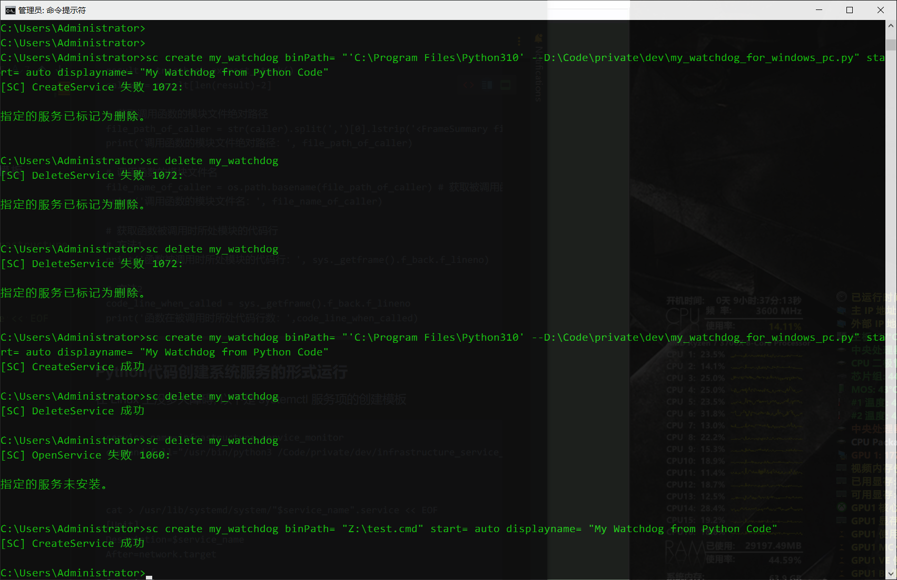
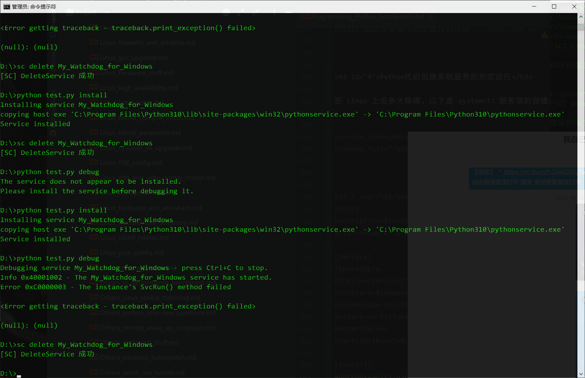
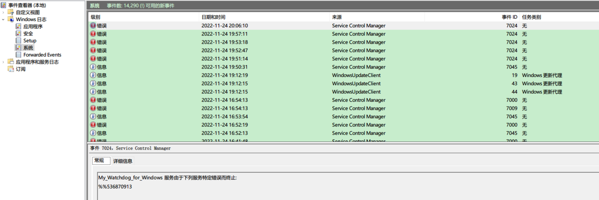
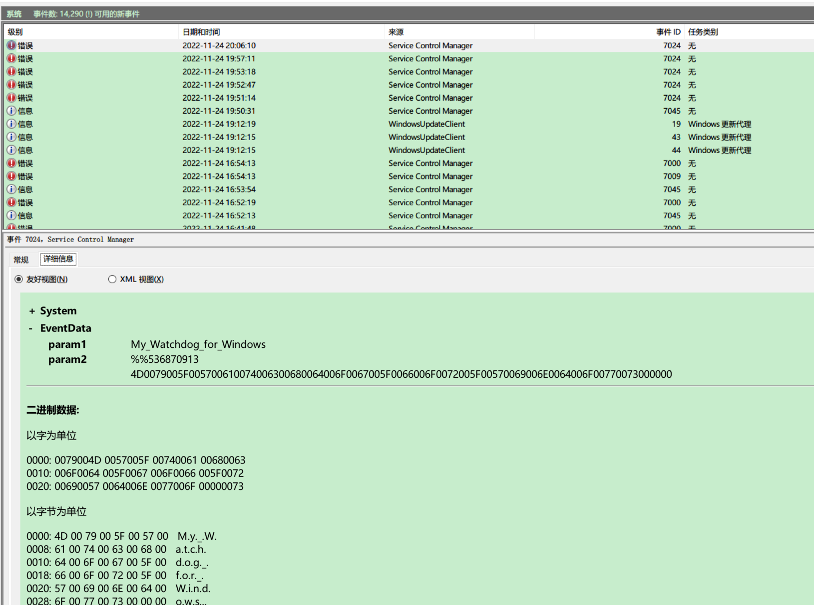

* [目录](#0)
  * [Python 时间格式处理](#1)
  * [Python 常用异常处理](#2)
  * [在 Beautifulsoup 中使用 XPATH 方式捕获对象](#3)
  * [Python代码创建系统服务的形式运行](#4)
  * [字典选择第一个、最后一个元素的key或value](#5)
  * [pip使用代理](#6)
  * [获取自身名称、路径以及调用者名称、路径](#7)
  * [字典操作备忘录](#8)
  * [读文件的方式问题——与ChatGPT的探讨](#9)


<h3 id="1">Python 时间格式处理</h3>

https://juejin.cn/post/6844903859257622541  
https://www.cnblogs.com/xuchunlin/p/5920549.html  
https://blog.csdn.net/google19890102/article/details/51355282  
https://blog.csdn.net/mighty13/article/details/78147357  

关于strptime, Python的Doc已经说得很明确了, 在大规模使用的情况下, 应避免使用它--性能问题  
https://python3-cookbook.readthedocs.io/zh_CN/latest/c03/p15_convert_strings_into_datetimes.html  
假设日期格式是 YYYY-MM-DD  
它的意思是让你直接构建datietime格式的数据  

```
from datetime import datetime
def parse_ymd(s):
    year_s, mon_s, day_s = s.split('-')
    return datetime(int(year_s), int(mon_s), int(day_s))
```

究竟strptime会比直接构建datietime格式数据的方式慢上多少?  
以下测试在AMD Ryzen 3700X 处理器上执行, 每个测试项循环100万次

```
>>> start_time = time.time()
>>> a = "2011-09-28 10:00:00"
>>> for i in range(1000000):
...     var = time.strptime(a,'%Y-%m-%d %H:%M:%S')
...
>>> end_time = time.time()
>>> print(str(end_time - start_time) + "秒")
7.145048141479492秒
>>>
>>>
>>>
>>> start_time = time.time()
>>> a = "2011-09-28 10:00:00"
>>> for i in range(1000000):
...     var = datetime.strptime(a,'%Y-%m-%d %H:%M:%S')
...
>>> end_time = time.time()
>>> print(str(end_time - start_time) + "秒")
7.07616662979126秒
>>>
>>>
>>>
>>> start_time = time.time()
>>> a = "2011-09-28 10:00:00"
>>> for i in range(1000000):
...     year_s, mon_s, day_s = a.split(' ')[0].split('-')
...     var = datetime(int(year_s), int(mon_s), int(day_s))
...
>>> end_time = time.time()
>>> print(str(end_time - start_time) + "秒")
0.8247499465942383秒
>>>
```

由此可见与官方文档所说的相差7倍多大致一致  
并且不管datetime还是time下strptime函数, 性能并没有太明显的区别


<font color=red>time模块下的函数作用</font>

- strptime()函数将时间转换成时间数组  
- mktime()函数将时间数组转换成时间戳  

```
#coding:UTF-8
import time

dt = "2016-05-05 20:28:54"

#转换成时间数组
timeArray = time.strptime(dt, "%Y-%m-%d %H:%M:%S")
#转换成时间戳
timestamp = time.mktime(timeArray)

print timestamp
```

<font color=red>字符串转时间戳</font>

```
#设a为字符串
import time
a = "2011-09-28 10:00:00"

#中间过程，一般都需要将字符串转化为时间数组
time.strptime(a,'%Y-%m-%d %H:%M:%S')
>>time.struct_time(tm_year=2011, tm_mon=9, tm_mday=27, tm_hour=10, tm_min=50, tm_sec=0, tm_wday=1, tm_yday=270, tm_isdst=-1)

#将"2011-09-28 10:00:00"转化为时间戳
time.mktime(time.strptime(a,'%Y-%m-%d %H:%M:%S'))
>>1317091800.0

#将时间戳转化为localtime
x = time.localtime(1317091800.0)
time.strftime('%Y-%m-%d %H:%M:%S',x)
>>2011-09-27 10:50:00

# datetime生成的时间格式直接转成数字化的时间戳, 再取个整就好
>>> datetime.datetime.now().timestamp()
1662382716.262145
```


<font color=red>数字型的时间戳转为Python内的时间戳格式</font>  

例如: 1612236538, 用到  
time.localtime  ---> 把数字转为时间元组

```
>>> time.localtime(1612236538)
time.struct_time(tm_year=2021, tm_mon=2, tm_mday=2, tm_hour=11, tm_min=28, tm_sec=58, tm_wday=1, tm_yday=33, tm_isdst=0)
```

时间元组不可做运算

```
>> time.localtime(1612236538) - time.localtime(1612236539)
Traceback (most recent call last):
  File "<stdin>", line 1, in <module>
TypeError: unsupported operand type(s) for -: 'time.struct_time' and 'time.struct_time'
>>>
```

如果是再将这个时间戳转到"YYYY-MM-DD HH:MM:SS"格式

```
>>> time_format = time.localtime(1612236538)
>>> time.strftime("%Y-%m-%d %H:%M:%S", time_format)
'2021-02-02 11:28:58'
>>>
```


<h3 id="2">Python 常用异常处理</h3>

https://docs.python.org/3/tutorial/errors.html  

python 内置的错误类型不必多说, 参考相关文档作了解.

以下示例是一个需要捕获的错误理由不在 error类型里, 而是在error详细理由里.

因此, 处理办法仅仅是将此 类对象 转换成 str 类型.

```
try:
    self.zbx_obj.send(item)
except Exception as error_reason:
    if re.search(r"Network is unreachable", str(error_reason)):
        print("Zabbix Server 网络不可达, 忽略此错误")
```


<h3 id="3">在 Beautifulsoup 中使用 XPATH 方式捕获对象</h3>

https://www.geeksforgeeks.org/how-to-use-xpath-with-beautifulsoup/

原文的示例

```
from bs4 import BeautifulSoup
from lxml import etree
import requests


URL = "https://en.wikipedia.org/wiki/Nike,_Inc."

HEADERS = ({'User-Agent':
			'Mozilla/5.0 (X11; Linux x86_64) AppleWebKit/537.36 \
			(KHTML, like Gecko) Chrome/44.0.2403.157 Safari/537.36',\
			'Accept-Language': 'en-US, en;q=0.5'})

webpage = requests.get(URL, headers=HEADERS)
soup = BeautifulSoup(webpage.content, "html.parser")
dom = etree.HTML(str(soup))
print(dom.xpath('//*[@id="firstHeading"]')[0].text)
```

我的代码片段

```
    soup = BeautifulSoup(masquerade(url, use_proxy='GFW', proxy_server_ip=proxy_server_ip,
                                    proxy_server_port=proxy_server_port), 'html.parser')
    dom = etree.HTML(str(soup))
    # dom = etree.HTML(soup)
    # pool_rate = soup.find(name="div", attrs={"class": "options-val"}).get_text()
    pool_rate = dom.xpath('//*[@id="app"]/div[2]/div/div/div[3]/div[2]/div[1]/div[1]/div[1]')[0].text
```

注意点:  
1) 不管用request 还是其他方式请求回来的web页面内容, 不要用```decode()```去解码, 在这个情景下属于画蛇添足.  
2) 经过```etree```处理, 以xpath 提取后的结果是个列表对象, 内容在下标 [0] 里


<h3 id="4">Python代码创建系统服务的形式运行</h3>

在 Linux 上没多大障碍, 以下是 systemctl 服务项的创建模板

```
service_name=infrastructure_service_monitor
command_full="/usr/bin/python3 /Code/private/dev/infrastructure_service_monitor.py"


cat > /usr/lib/systemd/system/"$service_name".service << EOF
[Unit]
Description=$service_name
After=network.target

[Service]
Type=simple
PIDFile=/var/run/"$service_name".pid
ExecStart=$command_full
ExecReload=/bin/kill -HUP 
Restart=on-failure
RestartSec=5s
StartLimitBurst=0

[Install]
WantedBy=multi-user.target

EOF


systemctl daemon-reload

systemctl enable "$service_name" --now
```

Windows 就诸多问题了

sc 创建服务  
https://blog.csdn.net/weixin_38570967/article/details/82689242

Python 代码使用 pywin32 模块创建服务  
https://www.jianshu.com/p/13302948dbe6

这两个方法都能把 Windows 服务创建成功, 但启动失败

其中使用 pywin32 创建服务, 在启动时的错误.

未解










示例中的用于创建服务的库函数

<a href="files/SMWinservice.py" target="_blank">附件</a>

用于业务逻辑的代码

<a href="files/EkPFT8hOvddFCPbk69mJXQi0t3qHvgL4.py" target="_blank">附件</a>


<h3 id="5">字典选择第一个、最后一个元素的key或value</h3>

https://blog.csdn.net/weixin_35757704/article/details/120368004

选取第一个元素

```
my_dict = {
    "first_key": 'first_value',
    "second_key": "second_value",
    "third_key": "third_value",
}

print("first key : ", next(iter(my_dict)))
print("first value : ", my_dict.get(next(iter(my_dict))))
```

选取最后一个元素

```
print("last key : ", list(my_dict.keys())[-1])
print("last value : ", my_dict.get(list(my_dict.keys())[-1]))
```

<h3 id="6">pip使用代理</h3>

https://zhuanlan.zhihu.com/p/371953325

几种方式:  

方式1, 临时性的指向其他源

```
# 豆瓣源
pip install -r requirements.txt -i https://pypi.douban.com/simple --trusted-host=pypi.douban.com

# 清华源
pip install -i https://pypi.tuna.tsinghua.edu.cn/simple some-package
```

方式2, 配置到系统的环境中.

```
vim /etc/profile：
    export http_proxy='http://代理服务器IP:端口号'
    export https_proxy='http://代理服务器IP:端口号'
source /etc/profile
```

方式3, shell下设置代理的方式, 临时性的  

```
export http_proxy='http://代理服务器IP:端口号
export https_proxy='http://代理服务器IP:端口号'
```

<h3 id="7">获取自身名称、路径以及调用者名称、路径</h3>

获取Python自身的文件名 函数名 代码行

https://www.modb.pro/db/108025

```
import sys
import os
import traceback

# 获取函数名称
print('函数名称：', sys._getframe().f_code.co_name)

# 获取函数所在模块文件名
print('获取函数所在模块文件名：', sys._getframe().f_code.co_filename)

result = traceback.extract_stack()
caller = result[len(result)-2]

# 获取调用函数的模块文件绝对路径
file_path_of_caller = str(caller).split(',')[0].lstrip('<FrameSummary file ')
print('调用函数的模块文件绝对路径：', file_path_of_caller)

# 调用函数的模块文件名
file_name_of_caller = os.path.basename(file_path_of_caller) # 获取被调用函数所在模块文件名称
print('调用函数的模块文件名：', file_name_of_caller)

# 获取函数被调用时所处模块的代码行
# 方法1
print('函数被调用时所处模块的代码行：', sys._getframe().f_back.f_lineno)

# 方法2
code_line_when_called = sys._getframe().f_back.f_lineno
print('函数在被调用时所处代码行数：',code_line_when_called)
```


获取自身名称、路径

```
os.path.realpath(__file__)
```

调用者名称、路径的样例

```
import time
import inspect

def time_wrapper(func):
    def wrapper(*args, **kwargs):
        start_time = time.time()
        result = func(*args, **kwargs)
        end_time = time.time()
        
        caller_frame = inspect.stack()[1]
        caller_module = inspect.getmodule(caller_frame[0])
        caller_file = caller_module.__file__
        
        print("Function:", func.__name__)
        print("File Path:", caller_file)
        print("Execution Time:", end_time - start_time, "seconds")
        return result
    return wrapper
```

<h3 id="8">字典操作备忘录</h3>

- has_key() 是已经被移除的方法

- python 3.7 开始, 字典已会自行排序, 是有序字典

- https://cloud.tencent.com/developer/article/1820102
这篇文章对比了判断键是否存在的三种方法的性能表现, ```<key> in <dict>``` 仍是最优解

- ```<dict>.update``` 方法用于更新键, 如果键不存在不会报错, 会新增, 通常是更普适的选择

- 删除键, 使用 ```pop()``` 如果键不存在不会报错, 通常是更普适的选择 
https://www.freecodecamp.org/chinese/news/how-to-remove-a-key-from-a-python-dictionary-delete-key-from-dict/

示例:

```
my_dict.pop("Book", 'Key does not exist')
```

<h3 id="9">读文件的方式问题——与ChatGPT的探讨</h3>

问得好 👍

你习惯的写法：

```python
f = open(r"xxx", "rb")
for line in f:
    line = line.decode("utf-8").strip()
```

和我写的：

```python
with open("xxx", "r", encoding="utf-8") as f:
    for line in f:
        line = line.strip()
```

其实目标一样：逐行读文本。区别主要在以下几点：

---

### 1. **资源管理**

* `with open(...) as f:` 是 **上下文管理器**，退出 `with` 代码块后，文件会自动关闭（即使发生异常也能关闭）。
* 你用 `open()` 得手动写 `f.close()`，否则如果代码异常提前退出，文件可能没被关闭。

👉 所以推荐 `with`，更安全。

---

### 2. **二进制 vs 文本模式**

* 你用 `'rb'` 打开文件，读出来是 **bytes**，必须再 `.decode()`。
* 我用 `'r'` 并指定 `encoding="utf-8"`，Python 读的时候就自动解码成 **str**，后续处理更自然。

👉 对于本来就是文本文件的场景（比如你的系统检查报告），用 `'r', encoding=...` 就省去了手动 `.decode()`。
👉 你的方法更适合：**文件里可能有二进制内容 / 不确定编码**，这样你可以灵活选择什么时候、用什么方式 decode。

---

### 3. **跨平台兼容性**

* `'r'` 模式下，Python 会自动处理换行符（Linux `\n`、Windows `\r\n`），统一成 `\n`。
* `'rb'` 模式下，你读到的就是原始字节，`\r\n` 会原样保留，需要你自己处理。

👉 在处理日志、配置文件时，自动换行处理通常更方便。

---

### 4. **性能**

性能几乎没区别。唯一小差别是：

* `'rb'` + 手动 decode，解码由你自己控制（比如分块 decode）。
* `'r', encoding=...`，解码由 Python 内置处理，通常更快，也更省心。

---

### 5. **你的场景**

你现在要处理的是 **清晰的文本（日志、检查报告）**，而且要 **逐行解析**。
👉 这类场景下，`with open(..., 'r', encoding='utf-8') as f` 明显更合适。

因为你用 `'rb'` 读取，还得 `.decode()`，而且碰到 BOM 或者混合编码时会更麻烦。

---

⚡ 总结：

* 如果是**明确的文本文件**（日志、配置、JSON、脚本），推荐 `with open(..., 'r', encoding='utf-8')`。
* 如果是**二进制文件**（图片、压缩包、未知格式），就用 `'rb'`，再手动 decode 或处理。

---


👌 你总结得很对了，我帮你梳理一下：

---

### 1. **异常编码**

* 用 `'rb'` → 你拿到的是裸字节，自己决定何时 decode、用什么编码 decode，甚至可以多次尝试不同编码。
* 用 `'r', encoding='utf-8'` → Python 帮你 decode，遇到非法字符可能直接报错，除非你加 `errors='ignore'` 或 `errors='replace'`。

👉 如果 **文件编码不确定 / 可能混杂不同编码**，还是 `'rb'` 更安全。

---

### 2. **性能（大文件内存）**

两种方法 **本质上差不多**，因为 `for line in f` 都是 **流式读取**，不会一次性把整个文件读进内存。

* `'rb'`：读 bytes，逐行 decode。
* `'r'`：Python 内部也就是边读边 decode。

👉 所以 **性能不是主要区别点**，主要是灵活度。

---

### 3. **换行符 (\r\n vs \n)**

* `'r'` 模式下，Python 默认会帮你把所有平台的换行符转换为 `\n`（除非指定 `newline=''`）。
* `'rb'` 模式下，换行符保持原样，你能看到 `\r\n`、`\n` 的区别。

👉 这就是你说的“我需要自己用 `\r\n` 做段落标记”这种场景：

* 如果你 **需要精确保留换行符**（区分 `\r\n` 和 `\n`），那就必须 `'rb'`，不能交给 Python 自动替换。
* 如果你只关心内容，不关心换行符差异，那 `'r'` 就简单很多。

---

### 4. **该怎么选？**

我建议你这样定策略：

* **默认情况**（日志、配置、普通文本）：

  ```python
  with open(path, "r", encoding="utf-8") as f:
      for line in f:
          ...
  ```

* **特殊情况**（需要自己处理换行符 / 编码未知 / 混合编码 / 二进制）：

  ```python
  with open(path, "rb") as f:
      for raw_line in f:
          line = raw_line.decode("utf-8", errors="ignore")
          ...
  ```

---

### 5. **段落标记场景**

如果你需要保留 `\r\n`，又想用 `with`：

```python
with open(path, "r", encoding="utf-8", newline="") as f:
    for line in f:
        # line 里会保留原始的换行符形式 (\n 或 \r\n)
        print(repr(line))
```

这里 `newline=""` 的意思是：**不要自动替换换行符**，按原样给你。

这样，你既能用 `with`，又能得到真实的 `\r\n` / `\n`。

---

⚡ 总结一句：

* 如果你关心 **编码安全性** 和 **换行符精确性** → `'rb'` 更合适。
* 如果你只关心 **文本内容** → `with open(..., "r", encoding=...)` 更省心。
* 如果你想要 **两者结合**（用 `with` 又保留换行符） → `with open(..., "r", encoding="utf-8", newline="")`。

---


完全正确 👍，这就是很多人（尤其做运维、日志处理的场景）更愿意 `rb` 的根本原因：

---

### 📌 `with open(..., "r", encoding="utf-8")` 的局限

* 它只能用你指定的编码解码整份文件。
* 文件里一旦混进别的编码（比如 GBK 的日志片段、系统环境变量导出来的奇怪字符），就容易 **UnicodeDecodeError**。
* 跨平台时差异很大：

  * Linux 默认 UTF-8 居多。
  * Windows 中文环境经常默认 GBK/GB18030。
  * 甚至日志可能一会儿 UTF-8，一会儿 GBK。

---

### 📌 `rb` 的优势

* 字节读取 → 你可以：

  * **动态判断编码**（比如用 `chardet`、`charset_normalizer` 自动探测）。
  * **不同段落用不同编码 decode**。
  * **遇到异常字节时 fallback**，比如先尝试 `utf-8`，失败就退回 `gb18030`。

这样处理的健壮性远比固定一个 `utf-8` 高。

---

### 📌 混合方案（推荐做法）

其实可以两者结合，用 `with` 管理资源 + 用 `rb` 读取：

```python
def read_lines(path):
    with open(path, "rb") as f:
        for raw_line in f:
            try:
                yield raw_line.decode("utf-8")
            except UnicodeDecodeError:
                yield raw_line.decode("gb18030", errors="replace")
```

这样你：

* 保留了 `with` 的简洁性和自动关闭文件。
* 保留了跨平台的容错能力。
* 还能根据需求扩展，比如 `errors="ignore"`。

---

### 📌 跨平台最佳实践

如果你写的代码需要同时跑在 **Linux + Windows** 环境下，建议：

1. **优先 utf-8**，因为 Linux 大部分都是它。
2. 如果失败，尝试 **系统默认编码**：

   ```python
   import locale
   sys_encoding = locale.getpreferredencoding()
   ```
3. 如果还失败，最后兜底用 **gb18030**（几乎能覆盖所有中文场景）。

---

所以我会这样写一个通用 reader：

```python
import locale

def safe_decode(raw_line, encodings=None):
    if encodings is None:
        encodings = ["utf-8", locale.getpreferredencoding(), "gb18030"]

    for enc in encodings:
        try:
            return raw_line.decode(enc)
        except UnicodeDecodeError:
            continue
    return raw_line.decode("utf-8", errors="replace")  # 最后兜底

def read_file(path):
    with open(path, "rb") as f:
        for raw_line in f:
            yield safe_decode(raw_line).rstrip("\r\n")
```

---

