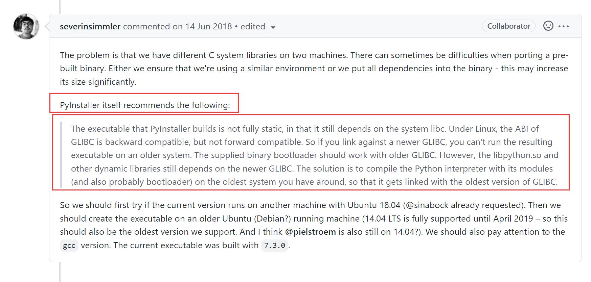
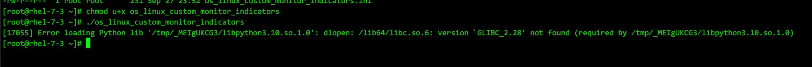

* [目录](#0)
  * [Python 在Linux上的编译安装](#1)
  * [有关pyinstaller](#2)
  * [cython 创建完全静态连接的可执行程序](#3)


<h3 id="1">Python 在Linux上的编译安装</h3>

重点在以下参数

```
./configure --prefix=/usr/local/${python_version_main} \
--with-openssl=/usr/local/openssl \
--enable-optimizations \
--enable-shared
```

--with-openssl=/usr/local/openssl  指定openssl所在位置,关键所在  
--enable-shared  动态库共享,关键所在  
--enable-optimizations  启用编译器优化,可选项
--prefix=/usr/local/${python_version_main}  指定编译生成的文件统一放置的位置,可选项

完成以后还需要做 ldd 的动态库链接指向添加工作

截止 Python 3.10.6 我的编译安装脚本

<a href="files/Python-3.10-install.sh" target="_blank">Python-3.10-install.sh</a>


<h3 id="2">有关pyinstaller</h3>

pyinstaller 作为 python的一个lib, 可以将 python 脚本编译生成成可执行程序, 尤其是单个文件

示例, -F 就是单文件的参数

```
pyinstaller -F <Python脚本位置>
```

但可能会遇到在执行过程中出现找不到跟libxxx.so的几个动态链接库文件的相关提示

```
OSError: Python library not found: libpython3.7m.so.1.0, libpython3.7mu.so.1.0, libpython3.7.so.1.0
This would mean your Python installation doesn't come with proper library files.
This usually happens by missing development package, or unsuitable build parameters of Python installation.

* On Debian/Ubuntu, you would need to install Python development packages
* apt-get install python3-dev
* apt-get install python-dev
* If you're building Python by yourself, please rebuild your Python with `--enable-shared` (or, `--enable-framework` on Darwin)
```

https://blog.csdn.net/weixin_39973810/article/details/122041118  
https://www.cnblogs.com/codeBang/p/15856571.html

解决方法:  
python解释器在编译安装时的参数```--enable-shared```极可能是遗漏的, 或者未添加到 ldd 的查找目录中 /etc/ld.so.conf  
参照本文第1条重新编译安装python解释器可以解决问题

##### 由pyinstaller生成的可执行程序在运行过程中获知自身的位置

由 pyinstaller 打包成可执行程序后, 执行程序默认是在 /tmp 下创建一个随机字符串命令的目录作为程序的工作目录

你可能会有获取可执行程序所在位置和自身文件名的需求, 

https://stackoverflow.com/questions/404744/determining-application-path-in-a-python-exe-generated-by-pyinstaller  
https://note.nkmk.me/en/python-os-basename-dirname-split-splitext/

示例方法:

```
if getattr(sys, 'frozen', False):
    # application_path = os.path.dirname(sys.executable)
    conf_file_name = os.path.dirname(sys.executable) + os.sep + os.path.basename(sys.executable) + r".ini"
elif __file__:
    # application_path = os.path.dirname(__file__)
    self_path_name = os.path.split(os.path.realpath(__file__))
    conf_file_name = self_path_name[0] + os.sep + re.sub(r".(py|exe)$", r".ini", self_path_name[1])
```

利用 getattr 获取程序自身的内置属性变量, 来判断是脚本还是可执行程序.


##### 最后

pyinstaller 并非是完全静态编译, 它依然是要依赖OS上的动态链接库

https://github.com/DARIAH-DE/TopicsExplorer/issues/53



所以, 如果是期望生成的可执行程序具有广泛的可移植性, <font color=red>pyinstaller 是做不到这一点的.</font>




<h3 id="3">cython 创建完全静态连接的可执行程序</h3>

