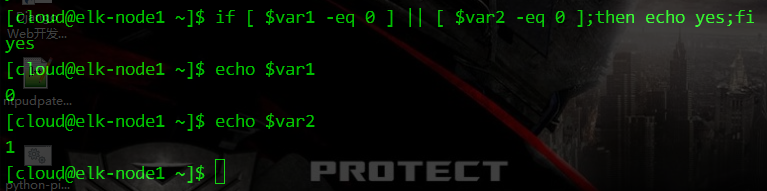
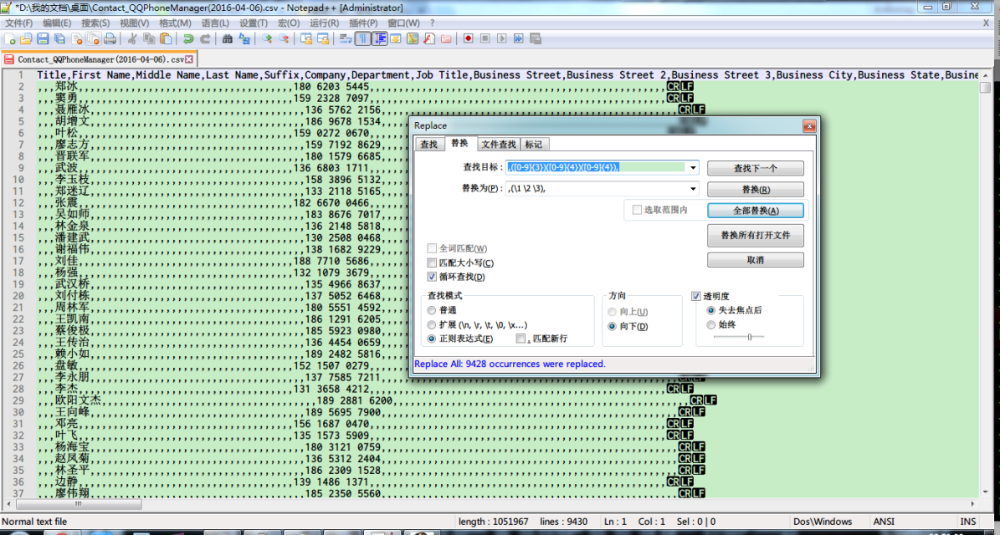
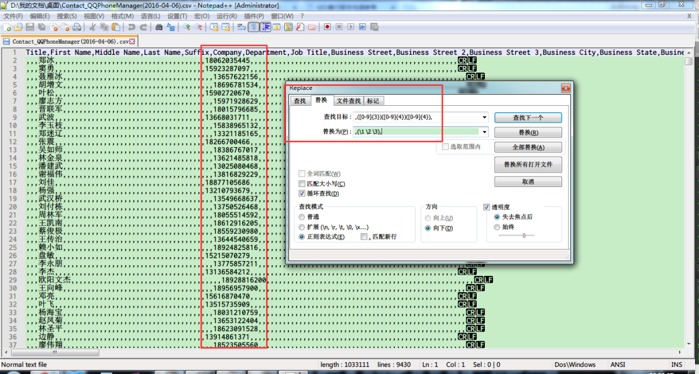
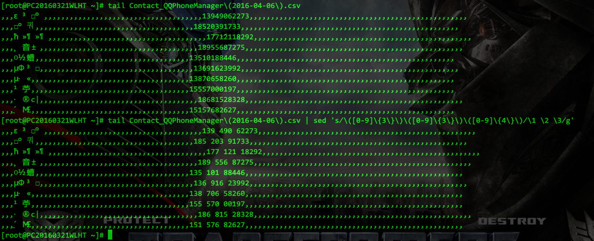
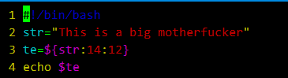
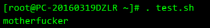
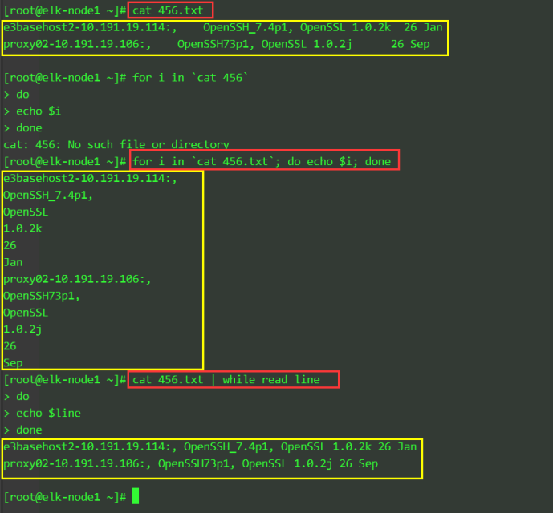
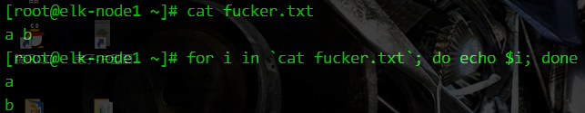

* 导航
    * [Shell正则](#01)  
    * [Shell里的细节](#02)  
    * [Shell比较运算符](#Shell比较运算符)  
    * [Shell输出的格式控制](#Shell输出的格式控制)  

[回到页首](#导航)  
<h4 id="01">Shell正则<h4>
<font color=red>关于正则表达式分组及后向引用</font>  
http://wiki.jikexueyuan.com/project/unix/regular-expressions.html  
http://www.cnblogs.com/jcli/p/4088514.html  
http://kodango.com/sed-and-awk-notes-part-3  

| 字符 | 描述 |  
| ---- | ---- |  
| ^ | 匹配一行的起始 |  
| $ | 匹配一行的结尾 |  
| . | 匹配任何的单个字符 |  
| * | 匹配零个或多个以前出现的字符 |  
| [chars] | 为了匹配任何字符串的字符。您可以使用`-`字符来表示字符的范围。 |  

| 表达式 | 描述 |  
| ---- | ---- |  
| /a.c/ | 匹配包含字符串如a+c，a-c，abc, match, 还有 a3c |  
| /a*c/ | 匹配相同的字符串还有字符串比如ace，yacc，以及arctic |  
| /[tT]he/ | 匹配字符The和the |  
| /^$/ | 匹配空白行 |  
| /^.*$/ | 不管任何情况，都匹配一整行 |  
| / */ | 匹配一个或多个空格 |  
| /^$/ | 匹配空行  |  

| 集 | 描述 |  
| ---- | ---- |  
| [a-z] | 匹配一个小写字母 |  
| [A-Z] | 匹配一个大写字母 |  
| [a-zA-Z] | 匹配一个字母 |  
| [0-9] | 匹配数字 |  
| [a-zA-Z0-9] | 匹配单个字母或数字 |  

一个实例:  
为了取/etc/redhat-release中的版本号,在描述数字0-9出现的次数 {1} ,<font color=red>花括号和小括号</font>需要用到转义符


awk来实现正则表达式取不匹配  
grep -v 在多个关键字时总不太灵光  
awk可以这样用  
awk '!/关键字1 | 关键字2/{print}'  
! 一定要配合单引号'',否则报错

<font color=red>sed正则表达式匹配,各种括号的转义和不转义</font>  
http://blog.csdn.net/zl87758539/article/details/77481679  
[ ] 需要匹配的时候，需要转义(这个是叛徒)  

```
echo "[ ]"|sed 's/\[.*\]/aaa/g'
```
( ) 需要匹配的时候，不要转义

&nbsp;

```
$echo "( )"|sed 's/( )/c/g'
```
{ } 需要匹配的时候，不要转义

&nbsp;

```
$echo "{ }"|sed 's/{ }/c/g'
```
当需要匹配数字，字母等使用中括号时候：  
不要转义   
但使用大括号作为特殊字符时候，需要转义。  

```
$echo "333"|sed 's/[0-9]\{3\}/ccc/g'
```
当需要适配符，需要使用\1来替换正则表达式的对应参数时：

不能写(regrexxxx)

要写\(regrexxxx\)
$echo "{1234567}"|sed 's/{\([0-9]*\)}/\1/g'
与此对应的还有 
+和*

在做为特别字符时候+必须转义为  
\+  
1
才有效，  
而*则不需要。

举个例子：
```
echo "ccc"| sed 's/c*/aaa/g'      #正确
echo "ccc"| sed 's/c\*/aaa/g'    #错误
echo "ccc"| sed 's/c+/aaa/g'      #错误
echo "ccc"| sed 's/c\+/aaa/g'    #正确
```

<font color=red>grep中正则表达式的细节</font>  
1. 在grep和sed中，\t和\s都是无效的，要表示制表符和空格，只能直接敲入tab和空格键，这个在shell脚本中还好说，在命令行模式下就比较麻烦了，因为tab默认是会智能补全命令的，所以要在按tab之前按下ctrl+v
，就可以把tab打出来了。  
2. egrep和grep -E是等效的，egrep相比grep对正则表达式有了一些扩展支持，具体包括一下几点（其实这些特性grep是可以用的，只不过要在元字符前面加上转义符，比如用到+时，应敲入\+）：  
+：匹配一个或多个先前的字符。如：’[a-z]+able’，匹配一个或多个小写字母后跟able的串，如loveable,enable,disable等。  
?：匹配零个或多个先前的字符。如：’gr?p’匹配gr后跟一个或没有字符，然后是p的行。  
a|b|c :匹配a或b或c。如：grep|sed匹配grep或sed    
():分组符号，如：love(able|rs)ov+匹配loveable或lovers，匹配一个或多个v。    
x{m},x{m,},x{m,n}:作用同x\{m\},x\{m,\},x\{m,n\}  
3. grep还支持一些POSIX字符类，也一并记录如下吧，虽然平时应该不大可能用到：  

| POSIX字符 | 含义 |  
| ---- | ---- |
| [:alnum:] | 文字数字字符  |  
| [:alpha:] | 文字字符  |  
| [:digit:] | 数字字符  |  
| [:graph:] | 非空字符（非空格、控制字符）  |  
| [:lower:] | 小写字符  |  
| [:cntrl:] | 控制字符  |  
| [:print:] | 非空字符（包括空格）  |  
| [:punct:] | 标点符号  |  
| [:space:] | 所有空白字符（新行，空格，制表符）  |  
| [:upper:] | 大写字符  |  
| [:xdigit:] | 十六进制数字（0-9，a-f，A-F）  |

[回到页首](#导航)  

<h4 id="02">Shell里的细节</h4>

http://blog.csdn.net/yorkingalan/article/details/7055518  
http://mprc.pku.edu.cn/mentors/training/TrainingCourses/material/ShellProgramming.HTM  
http://lq2419.blog.51cto.com/1365130/1238880  

<font color=red>调试执行</font>  
bash -x 脚本名

<font color=red>xargs引用管道前的结果</font>  
```
find . -name "*" | xargs -i cp {}  /home/users/
```

<font color=red>命令执行结果赋值给变量</font>  
形如：  
```
head -c 100 /dev/urandom | tr -dc A-Z | head -c 4
```
生成4个随机大写字母，结果想赋值给变量，在shell中如何表示？  
```
$(head -c 100 /dev/urandom | tr -dc A-Z | head -c 4)
```

<font color=red>shell四则运算</font>  
http://www.cnblogs.com/chengmo/archive/2010/09/30/1839556.html  
做除法用存变量的形式还是比较好使
```
var=$(echo "$numerator/$denominator"|bc)
```

<font color=red>shell去重的几种方法</font>  
1. 使用uniq/sort删除重复行  
注意：单纯uniq是不行的。  
sort -k2n file | uniq > a.out  
当file中的重复行不再一起的时候，uniq没法删除所有的重复行。经过排序后，所有相同的行都在相邻，因此uniq可以正常删除重复行。  
2. 使用用sort+awk命令  
注意：单纯awk同样不行，原因同上。  
sort -k2n file | awk '{if ($0!=line) print;line=$0}'  
也可以使用 awk '!i[$1]++' log;
3. 用sort+sed命令，同样需要sort命令先排序。  
sort -k2n file | sed '$!N; /^\(.*\)\n\1$/!P; D'


<font color=red>if条件判断之组合判断（与、或、非）</font>  
https://blog.51cto.com/dngood/675325  
在使用与 或 非条件判断时出现  
[: : integer expression expected  
并且-a -o 的写法与中括号 [ ] 里面的格式都正确时  
解决办法:  
1. 所有字符 与逻辑运算符直接用“空格”分开，不能连到一起。
2. [[]] 运算符只是[]运算符的扩充。能够支持<,>符号运算不需要转义符，它还是以字符串比较大小。里面支持逻辑运算符：|| &&


http://wuyelan.blog.51cto.com/6118147/1530277  
组合条件测试是指可以将多个条件组合起来进行判断，条件和条件之间有逻辑关系。例如判断一个数是否大于3，并且小于9，这里大于3是一个条件，小于9也是一个条件，这两个条件必须同时满足。同时满足即为逻辑关系。通常逻辑关系有以下几种：  
与：-a，当指定多个条件时，默认为与关系  
或：-o  
非：!，这是个单目操作符


示例
```
#!/bin/bash
if [ $1 =="memory" -o $1 == "Memory" ]; then
#### 这里不再使用模式匹配了，而采用-o或关系来进行组合条件判断
    free -m
else
    cat /proc/uptime
fi
```

上面的逻辑关系，是针对条件组合的情况，两个或多个命令的运行结果也可以组合判断，其逻辑关系有如下几种：  
&&: 与  
||：或  
!: 非  


<font color=red>重定向1>/dev/null 2>&1 含义</font>  
http://blog.csdn.net/ithomer/article/details/9288353

```
/dev/null ：代表空设备文件
>         ：代表重定向到哪里，例如：echo "123" > /home/123.txt
1         ：表示stdout标准输出，系统默认值是1，所以">/dev/null"等同于"1>/dev/null"
2         ：表示stderr标准错误
&         ：表示等同于的意思，2>&1，表示2的输出重定向等同于1
```

1 > /dev/null 2>&1 语句含义：  
```1 > /dev/null```  首先表示标准输出重定向到空设备文件，也就是不输出任何信息到终端，说白了就是不显示任何信息。  
```2>&1```  接着，标准错误输出重定向（等同于）标准输出，因为之前标准输出已经重定向到了空设备文件，所以标准错误输出也重定向到空设备文件。

cmd >a 2>a 和 cmd >a 2>&1 为什么不同？  
cmd >a 2>a ：stdout和stderr都直接送往文件 a ，a文件会被打开两遍，由此导致stdout和stderr互相覆盖。    
cmd >a 2>&1 ：stdout直接送往文件a ，stderr是继承了FD1的管道之后，再被送往文件a 。a文件只被打开一遍，就是FD1将其打开。  

<font color=red>Linux下批量复制文件到多个文件夹</font>  
http://blog.sina.com.cn/s/blog_45e860c10100ni1a.html  
mkdir建以1,2,3,4,5个文件夹名  
把所有ini后缀的文件拷贝到12345文件夹得集合F中,命令如下  
```
for F in 1 2 3 4 5 ;do cp *.ini $F ;done
```
想要每步骤都显示出来,在cp后面加上-vf  
```
for F in 1 2 3 4 5;do cp -vf *.ini $F ;done  
```

<font color=red>正则表达式的标签分组，后向引用的细节</font>
http://wiki.jikexueyuan.com/project/unix/regular-expressions.html  
对字符串分组拆分，并后向的引用，用一对小括号 () 来划分一个分组  
notepad++的实现：  




Shell中的实现（难点在于转移符 \ 的使用，分组标签 () 要用 \ 转义，以及出现次数 {} 也要用 \ 转移，）：


<font color=red>Shell里单双括号运算的解释</font>  
单括号运算符号：
```
a=$(date)
```
等同于
```
a=`date`
```

双括号运算符:
```
a=$((1+2))
```
等同于：
```
a=`expr 1 + 2`
```

<font color=red>指定范围的随机数生成</font>  
获取F范围【1-F】内的随机数  
echo $((RANDOM%F+1))

例：获取50范围【1-50】的随机数
echo $((RANDOM%50+1))

<font color=red>grep -q 用于if 逻辑判断</font>  
-q 参数，本意是 Quiet; do not write anything to standard output.  Exit immediately with zero status if any match is found, even if an error was detected.   中文意思为，安静模式，不打印任何标准输出。如果有匹配的内容则立即返回状态值0。

例：
```
#### cat a.txt
nihao 
nihaooo
hello

####  if  grep -q hello a.txt ; then echo yes;else echo no; fi 
yes
#### if grep -q word a.txt; then echo yes; else echo no; fi
no 
```

<font color=red>grep通过以下参数控制上下文</font>  
grep -C 5 foo file  显示file文件中匹配foo字串那行以及上下5行  
grep -B 5 foo file  显示foo及前5行  
grep -A 5 foo file  显示foo及后5行  

<font color=red>对时间的计算</font>  
date +%s -d '各种时间格式'  
将给定的时间格式转换成时间戳
 
时间加减  
这里处理方法，是将基础的时间转变为时间戳，然后，需要增加或者改变时间，变成 秒。
如：1990-01-01 01:01:01  加上 1小时 20分  
处理步骤：  
将基础时间转为时间戳  
```
time1=$(date +%s -d '1990-01-01 01:01:01')
echo $time1
631126861 【时间戳】
```

将增加时间变成秒
```
[root@localhost ~]#### time2=$((1*60*60+20*60))
[root@localhost ~]#### echo $time2
4800
```

两个时间相加，计算出结果时间
time1=$(($time1+$time2))
time1=$(date +%Y-%m-%d\ %H:%M:%S -d "1970-01-01 UTC $time1 seconds");
echo $time1
1990-01-01 02:21:01

时间差计算方法
如：2010-01-01 与 2009-01-01 11:11:11 时间差  
原理：同样转成时间戳，然后计算天，时，分，秒  
```
time1=$(($(date +%s -d '2010-01-01') - $(date +%s -d '2009-01-01 11:11:11')));  
echo time1
```
将time1 / 60 秒，就变成分了。

时间戳反转年月日时分秒
```
date -d @时间戳  "+%Y-%m-%d %T"
```

<font color=red>break和continue的准确用法</font>  
http://c.biancheng.net/cpp/view/7010.html


<font color=red>比较运算</font>  
http://blog.csdn.net/yf210yf/article/details/9207147   
1.整数比较
```
-eq 等于,如:if [ "$a" -eq "$b" ]   
-ne 不等于,如:if [ "$a" -ne "$b" ]   
-gt 大于,如:if [ "$a" -gt "$b" ]   
-ge 大于等于,如:if [ "$a" -ge "$b" ]   
-lt 小于,如:if [ "$a" -lt "$b" ]   
-le 小于等于,如:if [ "$a" -le "$b" ]   
<   小于(需要双括号),如:(("$a" < "$b"))   
<=  小于等于(需要双括号),如:(("$a" <= "$b"))   
>   大于(需要双括号),如:(("$a" > "$b"))   
>=  大于等于(需要双括号),如:(("$a" >= "$b"))
```

小数比较使用AWK

2.字符串比较  
= 等于,如:if [ "$a" = "$b" ]  
== 等于,如:if [ "$a" == "$b" ],与=等价  

注意, 比较两个字符串是否相等的办法是：  
if [ "$test"x = "test"x ]; then  
这里的关键有几点：  
1 使用单个等号  
2 注意到等号两边各有一个空格：这是unix shell的要求  
3 注意到"$test"x最后的x，这是特意安排的，因为当$test为空的时候，上面的表达式就变成了x = testx，显然是不相等的。而如果没有这个x，表达式就会报错：[: =: unary operator expected

注意:==的功能在[[]]和[]中的行为是不同的,如下:   
[[ $a == z* ]]   #### 如果$a以"z"开头(模式匹配)那么将为true  
[[ $a == "z*" ]] #### 如果$a等于z*(字符匹配),那么结果为true  
  
[ $a == z* ]     #### File globbing 和word splitting将会发生   
[ "$a" == "z*" ] #### 如果$a等于z*(字符匹配),那么结果为true   

<font color=red>获取字符串变量的一部分</font>  
echo ${variable:x:y}  
x - 起始位置  
y - 长度  
例子:  




<font color=red>在shell中计算浮点数的处理</font>  
bash 不支持浮点运算，如果需要进行浮点运算，需要借助bc,awk 处理  
1、借助bc处理示例：计算5.01-4*2.0，得到的结果为-2.99
```
$ c=$(echo "5.01-4*2.0"|bc)
$ echo $c
2、借助awk处理示例：计算7.01*5-4.01，得到的结果为31.05
$ c=$(awk 'BEGIN{print 7.01*5-4.01 }')
$ echo $c
```
注：在shell 中$() 与 ``等效。 中间包含命令语句执行，返回执行结果。

<font color=red>在shell中创建字典</font>  
```
declare -A dic
dic=([cms]="192.168.0.2" [api]="192.168.0.3" [web]="192.168.0.4")

http://blog.csdn.net/jeremy_yangt/article/details/49100773 
#必须先声明
declare -A dic
dic=([key1]="value1" [key2]="value2" [key3]="value3")

#打印指定key的value
echo ${dic["key1"]}
#打印所有key值
echo ${!dic[*]}
#打印所有value
echo ${dic[*]}

#遍历key值
for key in $(echo ${!dic[*]})
do
        echo "$key : ${dic[$key]}"
done

echo "shell定义数组"

#数组
list=("value1" "value2" "value3")
#打印指定下标
echo ${list[1]}
#打印所有下标
echo ${!list[*]}
#打印数组下标
echo ${list[*]}
#数组增加一个元素
list=("${list[@]}" "value3")
```

<font color=red>for循环遇到空格切分换行的问题解决</font>  
https://blog.csdn.net/m0_37549859/article/details/78238062  
重定义换行符可以解决, shell的内置变量$IFS  
```
OLDIFS=$IFS
IFS=$'\n'
中间代码块
IFS=$OLDIFS
```

<font color=red>for ... in ...和 while read ...之间的区别</font>  
http://blog.itpub.net/22664653/viewspace-1175858/  
真正导致for ... in ... 和while read ...区别在于shell中变量存储多行数据的形式  
在shell中输入多行变量,换行符并没有以\n形式存储,虽然显示的是多行,但实际上数据还是一行.  
如果你在变量中输入换行符\n,那么echo要能使换行符起作用,则需要使用-e参数,否则还是\n文本形式.  
所以 while read ...一次性读完了他演示的例子的数据,因为本来就只有一行  
而 for ... in ... 之所以进行了换行,那是因为遇到空格进行的切分的  
图示说明  




所以,结论就是,如果读文件,for...in...和while read ...并没有什么区别.  
变量存储就会有区别.  
简单就是最好的原则,尽量从文件中读取.  

<font color=red>shell中处理换行符\n</font>  
在文本解析中,需要替换换行符的场景比较常见  
但非贪婪模式,如 .*? 在sed中并不好使  


受下面帖子的启发  
http://blog.xg98.com/article.asp?id=549  
http://bbs.chinaunix.net/thread-3745188-1-1.html  
https://segmentfault.com/q/1010000002416121

总结目前一个可行的流程
1) tr命令 对\n做无脑替换,需注意tr是1对1替换,举例 tr 'abc' '123' ,那么它执行的是a变1,b变2,c变3  
2) sed 去找标志位,在标志位后加一些原文本绝不会出现的词组----是为第3步作准备  
3) awk 利用它的输入 / 输出 行 / 列符重定义的功能,将第2步加的词组作为行结束标志,替换回\n,因为是额外添加的,则这些是可以牺牲的,在awk作行分割时被替换掉也不会影响原文.  

[回到页首](#导航)  

#### Shell比较运算符
https://blog.csdn.net/ithomer/article/details/6836382

常用的运算符

| 运算符 | 描述 | 示例 |   
| ------ | ------ | ------ |
| 文件比较运算符 |   
| -e filename | 如果 filename 存在，则为真 | [ -e /var/log/syslog ] |   
| -d filename | 如果 filename 为目录，则为真 | [ -d /tmp/mydir ] |   
| -f filename | 如果 filename 为常规文件，则为真 | [ -f /usr/bin/grep ] |   
| -L filename | 如果 filename 为符号链接，则为真 | [ -L /usr/bin/grep ] |   
| -r filename | 如果 filename 可读，则为真 | [ -r /var/log/syslog ] |   
| -w filename | 如果 filename 可写，则为真 | [ -w /var/mytmp.txt ] |   
| -x filename | 如果 filename 可执行，则为真 | [ -L /usr/bin/grep ] |   
| filename1 -nt filename2 | 如果 filename1 比 filename2 新，则为真 | [ /tmp/install/etc/services -nt /etc/services ] |   
| filename1 -ot filename2 | 如果 filename1 比 filename2 旧，则为真 | [ /boot/bzImage -ot arch/i386/boot/bzImage ] |   
| 字符串比较运算符 （请注意引号的使用，这是防止空格扰乱代码的好方法） |   
| -z string | 如果 string 长度为零，则为真 | [ -z "$myvar" ] |   
| -n string | 如果 string 长度非零，则为真 | [ -n "$myvar" ] |   
| string1 = string2 | 如果 string1 与 string2 相同，则为真 | [ "$myvar" = "one two three" ] |   
| string1 != string2 | 如果 string1 与 string2 不同，则为真 | [ "$myvar" != "one two three" ] |   
| 算术比较运算符 |   
| num1 -eq num2 | 等于 | [ 3 -eq $mynum ] |   
| num1 -ne num2 | 不等于 | [ 3 -ne $mynum ] |   
| num1 -lt num2 | 小于 | [ 3 -lt $mynum ] |   
| num1 -le num2 | 小于或等于 | [ 3 -le $mynum ] |   
| num1 -gt num2 | 大于 | [ 3 -gt $mynum ] |   
| num1 -ge num2 | 大于或等于 | [ 3 -ge $mynum ] |   

[回到页首](#导航)  

#### Shell输出的格式控制
颜色、闪烁等
```
#!/bin/bash  
####  
#下面是字体输出颜色及终端格式控制  
#字体色30-37  
echo -e "\033[30m黑色字\033[0m"  
echo -e "\033[31m红色字\033[0m"  
echo -e "\033[32m绿色字\033[0m"  
echo -e "\033[33m黄色字\033[0m"  
echo -e "\033[34m蓝色字\033[0m"  
echo -e "\033[35m紫色字\033[0m"  
echo -e "\033[36m天蓝字\033[0m"  
echo -e "\033[37m白色字\033[0m"  
  
#字背景颜色范围:40-47  
echo -e "\033[40;37m黑底白字\033[0m"  
echo -e "\033[41;30m红底黑字\033[0m"  
echo -e "\033[42;34m绿底蓝字\033[0m"  
echo -e "\033[43;34m黄底蓝字\033[0m"  
echo -e "\033[44;30m蓝底黑字\033[0m"  
echo -e "\033[45;30m紫底黑字\033[0m"  
echo -e "\033[46;30m天蓝底黑字\033[0m"  
echo -e "\033[47;34m白底蓝字\033[0m"  
#.....  
  
  
#控制选项说明  
#\033[0m关闭所有属性  
#\033[1m设置高亮度  
#\033[4m下划线  
echo -e "\033[4;31m下划线红字\033[0m"  
#闪烁  
echo -e "\033[5;34m红字在闪烁\033[0m"  
#反影  
echo -e "\033[8m消隐\033[0m "  
####  
  
  
  
#\033[30m-\033[37m设置前景色  
#\033[40m-\033[47m设置背景色  
#\033[nA光标上移n行  
#\033[nB光标下移n行  
echo -e "\033[4A光标上移4行\033[0m"  
  
#\033[nC光标右移n行  
#\033[nD光标左移n行  
#\033[y;xH设置光标位置  
#\033[2J清屏  
#\033[K清除从光标到行尾的内容  
echo -e "\033[K清除光标到行尾的内容\033[0m"  
  
#\033[s保存光标位置  
#\033[u恢复光标位置  
#\033[?25|隐藏光标  
#\033[?25h显示光标  
echo -e "\033[?25l隐藏光标\033[0m"  
echo -e "\033[?25h显示光标\033[0m"  
  
  
#下面的这个例子是字体不停的闪烁。  
#!/bin/bash  
####  
a=30  
b=41  
while true  
do  
echo -e "\033[${a}m光辉女郎\033[0m"  
echo -e "\033[${a}m的吗西亚\033[0m"  
echo -e "\033[${a}m洛克萨斯\033[0m"  
a=$(($(($a%7))+30))  
b=$(($(($b%7))+40))  
#每次让字体颜色在30-37转换  
#每次让背景颜色在40-47转换  
echo -e "\033[4A\033[0m"  
done  
```
