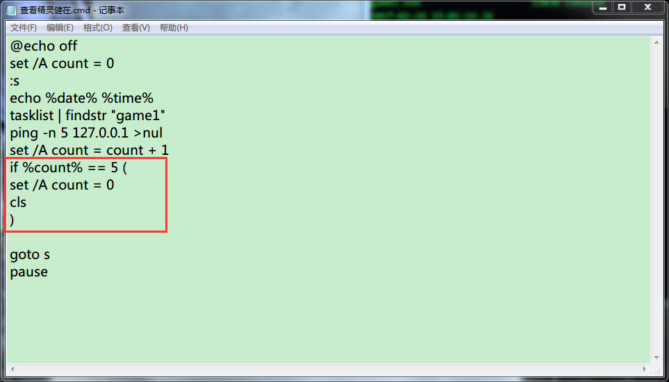

* 目录
    * [逻辑判断](#1) 
    * [变量赋值](#2)  
    * [if语句中执行多条命令](#3)  
    * [cmd输出空行与后台执行](#4)  
    * [cmd计算时间差](#5)  
    * [输出时间格式](#6)  


<h4 id="1">逻辑判断</h4>

if 语句里的换行

```
@echo off
echo %1
if "%1"=="ker" ( 
 echo kernel
 echo kernel2
 echo kernel3
) else (
 echo dtbc
 echo dtbc1
 echo dtbc2
 echo dtbc3
)
```

http://beikeit.com/post-333.html

1、判断驱动器、文件或文件夹是否存在，用 if exist 语句；   
2、判断某两个字符串是否相等，用 if "字符串1"=="字符串2" 语句；   
3、判断某两个数值是否相等，用 if 数值1 equ 数值2 语句；   
4、判断某个变量是否已经被赋值，用 if defined str 语句；   

if语句的完整格式是这样的：
```
if 条件表达式 (语句1) else (语句2)
```
它的含义是：  
如果条件表达式成立，那么，就执行语句1，  
否则，将执行语句2。 

对于以上四种情形，可以分别使用如下代码：  
1. if exist d:\test.txt (echo D盘下有test.txt存在) else (echo D盘下不存在test.txt)   
2. if "abc"=="xyz" (echo 字符串abc等于字符串xyz) else (echo 字符串abc不等于字符串xyz)   
3. if 1 equ 2 (echo 1等于2) else (echo 1不等于2)   
4. if defined str (echo 变量str已经被赋值，其值为%str%) else (echo 变量str的值为空) 

判断字符串是否相等的时候，if会区分大小写，比如，单纯的if语句会认为字符串abc和字符串Abc不相同，若不想区分大小写，则需要添加 /i 开关，使用 if /i "字符串1"=="字符串2" 的格式；另外，等于符号是连续的"=="而非单独的"="。 

判断两个数值之间的大小关系，除了等于用equ之外，还有其他的关系符号，所有适用于if语句的关系符号见下表： 

| 中文含义 | 关系符 | 英文解释 |  
| ---- | ---- | ---- |
| 等于 | equ | equal |  
| 大于 | gtr | greater than |  
| 大于或等于 | geq | greater than or equal |  
| 小于 | lss | less than |  
| 小于或等于 | leq | less than or equal |  
| 不等于 | neq | no equal |  

if语句还有一个精简格式：if 条件表达式 语句，它的含义是：如果条件表达式成立，将执行语句，否则，什么也不做

<h4 id="2">变量赋值</h4>

http://blog.csdn.net/wuqinfei_cs/article/details/9331869

参看set /?的帮助即可

在 SET 命令中添加了两个新命令行开关:

    SET /A expression
    SET /P variable=[promptString]

/A 命令行开关指定等号右边的字符串为被评估的数字表达式。  
/P 命令行开关允许将变量数值设成用户输入的一行输入。读取输入行之前，显示指定的 promptString。promptString 可以是空的。 

<h4 id="3">if语句中执行多条命令</h4>

在if语句的那一行后打左括号，后面换行来分割多条命令




<h4 id="4">cmd输出空行与后台执行</h4>

后台执行  
start /b  
采用此方式，cmd窗口可继续执行其他命令，同时有回显的会显示出来，但cmd窗口关闭后，程序会终止

echo输出空行  
http://www.jb51.net/article/30987.htm  
用echo输出空行至少有十种方法：  

```
echo= 
echo, 
echo; 

echo+ 
echo/ 
echo[ 
echo] 

echo: 
echo. 
echo\ 
pause 
```

这十种方法可以分为三组，每组的效率依次递减


<h4 id="5">cmd计算时间差</h4>

http://conducer.blog.51cto.com/841262/1377650

```
@echo off
set a=%time%
echo.
echo 开始时间：%a%
rem ===============插入代码段或调用脚本====================
ping -n 3 127.0.0.1
rem ===============插入代码段或调用脚本====================
set b=%time%
echo.
echo 结束时间：%b%
echo.
set /a h1=%a:~0,2%
set /a m1=1%a:~3,2%-100
set /a s1=1%a:~6,2%-100
set /a h2=%b:~0,2%
set /a m2=1%b:~3,2%-100
set /a s2=1%b:~6,2%-100
if %h2% LSS %h1% set /a h2=%h2%+24
set /a ts1=%h1%*3600+%m1%*60+%s1%
set /a ts2=%h2%*3600+%m2%*60+%s2%
set /a ts=%ts2%-%ts1%
set /a h=%ts%/3600
set /a m=(%ts%-%h%*3600)/60
set /a s=%ts%%%60
echo 耗时%h%小时%m%分%s%秒
pause >nul
exit 
```

<h4 id="6">输出时间格式</h4>

```
取年份： echo %date:~0,4% 
取月份： echo %date:~5,2% 
取日期： echo %date:~8,2% 
取星期： echo %date:~10,6% 
取小时： echo %time:~0,2% 
取分钟： echo %time:~3,2% 
取秒  ： echo %time:~6,2% 
取毫秒： echo %time:~9,2%
```
