### 官网  

docker 镜像  
https://hub.docker.com/r/grafana/grafana

官方文档  
https://grafana.com/docs/grafana/latest/

插件下载, zabbix数据源就是插件形式而非内置  
https://grafana.com/grafana/plugins/


### 几个手册性质的网站

grafana Transform 功能文档  
https://grafana.com/docs/grafana/v9.0/panels/transform-data/transformation-functions/


<br>
<br>

* [目录](#0)
  * [grafana--样式参考](#1)
  * [grafana--zabbix数据源--时间戳不一致情景下数据合并](#2)
  * [grafana--降序的阈值对应不同颜色](#3)
  * [grafana--时间范围的两个功能的应用](#4)
  * [grafana--通过自定义变量实现下拉筛选菜单](#5)
  * [grafana--计算项](#6)
  * [grafana--重新指定field的文字显示的几种方式](#7)


<h3 id="1">grafana--样式参考</h3>

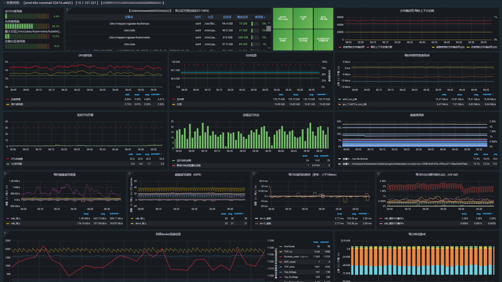

<h3 id="2">grafana--zabbix数据源--时间戳不一致情景下数据合并</h3>

效果图参照以下链接内容进行的对标:  
https://www.dounaite.com/article/62626709f86aba5c78840ea8.html

其他参考资料:  

Transform data  
https://grafana.com/docs/grafana/latest/panels/transform-data/

How to best organize your teams and resources in Grafana  
https://grafana.com/blog/2022/03/14/how-to-best-organize-your-teams-and-resources-in-grafana/

Table Panel  
https://docs.huihoo.com/grafana/2.6/reference/table_panel/index.html

grafana结合zabbix数据对其他Pannel设置学习  
http://www.51niux.com/?id=239

最终它的效果图如下:

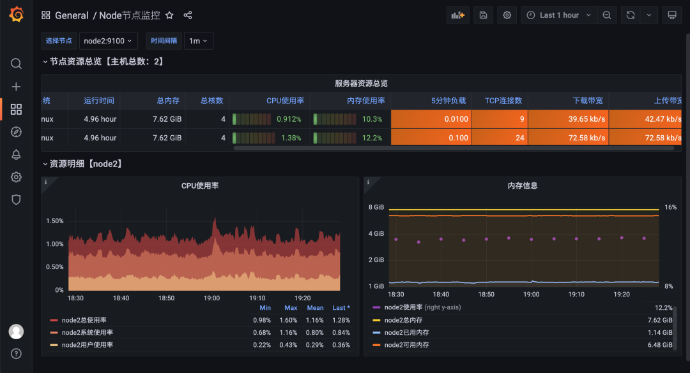

由于它的数据源是Prometheus, 且数据的时间戳是一致的, 所以它用到 ```Transform``` 里的 ```Merge``` 就完成了多项数据项的合并.  
grafana 会因为相同的时间戳, 将字段拼接到一个结果中.  
正如 grafana Transform 功能文档 (本文档顶部链接) 所示:

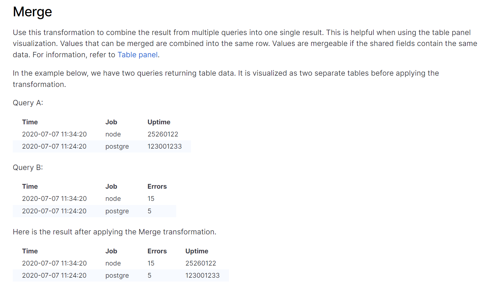

关于目标效果的背景描述

1) 数据源是zabbix  
2) 期望的效果是第一眼能看到关注的重点数据, 只求最新的状态值, 不要求详细变化趋势  
3) 详细的数据变化趋势可以在下方或子页面的形式呈现  
4) 出于种种原因, 各项指标的时间戳还并非大体一致的. 也就是一个指标一个时间戳, 非常普遍  

基于以上背景, 参考了```grafana Transform 功能文档``` 的介绍  
摸索出在此情景下的变通实现相似效果的方法  

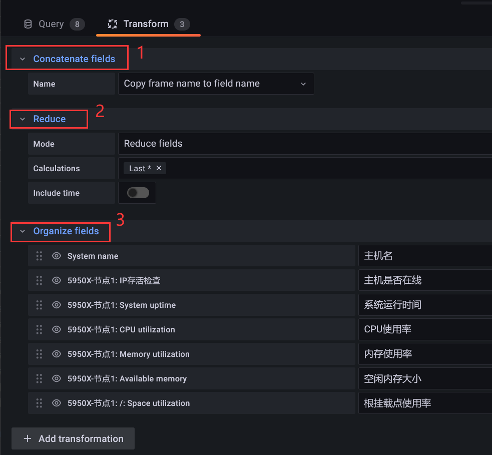

依次是:  
1) 创建 ```Table``` 类型的面板  
2) ```Concatenate fields``` 实现拼接字段  
3) ```Reduce``` 减少记录行数, 只保留最新的一条数据--否则是按时间戳顺序都列出来. 注意: 这里还需要选择```mode``` 为 ```Reduce fields```  
4) ```Organize fields``` 组织字段, 实现对字段的重命名以及自由拖拽排序功能.  

需要说明的是, 由于时间戳的不一致, 不能有效```Merge```  
而 ```Concatenate fields``` 只能做的是无脑连接字段.  
在此情景下, 想要一台主机上的信息以一行显示, 多个主机多行显示, 其实是采取的变通方式, 每台主机创建了一个panel, 
除了表头的panel 两行宽度以显示表头以外, 剩余都只有一行宽度, 且隐藏表头.  
有自欺欺人之嫌, 但外观至少看起来基本一致了.

最终效果图


<h3 id="3">grafana--降序的阈值对应不同颜色</h3>

升序的阈值对应不同颜色, 很简单, 拿来就用.  
但如果犯过来, 低于某个值, 就以一种不同的颜色显示, grafana 能否实现和如何实现?

https://github.com/grafana/grafana-polystat-panel/issues/46

答案原来很简单, 其实思维逆向一下就好

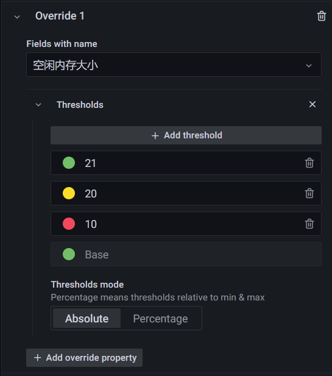

<h3 id="4">grafana--时间范围的两个功能的应用</h3>

grafana 提供了两个跟时间有关的功能:

- time range 时间范围
- time shift 时间偏移

在面板右上方的是统一的, 全局的时间范围设置

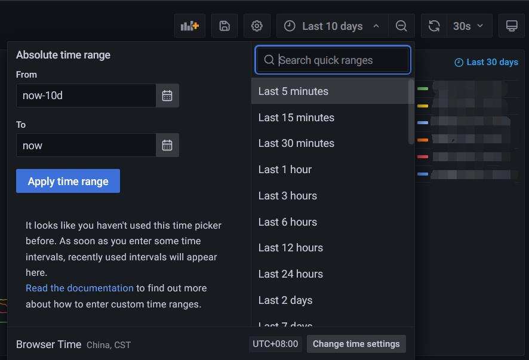

可以手动选择5,15,30分钟等  
也可以手动输入 now-10d 这样的形式

但存在某些希望在同一面板上, 不同的图表, 采用不同的时间范围来呈现的需求.

这个时候需要对单个图表的 time range 做设置, grafana的历史版本如下:

https://blog.csdn.net/qq_35981283/article/details/77427959  

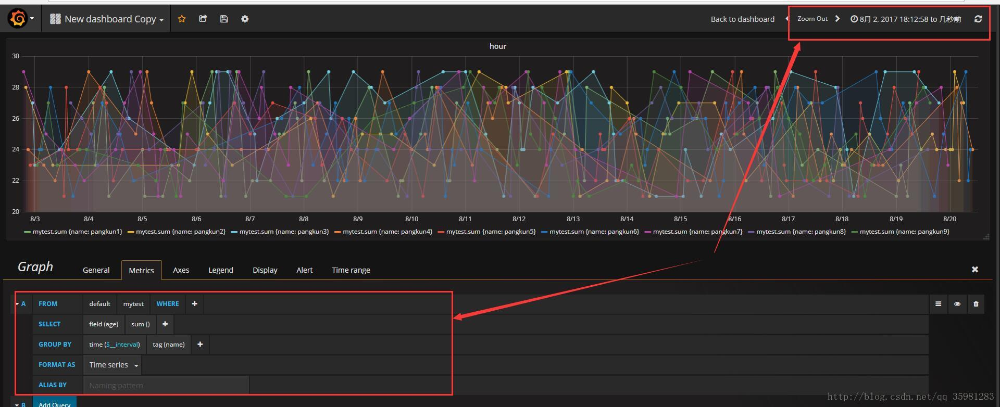

在 grafana 8.x, 9.x 设置的位置如下, 设置 Relative time:

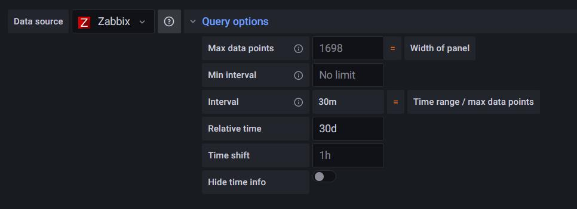

最终效果:

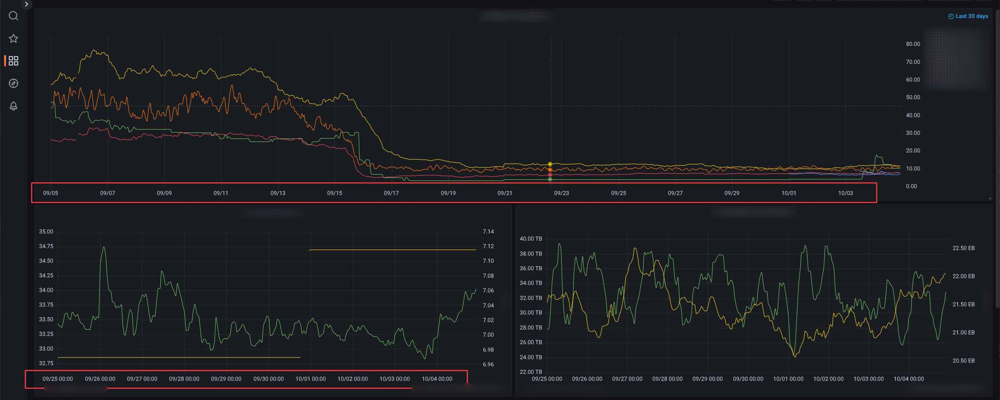

##### time shift 的作用

time shift 时间偏移, 与时间范围呈现时间跨度的调整作用不同, 它是通过对查询数据源设置了偏移量, 来达到更改原本查询时间范围的目的.

例如: 原本显示时间范围最近24小时, 时间偏移设置为了10天, 那么它是取的10天前的, 一天范围内的数据, 但是在图表上呈现的时间, 依然显示为最近24小时.

<h3 id="5">grafana--通过自定义变量实现下拉筛选菜单</h3>

先上效果图

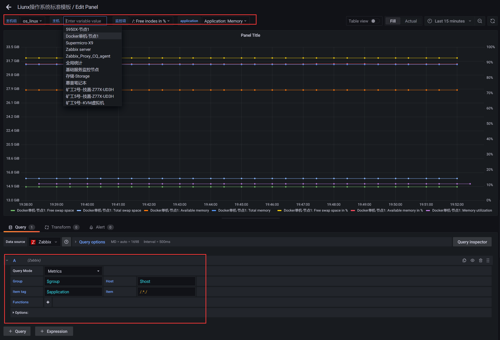

在顶部出现的几个筛选下拉框就是借由 dashboard 自定义变量实现的.

操作步骤:

http://www.sunrisenan.com/docs/zabbix/zabbix-1b406nmt2s6tm

但文中的grafana版本应是 7.0 及以前, 在 grafana 8.x 和 9.x 已有变化

https://github.com/alexanderzobnin/grafana-zabbix/issues/1261  

在以上帖子的启发之下,琢磨出正解.

需要在dashboard设置创建以下几个变量, 如下图

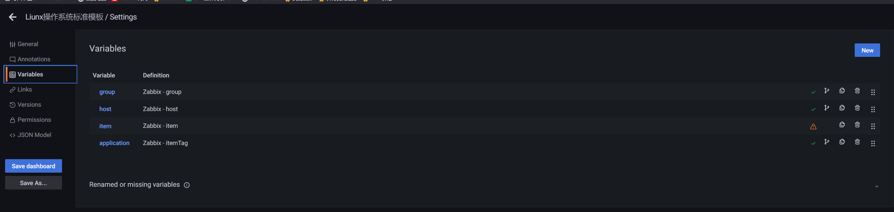

各自的设置依次如下:

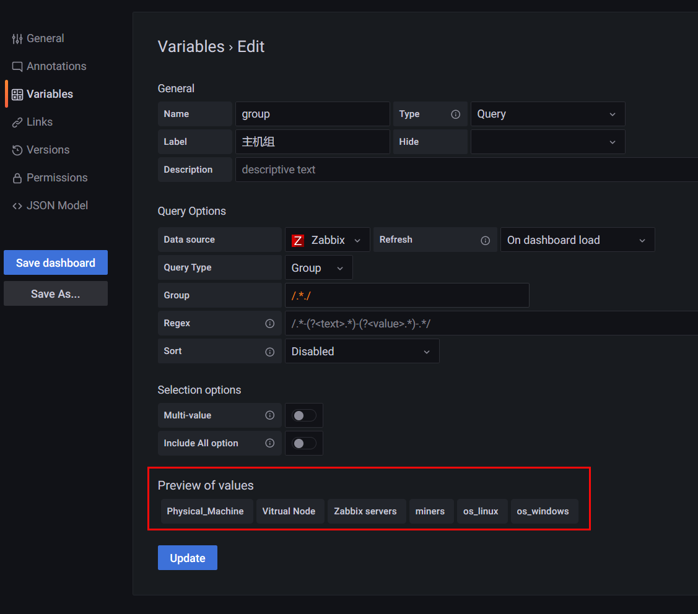

需要注意的是, 如果"Preview of values" 为 none 则意味着填写存在问题, 导致没有获取到查询结果

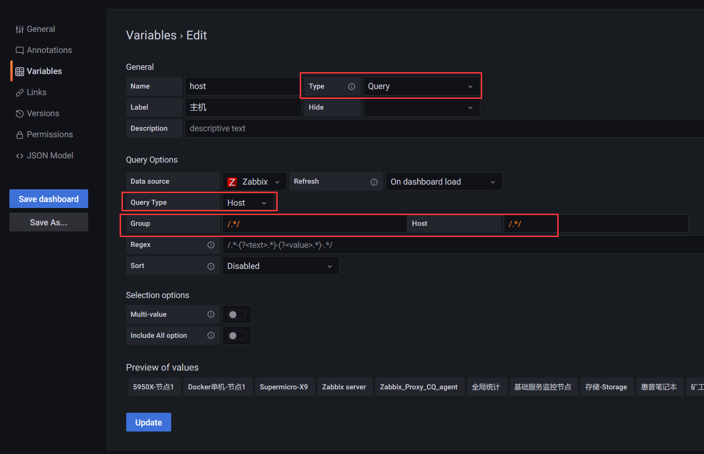

在 zabbix 里的 application 类别里, 对应 grafana 8.x 和 9.x 也有变化, 是靠 ```item tag``` 去查询的

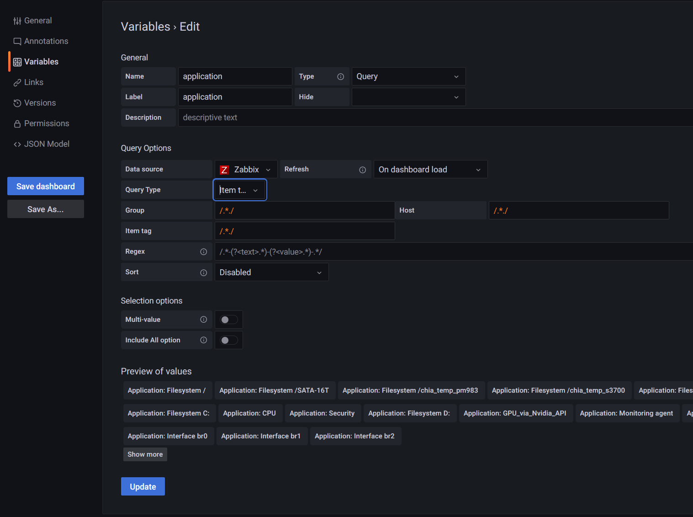

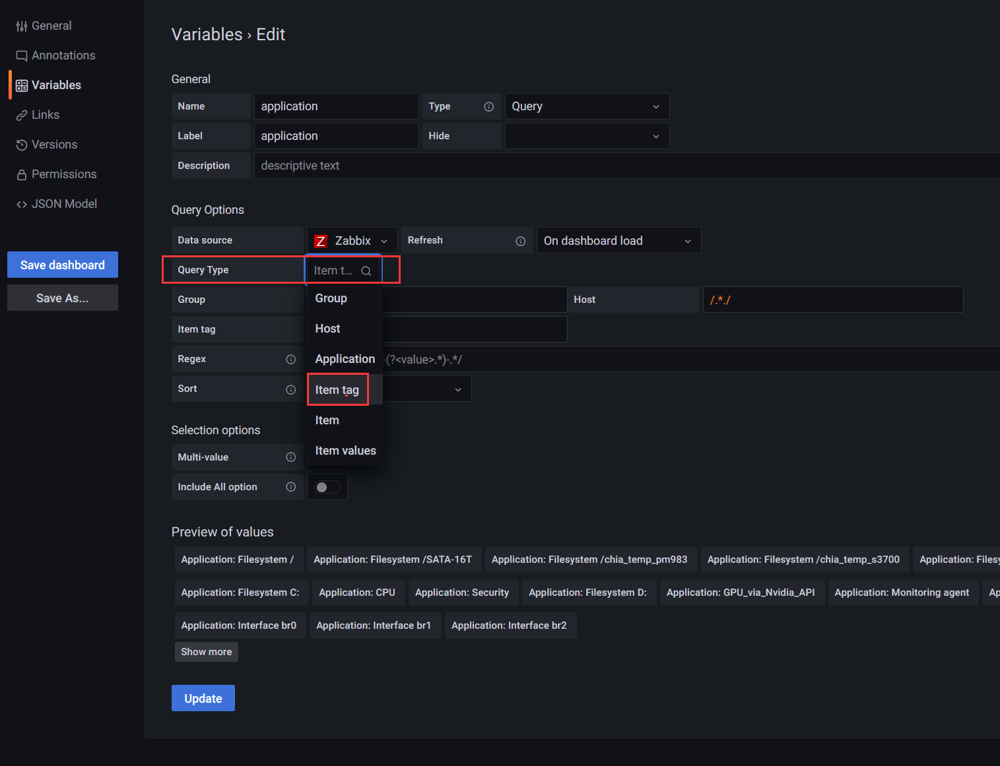

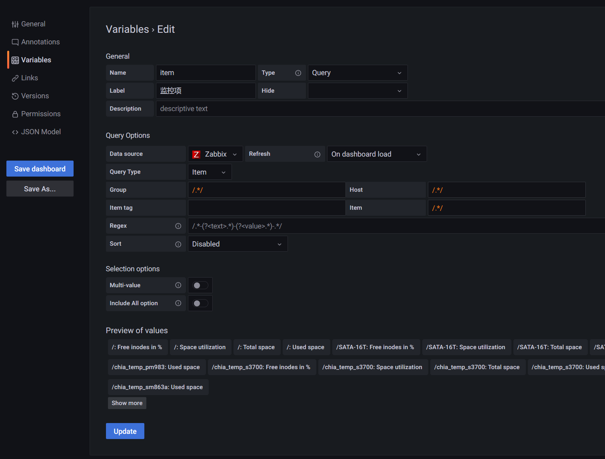

最终, 达到的效果就是在 dashboard 的顶部出现了4个下拉筛选框, 一套图表样式, 通过下拉选择可以呈现不同的对象的数据.


<h3 id="6">grafana--计算项</h3>

适用于不需要保留结果的展现项目

后端不管是zabbix 或 prometheus , 同样也支持自动计算得到的结果, 但需要入库存放.  
而如果是仅有实时呈现的需求, 而没有保留的需求, 使用grafana 的计算项则可以免除存放数据带来的开销问题.

https://blog.csdn.net/weixin_48421114/article/details/109455178

1 在Transform项中选取add field from calculation，可用做后面运算（±*/）

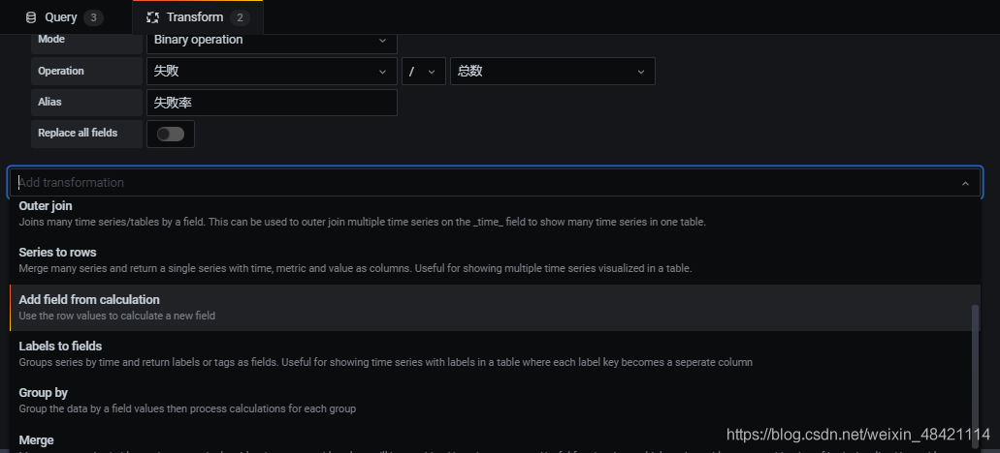

<br>

2 我因为是算成功率和失败率，即需使用/运算。失败率和成功率如下选择添加

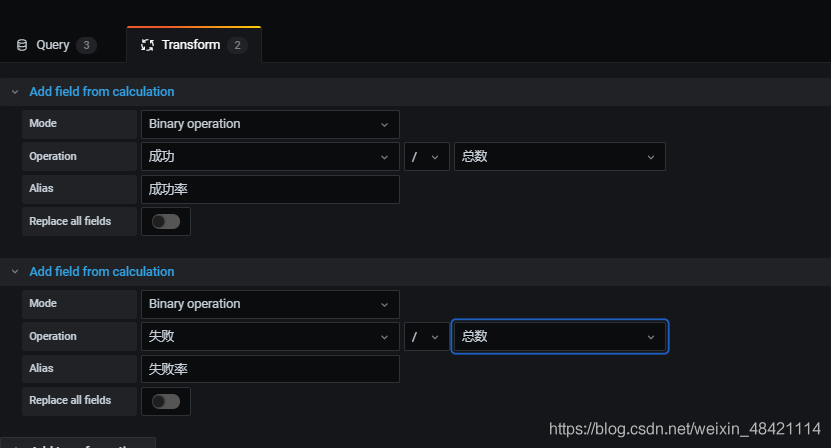

<br>

3 可添加项选择filter by name，然后勾选你实际想要的换算后的新列名

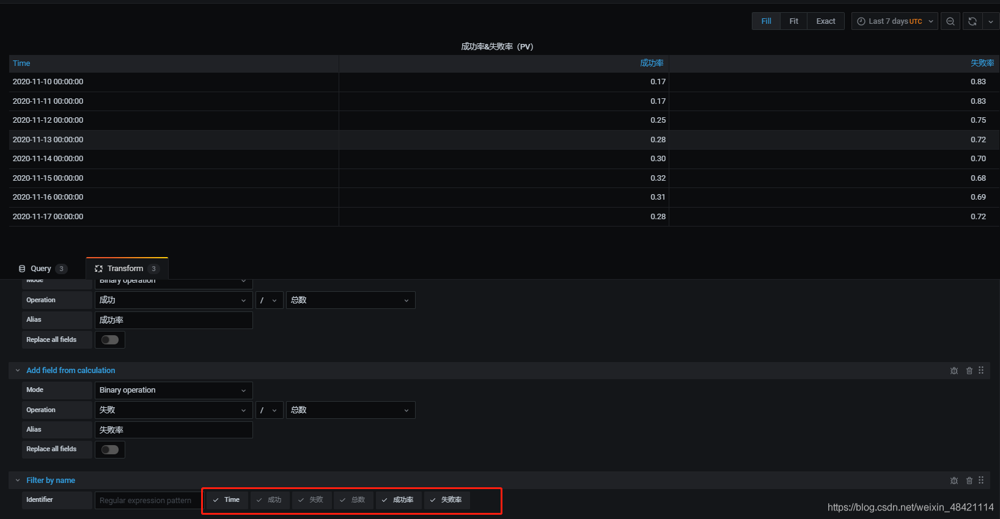


<h3 id="7">grafana--重新指定field的文字显示的几种方式</h3>

https://community.grafana.com/t/how-to-rename-values-in-grafana-using-regex-based-value-mapping/53616/2

这是方式一, 使用 ```transform``` 里的 ```Rename by regex```

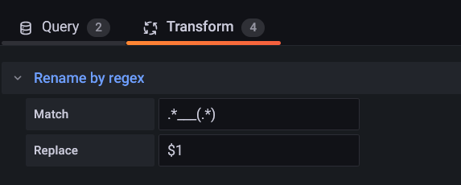

方式二, 在 ```query``` 这里使用 ```function```

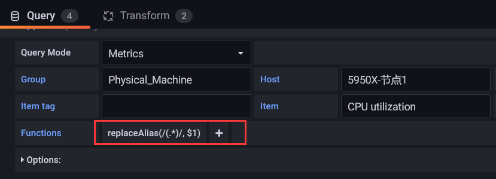

以上都是支持正则表达式, 分组引用注意是 ```$1 $2``` 的格式 
