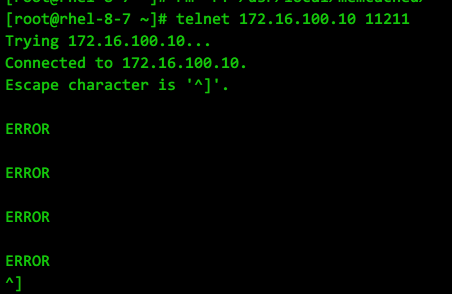
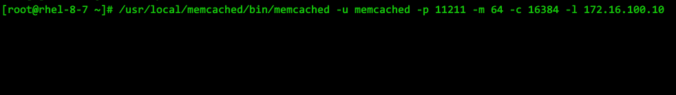

* [目录](#0)
  * [资源](#1)
  * [安装运行](#2)
  * [集群构建--未完成](#3)


<h3 id="1">资源</h3>

手册, 只找到个wiki  
https://github.com/memcached/memcached/wiki

常用命令  
https://www.runoob.com/memcached/memcached-tutorial.html

<h3 id="2">安装运行</h3>

Linux平台, 编译安装, 官网实际给的步骤就是这么几步

```
wget http://memcached.org/latest
tar -zxvf memcached-1.x.x.tar.gz
cd memcached-1.x.x
./configure && make && make test && sudo make install
```

但实际可能会遇到以下

```
checking for libevent directory... configure: error: libevent is required.  You can get it from https://www.monkey.org/~provos/libevent/

      If it's already installed, specify its path using --with-libevent=/dir/
```

所以前置依赖有以下

```
yum -y install gcc make libevent-devel
```

另外, make阶段还有

```
/bin/sh: line 3: prove: command not found
make: *** [test] Error 127
```

~~解决办法~~

```
# 这个不对
yum -y install perl-Test-Harness
```

~~但即便如此, ```make test``` 还是有报错, 截取部分内容~~

```
t/extstore.t ................ Can't locate Test/More.pm in @INC (you may need to install the Test::More module) (@INC contains: /usr/local/lib64/perl5 /usr/local/share/perl5 /usr/lib64/perl5/vendor_perl /usr/share/perl5/vendor_perl /usr/lib64/perl5 /usr/share/perl5) at t/extstore.t line 5.
BEGIN failed--compilation aborted at t/extstore.t line 5.
t/extstore.t ................ Dubious, test returned 2 (wstat 512, 0x200)
No subtests run 

...

t/whitespace.t            (Wstat: 512 Tests: 0 Failed: 0)
  Non-zero exit status: 2
  Parse errors: No plan found in TAP output
```

~~并且, 以上内容在~~  
~~RHEL 7.9 + gcc 4.8.5~~  
~~RHEL 8.7 + gcc 8.5.0~~  
~~上均相同出现~~  
~~还是不要 ```make test``` 这一步了,~~

这个才是对的  
https://github.com/memcached/memcached/issues/580

```
yum -y install perl-Test-Simple
```


实际执行

```
yum -y install gcc make libevent-devel perl-Test-Simple
wget --content-disposition http://memcached.org/latest
file_name=$(find ./ -name "memcached*.tar.gz" | head -n 1 | sed -e "s@^\./@@g" -e "s@.tar.gz@@")
tar -xvzf "$file_name".tar.gz
cd "$file_name"
./configure --prefix=/usr/local/memcached
make -j$(nproc)
make test
make install
```

创建 systemctl 的服务项

创建 /usr/lib/systemd/system/memcached.service 文件

```
[Unit]
Description=Memcached
After=network.target
[Service]
Type=simple
EnvironmentFile=-/etc/sysconfig/memcached
ExecStart=/usr/local/memcached/bin/memcached -u $USER -p $PORT -m $CACHESIZE -c $MAXCONN $OPTIONS
[Install]
WantedBy=multi-user.target
```

同时创建 /etc/sysconfig/memcached 文件  

```
PORT="11211"
USER="memcached"
MAXCONN="16384"
CACHESIZE="64"
OPTIONS="-l 0.0.0.0"
```

当前启动和开机自启动

```
systemctl daemon-reload
systemctl enable memcached --now
```

此时, 在主机端口可访问的前提, 服务已可被访问(注意监听地址的正确性)

特别需要注意的是, 关于memcached的客户端, 网上大多数文章都在说 telnet 或 nc即可, 我实测发现实在不明白如何做到的.  
至少我测试验证过的版本:  
memcached-1.4.39.tar.gz  
memcached-1.5.22.tar.gz  
memcached-1.6.23.tar.gz  
memcached-1.6.24.tar.gz  
OS版本也分别对应了:  
RHEL 7.9 + gcc 4.8.5  
RHEL 8.7 + gcc 8.5.0  
均出现以下情况:  



telnet 出现 "ERROR"

但此时查看server端, console 也无任何输出.



然而实际上server端是正常的, 以下是python使用客户端进行连接的示例

```
C:\Users\Administrator>pip install python-memcached
Looking in indexes: https://pypi.tuna.tsinghua.edu.cn/simple
Collecting python-memcached
  Downloading https://pypi.tuna.tsinghua.edu.cn/packages/8f/1b/3b15a37831ae34a264d7d5b71f3ae9fe74a81251453a3ec2135e76888ef1/python_memcached-1.62-py2.py3-none-any.whl (15 kB)
Installing collected packages: python-memcached
Successfully installed python-memcached-1.62

C:\Users\Administrator>python
Python 3.10.9 (tags/v3.10.9:1dd9be6, Dec  6 2022, 20:01:21) [MSC v.1934 64 bit (AMD64)] on win32
Type "help", "copyright", "credits" or "license" for more information.
>>> import memcached
Traceback (most recent call last):
  File "<stdin>", line 1, in <module>
ModuleNotFoundError: No module named 'memcached'
>>> import memcache
>>> memcache.Client(["172.16.100.20:11211"],debug=True)
<memcache.Client object at 0x000001876C887B20>
>>> client = memcache.Client(["172.16.100.20:11211"],debug=True)
>>> client.set("username","tlj",time=120)
True
>>> client.get("username")
'tlj'
>>>
```

由此可见, memcached 显然是不再允许 telnet 之类的明文传输方式继续连接, 网上的文章, 尤其还指明了 memcached 版本的, 实在不
明白是如何连接上的

其他客户端--没有找到在windows cmd下可用的客户端


<h3 id="3">集群构建--未完成</h3>

从网上现存文章来看, memcached 构建集群还要借助第三方工具来实现

google 有个项目, 但早在2010年也不再更新了  
https://code.google.com/archive/p/memagent/downloads
 
参考的文章如下:  
https://zhuanlan.zhihu.com/p/90558478

此文章还提供一些编译安装 magent 出现的问题的解决办法
https://blog.csdn.net/zhongbeida_xue/article/details/117038086

实际上 magent-0.6 的问题并不能解决, magent-0.5 安装成功

但缺少更准确可信的使用资料
