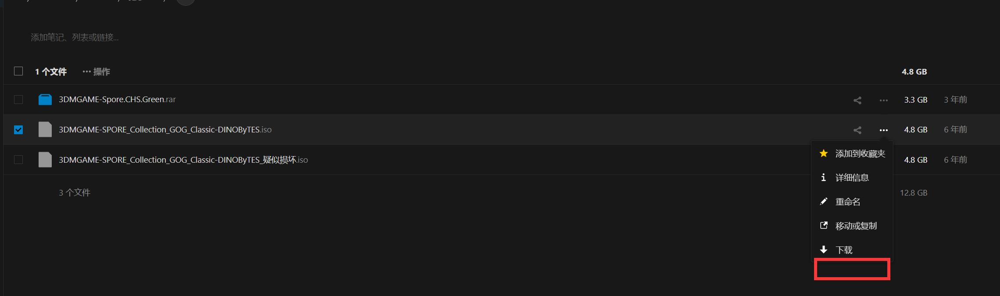
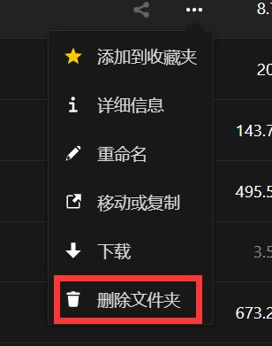
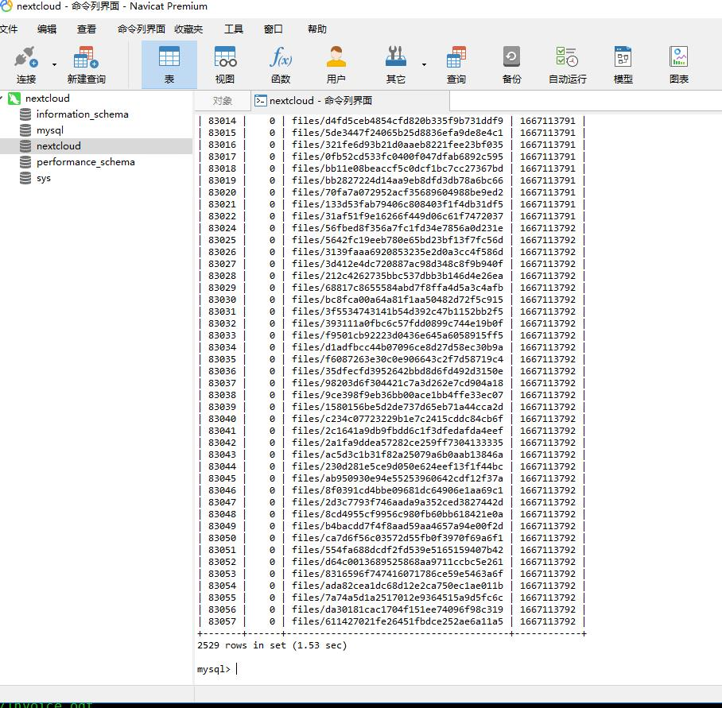

### 官网  
https://nextcloud.com/athome/  
https://nextcloud.com/install/#  

### 官方手册
https://docs.nextcloud.com/server/latest/user_manual/en/  
https://docs.nextcloud.com/server/latest/user_manual/zh_CN/  
https://doc.owncloud.com/server/next/admin_manual/configuration/server/occ_command.html  

### 入门手册  
https://support.websoft9.com/docs/nextcloud/zh/  
http://www.garfielder.com/post/990cc2cb.html  


* [目录](#0)
  * [config 可选参数](#5)
  * [新建用户首次登录的默认语言从英文改变到中文](#2)
  * [设置用户的密码复杂度策略](#3)
  * [用户的配额限制](#4)
  * [用户的默认时区](#5)
  * [NextCloud一直处于维护状态解决方法](#6)
  * [NextCloud客户端, 尽管登录url以https开头,但轮询url中没有](#7)
  * [上传 / 同步时出现413 Request Entity Too Large](#7)
  * [OCC 批量导入文件](#8)
  * [OCC 清理 "files_version" 和 "files_trashbin" 目录](#9)
  * [OCC 重建缓存](#10)
  * [无法删除/移动文件或文件夹的情况的处理](#11)
  * [误报存储满的问题](#12)


<h3 id="1">config 可选参数</h3>

出处:  
https://www.gooccoo.com/nextcloud/870/

防失效  
<a href="files/NextCloud config 配置参数.rar" target="_blank">NextCloud config 配置参数</a>

    
<h3 id="2">新建用户首次登录的默认语言从英文改变到中文</h3>

https://hostloc.com/thread-609835-1-1.html  
如此帖里提到的  
config/config.php
需要新增语句

```
'default_language' => 'zh',
```


如帖子中所说, 原本的zh_CN应是在nextcloud 新版中失效  
同时, 经过此设置后, 新增用户同样有报错, 但新用户数次登录后的确已变为中文.


<h3 id="3">设置用户的密码复杂度策略</h3>

管理员账户登录nextcloud, 从个人设置里"设置"导航到左侧"管理"部分里的"安全"  


<h3 id="4">用户的配额限制</h3>

https://help.nextcloud.com/t/custom-quota-option/54000/3  

  

以为是要改php代码等手段才能实现, 实际上, 官方论坛上的答复是, 你直接设置就可以了  
不过实测,nextcloud的管理员很多功能, 典型的如下拉列表等, 在chrome, firefox浏览器上都表现异常  
在opera浏览器上完成了该操作.

 

这里需要注意的是, 先在文本框输入你想限制的数值+单位, 待下方提示框出现后, 点击提示框的选择才可选择.  
如果输入完成直接回车, 则不会生效.  


<h3 id="5">新建用户登录的默认时区</h3>

https://docs.nextcloud.com/server/latest/admin_manual/configuration_server/language_configuration.html  
&nbsp;

locale从此处查得  
https://github.com/moment/moment/tree/2.18.1/locale  

&nbsp;

config/config.php
需要新增语句

```
"default_locale" => "zh-cn",
```

需要注意的是大小写 ```zh-cn```  
修改前  


修改后  

  

用户个人设置上虽然还是显示的美国, 但文件修改时间已显示为中文


<h3 id="6">NextCloud一直处于维护状态解决方法</h3>

https://blog.csdn.net/chenbetter1996/article/details/82831413  

主要修改的也是config/config.php，如果命令不行，直接修改该文件  
把'maintenance' => true 改为 false, 或者直接删掉这句  


<h3 id="7">NextCloud客户端, 尽管登录url以https开头,但轮询url中没有</h3>

https://docs.nextcloud.com/server/latest/admin_manual/configuration_server/reverse_proxy_configuration.html  
https://ld246.com/article/1631157051782  

以下场景限定:
1) nextcloud 自身没有启用 https 功能  
2) nextcloud 前端有一个nginx 的反向代理, 使用证书启用https (其他web服务器原理也相同)  
3) web页面访问nextcloud 服务正常, 但PC端会提示"尽管登录url以https开头,但轮询url中没有"  

之所以web页面能正常访问,因为之前 config.php 有配置

```
  'overwrite.cli.url' => 'http://192.168.1.30:999',
```

这里的值由nextcloud 初始化向导填入, 因为初始化时我使用浏览器访问的内部地址就是此地址

但当我需要PC客户端访问nextcloud 的地址时, 即使我加入了以下正确的配置语句

```
  'trusted_proxies'   => ['192.168.1.30'],
  'overwriteprotocol' => 'https',
  'overwritehost' => 'netdisk.heyday.net.cn:1000',
```

会出现服务反而不可用的情况, 因为 overwrite.cli.url 的存在会把客户端请求改写为 http  
而此时的 overwriteprotocol 又会改写为 https, 这一自相矛盾的设定即错误原因所在.

解决办法:
移除 ```'overwrite.cli.url' => 'http://192.168.1.30:999',``` 该语句


<h3 id="7">上传 / 同步时出现413 Request Entity Too Large</h3>

https://help.nextcloud.com/t/files-not-getting-synced-413-request-entity-too-large/45681

https://pieterbakker.com/error-413-on-large-file-uploads-with-nextcloud-behind-nginx-reverse-proxy/

常规原因是 nextcloud 的前端web服务器对于 ```max body``` 的设置不够

我选择的直接限制为0, 即不限制.

```
server {
    ...
    client_max_body_size 0;
}
```

但反馈也有设置此值, 而并非真正因为大小导致的错误, 待发现

<h3 id="8">OCC 批量导入文件</h3>

```
[root@docker ~]# docker exec -u 33 -it my_nextcloud /var/www/html/occ files:scan tanhuang
Starting scan for user 1 out of 1 (tanhuang)
+---------+-------+--------------+
| Folders | Files | Elapsed time |
+---------+-------+--------------+
| 910     | 10569 | 00:00:40     |
+---------+-------+--------------+
```

nextcloud 的 OCC 命令 位于 nextcloud 的网站根目录下
容器环境 和 编译 / rpm 安装的路径存在区别, 需要自己查找.


<h3 id="9">OCC 清理 "files_version" 和 "files_trashbin" 目录</h3>

发现 nextcloud 目录下似乎有不合理的空间占用

```
[root@docker ~]# du -sh /docker/nextcloud/data/tanhuang/*
28K	/docker/nextcloud/data/tanhuang/cache
4.0K	/docker/nextcloud/data/tanhuang/files
123M	/docker/nextcloud/data/tanhuang/files_trashbin
4.7G	/docker/nextcloud/data/tanhuang/files_versions
4.0K	/docker/nextcloud/data/tanhuang/uploads


[root@docker ~]# du -sh /docker/nextcloud/data/tanhuang/files_versions/*
3.8G	/docker/nextcloud/data/tanhuang/files_versions/Software
5.8M	/docker/nextcloud/data/tanhuang/files_versions/个人
230M	/docker/nextcloud/data/tanhuang/files_versions/工作资料
7.2M	/docker/nextcloud/data/tanhuang/files_versions/新旗舰.xlsx.v1652784184
7.2M	/docker/nextcloud/data/tanhuang/files_versions/新旗舰.xlsx.v1653485169
7.2M	/docker/nextcloud/data/tanhuang/files_versions/新旗舰.xlsx.v1653619020
7.2M	/docker/nextcloud/data/tanhuang/files_versions/新旗舰.xlsx.v1653628643
7.2M	/docker/nextcloud/data/tanhuang/files_versions/新旗舰.xlsx.v1653914578
7.2M	/docker/nextcloud/data/tanhuang/files_versions/新旗舰.xlsx.v1654089762
7.2M	/docker/nextcloud/data/tanhuang/files_versions/新旗舰.xlsx.v1654103194
7.2M	/docker/nextcloud/data/tanhuang/files_versions/新旗舰.xlsx.v1654149585
7.2M	/docker/nextcloud/data/tanhuang/files_versions/新旗舰.xlsx.v1654173954
7.2M	/docker/nextcloud/data/tanhuang/files_versions/新旗舰.xlsx.v1654409015
7.2M	/docker/nextcloud/data/tanhuang/files_versions/新旗舰.xlsx.v1654410121
7.2M	/docker/nextcloud/data/tanhuang/files_versions/新旗舰.xlsx.v1654420152
7.2M	/docker/nextcloud/data/tanhuang/files_versions/新旗舰.xlsx.v1654437700
7.2M	/docker/nextcloud/data/tanhuang/files_versions/新旗舰.xlsx.v1654439891
7.2M	/docker/nextcloud/data/tanhuang/files_versions/新旗舰.xlsx.v1654493737
7.2M	/docker/nextcloud/data/tanhuang/files_versions/新旗舰.xlsx.v1654530614
7.2M	/docker/nextcloud/data/tanhuang/files_versions/新旗舰.xlsx.v1654581910
7.2M	/docker/nextcloud/data/tanhuang/files_versions/新旗舰.xlsx.v1654606081
7.2M	/docker/nextcloud/data/tanhuang/files_versions/新旗舰.xlsx.v1654839854
7.2M	/docker/nextcloud/data/tanhuang/files_versions/新旗舰.xlsx.v1654958215
7.2M	/docker/nextcloud/data/tanhuang/files_versions/新旗舰.xlsx.v1654959470
```

官方论坛有讨论  

https://help.nextcloud.com/t/how-to-force-delete-of-versions-in-files-versions/87993

其中 smeijer 的回答已给出正解

> There is an occ command version:cleanup, which deletes all files in the files_versions directory. I use this on my home instance every now and then. However, this deletes the files for all users. I do not know how to run the command for a specific user only. Maybe in the doc this is further explained.

他所说的不知道针对单独用户进行清理, 其实也如下格式即可

```
[root@docker ~]# docker exec -u 33 -it my_nextcloud /var/www/html/occ version:cleanup tanhuang
Delete versions of   tanhuang
```

#### 清理 files_trashbin

```
[root@docker-node1 ~]# du -s -B 1G /docker/nextcloud/data/tanhuang/*
0	/docker/nextcloud/data/tanhuang/cache
0	/docker/nextcloud/data/tanhuang/files
50	/docker/nextcloud/data/tanhuang/files_trashbin
42	/docker/nextcloud/data/tanhuang/files_versions
1	/docker/nextcloud/data/tanhuang/uploads
[root@docker-node1 ~]# docker exec -u 33 -it my_nextcloud /var/www/html/occ version:cleanup tanhuang
Delete versions of   tanhuang
[root@docker-node1 ~]# du -s -B 1G /docker/nextcloud/data/tanhuang/*
0	/docker/nextcloud/data/tanhuang/cache
0	/docker/nextcloud/data/tanhuang/files
50	/docker/nextcloud/data/tanhuang/files_trashbin
1	/docker/nextcloud/data/tanhuang/uploads
```

同上清理 file_version

```
docker exec -u 33 -it my_nextcloud /var/www/html/occ trashbin:cleanup tanhuang
```

#### nextcloud 的参数里设置自动清理

https://blog.csdn.net/weixin_43598457/article/details/117367623

> 通过修改trashbin_retention_obligation参数为'auto,D'可自动清理超过D天的trashbin

我的示例

```
[root@docker-node1 ~]# cat /docker/nextcloud/var_www_html/config/config.php
<?php
$CONFIG = array (
  'htaccess.RewriteBase' => '/',
  'memcache.local' => '\\OC\\Memcache\\APCu',
  ……无关项省去……
  'quota_include_external_storage' => true,
  'trashbin_retention_obligation' => 'auto,60',
);
```

其中最后一条的 ```'trashbin_retention_obligation' => 'auto,60',``` 是新添加的

同理, file_version 也设置自动清理

https://docs.nextcloud.com/server/latest/admin_manual/configuration_files/file_versioning.html

```
  'trashbin_retention_obligation' => 'auto,60',
  'versions_retention_obligation' => 'auto,60',
```

<h3 id="10">OCC 重建缓存</h3>

https://help.nextcloud.com/t/how-can-i-recreate-regenerate-the-oc-filecache-table-solve-here-is-the-schema-for-oc-filecache/63395

在 nextcloud 存储挂载点有来自其他文件系统, 在我这个示例中是NFS, 并且是只读的, 所以没有"删除文件夹"按钮,如下: 





正确的解决方法 OCC files:scan 同样也能重建, -vvv 显示详细过程

```
occ files:scan --all -vvv
```


<h3 id="11">无法删除/移动文件或文件夹的情况的处理</h3>

http://sinoll.com/blog/view?id=132

浏览器页面右上角 错误提示如下: 


文件权限问题已排除, 同时也不涉及 ```mount -bind``` 挂载方式的问题.

仅使用 ```occ files:scan``` 也不能解决问题

在我的案例中为数据库中用于记录文件锁的表有相应记录导致

查询可知确实有大量记录存在, 如下所示




按照文章介绍的3步操作即解决问题:

1) occ maintenance:mode --on  将nextcloud进入维护模式  
2) 从nextcloud所在数据库删除锁记录 ```DELETE FROM oc_file_locks WHERE 1```  
3) occ maintenance:mode --off 退出维护模式  


<h3 id="12">误报存储满的问题</h3>

https://www.coder17.com/posts/nextcloud-storage-full/

帖子原文

> 在 Nextcloud 数据目录下 mount 其他位置的存储时，会误报存储已满。

> 问题原因在于统计文件大小时会将外部存储和被共享文件全部计入，而统计总容量时不计算外部存储和 mount 的其他位置。

找到 nextcloud 的 config/config.php,

默认位置是:  
/var/www/html/config/config.php


添加的参数

```
  'quota_include_external_storage' => true,
```

片段示例

```
  'installed' => true,
  'defaultapp' => 'files',
  'loglevel' => 0,
  'maintenance' => false,
  'quota_include_external_storage' => true,
```

帖子原文

> 设置后当前用户不再提示存储满，但如果此用户分享文件给其他用户，则被分享用户访问时仍会提醒文件 owner 的存储满。

> 此外，即使 UI 上不提示，但 Nextcloud 内部的判定依然是存储满，因此 File Versioning 会因为空间不足而不工作，目前没有找到解决方法。因此不推荐层叠 mount 方式存储。
