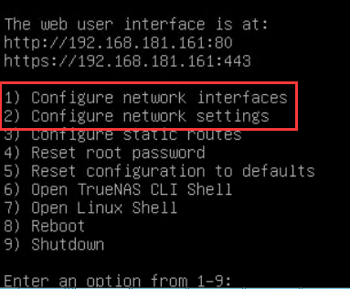
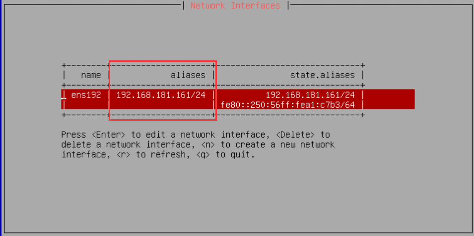
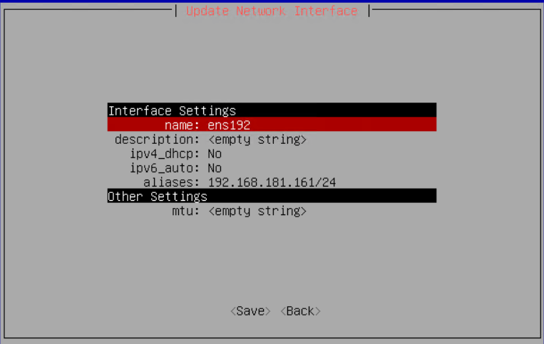
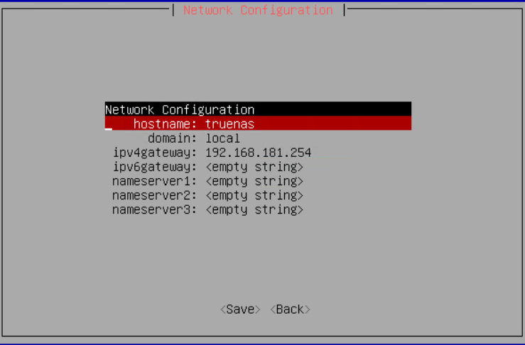

### 官网
前身就是freeNAS, 底层技术是ZFS, 如果了解ZFS, 上手就应该比较轻松  
https://www.truenas.com/truenas-scale/

### 官方手册
https://www.truenas.com/docs/ 

### 入门手册  
https://post.smzdm.com/p/a6d8m6vg/


* [目录](#0)
  * [初始化配置IP地址](#1)
  * [NFS客户端不能chmod的问题](#2)


<h3 id="1">初始化配置IP地址</h3>

网上一大堆说废话的, 要么是DHCP获取的, 要么就是不同版本的,菜单略有不同, 且通过命令行配置的.

这里提及的安装介质为  
```TrueNAS-SCALE-22.02.4.iso```

系统安装完成以后, 配置静态IP有两个菜单要进入:



第一个是设置IP, 注意是有掩码



只需要在 aliases处 填入IP, state.aliases 是自动生成的



第二个是配置网关



此后即完成, IP已可使用

<h3 id="2">NFS客户端不能chmod的问题</h3>

https://www.truenas.com/community/threads/cannot-chmod-nfs-operation-not-permitted.97247/

回复里面的这句

> Set the zfs aclmode on the dataset in question to "passthrough".

原因也就是 TrueNAS 默认启用的ACL 是 POSIX

改成如下,是可行的选择

下图是在"存储", "数据集"的"编辑选项" 中  
如果是有子数据集的情形, 父数据集虽然做了该设置, 但不会递归传递给子数据集, 在UI上有提示.


另外, 如果NFS共享, 希望暴露root权限给客户端, 则在NFS共享上还需设置mapuser  
该数据集的所有者是TrueNAS系统的root用户


此处涉及NFS的基本概念, 需要对NFS本身有足够了解.  
NFS本身不提供用户认证, 由操作系统完成.
