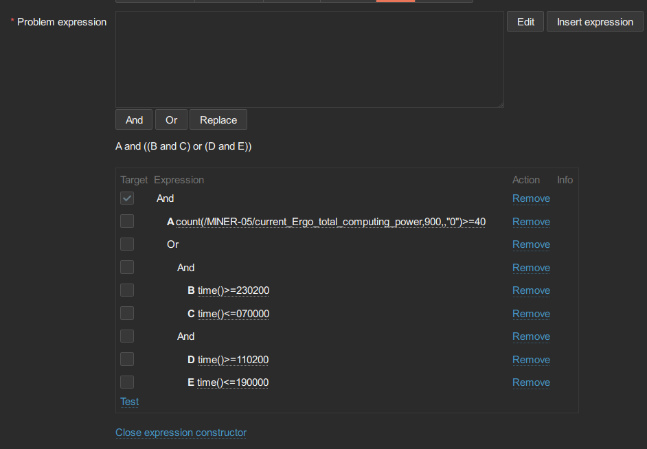

### 官网  

下载页  
https://www.zabbix.com/download

agent  
https://www.zabbix.com/download_agents

repo  
https://repo.zabbix.com/zabbix/

Zabbix on ARM64 Ubuntu  
https://repo.zabbix.com/zabbix/6.0/ubuntu-arm64/pool/main/z/zabbix/

docker 镜像  
https://hub.docker.com/r/zabbix/zabbix-server-mysql/tags  
https://hub.docker.com/r/zabbix/zabbix-web-nginx-mysql/tags?page=1

插件库  
https://www.zabbix.com/integrations

### 几个手册性质的网站

官网手册  
https://www.zabbix.com/documentation/6.0/zh/manual


* [目录](#0)
  * [py-zabbix的调试](#1)
  * [设定zabbix 触发器的生效时间](#2)


<h3 id="1">py-zabbix的调试</h3>

```
import sys
import logging
from pyzabbix import ZabbixAPI

stream = logging.StreamHandler(sys.stdout)
stream.setLevel(logging.DEBUG)
log = logging.getLogger('pyzabbix')
log.addHandler(stream)
log.setLevel(logging.DEBUG)

<py-zabbix 进行 send 的业务代码>
```


<h3 id="2">设定zabbix 触发器的生效时间</h3>

背景:  
使用"维护时段"并不能很好达到预期的效果.
"维护时段" 是推迟了发送告警消息的时间, 但事件本身是产生了的, 而事件恢复从而清除告警也需要时间才满足条件.  
真正能达到控制效果的是要在告警事件的生成上加上时段限定的条件.

https://blog.51cto.com/lwops/2440226

示例:

```
count(/MINER-05/current_Ergo_total_computing_power,900,,"0")>=40 and 
  (
    (time()>=230200 and time()<=070000) or 
    (time()>=110200 and time()<=190000)
  )
```

排版是为了容易阅读理解层次关系, 在zabbix触发器表达式内需按照它支持的格式书写.
230200 之类的都是时间格式, HHMMSS 的格式


zabbix 的表达式构造器是个不错辅助工具.  
它用了更可视化的形式呈现了你书写出来的层次关系.


