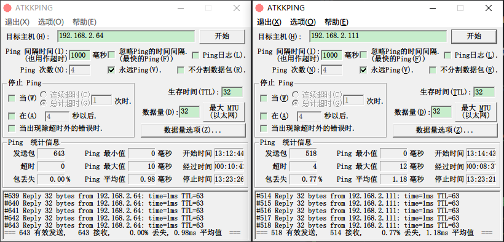

* [目录](#0)
  * [虚拟机启停等日常命令](#1)
  * [虚拟机快照类命令](#2)
  * [KVM运行环境的安装](#3)
  * [删除默认的virbr0, 并新建一个网桥用于KVM虚拟机的桥接网络](#4)
  * [创建NAT类型网桥](#5)
  * [基于bond的KVM网桥](#12)
  * [KVM虚拟机控制台连接的方式](#6)
  * [KVM克隆虚拟机](#7)
  * [qemu-img 的几个相关用法](#8)
  * [光驱相关](#9)
  * [virtio 模式下安装Windows操作系统](#10)
  * [磁盘的热添加/删除](#11)
  * [有关qcow2文件大小/压缩问题的进一步展开](#12)


<h3 id="1">虚拟机启停等日常命令</h3>

https://bynss.com/linux/520925.html  
https://access.redhat.com/documentation/en-us/red_hat_enterprise_linux/7/html/virtualization_deployment_and_administration_guide/sect-managing_guest_virtual_machines_with_virsh-shutting_down_rebooting_and_force_shutdown_of_a_guest_virtual_machine

```
# 启动虚拟机
virsh start 虚拟机名称

# 查看当前正在运行的虚拟机
virsh list

# 查看所有虚拟机, 包括停止的
virsh list --all

# 保存虚拟机内存状态并停止虚拟机
virsh save 虚拟机名称 保存点名称

# 还原虚拟机--使用virsh save的保存点
virsh restore 保存点名称

# 重启虚拟机
virsh reboot 虚拟机名称

# 挂起/暂停虚拟机
virsh suspend 虚拟机名称

# 恢复挂起/暂停的虚拟机
virsh resume 虚拟机名称

# 停止活动的虚拟机--destroy并不是删除虚拟机
virsh shutdown <虚拟机名称> --mode acpi  # 软关机 
virsh destroy 虚拟机名称  # 强制


# 停止活动的虚拟机--等待虚拟机事务自行结束
virsh destroy 虚拟机名称 --graceful

# 关闭虚拟机
virsh shutdown 虚拟机名称

# 输出虚拟机的配置定义文件
virsh dumpxml 虚拟机名称

# 输出虚拟机的配置定义文件, 重定向到文件
virsh dumpxml 虚拟机名称 > 文件名称.xml

# 从XML文件创建虚拟机
virsh create 文件名称.xml

# 编辑虚拟机 XML 配置文件--这是编辑的虚拟机的配置文件, 不是导出的副本; 
# 编辑器取决于你的$EDITOR 变量设置
virsh edit 虚拟机名称

# 把虚拟机设为开机自启动
virsh autostart 虚拟机名称

# 取消开机自启动
virsh autostart --disable 虚拟机名称

# 查看已设置了开机自启动的虚拟机
ll /etc/libvirt/qemu/autostart/
```

##### 临时性命令

```
暂时禁用虚拟机网卡, 等效于vmware平台上取消勾选网卡连接状态
virsh domif-setlink <domain> vnet0 down
其中<domain>替换为你的虚拟机名或ID，vnet0替换为实际的网络接口名。


查看一个虚拟机有哪些实际的网络接口名
virsh domiflist <domain>

例如
[root@CQ-KVM-03 ~]# virsh domiflist fortress-CQ-01 
 Interface   Type     Source   Model    MAC
-----------------------------------------------------------
 vnet4       bridge   br0      virtio   52:54:00:8e:e3:7c
```

##### virt-install --os-variant 可选值

```
osinfo-query os

# machine 的可选type
[root@X9DRi-LN4F ~]# /usr/libexec/qemu-kvm -machine help
Supported machines are:
pc                   RHEL 7.6.0 PC (i440FX + PIIX, 1996) (alias of pc-i440fx-rhel7.6.0)
pc-i440fx-rhel7.6.0  RHEL 7.6.0 PC (i440FX + PIIX, 1996) (default)
pc-i440fx-rhel7.5.0  RHEL 7.5.0 PC (i440FX + PIIX, 1996)
pc-i440fx-rhel7.4.0  RHEL 7.4.0 PC (i440FX + PIIX, 1996)
pc-i440fx-rhel7.3.0  RHEL 7.3.0 PC (i440FX + PIIX, 1996)
pc-i440fx-rhel7.2.0  RHEL 7.2.0 PC (i440FX + PIIX, 1996)
pc-i440fx-rhel7.1.0  RHEL 7.1.0 PC (i440FX + PIIX, 1996)
pc-i440fx-rhel7.0.0  RHEL 7.0.0 PC (i440FX + PIIX, 1996)
q35                  RHEL-8.6.0 PC (Q35 + ICH9, 2009) (alias of pc-q35-rhel8.6.0)
pc-q35-rhel8.6.0     RHEL-8.6.0 PC (Q35 + ICH9, 2009)
pc-q35-rhel8.5.0     RHEL-8.5.0 PC (Q35 + ICH9, 2009)
pc-q35-rhel8.4.0     RHEL-8.4.0 PC (Q35 + ICH9, 2009)
pc-q35-rhel8.3.0     RHEL-8.3.0 PC (Q35 + ICH9, 2009)
pc-q35-rhel8.2.0     RHEL-8.2.0 PC (Q35 + ICH9, 2009)
pc-q35-rhel8.1.0     RHEL-8.1.0 PC (Q35 + ICH9, 2009)
pc-q35-rhel8.0.0     RHEL-8.0.0 PC (Q35 + ICH9, 2009)
pc-q35-rhel7.6.0     RHEL-7.6.0 PC (Q35 + ICH9, 2009)
pc-q35-rhel7.5.0     RHEL-7.5.0 PC (Q35 + ICH9, 2009)
pc-q35-rhel7.4.0     RHEL-7.4.0 PC (Q35 + ICH9, 2009)
pc-q35-rhel7.3.0     RHEL-7.3.0 PC (Q35 + ICH9, 2009)
none                 empty machine
```

<h3 id="2">虚拟机快照类命令</h3>

https://www.cnblogs.com/liucx/p/11777336.html  

创建磁盘快照  

````shell
# 创建磁盘快照
virsh snapshot-create-as \
--domain CentOS7 \
--name snap-test1 \
--description "URL: www.test.com"
````

--domain 虚拟机名称  
--name 快照名称  
--description 描述,可选项  
<br>
<br>

列出虚拟机快照  

```shell
# 创建磁盘快照  
virsh snapshot-list 虚拟机名称
```
<br>
<br>

删除虚拟机快照  

```
virsh snapshot-delete 虚拟机名称(支持id,uuid) --snapshotname 快照名称
```

其余选项  

```
[root@3700X vm]# virsh snapshot-delete --help
  NAME
    snapshot-delete - Delete a domain snapshot

  SYNOPSIS
    snapshot-delete <domain> [--snapshotname <string>] [--current] [--children] [--children-only] [--metadata]

  DESCRIPTION
    Snapshot Delete

  OPTIONS
    [--domain] <string>  domain name, id or uuid
    --snapshotname <string>  snapshot name
    --current        delete current snapshot
    --children       delete snapshot and all children
    --children-only  delete children but not snapshot
    --metadata       delete only libvirt metadata, leaving snapshot contents behind
```
<br>
<br>

保存虚拟机状态  
```
virsh save --bypass-cache 虚拟机名称(支持id,uuid) 内存状态保存文件位置 --running
```
其中--running和--paused 是2选1的可选参数, 用于指定恢复后的虚拟机是运行还是暂停状态

其余选项  

```
[root@3700X vm]# virsh save --help
  NAME
    save - save a domain state to a file

  SYNOPSIS
    save <domain> <file> [--bypass-cache] [--xml <string>] [--running] [--paused] [--verbose]

  DESCRIPTION
    Save the RAM state of a running domain.

  OPTIONS
    [--domain] <string>  domain name, id or uuid
    [--file] <string>  where to save the data
    --bypass-cache   avoid file system cache when saving
    --xml <string>   filename containing updated XML for the target
    --running        set domain to be running on restore
    --paused         set domain to be paused on restore
    --verbose        display the progress of save
```

对应的恢复命令是  

```
virsh snapshot-revert 虚拟机名称 快照名称

# 快照文件的默认位置
# /var/lib/libvirt/qemu/snapshot
```

#### 删除快照失败的一种场景

创建快照时是加上了 ```--disk-only``` 参数

```
[root@5950x-node1 ~]# virsh snapshot-create-as kvm_host_simulator test --disk-only 
Domain snapshot test created
[root@5950x-node1 ~]# virsh snapshot-list kvm_host_simulator
 Name   Creation Time               State
---------------------------------------------------
 test   2024-03-26 09:36:04 +0800   disk-snapshot
```

试图按常规方式删除时, 就出现了报错

```
[root@5950x-node1 ~]# virsh undefine kvm_host_simulator 
error: Failed to undefine domain 'kvm_host_simulator'
error: Requested operation is not valid: cannot delete inactive domain with 2 snapshots

[root@5950x-node1 ~]# virsh snapshot-delete kvm_host_simulator test
error: Failed to delete snapshot test
error: unsupported configuration: deletion of 1 external disk snapshots not supported yet

[root@5950x-node1 ~]# virsh snapshot-delete kvm_host_simulator test2 
error: Failed to delete snapshot test2
error: unsupported configuration: deletion of 1 external disk snapshots not supported yet
```

答案在此  
https://serverfault.com/questions/721216/delete-orphan-libvirt-snapshot

实际就是多个 ```--metadata``` 参数

```
[root@5950x-node1 ~]# virsh snapshot-delete kvm_host_simulator --metadata test2
Domain snapshot test2 deleted

[root@5950x-node1 ~]# virsh snapshot-delete kvm_host_simulator --metadata test
Domain snapshot test deleted

[root@5950x-node1 ~]# virsh snapshot-list kvm_host_simulator
 Name   Creation Time   State
-------------------------------
```

<h3 id="3">KVM运行环境的安装</h3>

https://bynss.com/linux/591489.html  
https://www.liuwg.com/archives/kvm  
在RHEL / CentOS / Rocky 8.x上的安装示例  
```
[root@localhost /]# yum -y install qemu-kvm  libvirt libvirt-daemon  \
libvirt-client  libvirt-daemon-driver-qemu \
virt-manager virt-install  virt-viewer virt-v2v
```

软件包介绍：  
qemu-kvm: 为kvm提供底层仿真支持；  
libvirt-daemon: libvirtd守护进程，管理虚拟机；  
libvirt-client: 用户端软件，提供客户端管理命令；  
libvirt-daemon-driver-qemu: libvirtd连接qemu的驱动；  
libvirt: 虚拟管理模块；  
virt-manager: 图形界面管理工具；  
virt-install: 虚拟机命令行安装工具；  
virt-v2v: 虚拟机迁移工具；  

开机启动
```
[root@localhost /]# systemctl start libvirtd 
[root@localhost /]# systemctl enable libvirtd
```

<h3 id="4">删除默认的virbr0, 并新建一个网桥用于KVM虚拟机的桥接网络</h3>

<font color=red>2022-07-10 增补</font>

对 kvm 宿主机上的静态路由作了增删改后, 可能 kvm 虚拟机也需要重启才能获得改动后内容.

即使期间通过 ```brctl show``` 和 ```brctl addif vnet<xxx>``` 动态添加vnet等手段, 可能依然无效, 最后重启 guestOS 得以解决.  

#### 正文

https://bynss.com/linux/591489.html#  
https://www.liuwg.com/archives/kvm-bridge  
以下是摘录:  
<br/>

<font color=red>注意:</font>   
原文文档没有提到操作系统重启后, ip_forward 参数失效的问题  
需要额外确保 ```net.ipv4.ip_forward = 1```  
将其写入 /etc/sysctl.conf 中是选择之一

除此之外, 还有arp_ignore 也应确保未被开启

https://blog.csdn.net/sinat_20184565/article/details/81219703

```
$ sudo sysctl -a | grep -w arp_ignore
net.ipv4.conf.all.arp_ignore = 0
net.ipv4.conf.default.arp_ignore = 0
net.ipv4.conf.eth0.arp_ignore = 0

$ sysctl -a | grep -w arp_filter
net.ipv4.conf.all.arp_filter = 0
net.ipv4.conf.default.arp_filter = 0
net.ipv4.conf.eth0.arp_filter = 0
```

<br/>

在设置公共桥接网络之前，我们应该禁用 网络过滤器 为了 性能和安全原因. Netfilter 当前默认在网桥上启用。
要禁用 netfilter，请创建一个名为 /etc/sysctl.d/bridge.conf：
```
vi /etc/sysctl.d/bridge.conf
```
添加以下几行：  
```
net.bridge.bridge-nf-call-ip6tables=0
net.bridge.bridge-nf-call-iptables=0
net.bridge.bridge-nf-call-arptables=0
```
然后创建另一个文件 /etc/udev/rules.d/99-bridge.rules
```
vi /etc/udev/rules.d/99-bridge.rules
```
添加以下行：
```
ACTION=="add", SUBSYSTEM=="module", KERNEL=="br_netfilter", RUN+="/sbin/sysctl -p /etc/sysctl.d/bridge.conf"
```
重新启动系统 使这些更改生效。

通过```ip link```或```ip a```命令查看当前的网络接口  
可以看到KVM软件包创建了默认的 virbr0 和virbr0-nic 两个接口  
使用命令删除默认的 KVM 网络：  
```
# virsh net-destroy default
```
示例输出：
```
Network default destroyed
```
使用命令取消定义默认网络：
```
# virsh net-undefine default
```
示例输出：
```
Network default has been undefined
```
如果上述命令由于任何原因不起作用，您可以使用这些命令禁用和取消定义 KVM 默认网络：
```
# ip link delete virbr0 type bridge
# ip link delete virbr0-nic
```
现在运行 ip link 再次验证是否 virbr0 和 virbr0-nic 接口实际上被删除了

现在，让我们设置 KVM 公共桥接器以在创建新 VM 时使用。  
创建一个名为的新桥接接口 br0 使用 nmcli 命令：
```
# nmcli connection add type bridge autoconnect yes con-name br0 ifname br0
```
设置桥接接口的 IP 地址：
```
# nmcli connection modify br0 ipv4.addresses 192.168.225.53/24 ipv4.method manual
```
为桥接接口设置网关：
```
# nmcli connection modify br0 ipv4.gateway 192.168.225.1
```
为网桥接口设置 DNS：
```
# nmcli connection modify br0 ipv4.dns 192.168.225.1
```
接下来，我们需要移除您的一张网络接口卡并将其作为从属设备添加到网桥。  
请注意，如果您的服务器只有一个 NIC，而您通过 SSH 访问服务器，则在移除 NIC 后您的连接将被终止。  
作为示例，我要补充 enp0s8 接口作为桥接接口br0的从属接口.  
移除网络接口 enp0s8,执行：
```
# nmcli connection del enp0s8
```
接下来，添加 enp0s8 使用命令到桥：
```
# nmcli connection add type bridge-slave autoconnect yes con-name enp0s8 ifname enp0s8 master br0
```
这里，桥接网络接口 br0 连接到主机的网络接口 enp0s8. 替换上述与您的网络匹配的网络接口名称。  
重新启动网络管理器使更改生效：  
```
# systemctl restart NetworkManager
```
如果可能，最好重新启动系统：
```
# reboot
```
登录到您的服务器并检查 IP 地址是否已分配给桥接接口：
```
$ ip a
```
你也可以使用 bridge 显示网桥状态的命令：
```
# bridge link show br0
3: enp0s8: <BROADCAST,MULTICAST,UP,LOWER_UP> mtu 1500 master br0 state forwarding priority 32 cost 100
```
我们已经成功创建了一个桥接接口并且它是活动的。 我们需要做最后一件事。  
我们应该配置 KVM 使用这个桥接接口作为默认接口。 为此，创建一个 XML 文件名为 host-bridge.xml：  
```
# vi host-bridge.xml
```
添加以下几行：
```
<network>
  <name>host-bridge</name>
  <forward mode="bridge"/>
  <bridge name="br0"/>
</network>
```
运行以下命令以启动新创建的网桥并使其成为虚拟机的默认网桥：
```
# virsh net-define host-bridge.xml

# virsh net-start host-bridge

# virsh net-autostart host-bridge
```
验证网桥是否处于活动状态并使用以下命令启动：
```
# virsh net-list --all

示例输出：
Name          State    Autostart   Persistent
------------------------------------------------
 host-bridge   active   yes         yes
```


<h3 id="5">创建NAT类型的网桥</h3>  

https://www.codenong.com/cs109611731/  

http://www.4k8k.xyz/article/qq_42596792/103291249  

速查:

```
nmcli connection add type bridge autoconnect yes con-name br0 ifname br0 ipv4.addresses 192.168.1.101/24 ipv4.method manual ipv4.gateway 192.168.1.1 ipv4.dns 192.168.1.50,8.8.8.8
nmcli connection del eno3
nmcli connection add type bridge-slave autoconnect yes con-name eno3 ifname eno3 master br0
nmcli con up eno3
nmcli con up br0
```

详细如下:

KVM的软件包会创建一个NAT类型网络的配置定义文件, 也就KVM安装默认就有virbr0网络.  
其位于 /usr/share/libvirt/networks/default.xml  
可将其复制, 做自定义修改, 再通过 virsh net-define 导入到KVM的网络定义中去  
如下所示:

```
[root@localhost ~]# ll /usr/share/libvirt/networks/default.xml
-rw-r--r-- 1 root root 228 Nov  9 21:33 /usr/share/libvirt/networks/default.xml
[root@localhost ~]# cat /usr/share/libvirt/networks/default.xml
<network>
  <name>default</name>
  <bridge name="virbr0"/>
  <forward/>
  <ip address="192.168.122.1" netmask="255.255.255.0">
    <dhcp>
      <range start="192.168.122.2" end="192.168.122.254"/>
    </dhcp>
  </ip>
</network>
[root@localhost ~]# cp /usr/share/libvirt/networks/default.xml nat.xml
[root@localhost ~]# virsh net-list
 Name          State    Autostart   Persistent
------------------------------------------------
 host-bridge   active   yes         yes

[root@localhost ~]# vi nat.xml 
[root@localhost ~]# virsh net-define nat.xml 
Network nat defined from nat.xml

[root@localhost ~]# virsh net-list
 Name          State    Autostart   Persistent
------------------------------------------------
 host-bridge   active   yes         yes

[root@localhost ~]# virsh net-list --all
 Name          State      Autostart   Persistent
--------------------------------------------------
 host-bridge   active     yes         yes
 nat           inactive   no          yes
```


修改虚拟机的配置文件  

  

  

启动后可见网络已通

```
[root@localhost ~]# virsh start centos7.9 
Domain centos7.9 started

[root@localhost ~]# virsh list
 Id   Name        State
---------------------------
 3    centos7.9   running

[root@localhost ~]# virsh console 3
Connected to domain centos7.9
Escape character is ^]

CentOS Linux 7 (Core)
Kernel 3.10.0-1160.el7.x86_64 on an x86_64

localhost login: root
Password: 
Last login: Wed Jan  5 07:25:19 on ttyS0
[root@localhost ~]# ip a
1: lo: <LOOPBACK,UP,LOWER_UP> mtu 65536 qdisc noqueue state UNKNOWN group default qlen 1000
    link/loopback 00:00:00:00:00:00 brd 00:00:00:00:00:00
    inet 127.0.0.1/8 scope host lo
       valid_lft forever preferred_lft forever
    inet6 ::1/128 scope host 
       valid_lft forever preferred_lft forever
2: eth0: <BROADCAST,MULTICAST,UP,LOWER_UP> mtu 1500 qdisc pfifo_fast state UP group default qlen 1000
    link/ether 52:54:00:aa:2c:94 brd ff:ff:ff:ff:ff:ff
[root@localhost ~]# nmcli con sh
NAME  UUID                                  TYPE      DEVICE 
eth0  c9586c80-ffec-4b62-9f85-88e2d20ca6a0  ethernet  --     
[root@localhost ~]# nmcli con modify eth0 ifname eth0 autoconnect yes
[root@localhost ~]# nmcli con down eth0;nmcli con up eth0
Connection 'eth0' successfully deactivated (D-Bus active path: /org/freedesktop/NetworkManager/ActiveConnection/1)
Connection successfully activated (D-Bus active path: /org/freedesktop/NetworkManager/ActiveConnection/2)
[root@localhost ~]# ip a
1: lo: <LOOPBACK,UP,LOWER_UP> mtu 65536 qdisc noqueue state UNKNOWN group default qlen 1000
    link/loopback 00:00:00:00:00:00 brd 00:00:00:00:00:00
    inet 127.0.0.1/8 scope host lo
       valid_lft forever preferred_lft forever
    inet6 ::1/128 scope host 
       valid_lft forever preferred_lft forever
2: eth0: <BROADCAST,MULTICAST,UP,LOWER_UP> mtu 1500 qdisc pfifo_fast state UP group default qlen 1000
    link/ether 52:54:00:aa:2c:94 brd ff:ff:ff:ff:ff:ff
    inet 192.168.122.26/24 brd 192.168.122.255 scope global noprefixroute dynamic eth0
       valid_lft 3599sec preferred_lft 3599sec
    inet6 fe80::fdd1:14b3:14ff:55f5/64 scope link tentative noprefixroute 
       valid_lft forever preferred_lft forever
[root@localhost ~]# ping www.baidu.com
PING www.wshifen.com (45.113.192.101) 56(84) bytes of data.
64 bytes from 45.113.192.101 (45.113.192.101): icmp_seq=1 ttl=44 time=268 ms
64 bytes from 45.113.192.101 (45.113.192.101): icmp_seq=2 ttl=44 time=262 ms
64 bytes from 45.113.192.101 (45.113.192.101): icmp_seq=4 ttl=44 time=262 ms
64 bytes from 45.113.192.101 (45.113.192.101): icmp_seq=5 ttl=44 time=262 ms
64 bytes from 45.113.192.101 (45.113.192.101): icmp_seq=6 ttl=44 time=264 ms
64 bytes from 45.113.192.101 (45.113.192.101): icmp_seq=7 ttl=44 time=262 ms
64 bytes from 45.113.192.101 (45.113.192.101): icmp_seq=8 ttl=44 time=261 ms
64 bytes from 45.113.192.101 (45.113.192.101): icmp_seq=9 ttl=44 time=263 ms
 
--- www.wshifen.com ping statistics ---
9 packets transmitted, 8 received, 11% packet loss, time 8022ms
rtt min/avg/max/mdev = 261.979/263.528/268.287/2.011 ms
```

<h3 id="12">基于bond的KVM网桥</h3>

根据 *通义* 给出的答案, 实测确实可行

https://lxblog.com/qianwen/share?shareId=7f94cbe1-b7d6-4cac-813b-e6e4d05247c3

与前文 
<h5 id="5">删除默认的virbr0, 并新建一个网桥用于KVM虚拟机的桥接网络</h5>
的区别仅在于

```
# 如果 br0先前存在 (假设用于虚拟机使用的网桥的nmcli配置名称为br0), 则删除重建, 因为类型可能不匹配
# nmcli connection delete br0 
# nmcli connection add type bridge autoconnect yes con-name br0 ifname br0
# 将 bond0 作为 br0 的从属设备：
# nmcli connection modify bond0 connection.master br0 connection.slave-type bridge
```

其中, bond 的配置略, 本站文档  
[bond配置](./Linux_bond_config.md)

此时, br0 已生效, 真实的"物理设备"为 bond0  
使用br0作为虚拟机网卡进行通信的虚拟机已可以正常  
对真正的两张物理网卡的网线进行拔线测试, 能得出以下结果



1) 宿主机, 与常规配置bond的物理机一样, 不会感知到有网络掉包的发生  
2) 使用该 bond 网卡作为 br 桥接网卡的虚拟机, 掉线的假设正好是active-slave状态(bond配置的mode 1)的网卡, 虚拟机会感知到掉包的发生, 掉包个数几个到十几个不等, 会自行恢复


<h3 id="6">KVM虚拟机控制台连接的方式</h3>

#### console直连

https://blog.csdn.net/lemontree1945/article/details/80461037  

https://www.cnblogs.com/xieshengsen/p/6215168.html  

前两篇内容相同  
https://blog.csdn.net/qq_36885515/article/details/112367143  
https://www.igiftidea.com/article/11397774301.html  

- 对于RHEL 6版本的虚拟机的配置步骤  
  1) 添加ttyS0的许可，允许root登陆
  ```
  echo "ttyS0" >> /etc/securetty
  ```
  2) 编辑/etc/grub.conf中加入console=ttyS0
  ```
  [root@localhost ~]# less /etc/grub.conf 
  # grub.conf generated by anaconda
  #
  # Note that you do not have to rerun grub after making changes to this file
  # NOTICE:  You have a /boot partition.  This means that
  #          all kernel and initrd paths are relative to /boot/, eg.
  #          root (hd0,0)
  #          kernel /vmlinuz-version ro root=/dev/mapper/VolGroup-lv_root
  #          initrd /initrd-[generic-]version.img
  #boot=/dev/sda
  default=0
  timeout=5
  splashimage=(hd0,0)/grub/splash.xpm.gz
  hiddenmenu
  title CentOS (2.6.32-431.el6.x86_64)
          root (hd0,0)
          kernel /vmlinuz-2.6.32-431.el6.x86_64 ro root=/dev/mapper/VolGroup-lv_root rd_NO_LUKS LANG=en_US.UTF-8 
         rd_NO_MD rd_LVM_LV=VolGroup/lv_swap SYSFONT=latarcyrheb-sun16 crashkernel=128M rd_LVM_LV=VolGroup/lv_root  KEYBOARDTYPE=pc KEYTABLE=us rd_NO_DM rhgb quiet console=ttyS0
          initrd /initramfs-2.6.32-431.el6.x86_64.img
  [root@localhost ~]#
  ```
  也就是在当前使用的内核版本追加一个参数 ```console=ttyS0```  
  3) 编辑/etc/inittab，在最后一行加入内容
  ```
  S0:12345:respawn:/sbin/agetty ttyS0 115200
  ```
  4) 最后重启生效

- 对于RHEL 7版本的虚拟机的配置步骤
  ```
  grubby --update-kernel=ALL --args="console=ttyS0"
  reboot
  ```

  效果
  

- 退出console会话  
  退出console会话是按下ctrl+] 的组合键, 但没有特别的提示, 如果主机名没有区别, 看起来像是只是回车换了行, 通过 IP信息等方式来确定到底在哪台主机上,这个细节需要注意.

- 另一种参考示例  
  https://blog.csdn.net/mshxuyi/article/details/105837671  
  在virt-install 阶段就可以给出console的参数
  ```
  virt-install \
  --name=kvm99 --ram 1024 --vcpus=1 \
  --disk path=/home/vms/kvm99.qcow2,size=10,format=qcow2,bus=virtio \
  --location=/mnt/CentOS-7-x86_64-Minimal-1611.iso --network network=default,model=virtio \
  --graphics=none --console=pty,target_type=serial \
  --extra-args="console=tty0 console=ttyS0"
  ```
  关键点, 待验证
  ```
  --console=pty,target_type=serial \
  --extra-args="console=tty0 console=ttyS0"
  ```


#### VNC连接充当显示器
在创建虚拟机阶段, 使用virt-install 的 --graphics 参数可将虚拟机的图形输出定向到VNC连接  
虚拟机已经创建的, 也可以通过virsh edit 编辑配置文件追加上  
示例:

```
virt-install \
--virt-type=kvm \
--name centos6.10 \
--memory 1024 \
--vcpus=1 \
--os-variant=rhel6.10 \
--noautoconsole \
--cdrom=/mnt/PC_to_storage/ISO/Linux/CentOS-6.10-x86_64-bin-DVD1.iso \
--network=bridge=br0,model=virtio \
--graphics vnc,listen=0.0.0.0,port=5903 \
--disk path=/vm/centos6.qcow2,size=20,bus=virtio,format=qcow2
```

其中两个参数起作用  

```
# 让KVM不要自动创建console连接
--noautoconsole

# 将图形显示定向到VNC, 并且指定监听端口和IP
--graphics vnc,listen=0.0.0.0,port=5903
```

<h3 id="7">KVM克隆虚拟机</h3>  

https://www.cnblogs.com/5201351/p/4461000.html  

方法1

```
virt-clone \
-o rhel_7.9_template \
-n redis-01 \
-f /vm/redis/redis-01.qcow2
```

解释

| 命令                   | 含义             |
|:---------------------|:---------------|
| -o rhel_7.9_template | 克隆的源虚拟机        |
| -n redis-01          | 克隆的新虚拟机名称      | 
| -f /vm/redis/redis-01.img | 克隆的新虚拟机磁盘文件位置  |

#### 克隆的虚拟机已经配置了多个磁盘文件时

https://docs.deistercloud.com/content/Tutorials.100/Linux.80/KVM%20virtualization.40/Clone%20a%20KVM%20virtual%20machine.6.xml?embedded=true

其实就是 ```-f``` 参数的多次给出, 并且, 它是按照虚拟机在 xml 中定义的顺序而来的

```
virt-clone \
-o docker-cluster-node3 \
-n docker-cluster-node8 \
-f /vm/cheap_storage/docker-cluster-08.qcow2 \
-f /vm/cheap_storage/docker-cluster-08-data01.qcow2


virt-clone \
-o docker-cluster-node3 \
-n docker-cluster-node9 \
-f /vm/cheap_storage/docker-cluster-09.qcow2 \
-f /vm/cheap_storage/docker-cluster-09-data01.qcow2
```


方法2  

也可以手动拷贝虚拟机文件, 再创建虚拟机定义xml文件, 用virsh define 在virsh里添加此虚拟机

但既然都要编辑xml文件,还不如用方法1


<h3 id="8">qemu-img 的几个相关用法</h3>

#### 转换与回收空间

虚拟化都存在虚拟机磁盘文件膨胀后未能自动回收情况, 原理分析网上足够多, 主要是trim 指令是否支持以及文件系统决定.  

在KVM 里回收 其实也是调用转换命令

格式

```
qemu-img convert -c -O <格式> <源文件> <输出文件>
```

示例

```
qemu-img convert -c -O qcow2 /vm/games_pt_03.qcow2 vm/games_pt_03_new.qcow2
```

##### 更进阶一层

一种典型案例:  
guestOS 是 Windows,   
使用了 ```qemu-img convert -c -O <格式> <源文件> <输出文件>```的方式,  
但发现效果不佳  
于是使用 ```sdelete``` 命令对每个分区都执行一遍,  
试图来以此增加对空间幅度  
结果发现:  
KVM虚拟机的磁盘文件反而是满填充状态  
即原本的分配方式是 ```preallocation=metadata```  
在此情景下 ```sdelete``` 得到了反效果, 因为它会去挨个写0  
这对于KVM磁盘文件来说反而是使用状态  

正解:  
用 ```virt-sparsify``` 强制重新稀疏化  

```commandline
[root@5600 ~]# virt-sparsify --tmp /vm --compress /vm/downloader.qcow2 /vm/downloader_recover.qcow2
[   0.0] Create overlay file in /vm to protect source disk
[   0.1] Examine source disk
[   3.3] Fill free space in /dev/sda1 with zero
◓  0% ⟦════════════════════════════════════════════════════════════════════════════════════════════════════════════════
◑  0% ⟦═══════════════════════════════════════════════════════════════════════════════════════════════════════════════
◒  0% ⟦▒═══════════════════════════════════════════════════════════════════════════════════════════════════════════════
◐  0% ⟦▒═══════

中间略

 100% ⟦▒▒▒▒▒▒▒▒▒▒▒▒▒▒▒▒▒▒▒▒▒▒▒▒▒▒▒▒▒▒▒▒▒▒▒▒▒▒▒▒▒▒▒▒▒▒▒▒▒▒▒▒▒▒▒▒▒▒▒▒▒▒▒▒▒▒▒▒▒▒▒▒▒▒▒▒▒▒▒▒▒▒▒▒▒▒▒▒▒▒▒▒▒▒▒▒▒▒▒▒▒▒▒▒▒▒▒▒▒▒▒▒▒▒▒▒▒▒▒▒▒▒▒▒▒▒▒▒▒▒▒▒▒▒▒▒▒▒▒▒▒▒▒▒▒▒▒▒▒▒▒▒▒▒▒▒▒▒▒▒▒▒▒▒▒▒▒▒▒▒▒▒▒▒▒▒▒▒▒▒▒▒▒▒▒▒▒▒▒▒▒▒▒▒▒▒▒▒▒▒▒▒▒▒▒▒▒▒▒▒▒▒▒▒▒▒⟧ 00:00
[1092.4] Copy to destination and make sparse
[2464.6] Sparsify operation completed with no errors.
virt-sparsify: Before deleting the old disk, carefully check that the 
target disk boots and works correctly.
[root@5600 ~]# 


[root@5600 ~]# ls -lh /vm/downloader*
-rw-r--r-- 1 qemu qemu 192G Nov  9 15:27 /vm/downloader.qcow2
-rw-r--r-- 1 root root  32G Nov  9 16:53 /vm/downloader_recover.qcow2
-rw-r--r-- 1 root root 5.6K Sep  2 12:16 /vm/downloader.xml
[root@5600 ~]# 
```

#### 创建磁盘

https://www.cnblogs.com/weihua2020/p/13718916.html

英文原文在```man qemu-img``` 有

不过man手册没解释的细节

> 其中的 preallocation解释如下：  
off模式：缺省预分配策略，即不使用预分配策略  
metadata模式：分配qcow2的元数据(metadata)，预分配后的虚拟磁盘仍然属于稀疏映像类型(allocates qcow2 metadata, and it's still a sparse image.)  
full模式：分配所有磁盘空间并置零，预分配后的虚拟磁盘属于非稀疏映像类型(allocates zeroes and makes a non-sparse image)  
falloc模式：使用posix_fallocate()函数分配文件的块并标示它们的状态为未初始化，相对full模式来说，创建虚拟磁盘的速度要快很多(which uses posix_fallocate() to "allocate blocks and marking them as uninitialized", and is relatively faster than writing out zeroes to a file)

一般性而言, 最实用的分配方式是 ```preallocation=falloc``` 或 ```preallocation=metedata```

```
[root@X9DR3-F pm983]# qemu-img create -f qcow2 -o preallocation=metadata /vm/pm983/chia-miner-02-data01.qcow2 300G
Formatting '/vm/pm983/chia-miner-02-data01.qcow2', fmt=qcow2 cluster_size=65536 extended_l2=off preallocation=falloc compression_type=zlib size=322122547200 lazy_refcounts=off refcount_bits=16
```

原因是```falloc``` 和 ```metadata``` 都要分配元数据,  
并且metadata方式在磁盘容量增长时有更快的响应速度--这是man里的原文  
```full``` 由于在分配时置0, 它更适用于的场景是类似于公有云租用模式, 避免读取到前一个租户的磁盘数据.

```falloc``` 分配后, 在宿主机操作系统上 ```du``` 将统计到的是分配的大小.  
```metadata``` 分配后, 在宿主机操作系统上 ```du``` 将统计到的是实际数据量的大小.  
这两者的区别适用于不同的场景和需求, 请注意自行分辨.

#### KVM格式转VMware格式

```
qemu-img convert -f qcow2 <源文件> -O vmdk <目标文件>
```


<h3 id="9">光驱相关</h3>  

#### 开机状态下的弹出/插入光驱

https://www.ndchost.com/wiki/libvirt/change-media  

```
# 查看光驱对应的盘符
virsh domblklist 虚拟机名称

# 弹出光驱
virsh change-media --eject 虚拟机名称 盘符

# 插入光驱
virsh change-media 虚拟机名称 盘符 媒体文件 --insert 
```

#### 增加一个光驱的配置示例

```
    <disk type='file' device='cdrom'>
      <driver name='qemu' type='raw'/>
      <source file='/vm/iso/统信_uniontechos-server-20-1050e-arm64.iso'/>
      <target dev='sda' bus='scsi'/>
      <readonly/>
      <address type='drive' controller='0' bus='0' target='0' unit='0'/>
    </disk>
```

#### 改为光驱启动

在 <os> 标签内有 ```boot``` 项

```
<boot dev='cdrom'/>
```


<h3 id="10">virtio 模式下安装Windows操作系统</h3>

https://blog.51cto.com/tryingstuff/1954531

磁盘 bus 类型选为 virtio 的在 Windows 安装介质下会识别不到硬盘

文章说到把 virtio 的 iso驱动安装文件以软驱介质加载, 因为有些情景下有问题.(问题未知)

实测把 Windows 安装介质加载到第一个光驱(如,sda)  
把 virtio 驱动iso加载到第二个光驱(如,sdb)  
可在 windows 安装过程中手动加载驱动以识别硬盘.

需要注意, 在 virt-install 阶段指定两个 cdrom 的方式会出现找不到可启动的设备的情况.  
应该是在 virt-install 创建虚拟机后在编辑 xml 文件添加第2个光驱.  
注意 光驱cdrom 在 address项里的 unit 编号

```
    <disk type='file' device='cdrom'>
      <driver name='qemu' type='raw'/>
      <source file='/mnt/share/ISO/Linux/rhel-server-baseos-9.1-x86_64-virtio-win-1.9.30.iso'/>
      <target dev='sda' bus='sata'/>
      <readonly/>
      <address type='drive' controller='0' bus='0' target='0' unit='0'/>
    </disk>
    <disk type='file' device='cdrom'>
      <driver name='qemu' type='raw'/>
      <source file='/mnt/share/ISO/Linux/rhel-server-baseos-9.1-x86_64-virtio-win-1.9.30.iso'/>
      <target dev='sdb' bus='sata'/>
      <readonly/>
      <address type='drive' controller='0' bus='0' target='0' unit='1'/>
    </disk>
```

<h3 id="11">磁盘的热添加/删除</h3>

```
virsh attach-disk <domain-name, 虚拟机名称> \
  <磁盘文件位置> <在虚拟机内部的盘符, 如: vdb> \
  --subdriver <磁盘格式类型,典型如: qcow2>
```

```
for i in `echo 3 4 7 8`
do
    virsh attach-disk docker-cluster-node${i} /vm/cheap_storage/docker-cluster-0${i}-data02.qcow2 vdc --subdriver qcow2
    virsh attach-disk docker-cluster-node${i} /vm/cheap_storage/docker-cluster-0${i}-data02.qcow2 vdc --subdriver qcow2 --config
done
```

注意, 有无 ```--config``` 的区别在于, 写入配置文件与执行到当前虚拟机状态.  
没有 ```--config``` 是对虚拟机当前状态生效  
有 ```--config``` 虽然写入配置文件, 但 ```virsh dumpxml <虚拟机名称>``` 在虚拟机未关过机以前, 该内容不可见.

移除则是:  
```virsh detach-disk```

<h3 id="12">有关qcow2文件大小/压缩问题的进一步展开</h3>

完整的话题讨论比较长  
https://chatgpt.com/share/692ef0a4-0048-800c-9f70-f0ae0d6822c2

#### 📌 **最终推荐的正确工作流（最佳实践）**

下面这个流程既有性能，又能保证迁移时按实际大小拷贝，不会出现 rsync 复制 300GB 的悲剧：

---

##### **🟦（1）创建 qcow2 模板磁盘时 — 使用 preallocation=falloc（推荐）**

```bash
qemu-img create -f qcow2 -o lazy_refcounts=on,preallocation=falloc \
  /vm/disk.qcow2 300G
```

或：

```bash
qemu-img convert -O qcow2 \
  -o lazy_refcounts=on,preallocation=falloc \
  source.qcow2 dest.qcow2
```

✔ 性能好
✔ 避免 metadata 带来的 rsync 膨胀
✔ 不会占满磁盘空间

---

##### **🟦（2）虚拟机正常运行使用 qcow2（falloc）无问题**

你的使用场景属于：

* 单节点 KVM
* 偶尔迁移宿主机
* 需要较高性能
* 不追求极致压缩

→ **falloc 是最适合的中间点**
（云厂商普遍使用类似策略）

---

##### **🟦（3）迁移/拷贝磁盘时 — 必须用 `dd conv=sparse`（关键）**

这是你测试成功的命令：

```bash
dd if=/vm/disk.qcow2 of=/backup/disk.qcow2 bs=1M conv=sparse status=progress
```

它是 **唯一** 能保持 falloc 预分配稀疏性的方法：

✔ 按实际数据大小迁移
✔ 不会把磁盘中 zero-block 写满
✔ 比 rsync 更安全、更可控
✔ 有进度条、速度统计

---

##### ❌ **为什么不能用 rsync？**

因为 rsync 无法理解 falloc 的"空洞"来源，它会：

* 发现磁盘分配区块是“有效块”
* 从底层读出来（即使里面是 0）
* 导致复制整个 300GB

→ 实测就是你遇到的问题。

---

### 📚 **最终总结 — 最佳实践流程如下**

#### **创建阶段：**

✔ 使用 falloc：

```bash
qemu-img create -f qcow2 -o lazy_refcounts=on,preallocation=falloc disk.qcow2 300G
```

#### **运行阶段：**

➡️ 正常使用

#### **迁移阶段：**

✔ 使用 dd sparse 模式迁移：

```bash
dd if=/vm/disk.qcow2 of=/backup/disk.qcow2 bs=1M conv=sparse status=progress
```

### **重点：**

* **不要用 metadata**（会导致迁移膨胀）
* **不要用 compression**（和 preallocation 互斥）
* **不要用 rsync**（无法保持 sparse）
* **不要用 qemu-img convert -c**（CPU 重、意义不大）

