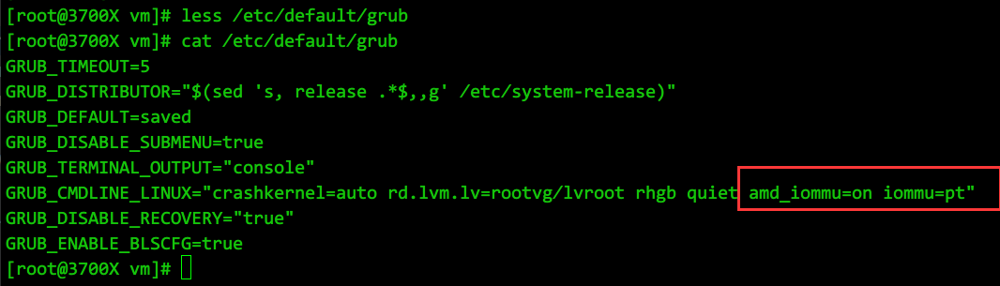
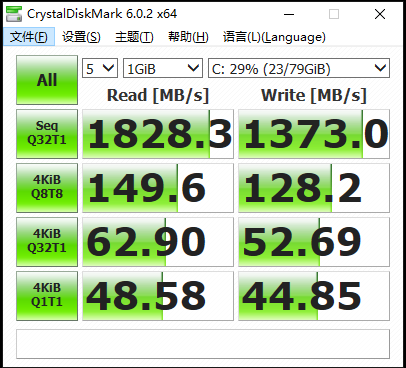
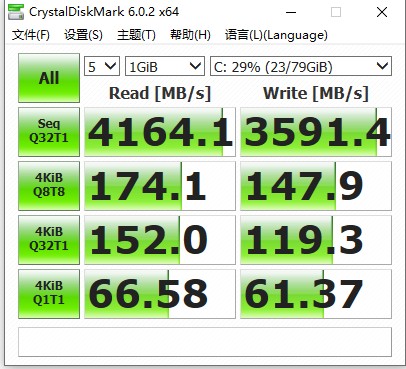
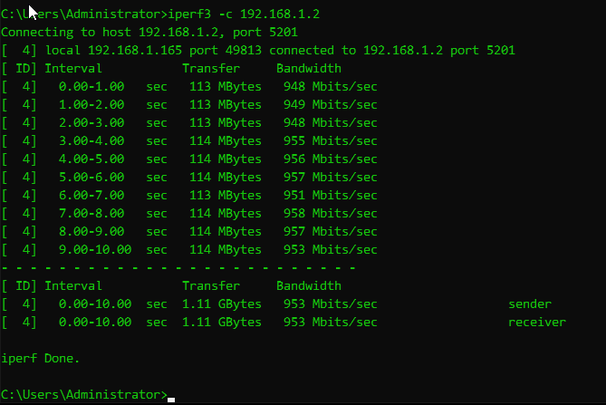
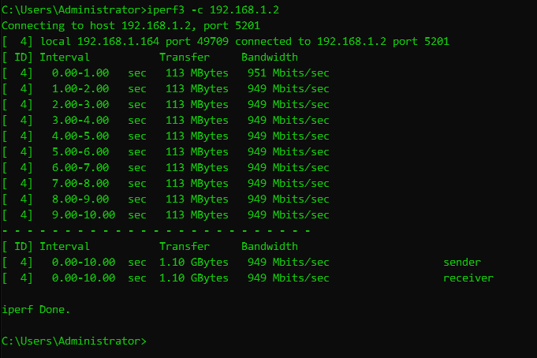

* [目录](#0)
  * [去除虚拟机特征](#1)
  * [GPU直通](#2)
  * [PCI设备直通](#3)
  * [网卡和硬盘类型改 virtio](#4)
  * [添加物理磁盘](#5)
  * [x86模拟ARM环境](#6)
  * [内存膨胀](#7)
  

<h3 id="1">去除虚拟机特征</h3>

这篇文章 qlf2012 的回答从原理层面作了解释  
https://www.zhihu.com/question/359121561  
实操层面给了一些示例,但偏少  

##### 让虚拟机的CPU型号与宿主机一致  
https://blog.51cto.com/molewan/1926131  
具体我的做法是:  
原本  

```
  <cpu mode='host-passthrough' check='none'/>
```

改为了

```
  <cpu mode='host-passthrough' check='none'>
    <feature policy='disable' name='hypervisor'/>
  </cpu>

```

##### 隐藏KVM Hypervisor信息
在```<features>``` 段落中插入以下内容  

```
<hyperv>
  <vendor_id state="on" value="random"/>
</hyperv>
<kvm>
  <hidden state="on"/>
</kvm>
```

原本的示例

```
  <features>
    <acpi/>
    <apic/>
    <hyperv>
      <relaxed state='on'/>
      <vapic state='on'/>
      <spinlocks state='on' retries='8191'/>
    </hyperv>
  </features>
```

修改后的示例

```
  <features>
    <acpi/>
    <apic/>
    <hyperv>
      <relaxed state='on'/>
      <vapic state='on'/>
      <spinlocks state='on' retries='8191'/>
      <vendor_id state='on' value='random'/>
    </hyperv>
    <kvm>
      <hidden state='on'/>
    </kvm>
  </features>
```


另一种方法:  
为虚拟机添加 ```<features>``` 段落定义
```
$ virsh edit windows
<domain>
  <features> # 在features中添加vendor_id, kvm, ioapic项目
    <hyperv>
      <vendor_id state='on' value='0123456789ab'/> # value可以是任意值
    </hyperv>
    <kvm>
      <hidden state='on'/>
    </kvm>
    <ioapic driver='kvm'/>
  </features>
</domain>
```


<h3 id="2">GPU直通</h3>

另一个前期整理的笔记  
<a href="files/KVM直通相关.sh" target="_blank">KVM直通相关.sh</a>

https://blog.csdn.net/u010099177/article/details/120709515    
https://blog.acesheep.com/index.php/archives/720/  
https://blog.csdn.net/hbuxiaofei/article/details/106566348  
https://doowzs.com/posts/2021/04/rtx-vfio-passthrough/  
https://www.jianshu.com/p/52cc99a9befd  

KVM配置GPU直通有 pci-stub 和 vfio 两种模式  
根据早一点的文档反应, vfio 配置过程遇到问题, 实际上我的配置一路通畅  
pci-stub 属于更"传统"的方式  
vfio 属于KVM后来版本迭代中出现的更新的一种方法, 技术原理上有更多优势.  

流程:  
1) 宿主机开启IOMMU  
2) 禁用nouveau 驱动  
3) 加载vfio-pci 内核模块  
4) 为虚拟机配置直通GPU  


#### 1) 宿主机开启IOMMU
以下是grub2的操作步骤  

修改/etc/default/grub，在GRUB_CMDLINE_LINUX_DEFAULT中添加内核启动参数

Intel CPU添加 intel_iommu=on  
AMD CPU添加 amd_iommu=on iommu=pt  



更新grub2启动参数
```
grub2-mkconfig -o /boot/grub2/grub.cfg
```

重启系统后验证
```
grep intel_iommu=on /proc/cmdline 

dmesg | grep -E "DMAR|IOMMU"
```

#### 2) 禁用nouveau 驱动
先通过lspci 命令, 在第一列的信息即为该设备的PCI-E设备的序号
```
lspci -nnk | grep -i nvidia
```
示例输出如下
```
[root@3700X vm]# lspci -nnk | grep -i nvidia
27:00.0 VGA compatible controller [0300]: NVIDIA Corporation GA106 [GeForce RTX 3060] [10de:2503] (rev a1)
27:00.1 Audio device [0403]: NVIDIA Corporation Device [10de:228e] (rev a1)
```
即  
27:00.0  
27:00.1  
则为同组设备的两个子类(显卡可能还包括USB控制器等其他设备,也可能有4个)  
将这两个序号再进行查询使用到的驱动
```
lspci -vv -s 27:00.0 | grep driver
lspci -vv -s 27:00.1 | grep driver
```

<br>

查到的驱动就是需要纳入屏蔽清单的内容  
```
[root@3700X vm]# cat /etc/modprobe.d/blacklist.conf
blacklist nouveau
blacklist snd_hda_intel
```

<br>

vim /usr/lib/modprobe.d/dist-blacklist.conf  
加上一行options nouveau modeset=0  
```
[root@3700X vm]# tail /usr/lib/modprobe.d/dist-blacklist.conf
# ISDN - see bugs 154799, 159068
blacklist hisax
blacklist hisax_fcpcipnp

# sound drivers
blacklist snd-pcsp

# I/O dynamic configuration support for s390x (bz #563228)
blacklist chsc_sch
options nouveau modeset=0
```

<br>

#### 3) 加载vfio-pci 内核模块
```
# 显示显卡的PCI认证数字和[供应商ID:设备ID]
$ lspci -nn | grep -i nvidia
3b:00.0 3D controller [0302]: NVIDIA Corporation GP104GL [Tesla P4] [10de:1bb3] (rev a1)
86:00.0 3D controller [0302]: NVIDIA Corporation GP104GL [Tesla P4] [10de:1bb3] (rev a1)

# 编辑vfio配置文件
$ vim /etc/modprobe.d/vfio.conf
# 创建一个新行，指定ids=供应商ID:设备ID
options vfio-pci ids=10de:1bb3,10de:1bb3

# 创建一个新文件，写入 vfio-pci
$ echo 'vfio-pci' > /etc/modules-load.d/vfio-pci.conf

$ reboot  # 重启
```

重启后验证
```
dmesg -T | grep -i vfio
```
有类似以下输出, 标志vfio方式加载成功
```
[root@3700X ~]# dmesg -T | grep -i vfio
[Wed Mar 23 00:55:50 2022] VFIO - User Level meta-driver version: 0.3
[Wed Mar 23 00:55:50 2022] vfio_pci: add [10de:1180[ffffffff:ffffffff]] class 0x000000/00000000
[Wed Mar 23 00:55:50 2022] vfio_pci: add [10de:0e0a[ffffffff:ffffffff]] class 0x000000/00000000
[Wed Mar 23 00:57:39 2022] vfio-pci 0000:27:00.0: vgaarb: changed VGA decodes: olddecodes=io+mem,decodes=none:owns=io+mem
[Wed Mar 23 00:57:39 2022] vfio-pci 0000:27:00.1: vfio_ecap_init: hiding ecap 0x25@0x160
[Wed Mar 23 00:57:39 2022] vfio-pci 0000:27:00.0: vfio_ecap_init: hiding ecap 0x1e@0x258
[Wed Mar 23 00:57:39 2022] vfio-pci 0000:27:00.0: vfio_ecap_init: hiding ecap 0x19@0x900
[Wed Mar 23 00:57:39 2022] vfio-pci 0000:27:00.0: vfio_ecap_init: hiding ecap 0x26@0xc1c
[Wed Mar 23 00:57:39 2022] vfio-pci 0000:27:00.0: vfio_ecap_init: hiding ecap 0x27@0xd00
[Wed Mar 23 00:57:39 2022] vfio-pci 0000:27:00.0: vfio_ecap_init: hiding ecap 0x25@0xe00
[Wed Mar 23 00:57:39 2022] vfio-pci 0000:27:00.0: No more image in the PCI ROM
```

#### 4) 为虚拟机配置直通GPU
在kvm虚拟机里添加直通的GPU设备有两种方式可选
- 手动修改配置定义xml文件里添加配置项
- 单独为新增的设备信息创建xml, 用 virsh attach-device的方式导入
两者实际上也都是编辑xml文件, 并要求语法的正确性, 所以也不存在太大区别,任选一种即可.

##### 手动修改配置定义xml文件里添加
这里先引用  
https://blog.acesheep.com/index.php/archives/720/  
内的讲解

```
lspci -nn | grep -i nvidia
01:00.0 VGA compatible controller [0300]: NVIDIA Corporation TU102 [GeForce RTX 2080 Ti Rev. A] [10de:1e07] (rev a1)
01:00.1 Audio device [0403]: NVIDIA Corporation Device [10de:10f7] (rev a1)
01:00.2 USB controller [0c03]: NVIDIA Corporation Device [10de:1ad6] (rev a1)
01:00.3 Serial bus controller [0c80]: NVIDIA Corporation Device [10de:1ad7] (rev a1)
```
```
这里列出的PCI 设备序号 01:00.0 01:00.1 01:00.2 01:00.3
01:00.0 这里需要对应配置文件的 <source> 节点里面 
<address domain='0x0000' bus='0x01' slot='0x00' function='0x0'/>
<hostdev> 里面是直通一个PCI 设备, 例如我这里有4个需要穿透到里面,就要有4个<hostdev>
```

这里可以看见示例里是一张2080Ti的显卡
01:00.0  
01:00.1  
01:00.2  
01:00.3  
是同一个设备下的4个子设备
格式参照如下  
bus号:slot号.function号  

一个 hostdev 定义项的示例
```
    <hostdev mode='subsystem' type='pci' managed='yes'>
      <driver name='vfio'/>
      <source>
        <address domain='0x0000' bus='0x01' slot='0x00' function='0x0'/>
      </source>
      <address type='pci' domain='0x0000' bus='0x00' slot='0x03' function='0x0'/>
    </hostdev>
```
其中 <source> </source> 之间定义的是宿主机上的设备信息  
对应填入在 lspci -nn | grep -i nvidia 看到的通道号信息  
```</source>``` 下一行的```<address ```则是虚拟机上的位置信息, 是可选的, 即使不填入, 在完成编辑后的虚拟机首次启动也会自动生成.


在我自己设备上的实例
```
[root@3700X ~]# lspci -nn | grep -i nvidia
27:00.0 VGA compatible controller [0300]: NVIDIA Corporation GA106 [GeForce RTX 3060] [10de:2503] (rev a1)
27:00.1 Audio device [0403]: NVIDIA Corporation Device [10de:228e] (rev a1)

[root@3700X ~]# virsh dumpxml miner-09 | less
    <hostdev mode='subsystem' type='pci' managed='yes'>
      <driver name='vfio'/>
      <source>
        <address domain='0x0000' bus='0x27' slot='0x00' function='0x1'/>
      </source>
      <alias name='hostdev0'/>
      <address type='pci' domain='0x0000' bus='0x04' slot='0x00' function='0x0'/>
    </hostdev>
    <hostdev mode='subsystem' type='pci' managed='yes'>
      <driver name='vfio'/>
      <source>
        <address domain='0x0000' bus='0x27' slot='0x00' function='0x0'/>
      </source>
      <alias name='hostdev1'/>
      <address type='pci' domain='0x0000' bus='0x05' slot='0x00' function='0x0'/>
    </hostdev>
```


2022-05-26 增补

"BAR 1: can't reserve [mem ....."  错误的处理

报错内容如下

```
[root@5950X vm]# dmesg -T | grep -i vfio | tail
[Thu May 26 17:04:45 2022] vfio-pci 0000:0d:00.0: BAR 1: can't reserve [mem 0xd0000000-0xdfffffff 64bit pref]
[Thu May 26 17:04:45 2022] vfio-pci 0000:0d:00.0: BAR 1: can't reserve [mem 0xd0000000-0xdfffffff 64bit pref]
[Thu May 26 17:04:45 2022] vfio-pci 0000:0d:00.0: BAR 1: can't reserve [mem 0xd0000000-0xdfffffff 64bit pref]
[Thu May 26 17:04:45 2022] vfio-pci 0000:0d:00.0: BAR 1: can't reserve [mem 0xd0000000-0xdfffffff 64bit pref]
[Thu May 26 17:04:45 2022] vfio-pci 0000:0d:00.0: BAR 1: can't reserve [mem 0xd0000000-0xdfffffff 64bit pref]
[Thu May 26 17:04:45 2022] vfio-pci 0000:0d:00.0: BAR 1: can't reserve [mem 0xd0000000-0xdfffffff 64bit pref]
[Thu May 26 17:04:45 2022] vfio-pci 0000:0d:00.0: BAR 1: can't reserve [mem 0xd0000000-0xdfffffff 64bit pref]
[Thu May 26 17:04:45 2022] vfio-pci 0000:0d:00.0: BAR 1: can't reserve [mem 0xd0000000-0xdfffffff 64bit pref]
[Thu May 26 17:04:45 2022] vfio-pci 0000:0d:00.0: BAR 1: can't reserve [mem 0xd0000000-0xdfffffff 64bit pref]
[Thu May 26 17:04:45 2022] vfio-pci 0000:0d:00.0: BAR 1: can't reserve [mem 0xd0000000-0xdfffffff 64bit pref]
```

起因是显卡硬件设备发生变化, 最初的排错是修改  

/etc/modprobe.d/vfio.conf 里的 供应商ID:设备ID

但重启后发现虚拟机启动依然报错, 此时查看dmesg 发现有上述报错内容  

解决办法在此处找到  

https://forum.proxmox.com/threads/problem-with-gpu-passthrough.55918/

以更新grub 参数的方式,屏蔽 efi 对GPU的使用

```
GRUB_CMDLINE_LINUX="textonly video=astdrmfb video=efifb:off"
```

于是我的 grub 更新为了

```
[root@5950X ~]# cat /proc/cmdline 
BOOT_IMAGE=(hd1,msdos2)/vmlinuz-5.10.90 root=/dev/mapper/rootvg-lvroot ro crashkernel=auto rd.lvm.lv=rootvg/lvroot rhgb quiet amd_iommu=on iommu=pt textonly video=astdrmfb video=efifb:off
```

问题的确得到了解决, 虚拟机启动不再hang住最后蓝屏

然后这个方案也并不完美, 因为有一个代价是:  
VNC连接, 即用作虚拟机显示器用途的, 不再能正常显示图像

<h3 id="4">网卡和硬盘类型改 virtio</h3>

宿主机上是 三星970 EVO plus 512G 的 NVMe 固态  
在启用 virtio 前后的虚拟机 使用 Crystaldiskmark 6 测的基准情况对比如下  
磁盘IO-启用前  



磁盘IO-启用后  



千兆网卡启用前后并无明显差异  





操作方法  
https://blog.51cto.com/u_15329153/4598066  
这篇文档给出2种方式  
1) 虚拟机已装好了系统, IDE改virtio
2) 虚拟机使用 virtio 全新安装windows操作系统

第1种方式先装出系统, 然后分别多添加一块 virtio 类型的网卡和磁盘, 再安装 virtio 的windows驱动, 使windows有能力识别  
第2种方式是通过有集成 virtio 驱动的第三方 Win PE 在 PE使用系统安装助手的第三方工具辅助 windows 原版ISO的安装

<font color=red>注意:  </font>  

系统安装时, 是 qemu 的硬盘, 则即使Windows 虚拟机安装了 virtio-win , 如果直接修改磁盘类型为 virtio, 则系统启动时依然会蓝屏.  
依然需要额外添加一块 virtio 类型的硬盘, 待windows识别以后, 再将系统盘改为 virtio 类型,才可以正常使用


具体到修改虚拟机配置  
https://blog.51cto.com/u_15329153/4589606  


在我的实例上  
磁盘的修改前后  

```
    <disk type='file' device='disk'>
      <driver name='qemu' type='qcow2'/>
      <source file='/vm/games_mu_02.qcow2'/>
      <target dev='sda' bus='sata'/>
      <address type='drive' controller='0' bus='0' target='0' unit='0'/>
    </disk>
```

```
    <disk type='file' device='disk'>
      <driver name='qemu' type='qcow2'/>
      <source file='/vm/games_mu_01.qcow2'/>
      <target dev='sda' bus='virtio'/>
      <address type='pci' domain='0x0000' bus='0x00' slot='0x04' function='0x0'/>
    </disk>
```

重点在```<address>```标签内, slot要注意不要与已有的冲突  
bus 可以参照已有的硬盘内容, 如没有则可以从 0x00 开始尝试  


网卡的修改前后

```
    <interface type='bridge'>
      <mac address='52:54:00:91:65:22'/>
      <source bridge='br0'/>
      <model type='e1000e'/>
      <address type='pci' domain='0x0000' bus='0x01' slot='0x00' function='0x0'/>
    </interface>
```

```
    <interface type='bridge'>
      <mac address='52:54:00:db:52:a3'/>
      <source bridge='br0'/>
      <model type='virtio'/>
      <address type='pci' domain='0x0000' bus='0x00' slot='0x07' function='0x0'/>
    </interface>
```


<h3 id="5">添加物理磁盘</h3>

https://blog.acesheep.com/index.php/archives/720/  

引用它的原文

>本段文章  
2012/10/14: Adding a Physical Disk to a Guest with Libvirt / KVM 
http://ronaldevers.nl/2012/10/14/adding-a-physical-disk-kvm-libvirt.html  
使用virt-manager无法做到这一点。据我所知，virt-manager适用于存储池。您可以将磁盘设置为存储池，但不能将现有磁盘直接添加到VM。  
幸运的是：手动将磁盘添加到域的xml配置文件中。/etc/libvirt/qemu/<your-vm>.xml 在编辑器中打开并在```<devices>```部分添加 ```<disk>```

```
<disk type='block' device='disk'>
  <driver name='qemu' type='raw'/>
  <source dev='/dev/md/storage'/>
  <target dev='vdb' bus='virtio'/>
  <address type='pci' domain='0x0000' bus='0x04' slot='0x00' function='0x0'/> #我的配置文件加入了这部分
</disk>
```

<h3 id="6">x86模拟ARM环境</h3>

- 目标是创建受 libvirt 管理的模拟 aarch64 的环境
- 在已有libvirt, virt-install, virt-manager的前提下
- 宿主机只使用命令行, 不使用图形界面

在参考此文档之后,走通流程  
https://blog.csdn.net/c5113620/article/details/115434366  

其他文档  
https://www.codetd.com/en/article/6422338  
https://blog.csdn.net/chenxiangneu/article/details/78955462?utm_source=blogxgwz3  
2篇相同, 只是对英文的翻译  


流程如下

- 编译安装Python 3 
  (由于我选择了当前最新的qemu稳定版(6.2), 因此对python解释器的版本要求大于3.6)
- 编译安装qemu
- 下载安装edk2-aarch64 (aarch64的uefi BIOS文件)
- virsh 建立虚拟机


1) 编译安装python3.10.4  
   略


2) 编译安装qemu  
https://download.qemu.org/  
参考文档作者的原文
```
yum groupinstall 'Development Tools' -y
yum groupinstall "Virtualization Host" -y
yum install kvm qemu virt-viewer virt-manager libvirt libvirt-python python-virtinst
systemctl enable libvirtd
systemctl start libvirtd
usermod -aG libvirt $(whoami)
yum install virt-install virt-viewer virt-manager -y
vi /etc/libvirt/qemu.conf # 打开两个注释 user="root" 和 group="root"
reboot

# 编译qemu-system-aarch64
tar xf qemu-4.2.0.tar.xz
cd qemu-4.2.0/
yum install python2 zlib-devel glib2-devel pixman-devel -y
./configure --target-list=aarch64-softmmu --prefix=/usr
make -j8
make install  # default location /usr/local/bin/qemu-system-aarch64
```

编译安装会遇到提示没有ninja, 需要下载  
https://github.com/ninja-build/ninja/releases  
下载后放到可被执行的目录如/bin , /sbin, /usr/sbin 等, 或是配置环境变量皆可    
实际上我执行的
```
yum groupinstall 'Development Tools' -y
yum groupinstall "Virtualization Host" -y
tar -xvf qemu-6.2.0.tar.xz
cd qemu-6.2.0/
yum install python2 zlib-devel glib2-devel pixman-devel
./configure --target-list=aarch64-softmmu --prefix=/usr/local/qemu --python=/usr/bin/python3
make -j16 && make install

qemu_path=/usr/local/qemu/bin
for i in `ls $qemu_path`
do
    echo $qemu_path/$i
    ln -s $qemu_path/$i /bin/
done
```


3) 下载uefi bios文件  
没有找到git等地址  
https://rpmfind.net/linux/rpm2html/search.php?query=edk2-aarch64  
下载后用yum安装, 未发现有包依赖  
安装后需要编辑 /etc/libvirt/qemu.conf
取消原有的注释
```
770 nvram = [
771    "/usr/share/OVMF/OVMF_CODE.fd:/usr/share/OVMF/OVMF_VARS.fd",
772    "/usr/share/OVMF/OVMF_CODE.secboot.fd:/usr/share/OVMF/OVMF_VARS.fd",
773    "/usr/share/AAVMF/AAVMF_CODE.fd:/usr/share/AAVMF/AAVMF_VARS.fd",
774    "/usr/share/AAVMF/AAVMF32_CODE.fd:/usr/share/AAVMF/AAVMF32_VARS.fd"
775 ]
```
完成后需要重启 libvirt
```
systemctl restart libvirtd
```

4) libvirt 建立虚拟机的示例
```
virt-install \
--name kylin-aarch64 --vcpus 4 --ram 4096 --arch aarch64 --os-variant rhel7.9 \
--boot uefi \
--graphics vnc,listen=0.0.0.0,port=5903 \
--cdrom /mnt/ISO/银河麒麟_Kylin-Server-10-SP2-aarch64-Release-Build09-20210524.iso \
--disk path=/vm/kylin-aarch64.qcow2,size=20,bus=virtio,format=qcow2
```

<h3 id="8">内存膨胀</h3>

https://github.com/yangcvo/KVM/blob/master/KVM%E8%99%9A%E6%8B%9F%E5%8C%96(%E5%85%AD)%E8%B0%83%E6%95%B4%E8%99%9A%E6%8B%9F%E6%9C%BACPU%E5%A4%A7%E5%B0%8F%2C%E6%B7%BB%E5%8A%A0memory%E5%86%85%E5%AD%98%2C%E6%B7%BB%E5%8A%A0%E8%99%9A%E6%8B%9F%E6%9C%BA%E7%A1%AC%E7%9B%98disk%2C%E8%99%9A%E6%8B%9F%E6%9C%BA%E5%86%85%E5%AD%98%E5%87%8F%E5%8D%8A%E7%8E%B0%E8%B1%A1.md  

https://cloud.tencent.com/developer/article/1087028  

一个比较有意思的细节, 关于kvm虚拟机内存容量的定义语句

```
  <memory unit='KiB'>8388608</memory>
  <currentMemory unit='KiB'>8388608</currentMemory>
```

字面含义 currentMemory 应该是当前内存, 网上的文章会说这是"最小内存"也就是 minRAM  

姑且照此理解, 但在使用 Win10 作为guestOS的虚拟机开机内存占用呈现以下趋势  

memory 8G, currentMemory 1G, Win10 guestOS 开机内存占用 7.7G  
memory 8G, currentMemory 2G, Win10 guestOS 开机内存占用 7.5G  
memory 8G, currentMemory 4G, Win10 guestOS 开机内存占用 4.xG  
memory 8G, currentMemory 6G, Win10 guestOS 开机内存占用 3.xG  
memory 8G, currentMemory 8G, Win10 guestOS 开机内存占用 1.8G (物理机的合理值)  
