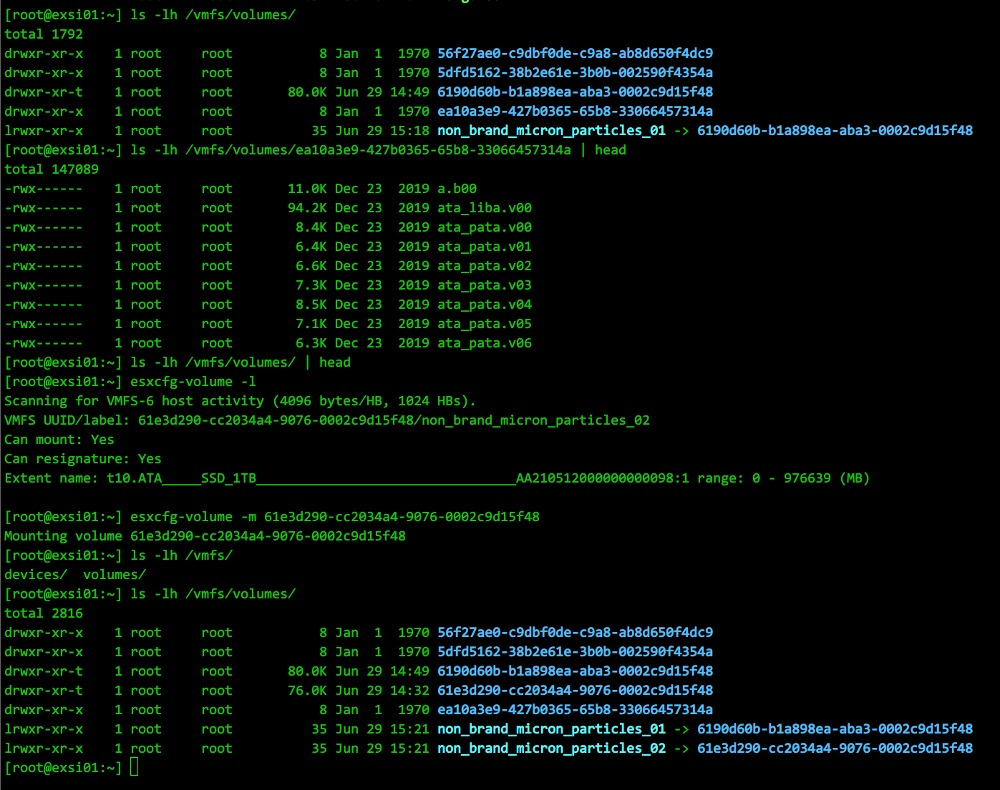

* [目录](#0)
  * [vcenter批量克隆虚拟机](#1)
  * [以链接克隆方式创建vSphere虚拟机](#2)
  * [重新挂载vmfs格式的磁盘](#3)
  * [vcenter websphere 503系列错误](#4)

<h3 id="1">vcenter批量克隆虚拟机</h3>

首次运行powershell, 需要执行

```
Set-ExecutionPolicy RemoteSigned
```

以配置powercli可以执行远程脚本, 否则启动时会错误提示

&nbsp;

需要用到PowerCLI, 下载地址:

https://my.vmware.com/web/vmware/downloads/details?downloadGroup=PCLI650R1&productId=614

普通注册帐号即可下载, 无需付费用户权限

安装后, 有两个快捷方式


需要双击运行, 后续操作要在此窗口环境下执行, 否则会缺少必要的vmware模块

&nbsp;

PowerCLI 是在 Windows Powershell上开发的, 想用python直接操控PowerCLI似乎无法绕过

只有寻找第3方lib是否有实现

https://www.reddit.com/r/learnpython/comments/cyma26/i_prefer_python_over_powershell_but_can_i_use_it/

&nbsp;


在此环境下执行ps1脚本文件的示例
```
powershell -File "D:\临时存储\vCenter批量克隆\批量克隆 - 修改.ps1" -FileName "D:\临时存储\vCenter批量克隆\info.csv"
```

第1个 -File &emsp;&emsp;&emsp;参数是powershell 传参你的ps1脚本文件的位置

第2个 -FileName &ensp;参数是ps1脚本内部要求的传参

&nbsp;

<font color=red>PowerCLI 有哪些命令</font>

全部的命令在VMware-PowerCLI-6.5.0-上有592个

常用的有以下:

```
get-vicommand    显示所有命令列表

Connect-VIServer    连接虚拟化平台

get-vmhost    显示ESXi主机列表

get-cluster    显示群集列表

get-datastore    显示存储列表

get-resourcepool    显示资源池

get-vm    显示虚拟机列表

get-virtualswitch    显示虚拟交换机列表

start-vm\stop -vm    启动或关闭虚拟机

new -vm    创建虚拟机

get-template    显示模板列表

get-oscustomizationspec    显示自定义规范列表

get-vapp    显示vapp 应用列表

get-folder    显示文件夹列表

```

<font color=red>创建虚拟机</font>

https://developer.aliyun.com/article/530985

PowerCLI 创建虚拟机命令New-VM, 用到的最基础的信息:

- 虚拟机名称 -- 在阿里这篇文档里变量定义为: name

- 模板名称 -- 在阿里这篇文档里变量定义为: template

- esxi主机，也就是在vcenter清单里显示的名称 -- 在阿里这篇文档里变量定义为: host

- 数据存储名称 -- 在阿里这篇文档里变量定义为: datastore

只提供以上4个信息即可完成一个虚拟机的创建

更丰富的参数选择以完成自定义的需求, 通过
```
Get-Help New-VM
```
查看内置帮助

在New-VM命令其中也有 NetworkName和Portgroup 两个参数可选

&nbsp;

<font color=red>自动配置IP和计算机名称</font>

自动配置IP和计算机名称的实现, 涉及到几个命令配合

- 虚拟机规范文件:  
New-OSCustomizationSpec 和 Set-OSCustomizationSpec  
前者创建新的, 后者设置已有的  
虚拟机规范文件用来提供虚拟机的IP和计算机名称信息  

- 创建虚拟机和设置虚拟机属性:  
New-VM 和 Set-VM  
CPU数量, 内存大小, 备注等规则

- 获取当前新建出来的虚拟机的指向  
```Get-VM -Name 虚拟机名称```

- 获取指定虚拟机的网卡指向  
```Get-NetworkAdapter```  
结合上一条就是  
```Get-VM -Name 虚拟机名称 | Get-NetworkAdapter```

- 设置虚拟机网卡属性  
Set-NetworkAdapter  
用于指定虚拟机使用vCenter上的哪个虚拟端口组(或分布式交换机, 参数不同)

完整的命令示例:

```
# 创建虚拟机规范文件
New-OSCustomizationSpec -Name 虚拟机规范文件名称 -OSType 操作系统类型(Windows / Linux) -Workgroup 工作组名称 -FullName 全名 -OrgName 组织名称

# 修改虚拟机规范文件, -ChangeSid是windows类型特有的参数
Set-OSCustomizationSpec -NamingScheme Fixed -NamingPrefix 主机名 -ChangeSid:$true

# 创建虚拟机
New-VM -Name 虚拟机名称 -VMHost Exsi主机名称 -Template 虚拟机模板名称 -Datastore 数据存储名称 -OSCustomizationspec 虚拟机规范名称
或
New-VM -Name 虚拟机名称 -ResourcePool 集群名称 -Template 虚拟机模板名称 -Datastore 数据存储名称 -OSCustomizationspec 虚拟机规范名称

# 设置虚拟机属性, 指向某个虚拟机的指针 在powershell中可以用变量存储, 如:  $vm = Get-VM -Name 虚拟机名称
Set-VM -VM 指向某个虚拟机的指针 -NumCpu CPU核心数量 -MemoryGB 内存大小(GB) -Notes 备注信息 -Confirm:$false

# 获取指定的虚拟端口组, 虚拟机所在的宿主机名称用"指向某个虚拟机的指针".VMHost 可以获得
Get-VirtualPortGroup -Name 虚拟端口组名称 -VMHost 虚拟机所在的宿主机名称

设置虚拟机网卡属性--指针类都用Get-xxx的方式获取, 再用变量存储引用
Set-NetworkAdapter -NetworkAdapter 指向虚拟机网卡指针 -Portgroup 指向虚拟端口组的指针 -Confirm:$false

Set-NetworkAdapter -NetworkAdapter 指向虚拟机网卡指针 -Type E1000 -StartConnected:$true -Confirm:$false

# 移除创建的自定义虚拟机规范
Remove-OSCustomizationSpec $osspec -Confirm:$false

# 虚拟机开机
Start-VM  -VM 指向虚拟机网卡指针 -Confirm:$false
```


<h3 id="2">以链接克隆方式创建vSphere虚拟机</h3>

引用:  
https://blog.51cto.com/foolishfish/1610682

vSphere Horizon View中运用了链接克隆的方法来使多个VDI使用同一基础镜像，而在没有View环境的时候，vSphere的GUI中没有链接克隆的相关使用项。这种情况下，可以使用PowerCLI来创建链接克隆的VM。

方法一：  
http://michlstechblog.info/blog/vmware-vsphere-create-a-linked-clone-with-powercli/

```
Connect-VIServer "vCenter_FQDN"
$sourceVM="source_vm_name"
#指定源VM名称

$sourceVMSnapshotName="linkedclone_snap" 
#定义快照名称

$NewVMName="linked_clone_VM"
#定义链接克隆方式创建的VM的名字

$cloneFolder=(Get-VM $sourceVM).Folder
#获取源VM所在文件夹

$sourceSnapShot=New-Snapshot -VM $sourceVM -Name $sourceVMSnapshotName -Description "Snapshot for linked clones" -Memory -Quiesce
#为源VM创建快照

$ESXDatastore=Get-Datastore -Name "Datastore1"
#指定存储

$LinkedCloneVM=New-VM -Name $NewVMName -VM $sourceVM -Location $cloneFolder -Datastore $ESXDatastore -ResourcePool Resources -LinkedClone -ReferenceSnapshot $sourceSnapShot
#以LinkedClone方式生成VM

Start-VM $LinkedCloneVM
#链接克隆VM开机

Stop-VM $LinkedCloneVM -Confirm:$false
#关机

Remove-VM -DeletePermanently $LinkedCloneVM -Confirm:$false 
#删除链接克隆VM

Remove-Snapshot -Snapshot $sourceSnapShot -Confirm:$false
#移除快照
```


方法二：

来源：   
http://www.vmdev.info/?p=40

```
Connect-VIServer "vCenter_FQDN"
#连接到vCenter
$sourceVM = Get-VM "source_vm_name" | Get-View
#获取源VM对象的View对象
$cloneName = "linked_clone_VM"
#定义克隆VM名称
$cloneFolder = $sourceVM.parent
#获取源VM所在文件夹（群集、资源池）
$cloneSpec = new-object Vmware.Vim.VirtualMachineCloneSpec
$cloneSpec.Snapshot = $sourceVM.Snapshot.CurrentSnapshot
#指定克隆方式，基于源VM的当前快照

$cloneSpec.Location = new-object Vmware.Vim.VirtualMachineRelocateSpec
$cloneSpec.Location.DiskMoveType = [Vmware.Vim.VirtualMachineRelocateDiskMoveOptions]::createNewChildDiskBacking
#磁盘拷贝类型为ChildDiskBacking
 
$sourceVM.CloneVM_Task( $cloneFolder, $cloneName, $cloneSpec )
#执行链接克隆
```

综上方法，写成脚本

```
#加载PowerCLI环境
Add-PSSnapin VMware.VimAutomation.Core 
C:\"Program Files (x86)\VMware\Infrastructure\vSphere PowerCLI\Scripts\Initialize-PowerCLIEnvironment.ps1"

#根据提示输入vCenter连接信息的方式，可以根据实际环境，将部分变量写成固定参数
$VCServer = Read-Host "Enter vCenter Server Name"
$Username = Read-Host "Enter Username"
$Password = Read-Host "Enter Password"
$SourceVM = Read-Host "Enter Source VM Name"
$CloneVM  = Read-Host "Enter Clone VM Name"
#连接vCenter Server
Connect-VIServer $VCServer -User $Username -Password $Password -Port 443

#如果源VM当前快照名称不是Linked_Clone则为该VM创建快照
if ((Get-Snapshot -VM $sourceVM).Name -ne "Linked_Clone") {
$SourceSnapshot = New-Snapshot -VM $SourceVM -Name "Linked_Clone" -Description "Snapshot for linked clones." -Memory -Quiesce
}

$sourceVMView = Get-VM $SourceVM | Get-View
$CloneFolder = $sourceVMView.parent
$CloneSpec = New-Object Vmware.Vim.VirtualMachineCloneSpec
$CloneSpec.Snapshot = $sourceVMView.Snapshot.CurrentSnapshot
$CloneSpec.Location = new-object Vmware.Vim.VirtualMachineRelocateSpec
$CloneSpec.Location.DiskMoveType = [Vmware.Vim.VirtualMachineRelocateDiskMoveOptions]::createNewChildDiskBacking

#执行VM链接克隆任务
$sourceVMView.CloneVM_Task($CloneFolder, $CloneVM, $CloneSpec)
```


<h3 id="3">重新挂载vmfs格式的磁盘</h3>

https://blog.csdn.net/weixin_36092871/article/details/116837412  

出于种种原因, 一块原有vmfs格式, 并且有数据的磁盘, 在主机上已从"设备"上可以查看到该硬盘的硬件信息, 但vmfs分区却未被挂载.

在帖子中的案例是2块硬盘, 从一台主机拆除安装到另一台主机, 两台主机原本在一个vcenter中.  
而我的案例是同一个主机, 但该硬盘原本在SAS直通卡上, 更换到板载SATA接口上.与帖子案例原理相同.  

从帖子给出的方法不难猜出, vmware这一设计是为避免误操作, 通过命令行可以操作解决, 目的就是需要你清楚你在做什么.

正解:

ssh 连接到 ESXi 主机

```
# 查看未被挂载的卷信息
esxcfg-volume -l 

# 通过前一个命令查看到的id 进行挂载
esxcfg-volume -m < volume 的UUID >
```




<h3 id="4">vcenter websphere 503系列错误</h3>

vcenter websphere client 页面访问, http 报503错误, 原因是各种各样, 其报错信息后方跟的更相信错误代码通常才是问题关键.

经常也会只需要重启一次主机就解决的情况( on Windows, 自6.7和7.0集成到一个linux虚拟机以后应该此类问题又会少很多)

本次遇到的问题:

https://blog.moper.net/1965.html  
https://blog.csdn.net/weixin_38623994/article/details/107168402  

先是通过这两篇文章, 找到vcenter的服务命令位置(默认安装位置)

```
cd C:\Program Files\VMware\vCenter Server\bin
service-control --status --all
```

通过执行 ```service-control --status --all``` 确实发现大量服务停止

不过按照文章提示, 手动挨个启动, 却有报错提示.

```
root@vcenter [ ~ ]# service-control --start vmware-vpxd
Operation not cancellable. Please wait for it to finish...
Performing start operation on service vpxd...
Error executing start on service vpxd. Details {
    "componentKey": null,
    "detail": [
        {
            "id": "install.ciscommon.service.failstart",
            "translatable": "An error occurred while starting service '%(0)s'",
            "args": [
                "vpxd"
            ],
            "localized": "An error occurred while starting service 'vpxd'"
        }
    ],
    "resolution": null,
    "problemId": null
}
Service-control failed. Error: {
    "componentKey": null,
    "detail": [
        {
            "id": "install.ciscommon.service.failstart",
            "translatable": "An error occurred while starting service '%(0)s'",
            "args": [
                "vpxd"
            ],
            "localized": "An error occurred while starting service 'vpxd'"
        }
    ],
    "resolution": null,
    "problemId": null
}
```

这也是无论重启了多少次操作系统, 依然故障的原因.  

很多网上的文章故障现象并不完全一样, 但指向了数据库连接问题, 数据库所在位置的可用磁盘空间问题.  

数据库(安装时使用的SQL Server)可用性没验证, 只检查到SQL服务已运行. 磁盘空间也有.

凑巧发现linux平台上的相关日志位置, 使用windows搜索发现它的位置.

```
C:\ProgramData\VMware\vCenterServer\logs\vmon\vMon.log
```

打开日志文件, 搜索 ```fail``` 关键字, 进而发现记录中有以下几个json文件读取报错

```
C:\ProgramData\VMware\vCenterServer\data\vmware-vmon\.svcStats\stats_cis-license.json
```

另外还有两个文件名称已不可考, 在记录中前后相邻不远.

再进而打开3个文件, 发现果然是非可见字符.
删除3个文件, 再重启windows, 再观察内存占用增长情况符合以往经验, 基本断定服务恢复.
最后确认的确恢复.
并且以上3个中, 文件名称中有 license 相关的, 也并未发现因删除操作而重置某个功能的授权.
