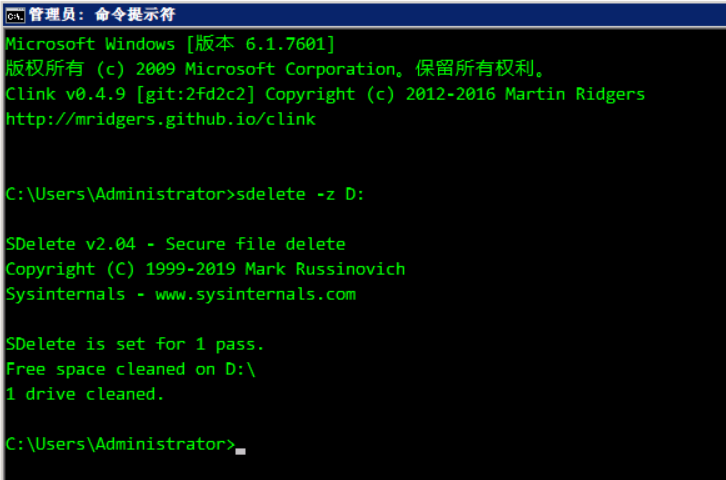
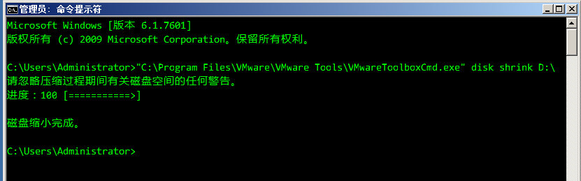
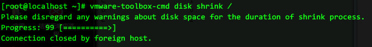

#### EXSi上的虚拟机空间回收
https://www.cxyzjd.com/article/endzhi/89818324  
https://blog.51cto.com/u_13777759/2437396  
有两个步骤是必要的:
1) 虚拟机内, Windows由于不会自动对已删除的空间填0,因此这部分已被回收的无法被宿主机感知,因此需要SDelete工具来进行填0操作  
2) 登录到EXSi控制台调用vmkfstools 进行虚拟机磁盘文件的空间收缩  

SDelete 的下载页面:  
https://docs.microsoft.com/en-us/sysinternals/downloads/sdelete

SDelete 执行示例
```
sdelete -z D:
```


vmkfstools 执行示例
```
[root@exsi01:/vmfs/volumes/6190d60b-b1a898ea-aba3-0002c9d15f48/Windows_7_2015年版本_爬虫机] vmkfstools -K Windows_7_2015年版本_爬虫机.vmdk
vmfsDisk: 1, rdmDisk: 0, blockSize: 1048576
Hole Punching: 100% done.
```

#### VMware workstation虚拟机空间回收

[https://www.howtoforge.com/how-to-shrink-vmware-virtual-disk-files-vmdk](https://www.howtoforge.com/how-to-shrink-vmware-virtual-disk-files-vmdk)

解决的问题:  
vmdk文件增长得很大, 但在guestOS中查看, 并未实际占有相应多的空间

* 在Windows宿主机上的操作方法

先对系统垃圾文件进行清理  
Before we try to shrink the virtual disk files, we should try to remove any unneeded files from the virtual machine 
to free space.   
For example, on Debian-based VMs, you can run apt-get clean to clear out the local repository of retrieved package files.

用/dev/zero填0，将虚拟机的磁盘空间全部占满，然后删除
Next, run
```
cat /dev/zero > zero.fill;sync;sleep 1;sync;rm -f zero.fill
to fill the unused space with zeros.
```

最后关闭虚拟机，再在宿主机上用vmware-vdiskmanager.exe命令行工具来收缩  
Then power down the VM and open the command window on the Windows host:
```
VMware workstation安装路径\vmware-vdiskmanager.exe -k 虚拟机文件路径\xxxx.vmdk
```

* guestOS是Windows的操作方法

https://www.zhihu.com/question/41707455

windows操作系统的虚拟机 ,用到vmware tools的命令  
```
 "C:\Program Files\VMware\VMware Tools\VMwareToolboxCmd.exe" disk shrink c:\
```

 
* guestOS是Linux的操作方法

中途可能ssh会中断  
```
vmware-toolbox-cmd disk shrink /
```


#### VMware workstation虚拟机性能设置

<font color=red>workstation的网卡改为vmxnet3</font>

workstation版本在界面上无法选择网卡类型, 但通过修改.vmx虚拟机配置文件可以替换网卡类型从e1000变为vmxnet3, 以最大化性能

操作步骤, 正则表达式的写法: 

ethernet[0-9]+.virtualDev = "e1000"

替换为

ethernet[0-9]+.virtualDev = "vmxnet3"

<font color=red>禁用vmem</font>

1. 虚拟机的配置中 Options 中，Advanced项，启用"Disable memory page trimming"，也就是禁止内存剪裁。
2. 虚拟机的配置文件 即 .vmx 文件中，加入 mainMem.useNamedFile = "FALSE"

http://jyhshin1.blogspot.com/2013/04/vmware-on-windows-7.html 

開啟 Disable memory page trimming
VM(選單列) → Settings... → 出現 Virtual Machine Settings 對話框 → Options(分頁) → Advanced → 打勾 Disable memory page trimming

等同於修改虛擬機的 .vmx 文件，修改 MemTrimRate = "0"。

在此功能啟用時，VMware 會將一些虛擬機未使用的記憶體交給主機，而將虛擬機記憶體保存在硬碟交換文件中。但是這樣做，雖然可以讓主機獲得更多記憶體，同時卻導致硬體性能的下降。如果當 VM Suspend 時，卻發現主機整個卡住，硬碟瘋狂的運轉，持續十分鐘以上，把此功能打勾試試。

開啟 Fit all virtual machine memory into reserved host ram
Edit(選單列) → Preferences → 出現 Preferences 對話框 → Memory → Advanced → 選取 Fit all virtual machine memory into reserved host ram

等同於修改 C:/ProgramData/VMware/VMware Workstation/config.ini 文件，修改 prefvmx.minVmMemPct = "100"。

如果這個參數是 100 的話，當虛擬機啟動時，VMware 會將該虛擬機的全部記憶體都使用實體記憶體，而不 swap 到檔案系統上；如果這個參數是 50 的話，VMware會將該虛擬機的部份記憶體 swap 到檔案系統上，部份使用實體記憶體。要高效能的話，就設為 100 吧。

開啟 prefvmx.useRecommendedLockedMemSize
修改 C:/ProgramData/VMware/VMware Workstation/config.ini 文件，修改prefvmx.useRecommendedLockedMemSize = "TRUE"。

不詳

取消 mainMem.useNamedFile
修改虛擬機的 .vmx 文件，加入 mainMem.useNamedFile = "FALSE"。

沒此參數前虛擬機執行時會在本機產生 .vmem 的文件。虛擬機上的記憶體讀寫等於在本機 .vmem 文件讀寫，也就造成虛擬機執行時，硬碟常常運轉不停。但有得必有失，加上這個參數後 Suspend 虛擬機速度就會慢很多，突然斷電就更難保證數據的完整性。

當虛擬機啟動時，VMware 會把部份的虛擬機記憶體存在檔案系統上，以檔案形式存在，這是因為 VMware 使用了 mmap(記憶體映射)的方式來管理虛擬機記憶體。藉由修改 mainMem.useNamedFile，VMware 會將這個檔案由 VM 所在的目錄，改放到主機暫存目錄下，這個異動可能對效能有小小地幫助，特別是暫存目錄是 ramdisk 時，但要注意有可能發生空間不足的問題。

取消 sched.mem.pshare.enable
修改虛擬機的 .vmx 文件，加入 sched.mem.pshare.enable = "FALSE"。

停用 memory sharing 後，VM 將不會分享通用記憶體block，VM 也將停止比對記憶體block。強制關閉虛擬機的虛擬記憶體管理分享裝置，需要較高的主系統資源，但提供比較快的虛擬環境。

取消 MemAllowAutoScaleDown
修改虛擬機的 .vmx 文件，加入 MemAllowAutoScaleDown = "FALSE"。

這個參數設定成 "TRUE" 時，如果虛擬機設定需要 2GB 的記憶體，但實際上主機卻提供給虛擬機的記憶體不到 2GB，虛擬機在啟動時會自動調整縮小記憶體到足夠啟動的範圍。

Windows XP 的 config.ini 放在 C:\Documents and Settings\All Users\Application Data\VMware\VMware Workstationg。

<span style="color:red;">关于CPU设置</span>

https://jingyan.baidu.com/article/ed2a5d1f1f96f309f6be17e1.html

这两篇文章都提到了关键性问题，不过关于核心数设置问题，针对CPU核心数逐渐增多的情况，还不足够

以VMware Workstation演示，在VMware vSphere中都有对应选项可找

<br/>

处理器i5-3570k，已知是双核四线程的处理器，在Workstation设置处理器数量

2x2和1x4皆是正常的，但4x1出现了警告，2x4则告诉你肯定无法运行

2x2和1x4两种设置，经过Cinebench 11.5 64位测试确认，计算能力一致，同样都使4个逻辑处理器满载

