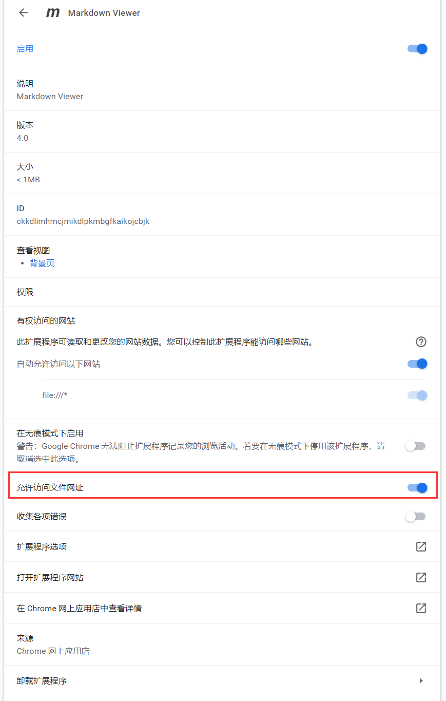

#### 字体加颜色

CSS样式解决

https://blog.csdn.net/heimu24/article/details/81189700

https://www.zhihu.com/question/22504694

https://blog.csdn.net/manjianchao/article/details/53668280  颜色,大小,字体

&nbsp; 

方法1:
```
<font face="黑体">我是黑体字</font>
<font face="微软雅黑">我是微软雅黑</font>
<font face="STCAIYUN">我是华文彩云</font>
<font color=red>我是红色</font>
<font color=#008000>我是绿色</font>
<font color=Blue>我是蓝色</font>
<font size=5>我是尺寸</font>
<font face="黑体" color=green size=5>我是黑体，绿色，尺寸为5</font>
```

效果  
<font face="黑体">我是黑体字</font><br />
<font face="微软雅黑">我是微软雅黑</font><br />
<font face="STCAIYUN">我是华文彩云</font><br />
<font color=red>我是红色</font><br />
<font color=#008000>我是绿色</font><br />
<font color=Blue>我是蓝色</font><br />
<font size=5>我是尺寸</font><br />
<font face="黑体" color=green size=5>我是黑体，绿色，尺寸为5</font>


```
浅红色文字：<font color="#dd0000">浅红色文字</font><br /> 
深红色文字：<font color="#660000">深红色文字</font><br /> 
浅绿色文字：<font color="#00dd00">浅绿色文字</font><br /> 
深绿色文字：<font color="#006600">深绿色文字</font><br /> 
浅蓝色文字：<font color="#0000dd">浅蓝色文字</font><br /> 
深蓝色文字：<font color="#000066">深蓝色文字</font><br /> 
浅黄色文字：<font color="#dddd00">浅黄色文字</font><br /> 
深黄色文字：<font color="#666600">深黄色文字</font><br /> 
浅青色文字：<font color="#00dddd">浅青色文字</font><br /> 
深青色文字：<font color="#006666">深青色文字</font><br /> 
浅紫色文字：<font color="#dd00dd">浅紫色文字</font><br /> 
深紫色文字：<font color="#660066">深紫色文字</font><br /> 
```

效果  
浅红色文字：<font color="#dd0000">浅红色文字</font><br /> 
深红色文字：<font color="#660000">深红色文字</font><br /> 
浅绿色文字：<font color="#00dd00">浅绿色文字</font><br /> 
深绿色文字：<font color="#006600">深绿色文字</font><br /> 
浅蓝色文字：<font color="#0000dd">浅蓝色文字</font><br /> 
深蓝色文字：<font color="#000066">深蓝色文字</font><br /> 
浅黄色文字：<font color="#dddd00">浅黄色文字</font><br /> 
深黄色文字：<font color="#666600">深黄色文字</font><br /> 
浅青色文字：<font color="#00dddd">浅青色文字</font><br /> 
深青色文字：<font color="#006666">深青色文字</font><br /> 
浅紫色文字：<font color="#dd00dd">浅紫色文字</font><br /> 
深紫色文字：<font color="#660066">深紫色文字</font><br /> 

方法2:

```
<span style="color:red;"> 红色 </span>
```

效果  
<span style="color:red;"> 红色 </span>


#### 加粗和斜体

```
**加粗**
```
**加粗**

```
*斜体*
```
*斜体*

#### 添加换行符

https://www.zhihu.com/question/20134106

以下两个都有效  

<font color=red>注意上下要空行, 否则会影响下一行内容的格式</font>

```
&nbsp;

<br/>
```

#### 添加多个空格

<font color=red>注意上下要空行, 否则会影响下一行内容的格式</font>

一个空格大小的表示

```
&ensp;

&#8194
```

两个空格的大小表示

```
&emsp;

&#8195;
```

不换行空格
```
&nbsp;

&#160;
```

#### 标记锚点

```
[显示文字](#标题)
```

上面的方法在我的环境并不能实现向下跳转  
以下是html代码的方式  
https://guo365.github.io/study/Markdown.html#41  
```
* [目录1](#40)
   * [标题1](#41)
   * [标题2](#42)
   * [标题3](#43)
   * [标题4](#44)

<h3 id="41">标题1</h3>
    轻轻的我走了， 正如我轻轻的来； 我轻轻的招手， 作别西天的云彩。
<h3 id="42">标题2</h3>
    正如我轻轻的来； 我轻轻的招手， 作别西天的云彩。
<h3 id="43">标题3</h3>
    我轻轻的招手， 作别西天的云彩。
<h3 id="44">标题4</h3>
    作别西天的云彩。
```
用html代码的方式标记标题, 并添加id, 则在"目录"里锚点标定这个id, 即可实现跳转

#### 添加删除线

文字前后都加2个 ~ 号
```
~~删除线示例~~
```
~~删除线示例~~

#### 添加表格
https://www.jianshu.com/p/2df05f279331  
https://www.runoob.com/markdown/md-table.html  
语法格式如下:  

```
| 一个普通标题 | 一个普通标题 | 一个普通标题 |
| ------ | ------ | ------ |
| 短文本 | 中等文本 | 稍微长一点的文本 |
| 稍微长一点的文本 | 短文本 | 中等文本 | 
```  

效果如下:  

| 一个普通标题 | 一个普通标题 | 一个普通标题 |
| ------ | ------ | ------ |
| 短文本 | 中等文本 | 稍微长一点的文本 |
| 稍微长一点的文本 | 短文本 | 中等文本 |


<font color=red>需要注意的是表头的上一行要有空格, 否则表格样式不生效</font>  

&nbsp;

对齐方式

```
| 左对齐标题 | 右对齐标题 | 居中对齐标题 |
| :------| ------: | :------: |
| 短文本 | 中等文本 | 稍微长一点的文本 |
| 稍微长一点的文本 | 短文本 | 中等文本 |
```

效果:

| 左对齐标题 | 右对齐标题 | 居中对齐标题 |
| :------| ------: | :------: |
| 短文本 | 中等文本 | 稍微长一点的文本 |
| 稍微长一点的文本 | 短文本 | 中等文本 |

&nbsp;

#### 表格内的换行

> 可以用html的代码，插入代码```<br>```

#### 表格中合并单元格的处理

如下示例

<table>
    <tr>
        <th>班级</th><th>课程</th><th>平均分</th>
    </tr>
    <tr>
        <td rowspan="3">1班</td><td>语文</td><td>95</td>
    </tr>
    <tr>
        <td>数学</td><td>96</td>
    </tr>
    <tr>
        <td>英语</td><td>92</td>
    </tr>
</table>

其中"1班" 这种希望被合并的单元格, 处理的方法只能是html代码, markdown语法至今不支持

https://www.zhihu.com/question/50267650  
"图南"的回答

html代码如下

```
<table>
    <tr>
        <th>班级</th><th>课程</th><th>平均分</th>
    </tr>
    <tr>
        <td rowspan="3">1班</td><td>语文</td><td>95</td>
    </tr>
    <tr>
        <td>数学</td><td>96</td>
    </tr>
    <tr>
        <td>英语</td><td>92</td>
    </tr>
</table>
```

逻辑不复杂, 费时

此外,如果在表格的字符还存在 html 语法里的特殊字符, 还需做额外的处理

常用对照表  
https://tool.oschina.net/commons?type=2


https://blog.csdn.net/sinat_26342009/article/details/87650636


| 字符                        |         十进制 |     转义字符     |
|:--------------------------|------------:|:------------:|
| "                         | ```&#34;``` | ```&quot;``` |
| &                         | ```&#38;``` | ```&amp;```  |
| <                         | ```&#60;``` |  ```&lt;```  |
| \>                        | ```&#62;``` |  ```&gt;```  |
| 不断开空格(non-breaking space) |      &#160; |    &nbsp;    |

#### 添加附件

https://www.cnblogs.com/yanh0606/p/10488356.html

```
<a href="files/test.txt" target="_blank">附件1</a>
```

效果如下:

<a href="files/test.txt" target="_blank">附件1</a>


#### 特殊字符的转义
在代码块的引用里有特殊字符, 导致样式渲染出错  
https://www.v2ex.com/t/323402  
尝试各种声明都不解除问题, 最后还是只能用以下牺牲样式的方式暂时解决


  
 


#### markdown直接转成pdf格式

https://juejin.cn/post/6844903990732259336

chrome 安装扩展  
```Markdown Viewer```

https://chrome.google.com/webstore/detail/markdown-viewer/ckkdlimhmcjmikdlpkmbgfkaikojcbjk/related

在 chrome 中要赋予文件网址的访问权限

[//]: # (![]&#40;images/JZGwP2AxWT5VUx91GFdp78K60lcTHeX4.png&#41;)


接下来使用浏览器打印功能, 打印成pdf文件即可.

代码块的背景保留还需要在打印选项上勾选,图形背景(Background graphics)


[//]: # (![]&#40;images/JZGwP2AxWTiCbcSFnJsD2ohk0tOXwgYA.png&#41;)


#### 图片缩放

https://www.zhihu.com/question/23378396  

用 html 标签, 按比例缩放  
虽然也可以指定像素等形式, 但还需要计算以避免不成比例的缩放导致的图片拉伸变形等, 麻烦

这个方式胜简单易操作

```

```
